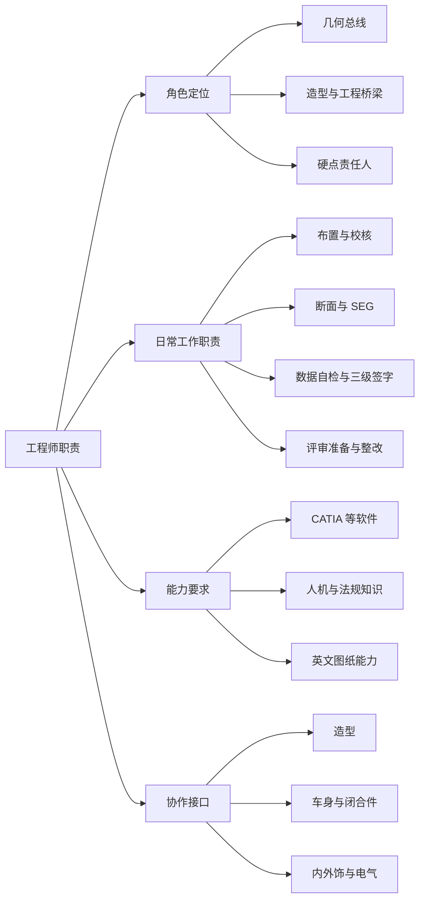

# 工程师职责

!!! quote "内容来源"
    本页正文抽取自《总布置》知识库中**可文本解析**的文件：
    `SJ 41-2009 动力/底盘3D数据评审流程`（职责分工）、`SJ 2-2008 车门设计指导书`（各阶段工作内容）、
    `SJ 45-2009 内饰SEG设计指导书`（SEG 工作与文件体系）、`SJ 16-2008 样车总布置测量指导书`、
    `40《总布置图设计规范》`（数据责任人与三级签字）、`SJ 4-2008`、`SJ 40-2009`、`SJ 46-2009`。
    企业规范编号原样保留。

## 职责体系

## 概述

### 要点

**（1）总布置工程师的三个角色**（`QCD-A0-005`、`SJ 40-2009`、H20 硬点报告）

| 角色 | 含义 | 依据 |
|---|---|---|
| **几何总线** | 把各系统的几何关系用"基准 + 尺寸 + 规则"统一约束，向造型/底盘/车身/电气输出边界与硬点 | `QCD-A0-005`、H20 硬点报告 |
| **造型与工程的桥梁** | SEG 阶段"工程应该尽可能去满足造型的要求"，通过断面与数据反馈可行性 | `SJ 40-2009` §4 |
| **硬点责任人** | 硬点报告的编制与冻结，后续设计"必须以确定的设计硬点为基础展开" | H20 硬点报告 |

**（2）部门分工**（知识库中规范的起草单位，反映组织架构）

| 部门 | 承担的规范领域 |
|---|---|
| **总体设计部** | 前方视野（`SJ 7`）、仪表反光眩目（`SJ 8`）、眼椭球与头部包络面（`SJ 9`）、人机硬点（`SJ 6`）、手伸及界面（`SJ 15`）、样车测量（`SJ 16`）、外后视镜（`SJ 55`） |
| **白车身设计部** | 外饰 SEG 断面（`SJ 40`）、车身 RPS（`SJ 29`）、白车身 2D 图纸（`SJ 28`）、侧碰 B 柱断面系数（`SJ 54`） |
| **装饰件设计部** | 顶篷（`SJ 18`）、空气室盖板（`SJ 19`）、立柱内饰板（`SJ 20`）、前门内饰板（`SJ 21`）、前后保险杠（`SJ 24`）、内饰 SEG（`SJ 45`）、仪表板 SEG（`SJ 46`）、吹面出风口（`SJ 47`）、仪表板风道（`SJ 48`）、仪表板装配（`SJ 50`）、上车踏板（`SJ 52`） |
| **开闭件设计部** | 车门设计（`SJ 2`）、车门检查（`SJ 3`）、车门主断面（`SJ 4`）、行李箱盖扭簧（`SJ 53`） |
| **电气设计部** | 操纵件标志法规校核（`SJ 39`）、倒车雷达（`SJ 32`） |
| **技术管理部** | 各规范的归口管理 |

### 示例

"造型与工程桥梁"的具体形态是 **SEG 分析**：其输出物包括**分析断面、分析数据（开闭件布置数据、前后轮口校核、顶盖前后分缝线范围）、表面圆角间隙阶差、设计构想书、SEG 检查表**（`SJ 40-2009` §4）——这五类输出正是工程师向造型与结构设计两个方向的"交付语言"。

### 注意事项

- **职责边界的常见误区**：SEG 阶段的立场是"**满足造型**"，但反馈必须早于油泥与 A 面；
  `SJ 40-2009` 强调 SEG 分析的好坏"直接影响到后期模型的制作进度和工程设计的进度及质量"——
  **工程师的价值在于"提前给边界"，而不是"事后否决"**。

## 日常工作职责

### 要点

**（1）按项目阶段划分的职责**（`SJ 2-2008` §4.2～4.5，可类推至上车体各系统）

| 阶段 | 职责 |
|---|---|
| **前期分析** | 造型控制要点的制作与输入；效果图初步分析判断与反馈；编制设计构想书；梳理新开发件与参考样车零件的**名称、图号、材料、料厚、面积、重量** |
| **可行性分析与方案设计** | 主断面与断面设计；造型可行性分析；确定各附件的**选型、布置、安装方式**；断面强度解析与调整；活动件运动分析；附件拆装分析；组焊顺序与焊接方式分析 |
| **结构设计** | 3D 数模设计；CAE 与工艺分析并优化；2D 工程图纸与设计文件 |
| **试制/试验/定型** | 配合试制试验试生产；归纳问题、分析整理、提供解决方案；更改设计文件；**编制维修手册、使用手册等产品文件** |

**（2）数据交付前的职责**（`SJ 41-2009` §5，以动力/底盘 3D 数据评审为例）

| 职责角色 | 承担人 | 交付物 |
|---|---|---|
| **填写/编制** | 系统负责人 | **3D 数据自检表**（纸版三级签字：设计人员自检 → 主管领导校对 → 部门领导审核）、**系统配接单**（各级签字确认） |
| **校核** | 底盘部**性能控制科室**相关责任人 | **管线布置校核报告**、**动态检查报告**、**3D 数据整改开闭项清单**（跟踪整改是否完成） |
| **汇总/申报** | **项目负责人** | **评审报告 PPT**（评审前三天完成）、**设计和开发评审申请表**；整理备案各文件（电子版汇总存放服务器） |
| **评审组织** | 项目负责人 + 专人记录 | 介绍评审报告；记录专家问题并填写《评审报告》；会后整理填写《整改记录》 |

**（3）总布置图/参数表的责任签署**（`40《总布置图设计规范》`）

参数表采用 **"数据责任人 + 检查责任（自检 / 校对 / 审核）"** 的三级签署结构，
每一行参数都要经过自检、校对、审核三道确认——这是参数发布前的最终质量关卡。

**（4）样车测量的职责**（`SJ 16-2008` §5.3）

| 环节 | 职责 |
|---|---|
| 车辆信息调查 | 通过互联网、随车使用手册了解样车，填写《整车基本参数配置表》**并向项目组发布** |
| 轴荷质心测量 | 与专业机构沟通协商委托事宜；**跟踪并监督测量过程**保证数据真实可靠；要求对方**出具测量报告**；据此填写《整车质量参数测量表》并向项目组发布 |
| 关键底盘间隙调查 | 采集数据结合照片分类整理，向项目组发布 |

### 示例

典型项目周期的职责链条（以仪表板 SEG 为例，`SJ 46-2009`）：

**① 收集输入**（外部：整车配置定义、法规性能要求、效果图与 CAS、总体人机与各专业布置、外观面差定义；内部：分块与装配工艺、材料料厚与成型工艺、拔模方向、外观间隙定义）→
**② 制作约 30 个断面**（3D 用 CATIA 草图绘制器 + 三维元素相交 + 参数化草图；2D 按模板、比例 1:1 优先、关键尺寸必须有基准）→
**③ 逐断面完成"信息清单 + 基准 + 设计思路"**→
**④ 输出 SEG 检查表与设计构想书**→
**⑤ 评审与整改闭环**。

### 注意事项

- **"三级签字"是硬性要求**：自检表需**纸版**完成三级签字确认后交项目负责人整理备案，**电子版汇总存放服务器**——
  责任可追溯是双保险，不是形式；
- **问题跟踪是自己的职责**：`SJ 41-2009` 的"3D 数据整改开闭项清单"由性能控制科室责任人填写并**跟踪落实各检查报告中的调整内容是否已完成修改**——
  发现问题不等于关闭问题。

## 能力要求

### 要点

**（1）软件能力**（知识库中明确出现的工具与方法）

| 工具 | 用途 | 依据 |
|---|---|---|
| **CATIA V5** | 3D 断面统一在"**草图绘制器**"模块绘制；用"**三维元素相交**"命令求与 CAS 面/油泥模型的交线；参数化草图；建立眼椭球（`SJ 9-2008` §5.2 明确"运用 CATIA V5，通过上列设计方法建立眼椭球"） | `SJ 46-2009` §5.2、`SJ 9-2008` |
| **Ramsis** | 校核 95%/50%/5% 假人操作换挡手柄与手刹的舒适性，输出**不舒适度值**与竞品对比 | `QCD-A0-005` §4.3 |
| 测量设备 | 三坐标测量仪、多关节臂测量仪、扫描设备、**SAE 标准假人**、人体配重（68 + 7）kg | `SJ 16-2008` §5.1.2 |

**（2）知识与规范能力**

| 能力项 | 内容 |
|---|---|
| **人机工程** | H 点/R 点体系、坐姿角度、眼椭圆与头部包络面、手伸及界面、视野校核 |
| **法规知识** | 内部凸出物、前后碰撞、外部凸出物、照明装置、号牌板、视野 |
| **尺寸与标准** | SAE J1100 尺寸代码体系（`40` 全表 127 项均参照 SAE 1100） |
| **英文能力** | `SJ 46-2009` §5 建议工程师在设计中**尽量采用英文**，"可以使我们的设计水平及规范与国际接轨，提高工程师的专业英文水平，也为外籍专家审核断面提供了便利" |
| **流程与文件** | 6 阶段流程、SEG 流程、评审准备文件 7 类、四张测量表、检查清单 |

**（3）方法能力**

| 能力 | 内容 |
|---|---|
| **基准思维** | 断面中关键尺寸必须由基准确定；基准的选用必须具有可操作性（`SJ 40-2009` §6） |
| **清单思维** | 每个断面固定回答"信息清单 / 设计基准 / 设计思路"三问（`SJ 40-2009` §6、`SJ 46-2009` §6） |
| **迭代思维** | 断面与三维数据互为迭代，直至匹配协调（`SJ 4-2008` §3） |

### 示例

能力自评可以对照"**五步设计顺序**"逐项检查：**查定义 → 做边界 → 核人机 → 定结构 → 细化 3D**（`SJ 18/19/20/21/50` 等多份规范统一采用）。若某一步的前提条件不具备（如定义未明确、人机参数未给定），**应当先把问题提出来而不是跳过**。

### 注意事项

- **不同年限工程师的能力侧重属待人工补充项**：知识库中未见能力分级与成长路径的规定；
- **主体能力是"查定义"**：多份规范把"查定义"列为第一步——它要求工程师主动确认**配置表、法规要求、性能目标**是否已定稿，
  而不是被动等待输入。

## 协作接口

### 要点

**（1）主要协作对象**（`SJ 2-2008` §3.4.1、`SJ 46-2009` §4.1）

| 协作对象 | 接口内容 | 交付物 |
|---|---|---|
| **造型** | 造型控制要点输入；效果图与 CAS 的工程可行性反馈；间隙段差圆角定义需**经造型师确认后发布** | 造型控制要点、SEG 断面、检查清单 |
| **车身/白车身** | 主断面、RPS 定位、刚度与断面系数；焊接搭接层次 | 主断面、RPS 尺寸图 |
| **开闭件（车门/盖类）** | 门洞尺寸与开度、铰链与锁的布置、密封方案 | 主断面、运动分析结论 |
| **内外饰（装饰件）** | 间隙段差圆角、安装点与定位点、人机尺寸 | 检查清单、断面 |
| **电气** | 组合仪表避光罩椭圆焦点（防眩目）、开关组与线束空间、灯具几何可见度 | 断面、法规校核结论 |
| **底盘/动力** | 动力总成吸能距离与间隙、悬架运动包络、轴荷与质心、配接单 | 配接单、管线布置校核报告 |
| **CAE** | 碰撞保护区域（膝部/小腿/侧碰）、刚度分析输入 | CAE 分析结果、保护块布置要求 |
| **供应商** | 工艺可实现性（分块方式、滑块滑动距离、加强筋厚度、模具能力） | 工艺要求、分块方案 |

**（2）接口交付物的三类语言**

| 语言 | 交付物 | 面向 |
|---|---|---|
| **几何语言** | 断面、主断面、SEG 断面、总布置图 | 造型、结构设计 |
| **参数语言** | 硬点报告、参数目标表、检查清单 | 各专业设计、CAE |
| **结论语言** | 校核报告、评审报告、整改记录 | 项目管理、客户 |

**（3）跨专业冲突的升级路径**（`SJ 46-2009` §6.1 实例）

当"仪表罩帽檐避光"与"仪表罩与方向盘手操作空间"两项要求冲突时，规范给出的做法是：**在仪表板内部空间允许的条件下，与总体和电气部门协商调整组合仪表的布置**——
即"先协商调整参数，再考虑降低指标"，而不是单方面牺牲。

### 示例

接口交付物的最小集合（以车门为例，`SJ 2-2008` §5.3）：**车型总体布置图**（定义车门数量、门洞开口位置与尺寸、门开度）、**车身产品描述书**、**带分缝线的车身 CLASS-A 数据**、**车身主断面**、**参考样车**、**车门附件引用件**、**新开发件清单**。

### 注意事项

- **跨专业冲突的升级处理**：已解析条款给出的模式是"**协商调整布置方案**"优先于"降低某方指标"；
  若协商无果，需回到上游（项目组/门禁评审）裁决——这一机制属待补充项；
- **接口变更的传递**：前端区域的灯具几何可见度、饰件的间隙体系都**依赖造型版本**，
  因此任何造型变更都必须触发对应校核的重跑（见 [前端区域布置](../front-rear/front.md)）。

## 待人工补充

!!! warning "本页待人工补充清单"
    - **能力分级与成长路径**（初级/中级/高级工程师的能力侧重）；
    - **绩效与职责考核方式**；
    - **跨专业冲突的正式升级机制**（评审裁决流程）；
    - **总布置工程师的完整岗位说明书**：知识库中未见该文件，
      本页职责由各规范的"填写/校核/签署责任人"条款反推；
    - 知识库中以下文件虽相关但因读取问题**未采用**：`AEM-A0-002 设计任务书`、
      `AEM-A3-001 装配维修性`、`整车部设计手册-总布置图.doc`、
      `整车部设计手册-附件系统布置.doc`（`.doc` 格式，无法解析）。

    建议：在 IMA 客户端中打开对应文件补充条款，或按"规范编号 + 页码"方式人工引用。

---

## 下一步阅读

- [法规与标准](standards.md)：标准体系与企业规范编码
- [总布置工作流程](workflow.md)：各阶段工作内容与门禁
- [软件工具](../tools/software.md)：CATIA、Ramsis 与数据协同
- [开发流程概述](../process/overview.md)：评审准备文件与交付要求
