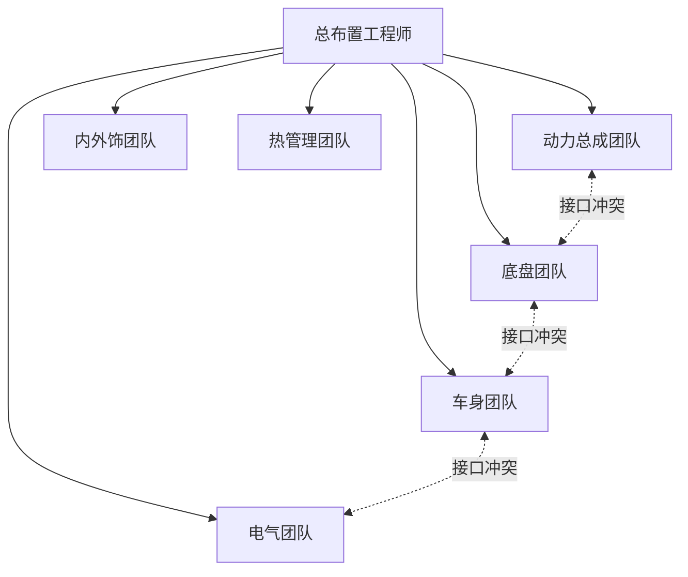

# 总布置工程师职责

## 角色定位

总布置工程师是汽车开发中的**"系统集成者"**，不负责单一系统的详细设计，而是统筹协调各系统，确保整车方案可行、性能达标、无干涉。

> 一句话理解：各系统工程师是"专科医生"，总布置工程师是"全科+协调医生"。

## 核心职责

### 1. 方案统筹

| 职责 | 说明 |
|------|------|
| 制定总布置方案 | 从整车层面确定各总成的空间位置和接口 |
| 参数定义与管控 | 定义并维护整车参数表，控制参数变更 |
| 平台化规划 | 考虑衍生车型的通用性，规划平台架构 |

### 2. 接口协调

这是总布置工程师**最重要**的日常工作：



典型协调场景：

- 动力总成悬置点与底盘副车梁安装点冲突 → 协调调整
- 排气管走向与后悬架纵臂空间冲突 → 协调走向
- 蓄电池位置与备胎舱冲突 → 重新规划
- 线束过孔与车身结构冲突 → 协调开孔位置

### 3. 干涉检查与管控

- 定期组织 DMU 干涉检查
- 建立干涉清单并跟踪关闭
- 评审各系统的布置变更影响

### 4. 性能协调

| 性能领域 | 协调内容 |
|----------|----------|
| 动力学 | 轴荷分配、重心高度 |
| NVH | 悬置模态、声学包空间 |
| 热管理 | 散热空间、风道设计 |
| 碰撞安全 | 吸能空间、乘员舱完整性 |
| 空气动力学 | 前保造型、底盘平整化 |

### 5. 法规符合性

- 确保布置方案满足目标市场法规
- 跟踪法规变更对方案的影响

详见 [法规与标准](standards.md)。

## 能力要求

### 知识储备

```
┌─────────────────────────────────────────────┐
│              总布置工程师知识体系              │
├───────────────┬──────────────┬──────────────┤
│   整车知识     │   系统知识    │   工具技能    │
├───────────────┼──────────────┼──────────────┤
│ 整车架构       │ 动力总成原理  │ CATIA/NX     │
│ 开发流程       │ 底盘系统原理  │ DMU 仿真     │
│ 法规标准       │ 车身结构     │ 性能仿真     │
│ 性能匹配       │ 电气架构     │ 数据管理     │
│ 人机工程       │ 材料工艺     │ 项目管理     │
└───────────────┴──────────────┴──────────────┘
```

### 软技能

| 技能 | 重要性 | 说明 |
|------|--------|------|
| 沟通协调 | ⭐⭐⭐⭐⭐ | 日常与多团队协调，核心能力 |
| 系统思维 | ⭐⭐⭐⭐⭐ | 从整车角度权衡各系统需求 |
| 问题解决 | ⭐⭐⭐⭐ | 快速定位冲突根因并推动解决 |
| 项目管理 | ⭐⭐⭐⭐ | 把控总布置节点与交付物 |
| 技术表达 | ⭐⭐⭐ | 方案汇报、报告撰写 |

## 成长路径

### 初级（0-3 年）

- 协助资深工程师进行布置图的维护
- 负责特定区域/系统的干涉检查
- 学习 CATIA 和 DMU 工具
- 熟悉开发流程和标准规范

### 中级（3-5 年）

- 独立负责整车或平台的总布置方案
- 主导接口协调会议
- 参与概念阶段的方案制定
- 指导初级工程师

### 高级（5-10 年）

- 负责全新平台的架构规划
- 主导总布置技术方案的评审
- 参与产品定义和战略规划
- 建立总布置设计规范

### 专家/管理（10 年+）

- 技术路线：总布置技术专家、首席工程师
- 管理路线：总布置部门经理、平台总监

!!! tip "给初学者的建议"
    1. **多画图**：熟练掌握 CATIA 布置断面绘制
    2. **多看车**：拆解研究竞品车的布置方案
    3. **多沟通**：主动参与跨部门协调，积累经验
    4. **建体系**：整理自己的参数库、案例库

## 常见误区

!!! danger "新手容易踩的坑"
    - **只看自己的一亩三分地**：总布置要全局观，不能只管一个系统
    - **忽视运动干涉**：静态没问题不代表动态没问题
    - **不关注装配工艺**：设计能装不代表产线能装
    - **参数变更不管控**：一个参数变了，可能影响多个系统
    - **不记录决策依据**：为什么这么布置，要有文档可追溯

---

## 下一步阅读

- [法规与标准](standards.md）：需要掌握的标准体系
- [软件工具](../tools/software.md)：常用工具详解
- [职业发展](../tools/career.md)：更详细的成长路径
