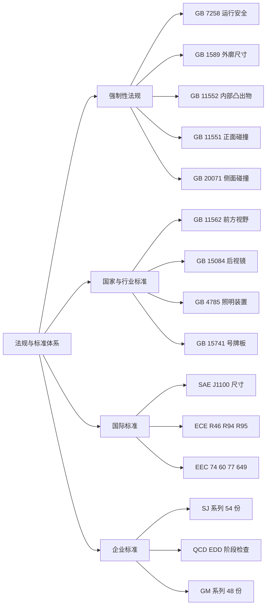

# 法规与标准

!!! quote "内容来源"
    本页正文抽取自《总布置》知识库中**可文本解析**的文件：
    `EDD-A0-005-1 外造型总布置检查清单`、`EDD-A0-005-2 内造型总布置检查清单`、
    `QCD-A0-005`、`QCD-A0-006 效果图阶段总布置检查规范`、
    `SJ 44-2009 整车外部照明及光信号装置的技术要求和校核规范`、
    `SJ 40-2009 轿车外饰SEG分析断面设计指导书`、`SJ 45-2009 内饰SEG设计指导书`。
    企业规范编号原样保留。

## 标准体系

## 概述

### 要点

**（1）总布置需要掌握的标准分四层**（汇总自 `EDD-A0-005-1` 与 `QCD-A0-005/006`）

| 层级 | 内容 | 掌握程度要求 |
|---|---|---|
| **强制性法规（GB 强检）** | 运行安全、外廓尺寸、碰撞、凸出物、视野 | 必须逐项校核并留结论 |
| **国家/行业标准（GB/T、QC/T）** | 测量方法、术语、尺寸代码、试验方法 | 作为校核方法依据 |
| **国际标准** | SAE（尺寸与 H 点）、ECE（碰撞与视野）、EEC（视野与内部件） | 企业标准的主要编写依据 |
| **企业标准** | 设计指导书、校核规范、检查清单 | 日常工作的直接依据 |

**（2）企业标准编码体系**（知识库实际分布）

| 编码前缀 | 体系 | 覆盖范围（示例） |
|---|---|---|
| **SJ n-YYYY** | 企业设计标准序列（**54 份**，SJ 1–55，缺 SJ 30） | 车门设计（2/3）、车门主断面（4）、刮扫区域（5）、驾驶员人机硬点（6）、前方视野（7）、仪表反光眩目（8）、眼椭球与头部包络（9）、后视镜（14）、手伸及界面（15）、样车测量（16）、散热器开口比（17）、顶蓬（18）、空气室盖板（19）、立柱内饰板（20）、前门内饰板（21）、内饰装配（22）、装饰件逆向（23）、前后保险杠（24）、前后风窗玻璃（25）、座椅及安全带（26）、前地板结构（27）、白车身 2D 图纸（28）、车身 RPS（29）、底盘管线（31）、倒车雷达（32）、前组合灯（36）、操纵件标志（39）、外饰 SEG 断面（40）、动力底盘 3D 评审流程（41）、三厢车外饰装配（42）、侧围外板（43）、外部照明（44）、内饰 SEG（45）、仪表板 SEG（46）、吹面出风口（47）、仪表板风道（48）、仪表板与底盘配接（49）、仪表板装配（50）、轮胎间隙（51）、N 类车踏步（52）、行李箱盖扭簧（53）、侧碰 B 柱断面系数（54）、外后视镜（55） |
| **QCD-A0-xxx** | 阶段总布置检查规范 | 概念草图阶段（005）、效果图阶段（006） |
| **EDD-A0-xxx** | 造型阶段检查清单与报告 | 外效果图可行性分析报告（005）、外造型总布置检查清单（005-1）、内造型总布置检查清单（005-2）、内效果图可行性分析报告（006） |
| **TY / CZ / JY 系列** | 技术管理规定 | 零部件及图样编号规则（TY 01）、明细表编制规则（TY 02）、设计和开发评审规定（TY 14）、DFMEA 工作流程（TY 17）、配接单（CZ 1）、动态检查报告（JY 2） |
| **GM 系列（U/T/Q/R/S/W/X）** | 通用汽车人机设计标准（**48 份**） | 手部操作件（U00–U20）、踏板与点火锁（T01–T05）、HVAC（Q00–Q04）、仪表显示（R01–R09）、音响时钟（S00/S01）、图形符号（W01–W04）、仪表（X01/X02） |

### 示例

`EDD-A0-005-1` 的"法规校核项"清单可直接作为总布置的**法规检查表**（以 M1/N1 类车型为主）：

| 法规校核项 | 对应标准 |
|---|---|
| 机动车运行安全技术条件 | `GB 7258` |
| 道路车辆外廓尺寸、轴荷及质量限值 | `GB 15089`（清单原文） |
| 汽车号牌板（架）及其位置 | `GB 15741` |
| 汽车后牌照板照明装置配光性能 | `GB 18408` |
| 汽车护轮板 | `GB 7063` |
| 汽车驾驶员前方视野要求及测量方法 | `GB 11562` |
| 机动车辆后视镜的性能和安装要求 | `GB 15084` |
| 汽车风窗刮水器、洗涤器的性能要求及试验方法 | `GB 15085` |
| 汽车前后端保护装置 | `GB 17354` |
| 汽车及挂车外部照明和光信号装置的安装规定 | `GB 4785` |
| 外部凸出物 | `GB 11566`（轿车）/ `GB 20182`（商用车驾驶室） |
| 汽车对行人的碰撞保护 | EU 法规（WAD 基准） |

### 注意事项

- **不同市场（中/欧/美）法规差异属待人工补充项**：本页依据均为国标与企业标准（国标多等效采用 ECE/EEC），
  **未见 FMVSS 等市场的差异对照**；
  可参考的线索：`SJ 44-2009` 的配置校核表**同时列出** `GB 4785-2007` 与 `ECE R48` 的配备要求，
  说明企业规范本身按"国标 + 欧标"双轨编写；
- **法规引用必须写版本号**：`GB 7258-2004` 与 `GB 7258-2012` 的条款存在差异，
  `SJ 4-2008`（引用 `GB 7258-2004`）与 `QCD-A0-006`（引用 `GB 7258-2012`）就分属不同版本——
  **跨规范引用时务必核对版本**。

## 强制性法规

### 要点

**（1）与上车体直接相关的强检项目**

| 法规 | 涉及的布置内容 | 判据示例 |
|---|---|---|
| **`GB 7258` 机动车运行安全技术条件** | 外廓、后悬、轴荷、视野 | 乘用车**后悬 ≤ 轴距的 55%**；空载与满载下**转向轮轴荷 ≥ 整车整备质量/总质量的 30%** |
| **`GB 1589` 道路车辆外廓尺寸、轴荷及质量限值** | 外廓限值 | `QCD-A0-005` 指出"一般乘用车很难超越其限值" |
| **`GB 11552` 轿车内部凸出物** | 内饰件圆角与凸出量 | 尖棱 = 曲率半径 < **2.5 mm** 的刚性棱边（**不含凸出高度 < 3.2 mm** 的构件）；格栅间距 1–10 / 10–15 / 15–20 mm 对应最小片厚 1.5 / 2.0 / 3.0 mm |
| **`GB 11551` 乘用车正面碰撞的乘员保护** | 膝部/小腿保护 | 小腿压力指标 **TCFC ≤ 8 kN**；**胫骨指数 ≤ 1.3**；以脚踝为中心 **R265～R437** 区域设缓冲 |
| **`GB 20071` 汽车侧面碰撞的乘员保护** | B 柱断面系数、内饰碰撞块 | 试验条件 **950 kg / 50 km/h / 90°**；内饰碰撞保护块**最小厚度 30 mm 以上** |
| **`GB 11566` 轿车外部凸出物** / **`GB 20182` 商用车驾驶室外部凸出物** | 前后保及外部附件圆角与凸出量 | 前保险杠上横梁断面须做外部凸出物法规校核 |
| **`GB 17354` 汽车前后端碰撞保护装置** | 低速碰撞吸能链路 | 碰撞高度 **445 mm**；正向 **4 km/h**、侧向 30° 角 **2.5 km/h** |
| **`GB 4785` 汽车及挂车外部照明和光信号装置的安装规定** | 灯具配备、位置、几何可见度 | 近光灯**离地 500–1200 mm**、距离 1 **≤ 400 mm**、几何可见度 +15°/−10°/+45°/−10° |
| **`GB 15741` 汽车和挂车号牌板（架）及其位置** + `GA 36` | 号牌板位置 | 号牌板安装空间与上下边缘离地高度 |

**（2）与内部相关的强制/推荐项**（`EDD-A0-005-2`）

| 检查项 | 标准 |
|---|---|
| 驾驶员前方视野 | `GB 11562-1994` |
| 遮阳板遮阳效果 | `QC/T 629-2005` |
| 手操纵件、指示器、信号装置位置 | `GB/T 17867-1999` |
| 手伸界面 | `SAE J287` |
| 踏板侧向间距 | `GB/T 17346-1998` / `ECE R35-1999` |
| 座椅头枕尺寸 | `GB 11550-2009` |
| 安全带固定点位置 | `GB 14166-2013` / `GB 14167-2013` |
| 儿童座椅固定点位置 | `GB 14166-2013` / `GB 14167-2013` |
| 内后视镜视野 | `GB 15084-2006` |
| 内部突出物 | `GB 11552-2009` |

### 示例

法规条款引用示例（`SJ 40-2009` 对行人保护的引用方式）：

| 对象 | 法规基准 | 试验条件 |
|---|---|---|
| 儿童 | EU 法规 **WAD = 1000 mm** | 头部模型 **Φ130 mm**、**2.5 kg**、**40 km/h**、与水平面成 **50°** |
| 成人 | EU 法规 **WAD = 1500 mm** | 头部模型 **Φ165 mm**、**4.8 kg**、**40 km/h**、与水平面成 **65°** |

设计要求：与行人保护有关的内板结构尺寸以"过 WAD = 1000 mm 的基准点垂直于外表面的基准线"为基准设定；考虑儿童头部 Φ130 mm 与 **50 mm 试验误差**，**加强件后边界到 WAD1000 的距离应 ≥ 65 + 50 = 115 mm**。

### 注意事项

- **不同市场法规差异**：`GB 4785` 等效采用 `ECE R48`，`GB 20071` 基于 `ECE R95` 并"根据国内人体参数、车型状况等情况做了少量修改"（`SJ 54-2009` §3）；
- **法规是下限**：企业目标（如 C-NCAP 五星）通常高于法规，需在概念设计阶段预留结构余量（见 [性能参数](../parameters/performance.md)）。

## 国家与行业标准

### 要点

**（1）尺寸与术语类**（作为尺寸代码与测量的依据）

| 标准 | 用途 |
|---|---|
| **`SAE J1100` Motor Vehicle Dimensions** | 尺寸代码的唯一来源（`40《总布置图设计规范》` 全部 127 项均标注参照 SAE 1100） |
| `GB/T 19234-2003 乘用车尺寸代码` | SAE J1100 的国标对应版本（`SJ 45-2009` 引用） |
| `GB/T 3730.2-1996 道路车辆 质量 词汇和代码` | 质量参数定义（`SJ 16-2008` 引用） |
| `GB/T 3730.3-1992 汽车和挂车的术语及其定义 车辆尺寸` | 尺寸术语（`QCD-A0-006` 引用） |
| `GB/T 4782-1984 道路车辆 操纵件、指示器及信号装置词汇` | 操纵件术语（`SJ 39-2009` 引用） |

**（2）测量与试验方法类**

| 标准 | 用途 |
|---|---|
| `GB/T 12673-1990 汽车主要尺寸测量方法` | 尺寸测量（`QCD-A0-006` 引用） |
| `GB/T 13053-2008 客车车内尺寸` | 客车内部尺寸 |
| `GB/T 15705-1995 载货汽车驾驶员操作位置尺寸` | 商用车驾驶位置 |
| `GB/T 2978-2008 轿车轮胎系列` / `GB/T 3487-2005 汽车轮辋规格系列` | 轮胎与轮辋（`SJ 51-2009` 引用） |
| `SAE J1214 JAN1992` Tire To Body Clearance Check | 轮胎间隙校核方法 |
| `SAE J826` H-Point Machine and Design Tool Procedures | H 点确定（`SJ 6-2008`、`SJ 7-2008` 引用） |

**（3）国际标准**

| 标准 | 用处 |
|---|---|
| **`SAE J1100` / `SAE J941`**（Driver's Eye Locations）/ **`SAE J1052`**（Head Position） | 尺寸代码、眼椭圆、头部包络面（`SJ 9-2008` 引用） |
| **`SAE J287`** Driver Hand Control Reach | 手伸及界面（`SJ 15-2008` 依据 `SAE J287-1988-06`） |
| **`ECE R46`** 间接视野装置 | 后视镜（`SJ 14-2008` 与 `GB 15084-2006` 并用） |
| **`ECE R48`** 照明装置安装 | 灯具（`SJ 44-2009` 与 `GB 4785-2007` 并用） |
| **`ECE R94`** 前碰撞乘员防护 / **`ECE R95`** 侧碰撞 | 正碰与侧碰 |
| **`ECE R16`** 安全带固定点 | 安全带（`40` 引用） |
| **`ECE R61`** 商用车外部凸出物 | N 类车（`SJ 52-2009` 引用） |
| **`EEC 74/60/EEC`、`78/632/EEC`、`77/649/EEC`、`78/318/EEC`** | 内部安装件、视野、雨刮洗涤器 |
| **`GB 11562-94` / `GB 15084-2006` / `GB 15085`** | 前方视野、后视镜、雨刮洗涤（国标对应版本） |

### 示例

标准应用示例（`SJ 51-2009` 轮胎间隙校核的依据链）：

> 方法依据 **`SAE J1214 JAN1992`**（Tire To Body Clearance Check For Recreational Vehicles）；
> 轮胎与轮辋标准 **`GB/T 2978-2008`**、**`GB/T 3487-2005`**；
> 校核工况按独立/非独立前悬各 4 工况、后悬 3 工况设定。

### 注意事项

- **标准版本更新跟踪属待人工补充项**：已解析条款中可见版本差异（如 `SAE J1100-2002` 与 `SAE J1100-2009`、
  `GB 7258-2004` 与 `GB 7258-2012`、`GB 11552-1999` 与 `GB 11552-2009`），但**未见版本更新跟踪机制**；
- **同一对象可能有多套并存标准**：后视镜同时依据 `GB 15084-2006` 与 `ECE R46-2006`（`SJ 14-2008`），
  灯具同时依据 `GB 4785-2007` 与 `ECE R48`（`SJ 44-2009`）——**引用时需说明以哪套为准**。

## 企业标准

### 要点

**（1）企业标准的三种形态**

| 形态 | 示例 | 用途 |
|---|---|---|
| **设计指导书** | `SJ 18 顶篷`、`SJ 21 前门内饰板`、`SJ 24 前后保险杠`、`SJ 47 吹面出风口` | 给出设计顺序、定义要求、间隙体系、工艺要求 |
| **校核规范** | `SJ 5 刮扫区域`、`SJ 7 前方视野`、`SJ 8 仪表反光及眩目`、`SJ 51 轮胎间隙`、`SJ 54 侧碰 B 柱断面系数` | 给出校核步骤、输入条件、结果判定 |
| **流程与清单** | `SJ 41 3D 数据评审流程`、`QCD-A0-005/006`、`EDD-A0-005-1/-2` | 规定流程、评审准备文件、检查清单 |

**（2）企业标准的通用结构**（以 SJ 系列为例）

`1 范围 → 2 规范性引用文件 → 3 术语和定义 → 4 基本要求/输入条件 → 5 前期分析（定义检查、总布置与人机分析、功能尺寸分析、间隙与边界要求、工艺要求）→ 6 3D 数据设计（设计顺序：查定义、做边界、核人机、定结构、细化 3D）→ 附录（以往车型数据）`。

**（3）企业标准中"经验值"的地位**

大量数值被明确标注为"经验值"或"仅供参考"：

| 类型 | 示例 |
|---|---|
| 经验值 | 顶篷头部空间与乘坐空间"此数值为经验数值"（`SJ 18-2008` §5.2.1）；前保尺寸 A～I"下面所述的尺寸均为经验值，具体车型需具体分析"（`SJ 24-2008` §5.2.5） |
| 仅供参考 | 叶片转轴"一般设在叶片的 1/3 处（此数据仅供参考）"（`SJ 47-2009` §5.2）；`EDD` 清单"以上校核内容仅供参考，根据具体项目增加或者减少相关校核项" |

### 示例

企业标准往往附**以往项目实测数据**作为对标基准，这是企业内部最有价值的知识资产：

| 规范 | 附录内容 |
|---|---|
| `SJ 6-2008` | 附录 A 以往项目驾驶员人机硬点坐标统计（7 个车型的轴距、H30、W20、APA、HGP/PRP/SgRP/SWC 坐标、转向盘角度） |
| `SJ 7-2008` | 附录 A 以往车型 A 柱障碍角、上下视野、转向盘障碍角统计数据与散点图 |
| `SJ 9-2008` | 附录 A 公司以往设计车型的最小头部空间（W27/W35/H35/H61） |
| `SJ 54-2009` | 车型算例（丰田 COROLLA、海马 M2 的断面系数计算） |

### 注意事项

- **企业标准与法规的优先级关系**：企业标准通常**严于**法规（如 A 柱障碍角法规 < 6°，`SJ 7-2008` 推荐 < 5°）；
  当两者冲突时以**法规为下限、企业标准为目标值**；
- **企业标准引用网络本身就是取材地图**：`SJ 46-2009` §2 引用了 `SJ 8/40/47/48/49/50`，
  顺着引用链可以一次性拉齐一个板块的全部依据（详见 [内容更新指南](../maintain/update.md)）。

## 待人工补充

!!! warning "本页待人工补充清单"
    - **不同市场法规差异对照**（GB vs ECE vs FMVSS）的完整清单；
    - **标准版本更新跟踪机制**；
    - **QC/T 系列**在知识库中的覆盖情况：`EDD-A0-005-2` 引用了 `QC/T 629-2005 汽车遮阳板`，
      但《总布置》知识库中未见 QC/T 标准原文；
    - **`GB 1589` 外廓尺寸、轴荷及质量的具体限值表**：`QCD-A0-005` 仅说明"一般乘用车很难超越其限值"，
      未列出限值；
    - **`GB/T 19234-2003 乘用车尺寸代码`** 与 SAE J1100 的**代码对照表**：知识库中未见该文件；
    - 知识库中以下文件虽相关但因读取问题**未采用**：`AEM-A4-002`、`AEM-A4-003`、`AEM-A4-004`、
      `AEM-A4-006`、`AEM-A4-101`、`AEM-A4-102`、`AEM-A4-301`～`AEM-A4-304`（法规校核规范系列）。

    建议：在 IMA 客户端中打开对应文件补充条款，或按"规范编号 + 页码"方式人工引用。

---

## 下一步阅读

- [工程师职责](responsibilities.md)：各阶段职责与能力要求
- [总布置工作流程](workflow.md)：各阶段的门禁与判据
- [开发流程概述](../process/overview.md)：评审与交付的流程要求
- [性能参数](../parameters/performance.md)：安全相关性能的判据与限值
