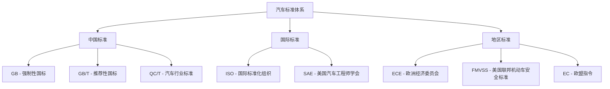

# 法规与标准

## 概述

汽车总布置设计必须满足**法规要求**，这是方案可行性的底线。不同市场的法规体系不同，需根据目标市场确定适用标准。

## 标准体系总览



## 与总布置相关的主要标准

### 1. 尺寸与质量类

| 标准号 | 标准名称 | 与总布置的关系 |
|--------|----------|----------------|
| GB 1589 | 汽车、挂车及汽车列车外廓尺寸、轴荷及质量限值 | 整车尺寸/质量的法规上限 |
| GB/T 12673 | 主要尺寸测量方法 | 尺寸参数定义与测量 |
| GB/T 12538 | 车辆重心位置测量 | 重心测量方法 |
| GB 7258 | 机动车运行安全技术条件 | 整车安全基本要求 |

!!! example "GB 1589 关键限值（乘用车）"
    - 车长：≤ 6000 mm
    - 车宽：≤ 2500 mm
    - 车高：≤ 4000 mm
    - （具体以最新版标准为准）

### 2. 安全类

| 标准号 | 标准名称 | 布置影响 |
|--------|----------|----------|
| GB 11551 | 正面碰撞乘员保护 | 前部吸能空间、乘员舱刚度 |
| GB 20071 | 侧面碰撞乘员保护 | 车门防撞梁、B 柱布置 |
| GB 17354 | 前端碰撞保护 | 前保险杠高度/刚度 |
| GB 11567 | 汽车及挂车侧面和后下部防护 | 侧/后防护装置位置 |
| GB 14166 | 安全带安装固定点 | 安全带固定点布置 |
| GB 11562 | 驾驶员前方视野 | A 柱盲区、前视野角 |
| GB 15084 | 间接视野装置 | 后视镜安装位置 |

### 3. 灯光类

| 标准号 | 标准名称 | 布置影响 |
|--------|----------|----------|
| GB 4785 | 汽车及挂车外部照明和光信号装置的安装 | 灯具位置/数量/间距 |
| GB 4599 | 前照灯配光性能 | 前照灯安装高度 |
| GB 4660 | 前雾灯配光性能 | 雾灯位置 |

!!! tip "灯光布置要点"
    - 前照灯高度有上下限要求
    - 各灯具之间需满足最小间距
    - 转向灯、制动灯的位置和可见角度有明确规定

### 4. 人机工程类

| 标准号 | 标准名称 | 布置影响 |
|--------|----------|----------|
| GB/T 13053 | 客车驾驶区尺寸 | 驾驶区布置（商用车） |
| GB 11552 | 乘用车内部凸出物 | 内饰圆角、凸出物限制 |
| GB 10000 | 中国成年人人体尺寸 | 人体模型参考 |
| SAE J826 | H 点装置（HPM） | H 点测量与定义 |
| SAE J941 | 眼椭圆 | 视野分析依据 |
| SAE J1052 | 机动车辆驾驶员和乘员头部位置 | 头部包络 |

### 5. 新能源相关

| 标准号 | 标准名称 | 布置影响 |
|--------|----------|----------|
| GB 38031 | 电动汽车动力蓄电池安全要求 | 电池包布置与防护 |
| GB/T 31486 | 动力电池电性能要求 | 电池包尺寸参考 |
| GB 18384 | 电动汽车安全要求 | 高压系统防护 |
| GB 38032 | 电动客车安全要求 | 客车电池布置 |

### 6. 排放与环保

| 标准号 | 标准名称 | 布置影响 |
|--------|----------|----------|
| GB 18352.6 | 轻型汽车污染物排放限值 | 排气系统/催化器布置 |
| GB 1495 | 汽车加速行驶车外噪声限值 | 发动机舱隔音、进气消声 |

## 如何使用标准

### 标准查阅流程

```
明确需求 → 确定适用标准 → 查阅最新版本 → 提取布置要求
    → 纳入设计规范 → 布置方案校核 → 法规验证
```

!!! warning "注意事项"
    1. **使用最新版**：标准会修订，务必查阅现行有效版本
    2. **多市场叠加**：出口车型需同时满足多个市场法规
    3. **法规动态跟踪**：新法规出台（如国七、Euro 7）需提前规划
    4. **认证试验**：方案需通过第三方认证机构验证

### 标准获取渠道

| 渠道 | 说明 |
|------|------|
| [全国标准信息公共服务平台](https://std.samr.gov.cn/) | GB/GB/T 标准查询 |
| [汽标委](http://www.catarc.org.cn/) | 汽车行业标准 |
| ISO 官网 | 国际标准（需购买） |
| SAE 官网 | SAE 标准（需购买） |
| 企业标准库 | 主机厂通常有内部标准订阅 |

## 企业标准与规范

除了国家标准，主机厂还有大量**企业内部标准**：

| 类型 | 内容 |
|------|------|
| 设计规范 | 总布置设计指南、各系统设计规范 |
| 试验规范 | 企业标准试验方法 |
| 材料规范 | 材料选型与技术要求 |
| 工艺规范 | 制造与装配工艺要求 |

!!! note "企业标准的重要性"
    企业标准通常比国标更严格、更具体，是日常设计的直接依据。
    初入行的工程师应尽快熟悉本企业的标准体系。

## 标准与布置的关系示例

### 示例：A 柱盲区法规校核

```
GB 11562 要求：
- 每根 A 柱在双眼基准点的双目障碍角 ≤ 6°
```

总布置需在方案阶段进行视野分析：

1. 建立眼椭圆模型（SAE J941）
2. 以眼椭圆最不利点为视点
3. 计算 A 柱双目障碍角
4. 若超限 → 调整 A 柱位置/截面/倾角

### 示例：电池包布置安全

```
GB 38031 要求：
- 电池包在车辆底部，需有防护结构
- 挤压、针刺、热扩散等安全要求
```

总布置需考虑：

1. 电池包离地间隙（满足通过性 + 防磕碰）
2. 电池包与周边结构的安全间距
3. 碰撞时电池包的防护路径

---

## 下一步阅读

- [整车参数](../parameters/dimensions.md)：参数如何满足法规
- [碰撞安全](../body/cabin.md)：乘员舱布置要点
- [电池布置](../electrical/battery.md)：新能源法规要求
