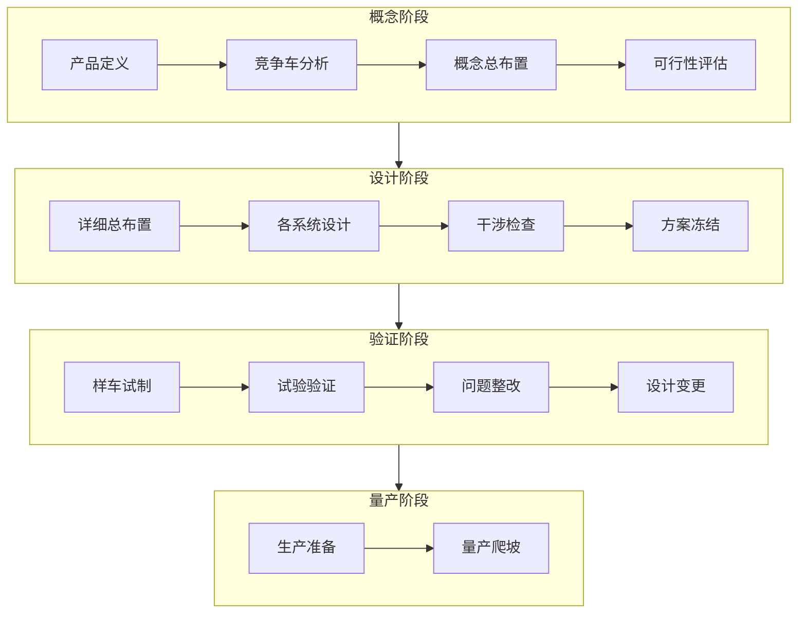
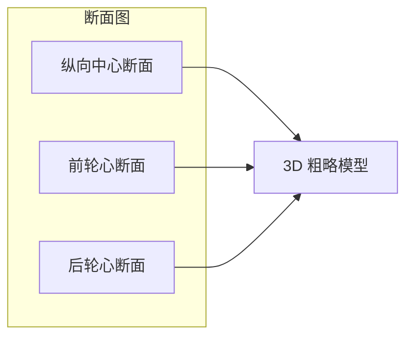
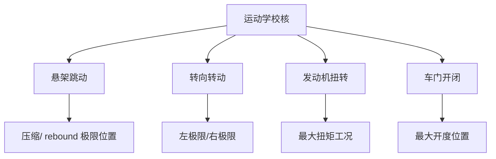
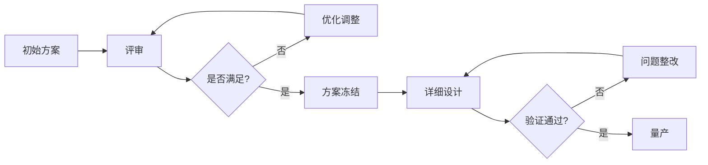

# 总布置工作流程

## 概述

总布置工作贯穿汽车开发的整个周期，从概念阶段到量产阶段，是一个**迭代优化**的过程。本章梳理典型的工作流程与关键里程碑。

## 开发阶段划分



## 阶段一：概念总布置

### 输入条件

| 输入项 | 内容 | 提供方 |
|--------|------|--------|
| 产品定义书 | 车型定位、目标市场、竞品 | 产品规划 |
| 性能目标 | 动力性、经济性、NVH 等 | 性能部门 |
| 法规清单 | 目标市场法规要求 | 法规部门 |
| 成本目标 | 整车成本限制 | 财务/采购 |

### 主要工作

#### 1. 确定整车基本参数

```
┌─────────────────────────────────────┐
│         整车参数包络定义              │
├──────────┬──────────┬───────────────┤
│  尺寸参数 │  质量参数 │  性能参数      │
│  长×宽×高 │ 整备质量  │ 最高车速       │
│  轴距     │ 满载质量  │ 0-100加速     │
│  轮距     │ 轴荷分配  │ 续航/油耗      │
│  前后悬   │ 重心高度  │ 最小离地间隙   │
└──────────┴──────────┴───────────────┘
```

#### 2. 总成选型与布置方案

- **动力总成**：发动机/电机型号选型，初步定位
- **底盘方案**：悬架形式（麦弗逊/多连杆等）、转向形式
- **车身形式**：承载式/非承载式，座舱布局（2+3 / 2+2+2 等）
- **电气架构**：低压/高压系统初步方案

#### 3. 绘制概念布置图

在 CATIA 中建立初步的布置断面（Section）：



#### 4. 可行性评估

| 评估项 | 方法 |
|--------|------|
| 空间可行性 | 干涉检查，确认各总成可放下 |
| 性能可行性 | 初步性能计算，是否达标 |
| 法规可行性 | 尺寸/安全法规校核 |
| 成本可行性 | 初步成本估算 |

!!! example "概念阶段输出物"
    - 概念总布置图（2D 断面 + 3D 粗模）
    - 整车参数表
    - 总成选型清单
    - 可行性分析报告

## 阶段二：详细总布置

### 主要工作

#### 1. 精确定位各总成

基于概念方案，在 CATIA 中进行详细的三维布置：

- 定义各总成的安装基准和定位方式
- 确定悬置/支座的位置和刚度
- 确定管线路的走向和固定方式

#### 2. 运动学校核



#### 3. 干涉检查（DMU）

- **静态干涉**：所有零件在设计位置的最小间隙
- **动态干涉**：运动件在极限位置的间隙
- **装配干涉**：模拟装配过程，检查可装配性

#### 4. 接口协调

总布置工程师的核心协调工作：

| 协调对象 | 接口内容 |
|----------|----------|
| 动力 ↔ 底盘 | 悬置点位置、半轴角度 |
| 底盘 ↔ 车身 | 硬点坐标、安装支架 |
| 车身 ↔ 电气 | 线束过孔、搭铁点 |
| 内饰 ↔ 车身 | 仪表台安装、门饰板配合 |
| 热管理 ↔ 所有 | 冷却管路、空调管路走向 |

#### 5. 方案冻结

经过多轮迭代后，总布置方案冻结，输出：

- 冻结的总布置图
- 硬点表（Hardpoint Table）
- 各系统设计任务书
- 总成接口控制文件（ICD）

!!! warning "方案冻结的意义"
    冻结后各系统才能开始详细设计。后续变更需走 ECN（工程变更通知）流程，
    代价较高。因此冻结前的充分论证至关重要。

## 阶段三：验证与整改

### 样车阶段

| 阶段 | 样车类型 | 主要目的 |
|------|----------|----------|
| ET | 工程样车 | 功能验证、性能摸底 |
| PT | 生产样车 | 工艺验证、可靠性 |
| TT | 试生产车 | 量产线验证 |

### 问题整改流程

```
发现问题 → 问题登记 → 根因分析 → 方案制定 → 方案评审
    → 设计变更（ECN）→ 验证 → 关闭
```

## 迭代优化

总布置不是一次性工作，而是持续迭代：



## 工作工具

| 工具 | 用途 |
|------|------|
| CATIA / NX | 三维建模、布置、干涉检查 |
| DMU（Digital Mock-Up） | 数字样机、运动仿真 |
| Excel | 参数表、硬点表管理 |
| Teamcenter / ENOVIA | 数据管理、变更管理 |
| MATLAB / CarSim | 性能仿真 |

---

## 下一步阅读

- [工程师职责](responsibilities.md)：总布置工程师的角色定位
- [法规与标准](standards.md）：开发中需遵循的标准体系
- [整车参数](../parameters/dimensions.md)：参数如何定义
