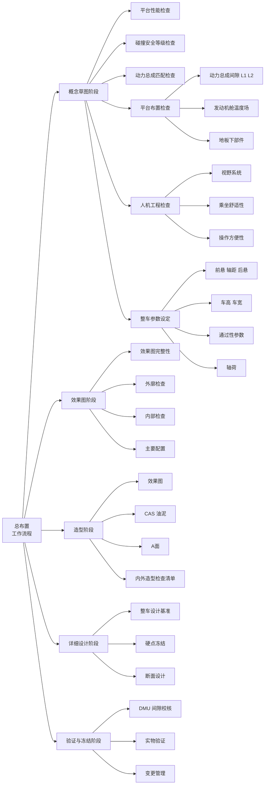
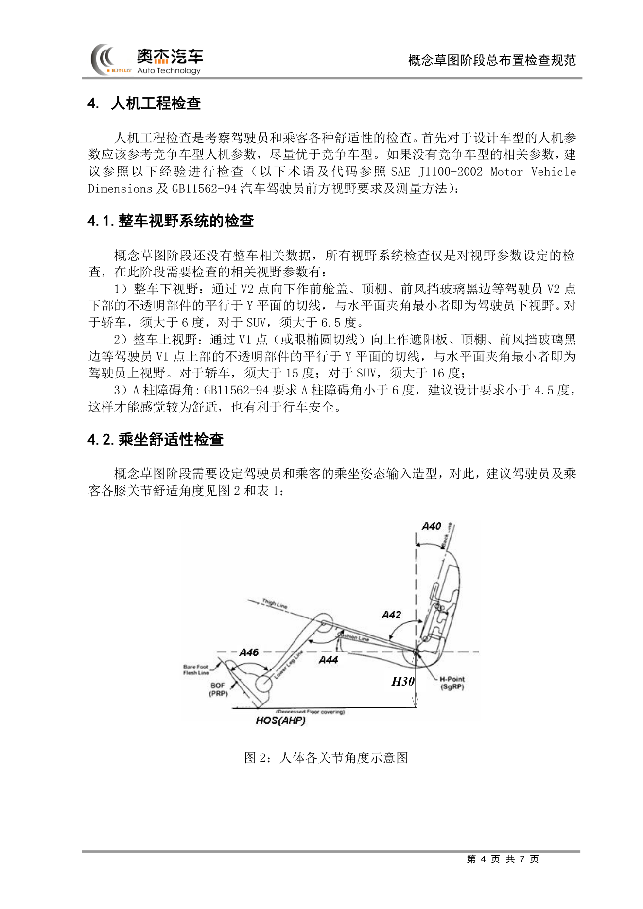
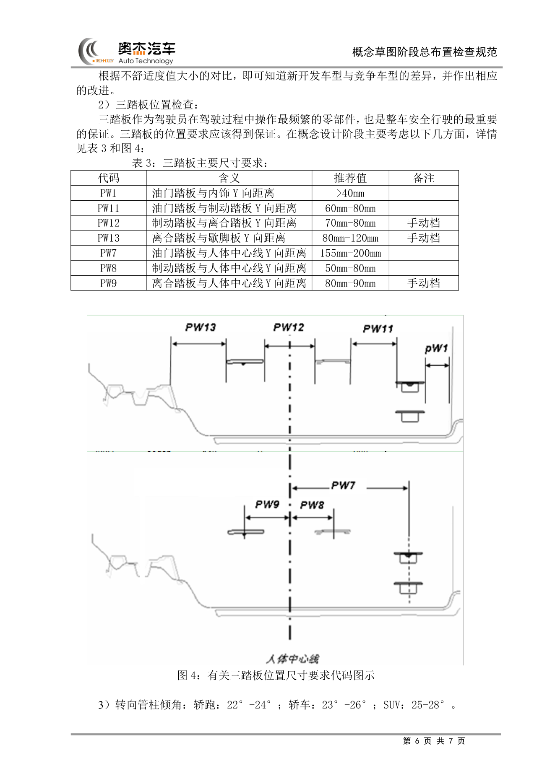
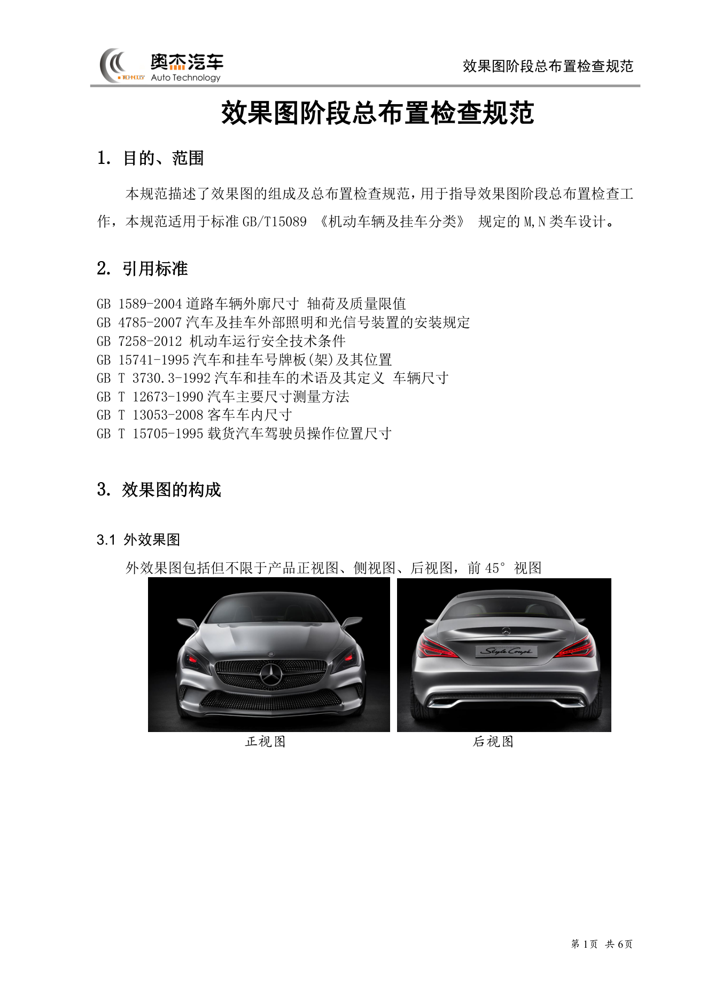
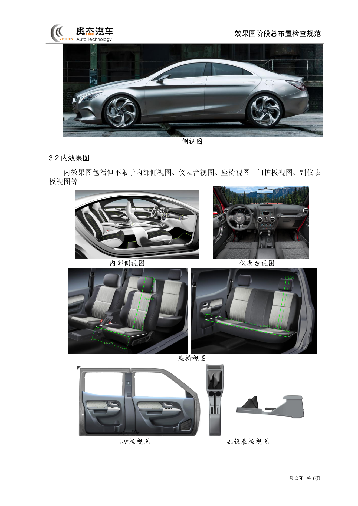

# 总布置工作流程

!!! quote "内容来源"
    本页正文抽取自《总布置》知识库中的可文本解析文件：
    `QCD-A0-005 概念草图阶段总布置检查规范`、`QCD-A0-006 效果图阶段总布置检查规范`、
    `H20-整车总布置设计硬点报告`、`01-H20项目上车体结构设计构想`。
    企业规范编号（AEM/EDD/QCD/SJ/H20/ZBZ）**原样保留**，便于回到知识库中对号入座。
    不可文本解析的扫描版条目已在小节末以「待人工补充」标出。

## 流程总览



## 概述

### 要点

总布置流程的本质是**"输入—布置—校核"三段闭环，并以门禁（Gate）分段冻结**。整条主线遵循三个特征：

| 特征 | 含义 | 知识库依据 |
|---|---|---|
| 平台先行 | "概念设计，平台先行"——先定市场定位、性能目标、碰撞星级、外廓尺寸区间，再选平台与配置 | QCD-A0-005 §3 |
| 造型同步 | 每进入一个造型阶段（效果图 → CAS → 油泥 → A 面），总布置用同一套清单**逐阶段打勾闭环** | EDD-A0-005-1/-2 |
| 硬点收口 | 流程终点是《整车总布置设计硬点报告》的发布与冻结，后续设计"必须以确定的设计硬点为基础展开" | H20 硬点报告 |

流程可归为**五个阶段、六个门禁**，阶段与主要交付物对应关系如下：

| 阶段 | 输入 | 主要工作 | 阶段交付物 |
|---|---|---|---|
| 概念草图 | 市场定位、竞品参数、目标星级 | 平台检查 → 动力总成匹配 → 平台布置 → 人机工程 → 整车参数设定 | 整车参数初稿、造型边界要求 |
| 效果图 | 效果图（外 4 视图 + 内 5 视图） | 完整性/外廓/内部/配置四类检查 | 效果图检查结论 |
| 造型 | 效果图 → CAS → 油泥 → A 面 | 用 EDD 内外造型检查清单逐阶段校核 | 各阶段 check list |
| 详细设计 | A 面、断面 | 硬点确定、断面设计、DMU 校核 | 硬点报告、断面图 |
| 验证与冻结 | 三维数据 | DMU 间隙/干涉校核、实物验证 | 冻结版硬点报告 |

### 注意事项

- 流程是**迭代**而非线性：造型每改动一次，外廓、视野、人机等校核项都要重跑对应清单。
- 各阶段检查的**松紧程度不同**：概念草图阶段"还没有整车相关数据，所有视野系统检查仅是对视野参数设定的检查"（QCD-A0-005 §4.1），不能拿详细设计阶段的精度去要求概念阶段。

## 概念设计阶段

概念草图阶段的检查内容由 **QCD-A0-005《概念草图阶段总布置检查规范》** 定义（R01，2013.01.30），仅适用于乘用车设计。其引用标准为 `GB 7258-2004`、`GB 1589-2004`、`GB 11562-1994`、`SAE J1100-2002`。

### 1. 平台检查

平台检查包含四项，任一不通过都可能意味着**换平台或重新选型**：

| 检查项 | 触发条件 / 判据 |
|---|---|
| 整车性能检查 | 新车型相对原平台出现**轴距加长**、**质心抬高**（如家轿平台做 SUV）、**前后轮距变小**时，需预估新车型重量、质心位置、轴距、轴荷并做仿真分析 |
| 碰撞安全等级检查 | 目标五星则原平台最好也是五星，否则需对原平台做较多加强设计与**多轮仿真** |
| 动力总成匹配检查 | 由整车重量、发动机万有特性曲线、变速箱速比、主减速比、迎风面积、风阻系数、滚动半径算出 0→100 km/h 加速时间、最高车速、最大爬坡度、综合工况百公里油耗，再与竞争车型对比；**有优势才进入布置分析，否则重新选型** |
| 平台布置检查 | 见下表动力总成/机舱/地板下部件布置要求 |

动力总成匹配中风阻系数取经验值：**家轿 Cd ≈ 0.27，SUV ≈ 0.3**。

### 2. 平台布置检查（间隙与温度场）

**（1）动力总成布置**

| 判据 | 数值要求 |
|---|---|
| 碰撞吸能距离 | `L1 + L2 > 425 mm`，`L1 > 300 mm`，`L2 > 50 mm`（L1＝动力总成硬物最前端→保险杠最前端；L2＝动力总成最后端→防火墙最前端） |
| 传动轴角度（前置前驱） | 轿车空/满载 ≤ **5.5°**；SUV 空/满载 ≤ **7°** |
| 发动机端与纵梁 Y 向间隙 | ≥ **25 mm** |
| 变速箱端与纵梁间隙 | 位于纵梁下端且有重叠：一般 > **20 mm**（按发动机摆动角度确定）；位于纵梁内侧：≥ **25 mm** |

**（2）发动机舱布置（按温度场定位大件）**

| 零部件 | 工作温度 / 布置要求 |
|---|---|
| 蓄电池 | -30~80 ℃，最佳 < 53 ℃；周边留 **10~20 mm** 散热间隙，远离热源、固定牢靠 |
| 转向机 | -35~+120 ℃；与排气部件最小间隙 ≥ **60 mm**，为加装隔热罩预留空间 |
| 液压助力转向管路 | -40~+100 ℃，瞬时耐热 +120 ℃ |
| ABS / ESP | 环境温度 ≤ **120 ℃**（制动液沸点虽 180 ℃，但 >120 ℃ 影响橡胶件并易引起气阻） |
| 引气口 | ≤ **40 ℃**（理想 25 ℃）；尽可能布置到发动机舱外（发盖与前保之间、纵梁外侧） |
| 电器盒 | -40~80 ℃，尽可能远离排气系统 |
| 冷却液壶 / 转向液壶 | 最低液面必须是**整个系统液面的最高点**（连通器原理，防气泡参杂） |

**（3）地板下部件布置**

- 排气管：最低点离地间隙**不能小于整车最小离地间隙**；
- 油箱：容量须保证整车行驶 **500 km**；地板下部离地间隙最小的零部件**不能是油箱**；排气管与油箱最小间隙 > **50 mm**（留足加装隔热垫空间）；
- 隐藏式排气：需满足 **95% 假人在车后 10 m 处看不见排气口**。

### 3. 人机工程检查

**（1）视野系统**（尺寸代码参照 SAE J1100-2002 / GB 11562-94）

| 参数 | 定义 | 轿车 | SUV |
|---|---|---|---|
| 整车下视野 | 过 V2 点向下作前舱盖/顶棚/前风挡黑边等的切线，与水平面夹角最小者 | > **6°** | > **6.5°** |
| 整车上视野 | 过 V1 点（或眼椭圆切线）向上作遮阳板/顶棚/前风挡黑边等的切线，与水平面夹角最小者 | > **15°** | > **16°** |
| A 柱障碍角 | GB 11562-94 要求 | < **6°**（建议设计 < **4.5°**） | 同左 |

**（2）乘坐舒适性**——驾驶员及各排乘客的关节角度推荐值：

| 角度 | H30 (mm) | A40 (°) | A42 (°) | A44 (°) | A46 (°) |
|---|---|---|---|---|---|
| 推荐范围 | 220–350 | 22–28 | 85–105 | 110–125 | 87（±2） |

H30 需按车型级别收窄取值：

| 车型级别 | 轿跑 | B 级车 | A 级车 | A0 级车 | A00 级车 | SUV |
|---|---|---|---|---|---|---|
| H30 (mm) | 220–240 | 230–270 | 280–310 | 300–330 | 320–350 | 320–350 |

**假人选用规则**：前排驾驶员与后排乘客尽量考虑 **SAE 95%** 假人空间，优先保证驾驶员舒适性；若后排 A44 < 85°，后排乘客改按 **SAE 50%** 假人；若 50% 假人仍 A44 < 85°，改按 **SAE 5% 女性假人**。

**（3）操作方便性**

- 换挡手柄包络与手刹包络**必须落在驾驶员手握式手伸及界面之内**；更合理的做法是用 **Ramsis** 校核 95%/50%/5% 假人在对应 H 点位置操作换挡手柄与手刹的舒适性，用**不舒适度值**与竞争车型对比后改进；
- 三踏板尺寸要求（PW 系列代码）：

| 代码 | 含义 | 推荐值 | 备注 |
|---|---|---|---|
| PW1 | 油门踏板与内饰 Y 向距离 | > 40 mm | |
| PW11 | 油门踏板与制动踏板 Y 向距离 | 60–80 mm | |
| PW12 | 制动踏板与离合踏板 Y 向距离 | 70–80 mm | 手动档 |
| PW13 | 离合踏板与歇脚板 Y 向距离 | 80–120 mm | 手动档 |
| PW7 | 油门踏板与人体中心线 Y 向距离 | 155–200 mm | |
| PW8 | 制动踏板与人体中心线 Y 向距离 | 50–80 mm | |
| PW9 | 离合踏板与人体中心线 Y 向距离 | 80–90 mm | 手动档 |

- 转向管柱倾角：轿跑 **22°–24°**、轿车 **23°–26°**、SUV **25°–28°**。

### 4. 整车参数设定检查

| 参数 | 确定依据 |
|---|---|
| 前悬 | 碰撞吸能距离 + 散热器/低速碰前保横梁布置 + 接近角与竞品对比 |
| 轴距 | 驾驶室内布置完假人后，对比新车型与竞品乘坐舒适性决定加长/减短 |
| 后悬 | 备胎布置 + 离去角对比；`GB 7258` 要求乘用车**后悬 ≤ 轴距的 55%** |
| 整车高度 | 轮胎型号 + 假人姿态 + 驾驶员头部空间要求 + 顶盖典型截面 |
| 整车宽度 | H 点 Y 坐标差（轮距不变时）；轮距加大/减小则整车宽度同向变化 |
| 接近角/离去角/纵向通过角/最小离地间隙 | 参照竞争车型数值设定 |
| 轴荷 | `GB 7258` 要求空载与满载下**转向轮轴荷 ≥ 整车整备质量/整车总质量的 30%** |

### 示例

图 2 给出各类节角度与 H 点的几何定义，是确定 A40/A42/A44/A46 与 H30 的直接工具：



图 4 给出三踏板位置尺寸代码（PW1/PW7/PW8/PW9/PW11/PW12/PW13）的图示定义：



### 注意事项

- **概念阶段的精度是"设定级"而非"校核级"**：此阶段没有整车数模，视野、坐姿等仅作为对造型的输入约束；切勿在概念阶段追求详细设计阶段的精度。
- 上游数据一旦变更（尤其是 H 点、平台轮距），三踏板、手伸及界面、视野全部需重新评估。
- 机舱布置以**温度场**为大件定位依据，而非以装配便利性优先；间隙要求是"最小值"，实际需为隔热罩、线束、维修空间留余量。

## 效果图阶段

效果图阶段的检查内容由 **QCD-A0-006《效果图阶段总布置检查规范》** 定义（R01，2013.01.30），适用于 `GB/T 15089` 规定的 **M、N 类车**。引用标准：`GB 1589-2004`、`GB 4785-2007`、`GB 7258-2012`、`GB 15741-1995`、`GB/T 3730.3-1992`、`GB/T 12673-1990`、`GB/T 13053-2008`、`GB/T 15705-1995`。

### 要点

**（1）效果图的构成**

| 类别 | 应包含视图（含但不限于） |
|---|---|
| 外效果图 | 正视图、侧视图、后视图、前 45° 视图 |
| 内效果图 | 内部侧视图、仪表台视图、座椅视图、门护板视图、副仪表板视图 |

**（2）四类检查项**

| 序号 | 检查项目 | 检查内容 | 规范要求 |
|---|---|---|---|
| 1 | 效果图的完整性 | 视图完整性 | 视图完整，无缺失 |
| | | 车型功能件完整性 | 车型功能件无缺失 |
| 2 | 外廓检查 | 整车长度 | 满足法规要求，满足总布置图要求 |
| | | 整车宽度、高度、轴距 | 满足总布置图要求 |
| | | 前悬、后悬、轮距 | 满足总布置图要求 |
| | | 接近角、离去角、最小离地间隙、机舱盖轮廓 | 满足总布置图要求 |
| | | 前后端离地高度 | 满足台阶保护要求；满足法规要求 |
| | | 外部照明装置、号牌板位置、外后视镜宽度 | 满足法规要求 |
| 3 | 内部检查 | 分块合理性 | 分块合理 |
| | | 人体布置空间 | 满足总布置图要求/舒适性要求 |
| | | 座椅尺寸、座间距 | 满足总布置图要求；满足法规要求 |
| | | 驾驶员视野 | 满足总布置图要求 |
| | | 三踏板间距、手操纵件舒适性、方向盘位置及尺寸 | 满足总布置图要求 |
| | | 仪表板边界、门护板边界、顶棚下边界 | 满足总布置图要求 |
| 4 | 主要配置 | 配置的体现 | 前期提供配置表得到体现 |

### 示例

外效果图与内效果图的规范示例（可直接作为"视图是否完整"的对照基准）：





### 注意事项

- 效果图阶段的检查依据是**总布置图 + 配置表**，因此前期配置表必须先行提供，否则"配置的体现"一项无法判定。
- 外廓检查中"前后端离地高度"需同时满足台阶保护与法规两条约束，二者可能冲突，需取严。

## 详细设计阶段

### 要点

详细设计阶段的主线交付物是 **《整车总布置设计硬点报告》**。H20 项目报告的目录结构本身即工作分解：

```text
1 概述
2 整车设计基准
  2.1 整车坐标系    2.2 整车设计状态
3 整车设计硬点
  3.1 整车装备选型      3.2 发动机参数
  3.3 底盘系统布置主要硬点  3.4 整车性能
  3.5 整车质量相关参数    3.6 整车外廓尺寸参数
  3.7 车身主要总成控制硬点  3.8 人机工程布置设计硬点
4 结束语
```

**（1）整车设计基准（H20 定义）**

| 维度 | 定义 |
|---|---|
| 坐标系类型 | 右手坐标系，与 CATIA 中零部件（part 文件）的绝对坐标系重合 |
| 高度方向 | 取前纵梁下平面平直段，**上正下负** |
| 宽度方向 | 取纵向对称中心线，**以汽车前进方向左负右正** |
| 长度方向 | 取**整备质量状态**下前轮中心的铅垂线，**前负后正** |
| 设计状态 | **整备质量状态**；空载、空载+前排乘员、半载、满载作为校核状态 |
| 基准处理 | 布置时**车身放平（前纵梁平直部分水平）并作为不动基准**，车轮位置由悬架状态拟合出不同地面，从而得到各载荷状态的整车姿态 |

**（2）车身主要总成控制硬点**（用于约束上车体）
前/后风窗玻璃倾角、前/后侧窗玻璃倾角、前/后车门开启角度（一级/二级开度）、发动机盖工作开启角（半锁角/撑杆支撑角）、后背门最大开启角、外后视镜本体旋转角、加油口盖最大开启角、天窗行程（水平行程 + 开启角）。

**（3）人机工程布置设计硬点**
各排 R 点坐标；座椅滑轨倾角 A19、水平调节行程 TL17/TL23/TL28、高度调节 TH21/TH22/TH28；靠背后调角与头枕行程；各排人体坐姿（A46/A44/A42/A40）；方向盘 A17/A18 倾角与 W9 直径、方向盘中心点；各排踵点坐标；三踏板中心点；换挡与驻车手柄受力点；L48 膝部空间、L50 排间 R 点距离、L11/H17 方向盘中心至踵点水平/垂直距离、L22、H74；H30 各排坐高、L53 H 点至踵点水平距离；H61 各排有效头部空间、W3 肩部、W5 臀部、W31 肘部、H35/W35/W27 头部竖向/横向/斜向空间。
> 尺寸代码参照 **SAE J1100-2009**（注意：QCD-A0-005/006 引用的是较老的 **SAE J1100-2002** 版本，跨阶段对照时需留意版本差异）。

**（4）断面设计**
硬点报告之外，详细设计阶段同步输出整车断面（主断面、SEG 断面），用于约束内外饰与车身的搭接关系，判据见 `SJ 4-2008 车门主断面`、`SJ 54-2008 侧碰 B 柱断面系数`、`SJ 40-2008 外饰 SEG 断面` 等。

### 示例

H20 硬点报告给出的"整车设计基准"四条定义，是后续所有硬点数值的公共参照系。任何新项目建模时，第一步都应先复现这四条基准。

### 注意事项

- 硬点报告的发布节奏是 **"初稿 → 项目完成冻结时正式发布"**，中间版本必须可追溯；
- 硬点一旦冻结，变更须走变更流程，并同步通知底盘、车身、电气等下游专业。

## 验证与冻结阶段

### 要点

| 环节 | 依据 | 通过条件 |
|---|---|---|
| DMU 数据检查 | `AEM-A0-009 DMU 数据检查手册`、`AEM-A0-011 DMU 数据间隙设定规范` | 间隙与干涉校核通过 |
| 数据评审 | `SJ 41-2008 动力底盘 3D 评审流程` | 评审问题闭环 |
| 尺寸链与公差 | `【技研】尺寸链计算方法` | 关键尺寸链可闭环 |
| 检查与维护性 | `AEM-A1-900 检查和维护性设计规范`、`AEM-A3-001 装配维修性` | 维修可达、装配可行 |
| 硬点冻结 | 硬点报告（正式版） | 报告发布并冻结 |

### 示例

DMU 校核的典型闭环路径：数模发布 → 间隙/干涉扫描 → 输出问题清单（含截图、间隙值、责任专业）→ 整改 → 复扫 → 关闭。问题清单应保留"结论 + 图片示意"两列以留痕。

### 注意事项

- 冻结不等于不再变更，但**冻结后的每一次变更都必须回到硬点报告与断面进行一致性检查**；
- 验证阶段暴露的问题若涉及硬点本身，需回溯到详细设计阶段重走门禁。

## 关键节点与门禁

| 节点 | 依据文件 | 通过条件 |
|---|---|---|
| 平台选定 | QCD-A0-005 | 整车性能/碰撞等级/动力总成匹配/平台布置四项检查通过 |
| 概念草图冻结 | QCD-A0-005 | 视野、坐姿、操作方便性、整车参数全部落在推荐区间 |
| 效果图评审 | QCD-A0-006 | 完整性、外廓、内部、配置四类检查无遗留 |
| 造型各阶段评审 | EDD-A0-005-1/-2 | 内外造型检查清单逐项打勾，法规项全部有校核结论 |
| 硬点发布 | H20 硬点报告 | 初稿 → 项目完成冻结时正式发布 |
| 数据校验 | AEM-A0-009 / AEM-A0-011 | 间隙与干涉校核通过 |

## 待人工补充

!!! warning "以下条目在知识库中为扫描图像版，无法文本解析"
    本页上述内容取自可文本解析的规范与报告。下列文件在知识库中存在，但为**扫描图像版 PDF**，
    无法自动提取条款，需人工阅读后补齐对应细节：

    - `AEM-A0-005 概念草图阶段总布置工作手册` —— 概念草图阶段的工作步骤与交付物清单
    - `AEM-A0-200 总布置图绘制规范` / `AEM-A0-203 造型用总布置图制作` / `AEM-A0-203-001/002 总布置样板图`
    - `AEM-A0-009 DMU 数据检查手册` / `AEM-A0-011 DMU 数据间隙设定规范` —— 具体间隙数值表
    - `AEM-A0-002 设计任务书` —— 任务书模板结构
    - `AEM-A5-001 人体布置流程`、`AEM-A5-203 方向盘位置设计`、`AEM-A5-501 上下车方便性校核规范`
    - `AEM-A4-301 汽车前方视野校核规范与流程`、`AEM-A1-504 地板布置规范`、`AEM-A3-001 装配维修性`

    建议：在 IMA 客户端中打开对应文件补充条款，或在页面中按"规范编号 + 页码"方式人工引用。

---

## 下一步阅读

- [概述](overview.md)：总布置的定义、范围与目标
- [法规与标准](standards.md)：需要掌握的标准体系
- [工程师职责](responsibilities.md)：总布置工程师在各阶段的职责
