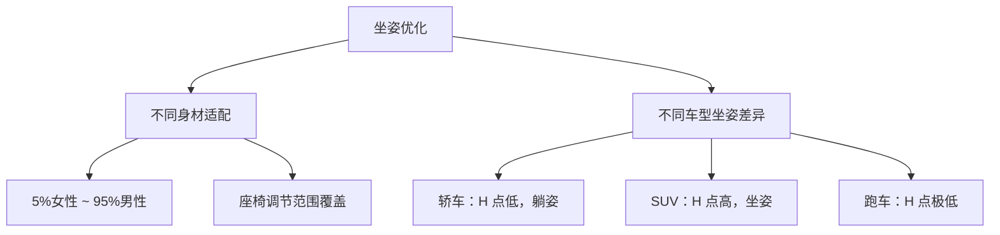
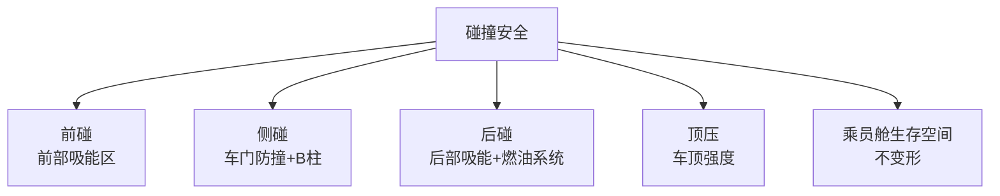

# 乘员舱布置

## 概述

乘员舱是驾乘人员的活动空间，直接影响**舒适性、安全性和空间利用率**。总布置需统筹座椅位置、头部空间、腿部空间、肩部空间等，满足人机工程要求。

## 乘员舱空间划分

```
┌──────────────────────────────────────────────┐
│                  车顶                          │
│  ┌──────────────────────────────────────┐    │
│  │                                      │    │
│  │    前排            后排               │    │
│  │  ┌──┐ ┌──┐      ┌──┐ ┌──┐ ┌──┐     │    │
│  │  │驾│ │副│      │乘│ │乘│ │乘│     │    │
│  │  └──┘ └──┘      └──┘ └──┘ └──┘     │    │
│  │                                      │    │
│  └──────────────────────────────────────┘    │
│  ◉─────────────◉──────────────◉             │
│  前轴          后轴                          │
│                                        行李舱 │
└──────────────────────────────────────────────┘
```

### 座位布置形式

| 布置形式 | 座位数 | 应用 |
|----------|--------|------|
| 2+2 | 4座 | 跑车、双门轿跑 |
| 2+3 | 5座 | 轿车（主流） |
| 2+3+2 | 7座 | 中型 SUV、MPV |
| 2+2+3 | 7座 | MPV |
| 2+2+2 | 6座 | MPV（独立座椅） |

## H 点与坐姿

### H 点定义

**H 点（Hip Point）** 是人体躯干与大腿铰接点，是坐姿布置的基准。

```
        头部
         │
    背部 │
         │
         ◉ ← H 点（Hip Point）
         │
    大腿 │
         │
         │
        膝盖
         │
    小腿 │
         │
        脚（踏板）
```

| H 点类型 | 说明 |
|----------|------|
| 设计 H 点 | 设计阶段确定的 H 点位置 |
| 实测 H 点 | 用 HPM 装置测量的 H 点 |
| H 点行程 | 座椅调节范围（前后/上下） |

### 驾驶员坐姿参数

| 参数 | 说明 | 典型范围 |
|------|------|----------|
| H30-1（H 点高度） | 脚跟到 H 点垂直距离 | 250-350mm（轿车） |
| L53（H 点前后） | 踏板到 H 点水平距离 | 700-900mm |
| 靠背角 A40 | 躯干与垂直面夹角 | 20-30° |
| 躯干大腿角 A42 | 躯干与大腿夹角 | 95-115° |
| 大腿小腿角 A44 | 大腿与小腿夹角 | 100-140° |
| 踏板踵点 | 脚跟在地板上的位置 | 基准点 |



## 空间尺寸

### 头部空间

```
    车顶内饰
    ─────────────
         │ ← 头部空间
    ◉ 头部包络
    │
    │ 坐姿
```

| 车型 | 前排头部空间 | 后排头部空间 |
|------|:---:|:---:|
| 轿车 | 950-1000mm | 900-960mm |
| SUV | 1000-1050mm | 950-1000mm |
| 跑车 | 900-950mm | - |

!!! note "头部包络"
    根据 SAE J1052，头部包络考虑不同身材乘员的头部活动范围。
    头顶到车顶内饰需保留 ≥ 50mm 间隙。

### 腿部空间

| 参数 | 说明 |
|------|------|
| 前排腿部空间 | 踏板到 H 点水平距离 |
| 后排腿部空间 | 前座椅靠背到后 H 点距离 |

### 肩部空间与臀宽

| 车型 | 前排肩宽 | 后排肩宽 |
|------|----------|----------|
| A 级 | 1370-1420mm | 1350-1400mm |
| B 级 | 1420-1480mm | 1400-1450mm |
| SUV | 1450-1520mm | 1420-1480mm |

## 座椅布置

### 座椅调节

| 调节方向 | 行程 | 说明 |
|----------|------|------|
| 前后 | 200-240mm | 适配不同腿长 |
| 上下 | 40-60mm | 适配不同身高 |
| 靠背角 | ±5-10° | 舒适度调节 |
| 腰托 | 4向 | 腰部支撑 |
| 头枕 | 上下+前后 | 安全+舒适 |

```
座椅调节行程范围：
    ┌─── 最后位置（95%男性）
    │       │
    │       │ ← 行程 240mm
    │       │
    └─── 最前位置（5%女性）
```

### 后排座椅

| 布置形式 | 说明 |
|----------|------|
| 整体固定 | 3座连排，不可调 |
| 4/6 分割放倒 | 可扩展行李舱 |
| 前后滑动 | MPV 常见 |
| 独立座椅 | 高端 MPV/SUV |

## 上下车便利性

### 门洞尺寸

| 参数 | 说明 | 影响 |
|------|------|------|
| 门洞高度 | 上下方向开口 | 头部进出 |
| 门洞宽度 | 前后方向开口 | 腿部进出 |
| 门槛高度 | 地板到门槛 | 上下车省力 |

```
    车门开口
    ┌──────────┐
    │          │ ← 门洞高度
    │          │
    └────┬─────┘
         │ ← 门槛高度
    ─────┴───── 地板
```

### 上下车影响因素

| 因素 | 优化方向 |
|------|----------|
| 门洞大小 | 越大越方便，受车身结构限制 |
| 开门角度 | ≥65° 方便进出 |
| 门槛高度 | 越低越方便，SUV 偏高 |
| 座椅高度 | H 点高度影响跨入难度 |
| A/B/C 柱位置 | 影响门洞有效空间 |

!!! tip "SUV 上下车"
    SUV 坐姿高，老年人/儿童上下车更方便，但门槛也高。
    部分车型配备踏板辅助上下车。

## 乘员舱安全

### 碰撞安全空间



| 安全要素 | 布置要求 |
|----------|----------|
| 前部吸能区 | 前保到前围板有足够变形空间 |
| 乘员舱刚度 | A/B/C 柱+门槛+车顶构成安全笼 |
| 安全带固定点 | GB 14166 规定位置和强度 |
| 安全气囊空间 | 方向盘、仪表、座椅、侧气帘空间 |
| 头枕 | 防止追尾颈部伤害（挥鞭伤） |

### 乘员舱完整性

```
    安全笼结构：
    ┌─────────────────────┐
    │ │                 │ │
    │ │  A柱  B柱  C柱  │ │ ← 立柱
    │ │     │   │   │   │ │
    │ │     │   │   │   │ │
    └─┴─────┴───┴───┴───┴─┘
    │← 门槛梁           →│
    ↑车顶纵梁           ↑
```

## 储物空间

乘员舱内的小储物空间也是布置内容：

| 储物空间 | 位置 |
|----------|------|
| 手套箱 | 副驾仪表台 |
| 中央扶手箱 | 前排座椅之间 |
| 门板储物格 | 车门内饰板 |
| 杯托 | 中控台/后排扶手 |
| 手机/零钱格 | 中控台 |
| 后排扶手箱 | 后排座椅中间 |

## 电动车乘员舱特点

| 特点 | 说明 |
|------|------|
| 地板平整 | 无传动轴通道 |
| 前备箱 | 无发动机，可增加前储物 |
| 座椅下方空间 | 无排气管，可利用 |
| 地板偏高 | 电池在底部，地板抬高 |

```
燃油车地板：          电动车地板：
┌──────────┐         ┌──────────┐
│          │         │          │
│ ┌─凸起─┐ │         │          │ ← 平整
│ │传动轴│ │         │  电池包   │
│ └──────┘ │         │          │
│          │         └──────────┘
└──────────┘
```

---

## 下一步阅读

- [人机工程](ergonomics.md）：驾驶员操作界面
- [行李与储物](cargo.md）：行李舱布置
- [碰撞安全](../basics/standards.md）：安全法规要求
