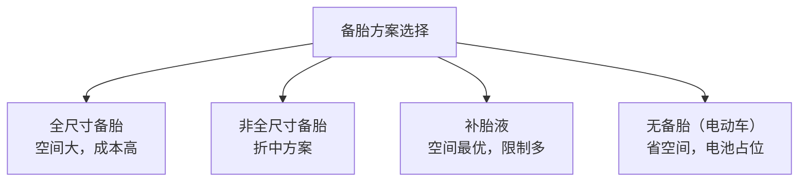
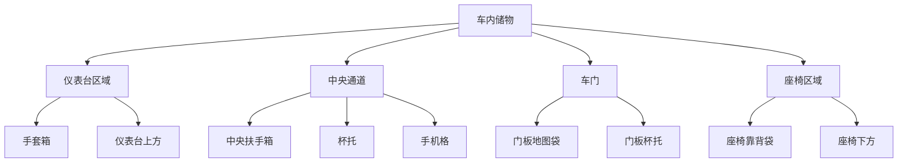

# 行李与储物

## 概述

行李舱和储物空间是影响用户日常使用体验的重要因素。总布置需在整车空间约束下，最大化行李舱容积，并合理规划车内储物。

## 行李舱布置

### 行李舱位置

```
┌──────────────────────────────────────┐
│                                      │
│  发动机舱    乘员舱      行李舱       │
│  ┌──────┐  ┌──────┐   ┌──────┐      │
│  │      │  │      │   │      │      │
│  └──────┘  └──────┘   └──────┘      │
│                                      │
│  ◉─────────◉──────────◉            │
│  前轴        后轴                    │
└──────────────────────────────────────┘
                  ↑
            后置行李舱（三厢车）
```

| 车型 | 行李舱位置 | 容积参考 |
|------|------------|----------|
| 三厢轿车 | 后部 | 400-550L |
| 两厢车 | 后部（与乘员舱连通） | 300-400L |
| SUV | 后部 | 500-800L |
| 掀背车 | 后部（开口大） | 400-600L |
| 旅行车 | 后部（加长） | 600-900L |

### 行李舱尺寸参数

| 参数 | 说明 |
|------|------|
| 行李舱容积 | VDA 方法测量（L） |
| 装载高度 | 地板离地高度 |
| 开口宽度 | 尾门开口最窄处 |
| 开口高度 | 尾门下沿到上沿 |
| 进深 | 尾门到后排座椅靠背 |

```
    尾门
    ┌────┐
    │    │ ← 开口高度
    │    │
    ├─── ┤ ← 装载高度
    │    │
    │    │ ← 进深
    │    │
    └────┘
    后排座椅
```

!!! note "VDA 容积测量"
    德国汽车工业协会（VDA）标准使用 200×100×50mm 的模块测量行李舱容积，
    结果以升（L）为单位，便于横向对比。

## 行李舱布置要点

### 1. 空间利用

| 要点 | 说明 |
|------|------|
| 规则形状 | 尽量方正，便于装载 |
| 减少凸起 | 避免轮罩、备胎仓凸起过多 |
| 可扩展 | 后排座椅放倒扩展空间 |
| 分层设计 | 底板下方储物 |

### 2. 备胎仓

| 备胎类型 | 布置 |
|----------|------|
| 全尺寸备胎 | 行李舱地板下方 |
| 非全尺寸备胎 | 行李舱地板下方（更小） |
| 补胎液 | 无备胎，节省空间 |



!!! tip "电动车备胎问题"
    电动车底部被电池包占用，通常无法布置全尺寸备胎。
    多数电动车采用补胎液或取消备胎。

### 3. 行李舱开口

| 要求 | 说明 |
|------|------|
| 开口低 | 装载高度低，方便搬重物 |
| 开口宽 | 便于横向装载 |
| 尾门形式 | 掀背/平开/侧开 |

### 尾门类型

| 类型 | 说明 | 应用 |
|------|------|------|
| 掀背尾门 | 整体上掀，开口大 | 两厢车、SUV |
| 三厢后备箱 | 下方开口，开口小 | 三厢轿车 |
| 侧开尾门 | 向侧面打开 | 越野车 |
| 电动尾门 | 电机驱动，脚踢感应 | 中高级车 |

## 车内储物空间

### 储物空间分类



### 储物空间设计要点

| 要点 | 说明 |
|------|------|
| 杯托 | 前后排各 ≥ 2 个，适应不同杯型 |
| 手机格 | 无线充电功能，尺寸适配主流手机 |
| 手套箱 | 带锁，容积 ≥ 5L |
| 中央扶手箱 | 容积 ≥ 4L，可放肘 |
| 门板储物 | 可放水瓶 |

!!! tip "储物细节"
    - 杯托深度：能稳定持有 500ml 矿泉水瓶
    - 手机格：考虑充电线走线
    - 零钱格：放停车卡、高速卡
    - 眼镜盒：顶棚，带缓冲

## 前备箱（电动车）

```
燃油车前部：              电动车前部：
┌──────────┐             ┌──────────┐
│          │             │          │
│  发动机   │             │  前备箱   │ ← 可用空间
│          │             │          │
└──────────┘             └──────────┘
```

| 车型 | 前备箱容积 |
|------|------------|
| Tesla Model 3 | 88L |
| Tesla Model S | 150L |
| 蔚来 ET7 | - |

!!! note "前备箱的价值"
    纯电动车无发动机，前部空间可用作前备箱，增加储物空间。
    部分车型前备箱可放行李箱或充电设备。

## 行李舱扩展

### 后排座椅放倒

```
正常状态：                    扩展状态：
┌──────────┐                ┌──────────┐
│          │                │          │
│  乘员舱   │                │  扩展空间  │
│┌──┐ ┌──┐ │                │          │
││座│ │座│ │                │  (连通)   │
│└──┘ └──┘ │                │          │
│          │                └──────────┘
├──────────┤
│  行李舱   │
└──────────┘
```

| 放倒方式 | 说明 |
|----------|------|
| 整体放倒 | 后排整体放倒 |
| 4/6 分割 | 可部分放倒 |
| 4/2/4 分割 | 更灵活 |

### 行李舱容积对比

| 车型 | 正常容积 | 座椅放倒后 |
|------|----------|------------|
| 紧凑轿车 | 400L | - (三厢不可放倒) |
| 两厢车 | 350L | 1000-1200L |
| 紧凑 SUV | 500L | 1400-1600L |
| 中型 SUV | 600L | 1700-2000L |
| 旅行车 | 650L | 1800-2000L |

## 行李舱法规要求

| 法规 | 要求 |
|------|------|
| 后碰法规 | 后碰后行李舱结构完整 |
| 内部凸出物 | 行李舱内无尖锐凸出（GB 11552） |
| 备胎固定 | 行李舱内物品需固定 |

!!! warning "行李舱超载"
    行李舱装载不应超过设计载荷（通常 50-75kg/m²）。
    超载影响轴荷分配和操稳性。

## 行李舱附件

| 附件 | 功能 |
|------|------|
| 货物网 | 固定行李 |
| 遮物板 | 遮挡行李，防盗 |
| 行李垫 | 保护地板 |
| 12V 电源 | 车载冰箱等 |
| 照明灯 | 夜间取物 |

## 储物空间参数表

| 储物空间 | 目标容积/尺寸 |
|----------|---------------|
| 行李舱（正常） | ≥ 450L |
| 行李舱（放倒后） | ≥ 1400L |
| 前备箱（EV） | ≥ 80L |
| 手套箱 | ≥ 5L |
| 中央扶手箱 | ≥ 4L |
| 门板地图袋 | 可放 1L 瓶 |
| 杯托（前排） | 2 个 |
| 杯托（后排） | 2 个 |

---

## 下一步阅读

- [乘员舱](cabin.md）：乘员空间布置
- [整车参数](../parameters/dimensions.md）：尺寸约束
- [纯电动平台](../cases/ev.md）：电动车空间特点
