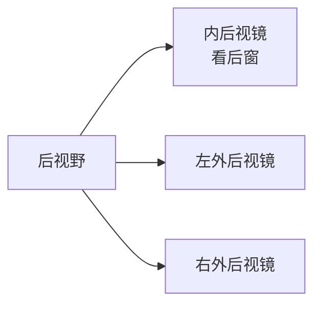
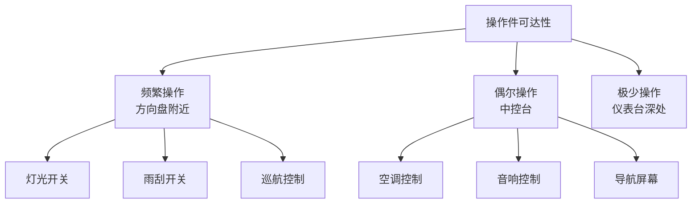
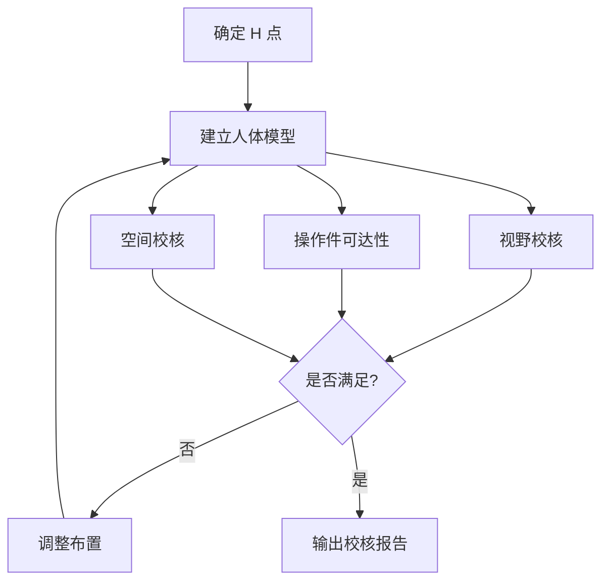

# 人机工程

## 概述

人机工程（Ergonomics）研究人与车辆的交互关系，确保驾驶员能**舒适、高效、安全**地操作车辆。总布置工程师需掌握人机工程的基本方法，进行视野分析、操作件布置和舒适性校核。

## 人体模型

### 人体尺寸百分位

| 百分位 | 含义 | 应用 |
|--------|------|------|
| 5% 女性 | 5% 的女性低于此尺寸 | 小身材校核 |
| 50% | 中等身材 | 一般设计 |
| 95% 男性 | 95% 的男性低于此尺寸 | 大身材校核 |

> 设计原则：满足 5% 女性 ~ 95% 男性的使用需求。

### 关键人体尺寸（中国成年人，GB 10000）

| 尺寸 | 5% 女性 | 50% | 95% 男性 |
|------|---------|-----|----------|
| 身高 | 1510mm | 1678mm | 1830mm |
| 坐高 | 810mm | 900mm | 970mm |
| 坐姿眼高 | 700mm | 780mm | 850mm |
| 上臂长 | 255mm | 280mm | 310mm |
| 前臂长 | 210mm | 235mm | 265mm |
| 大腿长 | 410mm | 460mm | 510mm |
| 小腿长 | 340mm | 390mm | 440mm |

### SAE 人体模型

| 模型 | 用途 |
|------|------|
| HPM（H 点装置） | 测量 H 点和实际坐姿（SAE J826） |
| 眼椭圆 | 视野分析（SAE J941） |
| 头部包络 | 头部空间校核（SAE J1052） |
| 手伸及面 | 操作件可达性（SAE J287） |

## 视野分析

### 眼椭圆

**眼椭圆**是不同身材驾驶员眼睛位置的统计分布范围。

```
        俯视图：
    左眼 ◉──◉ 右眼
         │
    眼椭圆范围
    （考虑座椅调节和身材差异）
```

| 视野校核 | 方法 |
|----------|------|
| 前视野 | 从眼椭圆最不利点向前看 |
| 后视野 | 通过内/外后视镜 |
| A 柱盲区 | 双目障碍角 |
| 仪表视野 | 眼椭圆到仪表的可视范围 |

### 前视野要求

```
    ┌─ 挡风玻璃
    │   ╱
    │  ╱ ← 前视野下界限（看到前方路面）
    │ ╱
    │╱
    ◉ 驾驶员眼睛
    
    前方路面
    ───────────────
    ↑
    前视野盲区（看不到的最近距离）
```

| 法规要求 | 标准 |
|----------|------|
| 前视野 | GB 11562 |
| A 柱双目障碍角 | ≤ 6° |
| 前视野盲区 | 前方 ≤ 4m × 1m 区域可见 |

### 后视野



| 后视镜 | 法规要求 |
|--------|----------|
| 内后视镜 | 看到后方至少 20m |
| 左外后视镜 | 看到左后方 4-20m |
| 右外后视镜 | 看到右后方 4-20m |

!!! note "盲区"
    所有后视镜都有盲区。部分车型配备盲区监测（BSD）辅助。
    流媒体后视镜可扩大视野范围。

### A 柱盲区校核

```
A 柱遮挡：
        眼椭圆
          ◉
         ╱│╲
        ╱ │ ╲
       ╱  │  ╲
      ╱   │   ╲
    A柱   │   A柱
    ◉─────┴─────◉
    
    障碍角 θ = A 柱遮挡的角度
    法规要求 θ ≤ 6°
```

## 操作件布置

### 踏板布置

```
    方向盘
      │
   ┌──┴──┐
   │     │
   └──┬──┘
      │
  ┌───┼───┐
  │ 离│制 │油 │
  │ 合│动 │门 │ ← 踏板
  └───┴───┴───┘
```

| 踏板 | 位置 | 布置要求 |
|------|------|----------|
| 离合踏板 | 最左 | 仅手动挡 |
| 制动踏板 | 中间 | 主踏板，行程适中 |
| 油门踏板 | 最右 | 风琴式或悬挂式 |

| 参数 | 典型值 |
|------|--------|
| 踏板间距 | 50-70mm |
| 踏板高度差 | 油门比制动低 10-30mm |
| 踏板行程 | 制动 80-120mm，油门 50-80mm |
| 踏板力 | 制动 100-300N，油门 20-50N |

!!! warning "踏板布置安全"
    - 误踩防护：油门和制动需明显区分
    - 紧急制动：制动踏板需足够大，防止打滑
    - 脚部空间：左脚休息区（自动挡）

### 方向盘布置

| 参数 | 说明 | 范围 |
|------|------|------|
| 方向盘直径 | - | 370-390mm |
| 倾角 | 与垂直面夹角 | 20-25° |
| 距 H 点距离 | - | 350-450mm |
| 可调范围 | 上下+前后 | 上下 40mm，前后 40mm |

### 中控操作件



### 手伸及面

**手伸及面**（Hand Reach Envelope, SAE J287）定义了驾驶员在安全带约束下能触及的范围。

```
    驾驶员
      ◉ ← 肩关节
     ╱│╲
    ╱ │ ╲ ← 手臂伸及范围
   ╱  │  ╲
  操作件需在此范围内
```

| 原则 | 说明 |
|------|------|
| 常用件近 | 频繁操作的放在手伸及范围内 |
| 安全件可达 | 应急操作件（如双闪）必须易达 |
| 防误操作 | 关键操作件（如启动）需防误触 |

## 仪表与显示

### 仪表视野

```
    方向盘
      │
   ┌──┴──┐
   │     │ ← 方向盘缺口
   └──┬──┘
      │
   ┌──┴──────┐
   │  仪表盘  │ ← 通过方向盘缺口可见
   └─────────┘
```

| 要求 | 说明 |
|------|------|
| 不被方向盘遮挡 | 关键信息在方向盘缺口内可见 |
| 视线偏移小 | 读取仪表视线偏离前方 ≤ 10° |
| 夜间可读 | 背光可调，防眩目 |

### HUD（抬头显示）

```
    驾驶员
      │
      │ 视线
      │
    ┌─┴──┐
    │ HUD │ ← 投射在挡风玻璃上
    └────┘
      │
    前方路面
```

| 优点 | 说明 |
|------|------|
| 视线不离路 | 不需低头看仪表 |
| 安全 | 提升驾驶安全 |
| 应用 | 越来越普及，AR-HUD 是趋势 |

## 舒适性

### 乘坐舒适性

| 因素 | 影响 |
|------|------|
| 座椅支撑 | 长途驾驶不易疲劳 |
| 振动 | 平顺性影响舒适 |
| 噪声 | NVH 影响 |
| 温度 | 空调效果 |
| 空气质量 | PM2.5/CO₂ 过滤 |

### 驾驶姿势评分

```
理想坐姿角度（RULA 评分优化）：
    躯干与垂直：20-25°
    躯干与大腿：100-120°
    大腿与小腿：100-120°
    小腿与脚：90-110°
    上臂与躯干：20-40°
    前臂与上臂：80-120°
```

## 后排乘员人机

| 参数 | 说明 |
|------|------|
| 后排 H 点 | 前排座椅之后 |
| 腿部空间 | 前座椅靠背到后排 H 点 |
| 头部空间 | 后排头顶到车顶 |
| 脚部空间 | 前座椅下方 |
| 上下车 | 后门洞尺寸 |

!!! tip "后排舒适度提升"
    - 后排空调出风口
    - 后排独立音响控制
    - 后排 USB 充电口
    - 后排座椅加热（高端车）

## 特殊人群

| 人群 | 考虑 |
|------|------|
| 儿童 | 儿童座椅 ISOFIX 固定 |
| 老年人 | 上下车便利性 |
| 轮椅用户 | 无障碍设计 |

## 人机工程校核流程



---

## 下一步阅读

- [乘员舱](cabin.md）：空间布置
- [法规与标准](../basics/standards.md）：人机相关法规
- [转向系统](../chassis/steering.md）：方向盘布置
