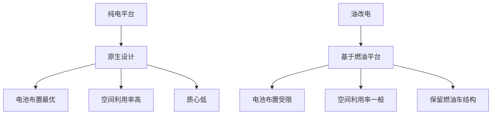
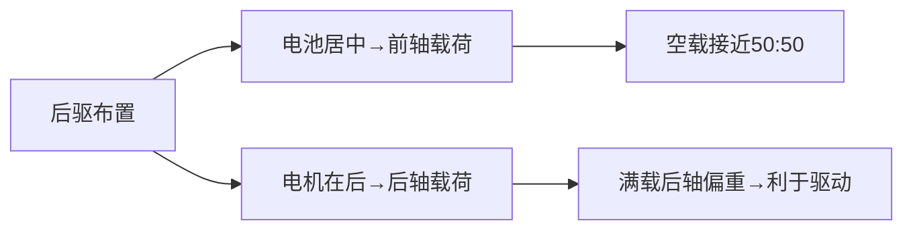
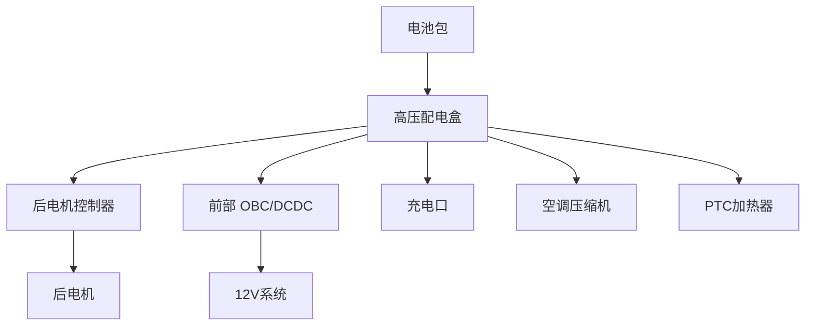

# 纯电动平台总布置案例

## 概述

纯电动平台从零开始为电动化设计，摆脱了燃油车平台的束缚。本章以典型纯电动平台为例，解析其总布置特点，并与"油改电"对比。

## 纯电平台 vs 油改电



| 对比项 | 纯电平台 | 油改电 |
|--------|----------|--------|
| 电池布置 | 底盘平整铺放 | 受排气管/油箱限制 |
| 地板 | 平整（无通道） | 有凸起（残留通道） |
| 前备箱 | 有 | 无（发动机位置） |
| 空间利用率 | 高 | 低 |
| 轴荷分配 | 可优化 | 受限 |
| 质心 | 低 | 较高 |

## 假设车型参数

| 参数 | 数值 |
|------|------|
| 级别 | 中型轿车 |
| 布置形式 | 后驱单电机 |
| 车长 × 宽 × 高 | 4880 × 1896 × 1450 mm |
| 轴距 | 2998mm |
| 整备质量 | 1950kg |
| 电池容量 | 75kWh |
| 续航（CLTC） | 610km |
| 0-100加速 | 5.4s |

## 总布置断面

### 纵向断面

```
┌──────────────────────────────────────────────┐
│                                                │
│   ┌──前悬──┐┌──────轴距 2998──────┐┌后悬──┐   │
│   │        ││                      ││      │   │
│   │ 前备箱  ││    乘员舱             ││ 后备  │   │
│   │ ┌──┐   ││  ┌──┐┌──┐  ┌──┐┌──┐ ││ 箱+  │   │
│   │ │储│   ││  │驾││副│  │乘││乘│ ││ 电机  │   │
│   │ │物│   ││  └──┘└──┘  └──┘└──┘ ││      │   │
│   │ └──┘   ││                      ││      │   │
│   │        ││  ┌────────────────┐ ││      │   │
│   │        ││  │   电池包（底部）  │ ││      │   │
│   │        ││  └────────────────┘ ││      │   │
│   └────────┘└──────────────────────┘└──────┘   │
│   ◉──────────────◉──────────────────◉        │
│   前轮中心          后轮中心                   │
│                                                │
│   ═════════════════════════════════ 地面       │
└──────────────────────────────────────────────┘
```

## 各系统布置详解

### 1. 动力总成布置（后驱）

```
后部俯视：
    ┌─── 后副车架 ───┐
    │                │
    │   ┌────────┐   │
    │   │ 后电机  │   │ ← 电机+减速器+电控（三合一）
    │   │ +减速器 │   │
    │   │ +电控   │   │
    │   └────────┘   │
    │                │
    │  ◉──────◉     │ ← 后轮（驱动）
    │   半轴  半轴    │
    └────────────────┘
```

| 参数 | 数值 |
|------|------|
| 电机类型 | 永磁同步 |
| 电机最大功率 | 200kW |
| 电机最大扭矩 | 350Nm |
| 减速器速比 | 9.0 |
| 电驱形式 | 三合一（电机+减速器+电控） |
| 布置位置 | 后轴 |

### 2. 电池包布置

```
底部俯视：
    ┌─── 电池包 ────────────────┐
    │                            │
    │  ┌──────────────────────┐ │
    │  │                      │ │
    │  │    电芯模组排列        │ │
    │  │                      │ │
    │  │  (CTP 无模组结构)     │ │
    │  │                      │ │
    │  └──────────────────────┘ │
    │                            │
    │  ◉──────◉──────◉         │ ← 避让前后悬架
    │  前悬架          后悬架     │
    └────────────────────────────┘
```

| 参数 | 数值 |
|------|------|
| 电池容量 | 75kWh |
| 额定电压 | 400V |
| 电池包尺寸 | 1900×1400×140mm |
| 电池包质量 | 480kg |
| 能量密度（包级） | 185Wh/kg |
| 冷却方式 | 液冷 |
| 结构形式 | CTP（无模组） |

### 3. 前部布置（前备箱）

```
前部俯视：
    ┌─── 前机舱 ────────────────┐
    │                            │
    │  ┌─── 前备箱 ─┐            │
    │  │            │            │
    │  │  储物空间   │ ← 无发动机  │
    │  │            │            │
    │  └────────────┘            │
    │                            │
    │  ┌──┐    ┌──┐              │
    │  │冷│    │散│ ← 冷凝器+散热器│
    │  └──┘    └──┘              │
    │                            │
    │  ◉──────◉ ← 前轮（从动）    │
    └────────────────────────────┘
```

| 部件 | 位置 |
|------|------|
| 前备箱 | 原发动机位置，储物 80L |
| 冷却模块 | 最前端 |
| 前备箱下方 | 转向器、前悬架 |
| 充电口（快充+慢充） | 前翼子板或后部 |

### 4. 质量与轴荷

| 工况 | 前轴 | 后轴 | 轴荷比 |
|------|------|------|--------|
| 空载 | 980kg | 970kg | 50.3:49.7 |
| 满载 | 1050kg | 1150kg | 47.7:52.3 |



!!! note "轴荷优势"
    后驱电动车的电池居中布置使空载轴荷接近 50:50，操控性好。
    满载时后轴略重，利于后轮驱动。

### 5. 质心分析

```
质心对比：
    燃油车              纯电动
    ◉ 质心 550mm       ◉ 质心 480mm
    │                  │
    │  发动机高         │  
    │                  │  电池在底部
    │                  │  质心低
    ═══ 地面            ═══ 地面
```

| 参数 | 燃油车 | 纯电动 |
|------|--------|--------|
| 质心高度 | 550mm | 480mm |
| 侧倾改善 | - | 显著 |
| 操稳改善 | - | 显著 |

## 空间优势

### 1. 地板平整

```
燃油车地板：              纯电动地板：
┌──────────┐             ┌──────────┐
│  ┌─凸起─┐ │             │          │
│  │传动轴│ │             │  平整    │ ← 无传动轴
│  └──────┘ │             │  地板    │
│          │             │          │
└──────────┘             └──────────┘
后排中间有凸起              后排中间平整
```

### 2. 乘坐空间

| 参数 | 燃油车 | 纯电动 | 优势 |
|------|--------|--------|------|
| 后排腿部 | 820mm | 900mm | +80mm |
| 后排中间脚部 | 有凸起 | 平整 | 无凸起 |
| 前备箱 | 无 | 80L | +80L |
| 行李舱 | 480L | 500L | +20L |

### 3. 风阻优化

```
纯电动风阻优化：
┌──────────────────────┐
│  ← 平滑前脸（无进气格栅）│
│  ← 底部平整（电池包）    │
│  ← 优化后视镜/轮罩      │
│  ← 主动空气动力学        │
└──────────────────────┘
```

| 车型 | 风阻系数 |
|------|----------|
| 普通燃油轿车 | 0.28-0.32 |
| 纯电动轿车 | 0.22-0.28 |
| 低风阻电动车 | 0.20-0.22 |

!!! tip "低风阻的意义"
    风阻每降低 0.01，续航提升约 10-15km。
    电动车追求低风阻是提升续航的高性价比手段。

## 高压系统布置



| 部件 | 位置 | 说明 |
|------|------|------|
| 电池包 | 底盘 | 高压源 |
| 高压配电盒 | 电池包内/机舱 | 高压分配 |
| 电机控制器 | 后轴（集成） | 驱动电机 |
| OBC/DCDC | 前机舱 | 充电+12V转换 |
| 充电口 | 翼子板 | 快充+慢充 |
| 空调压缩机 | 前机舱 | 电动驱动 |

## 热管理布置

```
热管理回路：
    ┌─── 电池回路 ───┐
    │  电池 ↔ 冷却板  │
    │       ↕        │
    │  Chiller（换热）│
    └────────────────┘
         ↕
    ┌─── 制冷剂回路 ──┐
    │  压缩机 → 冷凝器 │
    │  → 蒸发器/Chiller│
    └────────────────┘
         ↕
    ┌─── 乘员舱回路 ──┐
    │  蒸发器（制冷）  │
    │  PTC/热泵（制热）│
    └────────────────┘
         ↕
    ┌─── 电机回路 ────┐
    │  电机 ↔ 散热器   │
    └────────────────┘
```

| 特点 | 说明 |
|------|------|
| 热泵系统 | 冬季制热效率高 |
| 多回路集成 | 电池/电机/乘员舱热交换 |
| 智能控制 | 预热、预冷、余热利用 |

## 性能达成

| 性能指标 | 目标 | 实际 |
|----------|------|------|
| 续航（CLTC） | 600km | 610km |
| 0-100加速 | 5.5s | 5.4s |
| 最高车速 | 200km/h | 205km/h |
| 电耗 | 13.5kWh/100km | 13.1kWh/100km |
| 100-0制动 | 37m | 36m |
| 风阻系数 | 0.24 | 0.23 |

## 纯电平台发展趋势


| 趋势 | 说明 |
|------|------|
| 800V 平台 | 快充 15 分钟 10-80% |
| CTB | 电池作为车身结构 |
| 滑板底盘 | 上下车体解耦 |
| 固态电池 | 能量密度 400Wh/kg+ |
| 一体化压铸 | 减少零件、降本 |

## 布置总结

| 优势 | 说明 |
|------|------|
| 空间大 | 无传动轴/发动机，空间利用率高 |
| 质心低 | 电池在底部，操稳好 |
| 风阻低 | 优化造型，续航长 |
| 轴荷好 | 可设计接近 50:50 |

| 挑战 | 说明 |
|------|------|
| 质量大 | 电池重，悬架/制动需加强 |
| 成本高 | 电池成本占比大 |
| 热管理复杂 | 电池/电机/乘员舱综合管理 |
| 高压安全 | 绝缘、防护、碰撞断电 |

---

## 下一步阅读

- [燃油轿车](sedan.md)：对比燃油车布置
- [电池布置](../electrical/battery.md）：电池详细布置
- [电机布置](../powertrain/motor.md）：电驱系统
