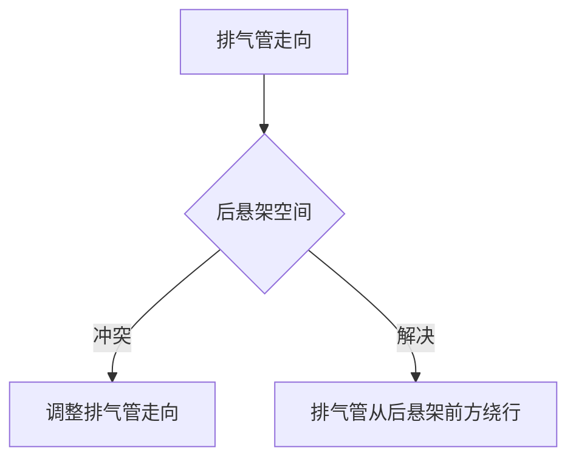
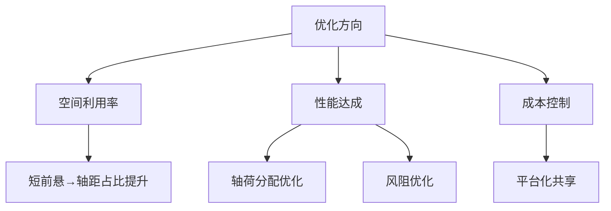

# 燃油轿车总布置案例

## 概述

本章以一款典型 B 级燃油轿车（前置前驱）为例，解析总布置方案，帮助理解理论知识如何落地。

## 车型假设

| 参数 | 数值 |
|------|------|
| 级别 | B 级轿车 |
| 布置形式 | FF（前置前驱） |
| 发动机 | 1.5T 涡轮增压，横置 |
| 变速器 | 6AT |
| 车长 × 宽 × 高 | 4780 × 1835 × 1470 mm |
| 轴距 | 2780 mm |
| 整备质量 | 1420 kg |
| 满载质量 | 1820 kg |

## 总布置断面图

### 纵向中心断面

```
┌──────────────────────────────────────────────────────┐
│                                                        │
│   ┌──前悬──┐┌──────轴距 2780──────┐┌──后悬──┐         │
│   │        ││                      ││        │         │
│   │ 发动机  ││    乘员舱             ││ 行李舱  │         │
│   │ 变速器  ││  ┌──┐┌──┐  ┌──┐┌──┐ ││        │         │
│   │        ││  │驾││副│  │乘││乘│ ││        │         │
│   │        ││  └──┘└──┘  └──┘└──┘ ││        │         │
│   │        ││                      ││        │         │
│   └────────┘└──────────────────────┘└────────┘         │
│   ◉──────────────◉──────────────────◉                 │
│   前轮中心        后轮中心                              │
│                                                        │
│   │←930→│←─────2780─────→│←──1070──→│                 │
│   │     │                  │          │                 │
│   └─ 总长 4780 ────────────────────────┘                 │
└──────────────────────────────────────────────────────┘
```

## 各系统布置详解

### 1. 动力总成布置

```
机舱俯视：
    ┌─── 前围板 ───┐
    │              │
    │  变速器       │
    │  ┌────┐      │
    │  │    │      │
    │  └────┘      │
    │  发动机       │
    │  ┌────┐      │
    │  │    │      │
    │  └────┘      │
    │   横置        │
    │              │
    └─── 前副车架 ─┘
    ◉──────◉ 前轮
```

| 布置参数 | 数值 |
|----------|------|
| 发动机形式 | 直列 4 缸，横置 |
| 发动机倾角 | 3° |
| 曲轴中心高度 | 380mm |
| 曲轴中心距前轮心 | +80mm（前轮心后方） |
| 变速器位置 | 发动机右侧（横置） |
| 悬置形式 | 三点悬置（左右+防扭） |

### 2. 底盘布置

| 系统 | 形式 | 说明 |
|------|------|------|
| 前悬架 | 麦弗逊式 | 结构紧凑，成本低 |
| 后悬架 | 多连杆 | 操控与舒适兼顾 |
| 转向 | 齿轮齿条+EPS | 后置转向器 |
| 制动 | 前通风盘+后实心盘 | 前盘 Φ320mm |

```
前悬架（麦弗逊）：
        减振器
          │
    ╔═════╧═════╗
    ║  转向节    ║
    ║   ◯ 车轮   ║
    ╚═════╤═════╝
    ┌─────┴─────┐
    │  下摆臂    │
    └───┬───┬───┘
        │   │
      副车架
```

### 3. 质量与轴荷

| 工况 | 前轴 | 后轴 | 轴荷比 |
|------|------|------|--------|
| 空载 | 880kg | 540kg | 62:38 |
| 满载 | 1000kg | 820kg | 55:45 |


!!! note "轴荷分析"
    FF 布置前轴偏重，利于驱动（前轮驱动需足够载荷保证附着力）。
    满载时后轴增加（乘客+行李），轴荷趋于均衡。

### 4. 乘员舱布置

| 参数 | 数值 |
|------|------|
| 前排头部空间 | 980mm |
| 后排头部空间 | 940mm |
| 后排腿部空间 | 850mm |
| 前排肩宽 | 1450mm |
| 后排肩宽 | 1420mm |
| 行李舱容积 | 480L |

### 5. 人机工程

```
驾驶员坐姿：
    H 点高度 H30 = 280mm
    靠背角 A40 = 25°
    躯干大腿角 A42 = 105°
    方向盘倾角 = 22°
```

## 空间布置分析

### 机舱空间

```
┌─── 机舱 ───────────────────┐
│                            │
│  散热器  发动机  变速器     │
│  ┌───┐  ┌──┐  ┌──┐        │
│  │   │  │  │  │  │        │
│  └───┘  └──┘  └──┘        │
│                            │
│  蓄电池  空滤  保险丝盒     │
│  ┌──┐  ┌──┐  ┌──┐         │
│  │  │  │  │  │  │         │
│  └──┘  └──┘  └──┘         │
│                            │
└────────────────────────────┘
```

| 部件 | 位置 |
|------|------|
| 散热器 | 最前端 |
| 发动机 | 中部偏右 |
| 变速器 | 发动机右侧 |
| 蓄电池 | 机舱左侧 |
| 空滤 | 机舱左侧上方 |
| 保险丝盒 | 蓄电池上方 |
| 膨胀罐 | 散热器侧 |

### 底部空间

```
┌─── 底盘 ───────────────────┐
│                            │
│  ◉ 前副车架                 │
│  │  发动机+悬架             │
│  │                          │
│  │  排气管走向 ────────→    │
│  │                          │
│  │  油箱（后部）             │
│  │  ┌──────┐               │
│  │  │ 油箱  │               │
│  │  └──────┘               │
│  │                          │
│  ◉ 后副车架                 │
│  │  后悬架                   │
│  │                          │
└────────────────────────────┘
```

## 性能达成情况

| 性能指标 | 目标 | 实际 | 状态 |
|----------|------|------|------|
| 最高车速 | 190km/h | 195km/h | ✓ |
| 0-100加速 | 9.5s | 9.2s | ✓ |
| 综合油耗 | 6.8L/100km | 6.5L/100km | ✓ |
| 100-0制动 | 40m | 38m | ✓ |
| 最小转弯半径 | 5.6m | 5.5m | ✓ |
| 风阻系数 | 0.30 | 0.29 | ✓ |

## 布置难点与解决

### 难点 1：排气管与后悬架空间



**解决方案：** 排气管从变速器下方引出，沿车身纵梁走向，在后悬架前方避开多连杆，最终从后桥右侧通向后消音器。

### 难点 2：转向管柱与前围板

| 问题 | 解决 |
|------|------|
| 管柱穿过前围板需密封 | 橡胶密封圈 |
| 管柱与踏板支架空间冲突 | 调整管柱倾角 |
| 碰撞收缩空间 | 预留 80mm 收缩行程 |

### 难点 3：油箱与后排座椅

| 问题 | 解决 |
|------|------|
| 油箱高度受限 | 采用扁平油箱 |
| 油箱与排气管热安全 | 排气管加隔热板 |
| 油箱与后悬架空间 | 油箱置于后悬架前方 |

## 布置优化总结



| 优化项 | 效果 |
|--------|------|
| 短前悬（930mm） | 轴长比 0.58，空间利用率好 |
| 后排腿部空间 850mm | B 级领先 |
| 风阻 0.29 | 优于同级 |
| 行李舱 480L | 满足日常 |

---

## 下一步阅读

- [SUV与MPV](suv.md）：不同车型的布置差异
- [纯电动平台](ev.md）：电动车布置案例
- [整车参数](../parameters/dimensions.md)：参数定义回顾
