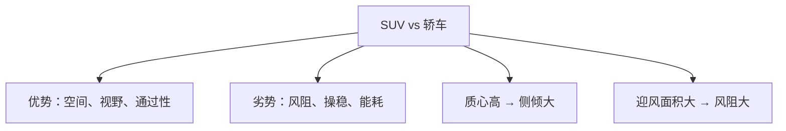
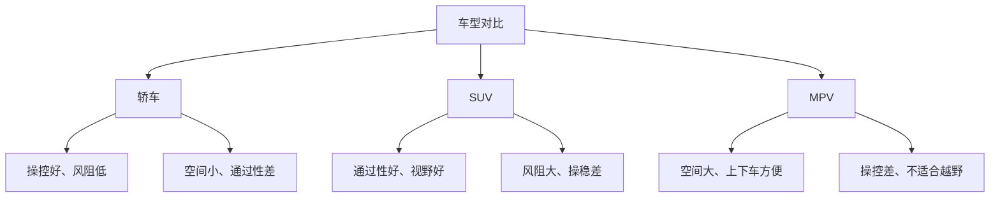

# SUV 与 MPV 总布置案例

## 概述

SUV 和 MPV 是高空间需求车型，总布置需兼顾**大空间、高离地间隙、7 座灵活性**。本章对比分析 SUV 和 MPV 的布置特点。

## SUV 总布置

### SUV 特点

| 特点 | 说明 |
|------|------|
| 高离地间隙 | 通过性好 |
| 高坐姿 | 视野好，上下车方便 |
| 大轮胎 | 轮罩空间需求大 |
| 可能 7 座 | 第三排座椅布置 |
| 风阻大 | 车身高，Cd 偏大 |

### 假设参数

| 参数 | 紧凑 SUV | 中型 SUV |
|------|----------|----------|
| 车长 | 4600mm | 4850mm |
| 车宽 | 1850mm | 1940mm |
| 车高 | 1680mm | 1720mm |
| 轴距 | 2700mm | 2850mm |
| 离地间隙 | 190mm | 210mm |
| 座位 | 5座 | 5座/7座 |

### SUV 纵向断面

```
┌──────────────────────────────────────────┐
│                                            │
│   ┌──┐  ┌──────────────┐  ┌──┐           │
│   │发│  │   乘员舱      │  │行│           │
│   │动│  │ ┌──┐┌──┐     │  │李│           │
│   │机│  │ │驾││副│ ┌──┐│  │舱│           │
│   │  │  │ └──┘└──┘ │第││  │  │           │
│   │  │  │          │三││  │  │           │
│   │  │  │ ┌──┐┌──┐ │排││  │  │           │
│   │  │  │ │乘││乘│ └──┘│  │  │           │
│   │  │  │ └──┘└──┘     │  │  │           │
│   └──┘  └──────────────┘  └──┘           │
│   ◉──────────◉──────────────◉           │
│                                            │
│   ↑ 高离地间隙                              │
│   ═════════════════ 地面                   │
└──────────────────────────────────────────┘
```

### SUV 布置要点

#### 1. 离地间隙与通过性

```
    接近角 α          离去角 β
       ╱                ╲
      ╱                  ╲
    ──╱──── 车身 ──────╲──
      │                  │
      ◉                ◉
      前轮             后轮
    
    离地间隙：底盘最低点到地面
```

| 参数 | 城市 SUV | 硬派 SUV |
|------|----------|----------|
| 离地间隙 | 180-200mm | 220mm+ |
| 接近角 | 18-22° | 25°+ |
| 离去角 | 22-26° | 25°+ |
| 纵向通过角 | 16-20° | 20°+ |

!!! note "离地间隙的影响"
    - 高离地间隙 → 通过性好，但质心高，操稳差
    - 低离地间隙 → 操稳好，但通过性差
    - SUV 需在两者间平衡

#### 2. 7 座布置

```
5座 SUV：                    7座 SUV：
┌──────────┐                ┌──────────┐
│          │                │          │
│ ┌─┐┌─┐   │                │ ┌─┐┌─┐   │
│ │ ││ │   │                │ │ ││ │┌─┐│ ← 第三排
│ └─┘└─┘   │                │ └─┘└─┘└─┘│
│          │                │          │
│ ┌─┐┌─┐   │                │ ┌─┐┌─┐   │
│ │ ││ │   │                │ │ ││ │   │
│ └─┘└─┘   │                │ └─┘└─┘   │
│          │                │          │
└──────────┘                └──────────┘
行李舱大                    行李舱小
```

| 7 座布置挑战 | 解决方案 |
|--------------|----------|
| 第三排空间小 | 轴距加长、第三排紧凑设计 |
| 第三排上下车 | 第二排座椅翻折/滑动 |
| 行李舱空间 | 第三排可放倒/下沉 |
| 后悬加长 | 7 座后悬通常更长 |

#### 3. 轮罩空间

| 要点 | 说明 |
|------|------|
| 大轮胎 | SUV 轮胎更大，轮罩空间需求大 |
| 悬架行程 | 越野需求，悬架行程大 |
| 转向角 | 轮胎与轮罩间隙需考虑转向 |

### SUV 与轿车布置对比

| 对比项 | 轿车 | SUV |
|--------|------|-----|
| 车高 | 1450mm | 1700mm |
| H 点高度 | 280mm | 350mm+ |
| 离地间隙 | 140mm | 190mm+ |
| 质心高度 | 550mm | 700mm |
| 轮罩空间 | 小 | 大 |
| 风阻系数 | 0.28 | 0.32-0.36 |
| 行李舱 | 480L | 550-800L |



## MPV 总布置

### MPV 特点

| 特点 | 说明 |
|------|------|
| 单厢车身 | 发动机舱短，空间利用率高 |
| 高车顶 | 头部空间充裕 |
| 低地板 | 上下车方便 |
| 滑动门 | 后排上下车方便 |
| 7座为主 | 第二排独立座椅 |

### MPV 假设参数

| 参数 | 数值 |
|------|------|
| 车长 | 5100mm |
| 车宽 | 1950mm |
| 车高 | 1820mm |
| 轴距 | 3000mm |
| 座位 | 2+2+3 |

### MPV 纵向断面

```
┌──────────────────────────────────────────┐
│              高车顶                        │
│  ┌──────────────────────────────┐        │
│  │                              │        │
│  │  发动机    乘员舱             │        │
│  │  ┌──┐  ┌──────────────┐     │        │
│  │  │  │  │ ┌─┐┌─┐       │     │        │
│  │  │  │  │ │ ││ │ ┌─┐  │     │        │
│  │  └──┘  │ └─┘└─┘ │ │  │     │        │
│  │        │      ┌─┐ │ │  │     │        │
│  │        │      │ │ │ │  │     │        │
│  │        │      └─┘ └─┘  │     │        │
│  │        └──────────────┘     │        │
│  ◉──────────◉──────────◉      │        │
│  低地板                        │        │
└──────────────────────────────────────────┘
```

### MPV 布置要点

#### 1. 单厢车布置

```
轿车（三厢）：                MPV（单厢）：
┌──┐┌──────┐┌──┐           ┌──────────────┐
│动││ 乘员 ││行│           │动  乘员舱     │
│力││ 舱  ││李│           │力             │
└──┘└──────┘└──┘           └──────────────┘
发动机舱独立                 发动机舱短，空间给乘员舱
```

| 特点 | 说明 |
|------|------|
| 发动机舱短 | A 柱前移，乘员舱扩大 |
| 地板低 | 上下车方便 |
| 车顶高 | 头部空间大 |

#### 2. 第二排独立座椅

```
MPV 第二排：
    ┌──┐    ┌──┐
    │独│    │独│  ← 独立座椅，中间通道
    │立│    │立│
    │座│    │座│
    └──┘    └──┘
      └─通道─┘
    （方便进入第三排）
```

| 优点 | 说明 |
|------|------|
| 舒适性 | 独立扶手、调节功能 |
| 通道 | 中间通道进第三排 |
| 商务感 | 高端 MPV 核心卖点 |

#### 3. 滑动门布置

```
普通车门（铰链）：              滑动门：
    开启需要大空间              开启需要小空间
    ┌──┐                        ┌──┐
    │  │╲                       │  │──→ 沿轨道滑动
    │  │ ╲                      │  │
    └──┘  ╲                     └──┘
```

| 优点 | 说明 |
|------|------|
| 空间需求小 | 窄车位也能开门 |
| 开口大 | 上下车方便 |
| 安全 | 不会意外打开碰行人 |

!!! tip "MPV 滑动门轨道"
    滑动门轨道沿车身侧面布置，需在车身结构中预留轨道安装空间。

#### 4. 第三排进出

| 方式 | 说明 |
|------|------|
| 第二排翻折 | 第二排座椅前翻，进入第三排 |
| 第二排滑动 | 第二排座椅前移，留出通道 |
| 中间通道 | 第二排独立座椅间通道 |

## SUV vs MPV vs 轿车



| 对比项 | 轿车 | SUV | MPV |
|--------|------|-----|-----|
| 空间 | ★★★ | ★★★★ | ★★★★★ |
| 操控 | ★★★★★ | ★★★ | ★★ |
| 通过性 | ★★ | ★★★★★ | ★★ |
| 上下车 | ★★★ | ★★★★ | ★★★★★ |
| 风阻 | ★★★★★ | ★★★ | ★★ |
| 7座 | ★ | ★★★ | ★★★★★ |

## 新能源 SUV/MPV 特点

| 特点 | 说明 |
|------|------|
| 底盘平整 | 电池在底部，无排气管 |
| 前备箱 | 无发动机，前部可储物 |
| 空间更大 | 无传动轴通道，地板平整 |
| 质心低 | 电池在底部，操稳改善 |
| 续航挑战 | SUV 风阻大、质量大，续航需更大电池 |

---

## 下一步阅读

- [燃油轿车](sedan.md）：轿车布置案例
- [纯电动平台](ev.md）：电动车布置
- [乘员舱](../body/cabin.md）：空间布置
