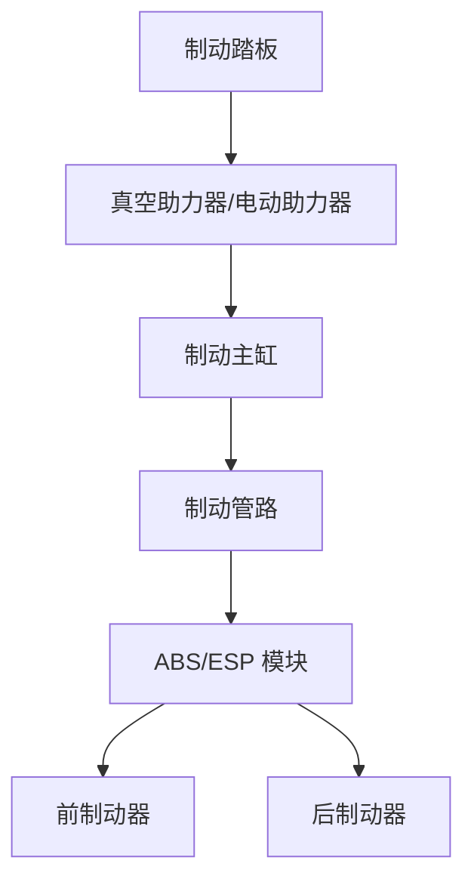
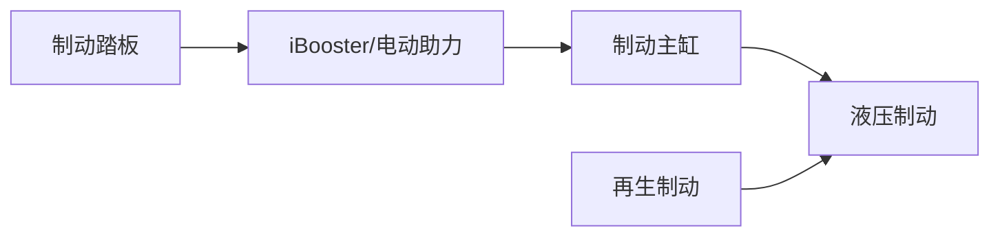
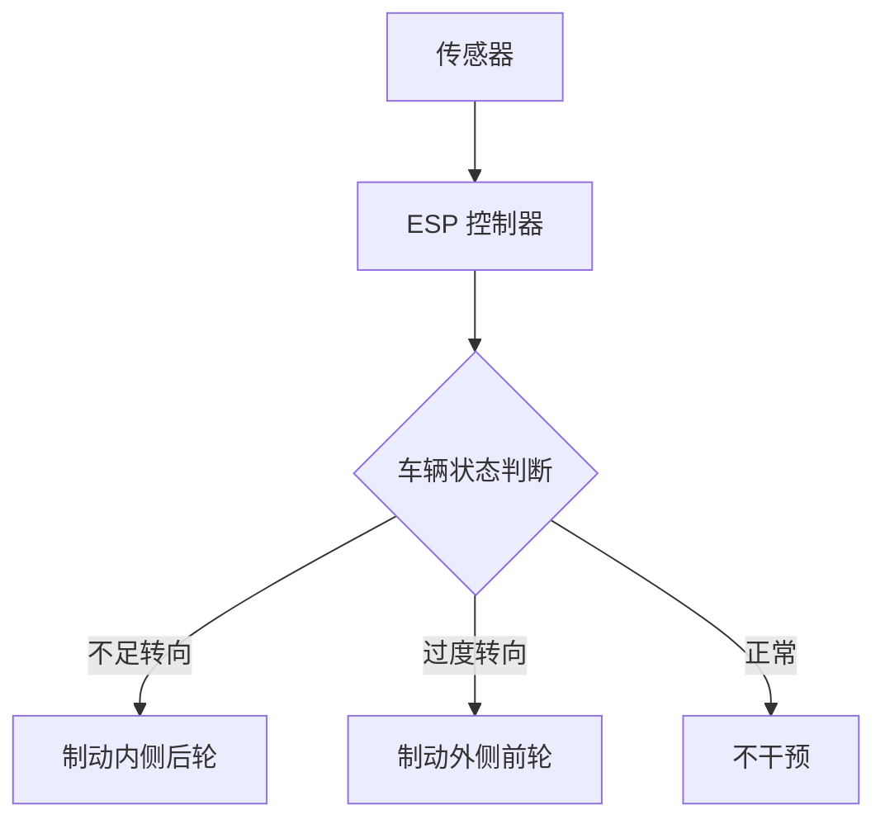
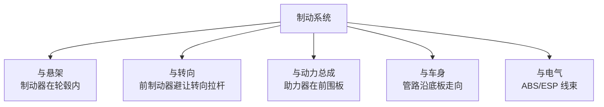

# 制动系统

## 概述

制动系统是汽车最重要的安全系统，总布置需协调制动器位置、管路走向、ABS/ESP 布局，确保满足法规要求和性能目标。

## 制动系统组成



| 部件 | 功能 | 布置位置 |
|------|------|----------|
| 制动踏板 | 驾驶员输入 | 乘员舱，方向盘左侧 |
| 助力器 | 放大制动力 | 机舱前围板，踏板后方 |
| 制动主缸 | 产生液压 | 助力器后方 |
| ABS/ESP | 防抱死/车身稳定 | 机舱或底部 |
| 制动器 | 产生制动力 | 各车轮 |
| 制动管路 | 传输液压 | 沿车身底部走向 |

## 制动器类型

### 1. 盘式制动器

```
    ┌─── 制动钳 ───┐
    │      │       │
    │  ┌───┴───┐   │
    │  │  盘    │   │ ← 制动盘（随车轮旋转）
    │  └───┬───┘   │
    │      │       │
    └──────┴───────┘
```

| 类型 | 说明 |
|------|------|
| 实心盘 | 结构简单，散热一般 |
| 通风盘 | 内部有风道，散热好 |
| 开孔盘/划线盘 | 进一步提升散热，高性能用 |

### 2. 鼓式制动器

| 特点 | 说明 |
|------|------|
| 优点 | 制动力大（自增力）、成本低 |
| 缺点 | 散热差、热衰退严重、进水影响大 |
| 应用 | 后轮（部分经济型车）、商用车 |

!!! tip "前盘后鼓 vs 四轮盘"
    - 经济型车：前通风盘 + 后鼓式（成本低）
    - 中高级车：四轮盘式（性能好）
    - 趋势：四轮盘式越来越普及

## 制动助力

### 真空助力器（燃油车）

| 原理 | 利用发动机进气歧管真空度 |
|------|--------------------------|
| 优点 | 成熟可靠、成本低 |
| 限制 | 依赖发动机真空 |

### 电动助力（电动车）



| 类型 | 说明 |
|------|------|
| iBooster | 博世电动助力，电机直接驱动 |
|机电伺服 | 其他厂商类似方案 |

!!! note "电动车的制动特点"
    - 无发动机真空，必须用电动助力
    - 再生制动（动能回收）与液压制动需协调
    - 踏板感需模拟，保证驾驶员感受一致

## 再生制动（电动车）

### 制动力分配

```
总制动力 = 再生制动力 + 液压制动力

    低制动强度 → 主要用再生制动（回收能量）
    高制动强度 → 再生 + 液压联合
    紧急制动 → 主要液压制动（保证安全）
```

| 协调策略 | 说明 |
|----------|------|
| 并行式 | 再生和液压同时工作，简单 |
| 串联式 | 先再生后液压，回收效率高 |
| 踏板行程模拟 | 解耦踏板与实际制动力，灵活控制 |

## ABS/ESP 布置

### ABS（防抱死制动系统）

| 功能 | 防止车轮抱死，保持转向能力 |
|------|---------------------------|
| 原理 | 监测轮速，调节制动力 |

### ESP（车身电子稳定系统）



| 功能 | 说明 |
|------|------|
| ABS | 防抱死 |
| TCS | 驱动防滑 |
| VDC | 车辆动态控制 |
| HHC | 坡道起步辅助 |
| AUTOHOLD | 自动驻车 |

### 布置要点

| 要点 | 说明 |
|------|------|
| 位置 | 靠近制动主缸，管路短 |
| 固定 | 车身或副车架，振动小 |
| 管路 | 进出管路清晰，便于维护 |
| 散热 | 工作时发热，需通风 |

## 制动管路布置

### 双回路设计

法规要求制动系统必须采用**双回路**，防止单回路失效导致全车无制动：

```
方案一（前后分区）：
    前回路 → 前左 + 前右
    后回路 → 后左 + 后右

方案二（对角分区，更常见）：
    回路1 → 前左 + 后右
    回路2 → 前右 + 后左
```

### 管路走向

| 要点 | 说明 |
|------|------|
| 走向 | 沿车身纵梁/底板，避免运动件 |
| 固定 | 每 200-300mm 一个固定卡子 |
| 弯曲 | 弯曲半径 ≥ 管径 5 倍 |
| 间隙 | 与运动件 ≥ 15mm，与热源 ≥ 50mm |
| 防护 | 易受飞溅处加防护套 |

!!! warning "管路防护"
    - 制动管路不能与排气管近距离平行
    - 经过车轮区域需防护石击
    - 接头处需防松、防漏

## 制动性能

### 主要指标

| 指标 | 法规/目标 |
|------|-----------|
| 100-0km/h 制动距离 | ≤ 40m（一般目标 ≤ 38m） |
| MFDD（充分发出的平均减速度） | ≥ 5.0 m/s²（GB 21670） |
| 热衰退 | 高温制动效能保持率 |
| 制动稳定性 | 不跑偏、不侧滑 |

### 前后制动力分配

```
制动力分配：
    I 曲线（理想分配曲线）
        │
    前制动力
        ↑
        │    ╱ 理想 I 曲线
        │  ╱
        │╱
        └────────→ 后制动力

    实际分配线（β 线）应在 I 曲线下方（前轮先抱死，安全）
```

| 布置因素 | 影响 |
|----------|------|
| 质心高度 | 越高，制动时载荷转移越大 |
| 轴荷分配 | 影响前后制动力分配设计 |
| 制动器规格 | 前盘通常比后盘大 |

## 电子驻车制动（EPB）

| 部件 | 说明 |
|------|------|
| EPB 执行器 | 后制动钳集成电机 |
| EPB 开关 | 中控台，操作按钮 |
| EPB 控制器 | 与 ESC 集成或独立 |

```
传统手刹：拉杆 → 钢丝 → 后制动器
电子手刹：按钮 → 控制器 → 电机 → 后制动钳
```

| 优点 | 说明 |
|------|------|
| 省空间 | 无需中央拉杆 |
| 自动化 | 车停自动驻车，起步自动释放 |
| 安全 | 与 ESC 联动，紧急制动辅助 |

## 制动系统布置要点总结

### 空间协调



### 电动车制动特点

| 特点 | 说明 |
|------|------|
| 电动助力 | 无真空依赖 |
| 再生制动 | 能量回收，提升续航 |
| EPB 普及 | 电子驻车成标配 |
| One-Pedal | 单踏板模式（部分车型） |
| 线控制动 | 未来趋势，完全电控 |

## 制动系统参数表

| 参数 | 典型值 |
|------|--------|
| 前制动器 | 通风盘 Φ300-340mm |
| 后制动器 | 实心盘 Φ280-310mm |
| 制动主缸直径 | Φ22-26mm |
| 助力器直径 | Φ9-10 inch |
| 100-0制动距离 | 36-40m |
| MFDD | ≥6.0 m/s² |

---

## 下一步阅读

- [悬架系统](suspension.md）：制动器与悬架的协调
- [转向系统](steering.md）：底盘其他系统
- [性能参数](../parameters/performance.md）：制动性能目标
