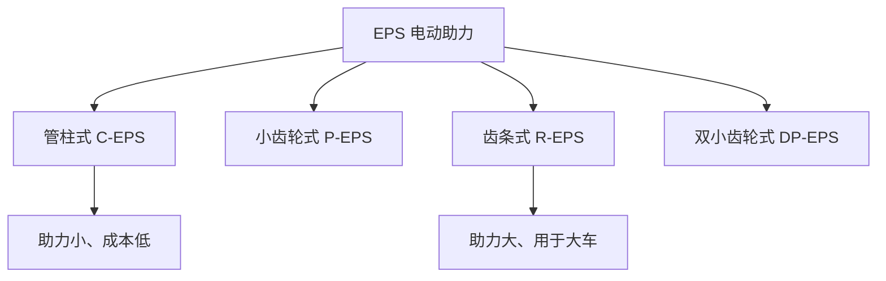
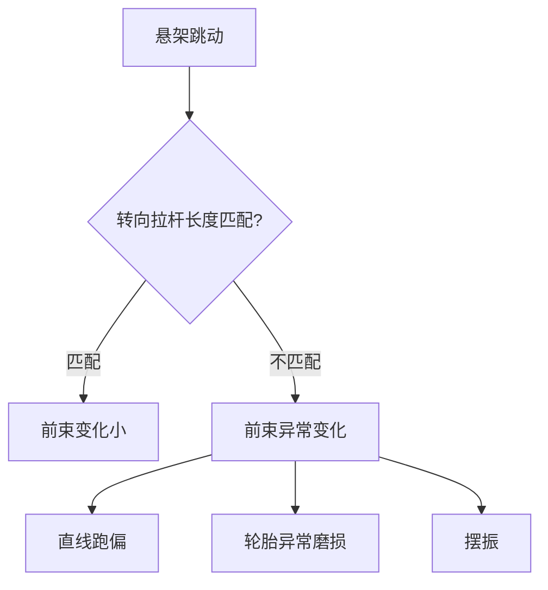

# 转向系统

## 概述

转向系统控制车辆行驶方向，影响**操控性、安全性**和**驾驶舒适性**。总布置需协调转向器位置、转向管柱走向和转向轮运动空间。

## 转向系统组成


| 部件 | 功能 | 布置位置 |
|------|------|----------|
| 方向盘 | 驾驶员输入 | 乘员舱，驾驶员前方 |
| 转向管柱 | 传递扭矩 | 穿过前围板 |
| 转向器 | 降速增扭、转换运动 | 前轴附近，副车架上 |
| 转向拉杆 | 推拉转向节 | 转向器到转向节 |
| 转向节 | 连接车轮 | 车轮中心 |

## 转向器类型

### 1. 齿轮齿条式（最常见）

```
    方向盘
      │
    转向管柱
      │
      ◉ ← 转向器输入（齿轮）
      │═════════════════════│ ← 齿条
      │                     │
   左拉杆                  右拉杆
      │                     │
   左转向节              右转向节
```

| 特点 | 说明 |
|------|------|
| 结构 | 齿轮带动齿条左右移动 |
| 优点 | 结构简单、精度高、路感好 |
| 应用 | 乘用车前转向几乎全部采用 |

### 2. 循环球式

| 特点 | 说明 |
|------|------|
| 应用 | 商用车、越野车 |
| 特点 | 螺杆+螺母+齿扇，承载大 |

## 助力转向

| 类型 | 说明 | 应用 |
|------|------|------|
| 液压助力 HPS | 液压泵提供助力 | 传统燃油车 |
| 电动助力 EPS | 电机提供助力 | 主流（燃油+电动） |
| 线控转向 SbW | 无机械连接 | 新型/高端车 |



!!! note "线控转向 SbW"
    线控转向取消方向盘与转向器的机械连接，用电机实现转向。
    - 优点：可变传动比、可过滤路面冲击、空间布置自由
    - 挑战：法规要求冗余备份、路感模拟
    - 应用：Tesla Cybertruck、丰田 bZ4X

## 转向系统布置

### 1. 转向管柱布置

```
    方向盘
      │
      │ ↘ 倾角 θ1（约 20-25°）
      │
    上转向轴
      │
      ◉ ← 万向节
      │
      │ ↘ 倾角 θ2
      │
    下转向轴
      │
      ◉ ← 万向节
      │
    转向器
```

| 布置要点 | 说明 |
|----------|------|
| 方向盘倾角 | 约 20-25°，符合人机工程 |
| 方向盘距座椅 | 可调范围满足不同身材 |
| 管柱走向 | 穿过前围板，避开踏板和仪表 |
| 万向节 | 补偿管柱与转向器的角度差 |
| 安全收缩 | 碰撞时管柱可收缩，减少对驾驶员伤害 |

!!! warning "碰撞安全"
    转向管柱是碰撞时对驾驶员的潜在伤害源。
    GB 11557 规定了方向盘和转向管柱的碰撞吸能要求。
    总布置需保证管柱有足够的收缩空间。

### 2. 转向器布置

| 布置方式 | 说明 |
|----------|------|
| 前置 | 转向器在前轴前方 |
| 后置 | 转向器在前轴后方（更常见） |

```
前置转向器：
    转向器
    ══════════════════════
        │            │
      前轮中心
    ◉─────◉─────◉
    （拉杆在前）

后置转向器：
    ◉─────◉─────◉
      前轮中心
        │            │
    ══════════════════════
    转向器
    （拉杆在后）
```

### 3. 转向拉杆布置

| 要点 | 说明 |
|------|------|
| 走向 | 转向器到转向节，尽量平直 |
| 角度 | 悬架跳动时拉杆角度变化小 |
| 间隙 | 与悬架连杆、半轴保持间隙 |
| 防护 | 防尘套完好，防止进水进尘 |

## 转向几何参数

### 阿克曼几何

转弯时内侧车轮转角应大于外侧车轮转角：

```
            转弯中心
               ◉
              /│\
             / │ \
            /  │  \
           /   │   \
    外轮 ◉    │    ◉ 内轮
    （转角小）│ （转角大）
              │
         ─────┴───── 车辆纵轴
```

**阿克曼误差：** 实际转角差与理论阿克曼转角差的偏差。

### 转向传动比

| 传动比 | 说明 |
|--------|------|
| 12:1 ~ 18:1 | 方向盘转角与车轮转角之比 |
| 可变传动比 | 中间小（灵敏）、两端大（停车轻便） |

### 最小转弯半径

```
最小转弯半径 R = 轴距 / sin(最大内轮转角) + 前悬偏移
```

| 车型 | 最小转弯半径 |
|------|-------------|
| A0 级 | 4.5-5.0 m |
| A 级 | 5.0-5.5 m |
| B 级 | 5.5-6.0 m |
| SUV | 5.5-6.5 m |

## 转向与悬架的协调

### 转向拉杆与悬架运动



!!! tip "转向拉杆硬点"
    转向拉杆内外点的 Z 向位置需与悬架纵向瞬时中心匹配，
    使悬架跳动时前束变化最小。这是总布置与悬架协调的关键。

### 干涉检查

| 检查项 | 说明 |
|--------|------|
| 转向极限 + 悬架跳动 | 拉杆与周边最小间隙 |
| 转向极限 | 轮胎与轮罩、悬架零件间隙 |
| 管柱与前围板 | 管柱运动时与前围板间隙 |

## 四轮转向（4WS）

| 模式 | 说明 |
|------|------|
| 低速反向 | 后轮与前轮反向，减小转弯半径 |
| 高速同向 | 后轮与前轮同向，变道更稳 |

```
低速转弯（后轮反向）：
    ↓ 前轮
    ┌─────┐
    │     │ ← 车辆
    │     │
    └─────┘
    ↑ 后轮（反向）

高速变道（后轮同向）：
    → 前轮
    ┌─────┐
    │     │ ← 车辆平移
    │     │
    └─────┘
    → 后轮（同向）
```

## 电动车转向特点

| 特点 | 说明 |
|------|------|
| EPS 普及 | 无发动机，无需液压泵 |
| 线控转向 | 电控化趋势，布置更灵活 |
| 可变传动比 | 软件定义，按车速调整 |
| 自动驾驶 | 需支持自动转向控制 |

## 转向系统参数表

| 参数 | 典型值 |
|------|--------|
| 方向盘直径 | 370-380 mm |
| 方向盘倾角 | 20-25° |
| 转向传动比 | 14-16:1 |
| 方向盘圈数（锁到锁） | 2.8-3.5 圈 |
| 最大内轮转角 | 35-42° |
| 最小转弯半径 | 5.0-6.0 m |
| 转向器类型 | 齿轮齿条式 |

---

## 下一步阅读

- [悬架系统](suspension.md）：悬架硬点与转向的协调
- [制动系统](braking.md）：制动系统布置
- [人机工程](../body/ergonomics.md）：方向盘位置与人机
