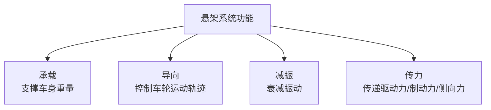
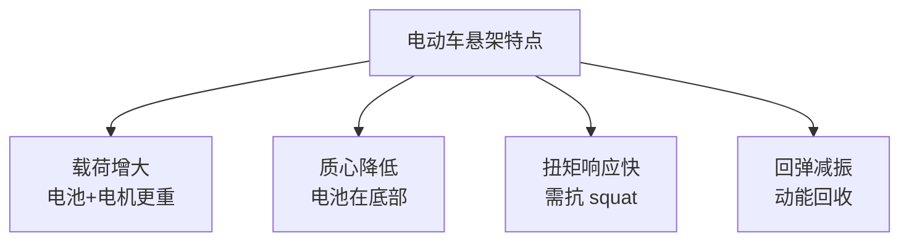

# 悬架系统布置

## 概述

悬架系统连接车轮与车身，影响**操稳性、平顺性、NVH** 和**空间布置**。悬架硬点是总布置的核心数据之一，直接决定车辆动态特性。

## 悬架的功能



## 前悬架常见形式

### 1. 麦弗逊式（MacPherson）

```
        减振器+弹簧
            │
            │
    ╔═══════╧═══════╗
    ║   转向节       ║
    ║   ┌───┐       ║
    ║   │ ◯ │ ← 车轮 ║
    ║   └───┘       ║
    ╚═══════╤═══════╝
            │
    ┌───────┴───────┐
    │  下摆臂（A臂）  │
    └───┬───────┬───┘
        │       │
       副车架安装点
```

| 特点 | 说明 |
|------|------|
| 结构 | 减振器作为导向机构，下摆臂控制横向 |
| 优点 | 结构简单、成本低、占用空间小 |
| 缺点 | 几何不完全理想、侧倾中心低 |
| 应用 | 前悬架最主流（A0-B 级车） |

### 2. 双叉臂式（Double Wishbone）

```
        减振器+弹簧
            │
    ┌───────┴───────┐  ← 上摆臂
    │               │
    ║   转向节       ║
    ║   ┌───┐       ║
    ║   │ ◯ │ ← 车轮 ║
    ║   └───┘       ║
    ╚═══════╤═══════╝
    ┌───────┴───────┐  ← 下摆臂
    │               │
    └───┬───────┬───┘
       副车架安装点
```

| 特点 | 说明 |
|------|------|
| 结构 | 上下两个 A 臂，转向节连接 |
| 优点 | 几何理想、操控好、侧倾中心可调 |
| 缺点 | 结构复杂、成本高、占用空间大 |
| 应用 | 高级轿车、性能车、SUV 前悬架 |

### 3. 多连杆式

| 特点 | 说明 |
|------|------|
| 结构 | 3-5 根连杆，各连杆独立控制一个自由度 |
| 优点 | 操控和平顺兼顾、调校空间大 |
| 缺点 | 结构最复杂、成本最高 |
| 应用 | 高级轿车前后悬架 |

## 后悬架常见形式

### 1. 扭力梁式（Torsion Beam）

```
    左轮          右轮
    ◯─────────────◯
     │  扭力梁  │
     └─────────┘
     │         │
    纵臂      纵臂
     │         │
    ◉         ◉ ← 车身安装点
```

| 特点 | 说明 |
|------|------|
| 优点 | 结构简单、成本低、占用空间小 |
| 缺点 | 非独立悬架、两侧车轮相互影响 |
| 应用 | A0-A 级车后悬架 |

### 2. 多连杆式

| 特点 | 说明 |
|------|------|
| 优点 | 独立悬架、操控平顺好、可调性大 |
| 缺点 | 成本高、占用空间 |
| 应用 | B 级以上后悬架 |

### 3. 拖曳臂式

| 特点 | 说明 |
|------|------|
| 应用 | 较少见，部分法系车使用 |

## 悬架硬点

### 什么是硬点

**硬点（Hardpoint）** 是悬架各连杆安装点的三维坐标，是悬架设计的基础数据。

```
关键硬点：
├── 弹簧上座（车身侧）
├── 减振器上下安装点
├── 上摆臂前后安装点（车身侧）
├── 上摆臂球头（转向节侧）
├── 下摆臂前后安装点（副车架侧）
├── 下摆臂球头（转向节侧）
├── 转向拉杆内点/外点
├── 副车架安装点
└── 车轮中心
```

### 关键几何参数

| 参数 | 定义 | 影响 |
|------|------|------|
| 主销后倾角 | 主销向后倾斜角度 | 回正性、直线稳定性 |
| 主销内倾角 | 主销向内倾斜角度 | 回正性、转向力 |
| 前束角 | 车轮前端向内收 | 直线稳定性、轮胎磨损 |
| 外倾角 | 车轮顶部向内/外倾 | 过弯抓地力、轮胎磨损 |
| 侧倾中心 | 悬架侧倾转动中心 | 侧倾刚度、侧倾角 |
| 纵向瞬时中心 | 悬架纵向转动中心 | 抗俯仰、抗 squat |

!!! tip "硬点是核心数据"
    硬点坐标是各系统设计的基础，总布置负责维护和管控硬点表。
    硬点变更需走 ECN 流程，影响面大。

## 悬架布置要点

### 1. 运动空间

| 工况 | 空间需求 |
|------|----------|
| 悬架最大压缩 | 弹簧/减振器最短状态，与周边无干涉 |
| 悬架最大下跳 | 弹簧/减振器最长状态 |
| 转向最大转角 | 转向拉杆、半轴角度 |
| 车轮跳动 | 轮罩空间，轮胎与翼子板间隙 |

```
    轮罩空间
    ┌──────────────────┐
    │                  │ ← 包络线（含轮胎跳动+转向）
    │    ┌──────┐      │
    │    │ 轮胎  │      │
    │    └──────┘      │
    └──────────────────┘
```

### 2. 与动力总成的协调

| 协调项 | 说明 |
|--------|------|
| 半轴走向 | 半轴从差速器到车轮，避让悬架连杆 |
| 副车架 | 副车架同时支撑悬架和动力总成 |
| 排气管 | 排气管穿过后悬架区域 |
| 油箱/电池 | 后悬架空间影响油箱/电池布置 |

### 3. 副车架布置

```
┌─── 副车架 ───────────────────────┐
│                                  │
│  ◉───────◉───────◉───────◉      │ ← 悬架安装点
│  │       │       │       │      │
│  ◉───────◉───────◉───────◉      │ ← 车身安装点
│                                  │
│  ◉───────◉  ← 动力总成悬置点     │
│                                  │
└──────────────────────────────────┘
```

| 副车架作用 | 说明 |
|------------|------|
| 隔振 | 柔性连接隔离路面振动 |
| 承载 | 支撑悬架和动力总成 |
| 碰撞 | 前副车架参与碰撞吸能 |
| 装配 | 悬架+动力总成预装，提高装配效率 |

### 4. 弹簧与减振器布置

| 布置形式 | 说明 | 应用 |
|----------|------|------|
| 同轴布置 | 弹簧套在减振器外 | 麦弗逊常见 |
| 分离布置 | 弹簧和减振器分开 | 多连杆常见 |
| 横置减振器 | 减振器水平布置 | 部分后悬架 |

## 电动车悬架特点



| 特点 | 对悬架的影响 |
|------|--------------|
| 质量大 | 弹簧/减振器需加强 |
| 质心低 | 侧倾减小，可适当调软 |
| 扭矩大 | 需更强的抗 squat/dive 设计 |
| 动能回收 | 制动时需协调减振器阻尼 |

## 悬架硬点表模板

| 序号 | 硬点名称 | X (mm) | Y (mm) | Z (mm) | 说明 |
|------|----------|--------|--------|--------|------|
| 1 | 前轮中心（左） | 0 | -780 | 300 | 基准点 |
| 2 | 下摆臂前点（左） | -180 | -650 | 200 | 副车架 |
| 3 | 下摆臂后点（左） | 120 | -650 | 200 | 副车架 |
| 4 | 下摆臂球头（左） | 0 | -750 | 180 | 转向节 |
| 5 | 上摆臂前点（左） | -150 | -600 | 450 | 车身 |
| 6 | 上摆臂后点（左） | 100 | -600 | 450 | 车身 |
| 7 | 上摆臂球头（左） | 0 | -700 | 430 | 转向节 |
| 8 | 减振器下端（左） | 20 | -740 | 250 | 转向节 |
| 9 | 减振器上端（左） | 30 | -600 | 600 | 车身 |
| 10 | 转向拉杆内点（左） | -50 | -400 | 300 | 转向器 |
| 11 | 转向拉杆外点（左） | 0 | -760 | 280 | 转向节 |

> 坐标为示意值，X 向前为正，Y 向左为正，Z 向上为正。

---

## 下一步阅读

- [转向系统](steering.md）：转向与悬架的协调
- [制动系统](braking.md）：制动系统布置
- [底盘案例](../cases/sedan.md）：实际底盘布置
