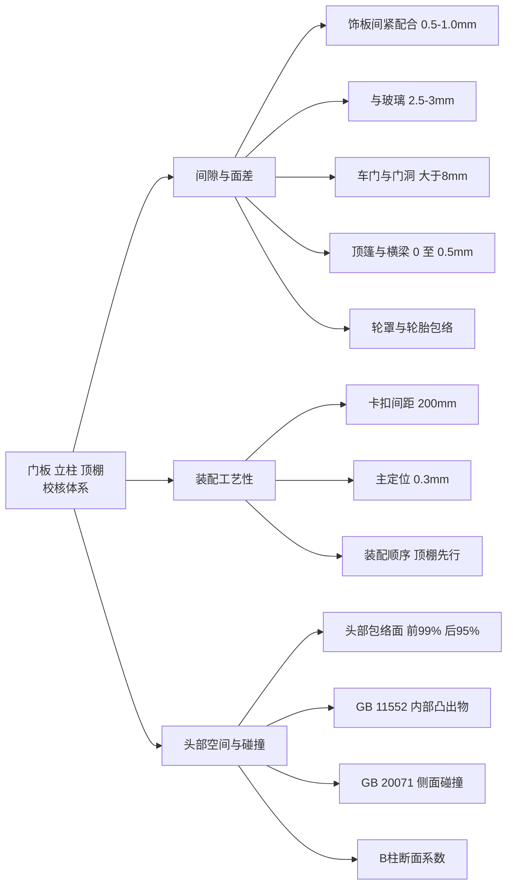
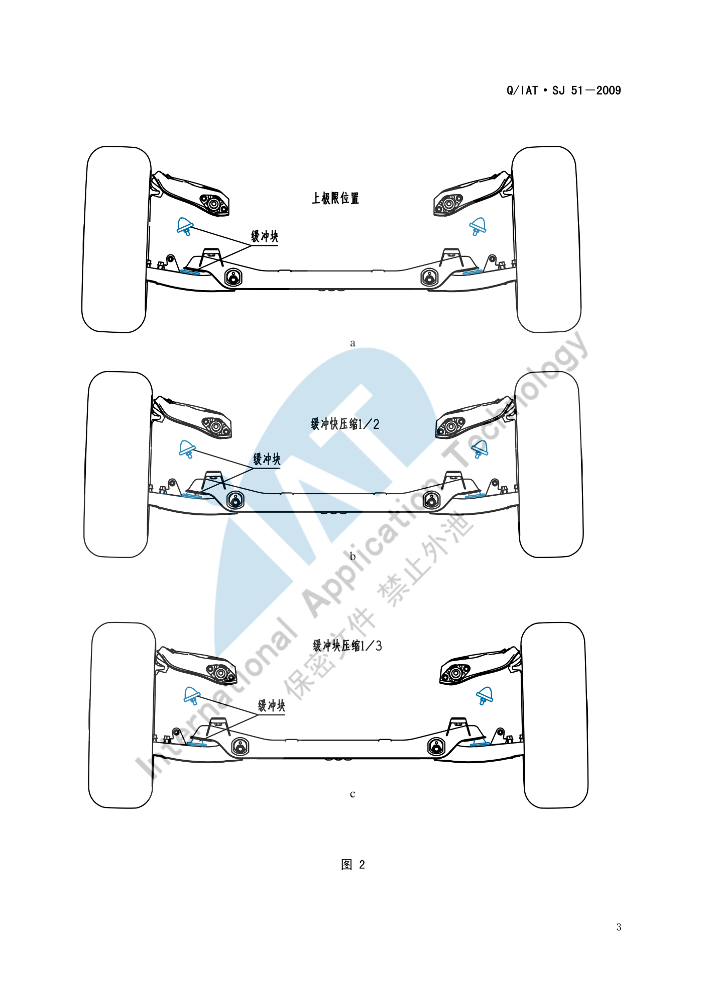

# 门板&立柱&顶棚校核标准

!!! quote "内容来源"
    本页正文抽取自《总布置》知识库中**可文本解析**的文件：
    `SJ 20-2008 立柱内饰板设计指导书`、`SJ 21-2008 前门内饰板设计指导书`、
    `SJ 18-2008 顶篷设计指导书`、`SJ 19-2008 空气室盖板设计指导书`、
    `SJ 4-2008 轿车车门主断面设计流程`、`SJ 51-2009 轮胎间隙校核规范`、
    `SJ 54-2009 侧碰对应B柱断面系数设定指导书`、`SJ 9-2008 A类汽车眼椭球、头部包络面设计规范`、
    `SJ 50-2009 仪表板装配设计指导书`。
    企业规范编号原样保留。

## 校核体系

## 概述

### 要点

本区域的校核分三类，共同特点是**"软内饰 + 钣金 + 运动件"三层约束叠加**：

| 类别 | 判据来源 | 主要校核项 |
|---|---|---|
| 间隙与面差 | `SJ 20/21/18/19/4` | 饰板间配合、与玻璃/密封条配合、与钣金间隙、面差 |
| 装配工艺性 | `SJ 20/21/18/19/50` | 卡扣间距、定位方案、安装顺序、工具空间、拔模 |
| 头部空间与碰撞 | `SJ 9/18/54`、`GB 11552/GB 20071` | 头部包络面间隙、内部凸出物、侧面碰撞、B 柱断面系数 |

**统一的设计顺序**：内饰类零件均为 **"查定义、做边界、核人机、定结构、细化 3D / 工艺分析细化 3D"**。

### 示例

三类校核在同一张断面上交汇。以顶篷与侧围边梁处为例：这里同时要满足**侧碰间隙（≥ 25 mm 或气帘 > 3 mm）**、**立柱饰板压顶棚过盈 1 mm**、**顶篷搭接长度 > 8 mm** 三项来自不同规范的要求。

### 注意事项

- **校核必须区分"可视区"与"非可视区"**：已解析条款中大量采用"外观间隙"（如中控面板 0.5 mm）与"内部间隙"（如顶篷无安装结构处 > 3 mm）两套标准，但**未给出统一的 DTS 分级表**，属待补充项；
- 所有间隙都是**静态设计值**，必须另行校核**极限状态**（车门下沉、座椅全行程、遮阳板全翻转）。

## 间隙与面差

### 要点

**（1）立柱内饰板**（`SJ 20-2008` §5.4）

| 校核项 | 要求 |
|---|---|
| 立柱上、下内饰板**紧配合** | 表面间隙 **0.5 mm–1.0 mm** |
| 立柱上、下内饰板**搭接配合** | 阶差 **1 mm**，搭接长度 **> 20 mm** |
| 与**门槛踏板**紧配合 | 表面间隙 **0.5 mm–1.0 mm**；搭接配合时阶差 1 mm、搭接长度 > 20 mm |
| 与**顶棚**紧配合 | 过盈量 **0.5 mm–1.0 mm** |
| 与**地毯** | 一般过盈量 **1.0 mm–2.0 mm**；地毯**长出立柱 10 mm** |
| 与**玻璃** | 间隙 **2.5 mm–3 mm** |
| 与**座椅**的运动间隙 | **> 40 mm** |
| 与**安全带**的运动间隙 | **> 5 mm** |
| 与**电器开关**表面 | 间隙 **2 mm** |
| **A 柱上内饰板与 IP** | 配合间隙 **0.5 mm** |
| **A 柱下饰板与发罩扣手** | 表面间隙 **2 mm** |
| 与密封条周边 | 间隙合适、配合合理（需逐项确认） |

**（2）前门内饰板**（`SJ 21-2008` §5.4）

| 校核项 | 要求 |
|---|---|
| 与 **IP** | 配合间隙一般 **> 6 mm**，配合宽度 **> 8 mm**，**内部无配合区 10 mm 以上** |
| 与**门槛踏板（压板）** | 一般 **8 mm**（考虑车门安装后有下沉趋势） |
| 与前立柱及中立柱**密封条** | 一般 **7 mm–8 mm**；若前/中立柱为半包结构同样 **7 mm–8 mm** |
| 门内饰与车门钣金接触的配合翻边与**密封泡**之间 | **≥ 5 mm** |
| 与**座椅靠背**运动间隙 | **> 20 mm** |
| 与**坐垫总成机构**运动间隙 | **> 40 mm** |
| 与**门内板**配合周边 | 一般**要求零接触**，边界过渡均匀、无安装阻碍 |
| 与**门内水切** | 配合边界正确：覆盖长度合适、间隙适度、干涉合理、结构可行 |
| 与**后门内饰板** | 需协调统一（可通用件如内开启结构总成、拉手盒、饰盖、标准件） |

**（3）顶篷**（`SJ 18-2008` §5.3）

| 校核项 | 要求 |
|---|---|
| 与玻璃（前后风挡、角窗等） | **2.5 mm–3.0 mm**，要求均匀一致 |
| 与玻璃黑区 | **H > 2 mm**、**L > 5 mm** |
| 与风窗止口边 | **≤ 3 mm** |
| 与密封条（有"翅膀"） | 距密封条本体 **2 mm 左右**；"翅膀"覆盖顶棚 **> 5 mm**；A 值 1.5–2 mm；C 值 1.0–1.5 mm |
| 与密封条（无"翅膀"） | **0 接触**，但与圆角区距离 **≥ 2 mm** |
| 与顶盖横梁 | 有安装结构处 **0 mm ~ −0.5 mm**；无安装结构处 **> 3 mm** |
| 与侧围边梁 | 不加装：**8 mm–15 mm**；考虑侧碰：**≥ 25 mm**；加气帘：**> 3 mm**；塑料护板：**0 mm**；泡沫块：**0 mm** |
| 与立柱 | 顶篷与立柱间隙 **1 mm**、面差 **0 mm**、翻边 **> 8 mm**；立柱饰板压顶棚**过盈 1 mm**、盖住顶篷 **≥ 8 mm** |
| 与内拉手 | 手部开启空间 **≥ 5 mm**；固定处与钣金 **0 mm**；拉手干涉顶篷 **1 mm–1.5 mm**；开孔保证安装座搭接顶篷 **约 4 mm** |
| 与顶灯 | 顶灯干涉顶篷 **1 mm**；开孔保证灯搭接顶篷 **≥ 8 mm** |
| 与遮阳板 | 前端配合 **0 mm**；后端旋转中心到顶篷距离 **> 旋转半径 + 2 mm**；手部开启空间 **≥ 16 mm**（视相对高度）；支座凹台周圈间隙 **5 mm–8 mm**；支座干涉顶篷外表面 **1 mm–1.5 mm**；凹台外表面与横梁/支架 **0 mm**；开孔保证支架搭接顶篷 **约 5 mm** |
| 与高位刹车灯 | 配合间隙 **≥ 5 mm**；加塑料护板时护板干涉顶篷 **1 mm**、开孔保证搭接 **≥ 8 mm** |
| 与天窗（翻边配合） | 翻边侧面距天窗 **3 mm**；翻边顶部 **≥ 6 mm**；翻边高度 **≥ 15 mm**（不足时优先保高度，顶部距离不低于 3 mm）；粘扣处间隙 **≥ 8 mm** |
| 与天窗（密封条配合） | **零接触**或按密封条形式定（示例 2 mm）；其他部位 **≥ 3 mm**（特殊局部 2 mm） |
| 与出水管、线束、电器元件 | 一般 **≥ 3 mm**；特殊情况下出水管/线束局部 **1 mm**（不干涉即可）、电器元件局部 **2 mm** |

**（4）车门与门洞**（`SJ 4-2008`）

| 校核项 | 要求 |
|---|---|
| 前门门框与 B 柱、后门门框与 B 柱的**所有间隙** | **> 8 mm** |
| 后门**开度** | **60°–70°** |
| 后门开启过程中（与前后门之间、与铰链体、与 B 柱） | **> 3 mm** |
| 门洞密封条与门护板距离 | **> 6 mm** |
| 前门下边缘线与侧围门槛线间隙 | **5 mm–8 mm** |
| 前门门框与侧围门洞周边间隙 | **> 8 mm** |
| 侧围门洞法兰面宽度 | **15 mm–18 mm** |
| 侧围门洞法兰面与车门密封面距离 | **12 mm–16 mm** |
| 板金件内外板边缘线落差 L1 | **1 mm** |
| 门洞法兰面圆角 R1 | **3 mm–6 mm** |
| B 柱侧面斜角 α | **> 4°** |
| 车门内板铰链/锁体安装面与 YZ 平面 | 成 **3° 以上**角度 |
| 门洞密封条安装槽侧壁与法兰面边缘线间隙 | **1 mm–1.5 mm** |

**（5）空气室盖板**（`SJ 19-2008` §5.4）

| 校核项 | 要求 |
|---|---|
| 与发动机罩运动间隙 | **≥ 5 mm** |
| 与发动机罩铰链运动间隙 | **≥ 6 mm** |
| 与翼子板、侧围外板 | **0 mm–2 mm** |
| 与前风挡玻璃 | 一般**过盈 1 mm** |
| 与雨刮旋转轴、雨刮摇臂运动间隙 | **≥ 5 mm** |
| 与雨刮电机安全间隙 | **≥ 5 mm** |
| 前方视野 | **不能高于前方下视野** |

**（6）轮罩与轮胎**（`SJ 51-2009`）

轮胎跳动校核的输入条件（所有数据要求在整车坐标下）：轮胎上下跳行程参数与转向器行程参数；所用轮胎的**标准胎、最大胎**数据（底盘无法提供准确最大胎断面时参考附录绘制，**有防滑链要求时考虑防滑链尺寸**）；车身相关数据（车身纵梁、轮罩、翼子板、挡泥板等轮胎周边数据）；前后悬架运动分析数据。

包络面制作工况：

| 悬架形式 | 工况设置 |
|---|---|
| **独立前悬架**（4 工况） | ① 转向角 0°、车轮下极限到上极限；② 转向角 10°、上跳至上极限；③ 转向角 20°、上跳至缓冲块压缩 1/2；④ 全转向、上跳至缓冲块压缩 1/3 |
| **非独立前悬架**（4 工况） | ① 0°、下极限到上极限；② 0°、一侧车轮跳动至轴线翘起 5°；③ 全转向、下极限到上极限；④ 全转向、一侧车轮跳动至轴线翘起 5° |
| **独立后悬架** | 车轮从下极限运动到上极限 |
| **非独立后悬架**（3 工况） | ① 两侧车轮同时跳动从下极限至上极限；② 一侧在设计位置、另一侧上跳至上极限；③ 一侧跳至上极限使后轴翘起 5°（备选） |

方法依据：`SAE J1214 JAN1992 Tire To Body Clearance Check For Recreational Vehicles`；轮胎与轮辋标准：`GB/T 2978-2008`、`GB/T 3487-2005`。

### 示例

前轮包络面的工况定义（a/b/c 三种车轮位置）直接决定了轮罩与翼子板的边界：

### 注意事项

- **可视区与非可视区的标准差异**在本区域尤为明显：门内饰与 IP 的"配合间隙 > 6 mm"、与门槛的 8 mm 属可视区；而顶篷"无安装结构处 > 3 mm"、出水管"局部 1 mm"属非可视区。已解析条款**未给出统一的 DTS 分级表**，属待补充项。
- **公差累积**：内饰件的间隙值多数在 0.5–2 mm 量级，而钣金单件公差往往同量级，因此必须做**极限状态校核**（车门下沉、座椅全行程、遮阳板全翻、卡扣活动余量），不能只比对标称值。

## 装配工艺性

### 要点

**（1）装配顺序**（`SJ 50-2009` §3.1）

装饰件装配顺序：**顶棚系统 → 铺设地毯 → 驾驶舱模块（含仪表板组件）→ 前风挡玻璃 → 立柱、护板等内饰件 → 座椅固定在地板上 → 其他部件**。

**（2）固定与定位**（`SJ 20-2008` §6.2、`SJ 18-2008` §6.2）

| 校核项 | 要求 |
|---|---|
| 立柱饰板固定方式 | 一般塑料卡扣，局部可用螺钉 |
| 卡扣固定间距 | 一般 **200 mm 左右**，均匀布置 |
| 滑块空间 | 卡扣座外部要留出**大于卡扣座内部深度 2 倍以上**的距离作为滑块滑动空间 |
| 立柱饰板主定位 | 一个主定位控制 **X、Z 方向**，高度方向一般靠近配合边；开孔与定位卡扣处间隙 **0.3 mm** |
| 立柱饰板辅助定位 | 一个辅助定位控制 **X 方向**，非限位方向间隙 **1.0 mm–2.0 mm** |
| 窄长饰板 | 纵向只能布置一排固定点且无限制旋转部件时，需设计**限位加强筋**与钣金配合限制旋转 |
| 顶篷安装点 | 布置在顶盖横梁或钣金支架上，**每个横梁 1～2 个**，均匀且左右对称 |
| 顶篷第一根横梁 | 已安装遮阳板和前顶灯，一般**不需布置**安装点 |
| 顶篷最后一根横梁 | 一般 **3～4 个**；有高位刹车灯配合时一般 **2 个** |
| 顶篷天窗车型 | 后阅读灯布置到横梁位置时，横梁上一般**不再布置**安装点 |
| 顶篷主定位 | 控制 X、Y 方向，半径差 **0.3 mm**；一般为最后排安装孔（优先中间的孔） |
| 顶篷副定位 | 控制 Y 方向，X 向半径差 **1.5 mm–2 mm**、Y 向 **0.3 mm**；一般为最前排安装孔、与主定位同侧 |
| 顶篷非定位孔 | 直径差 **1.5 mm–2 mm** |

**（3）装配可行性**（`SJ 21-2008`、`SJ 20-2008`、`SJ 19-2008`）

| 校核项 | 要求 |
|---|---|
| 门内饰与门内板 | 配合周边**一般要求零接触**，边界过渡均匀、无安装阻碍 |
| 内开启扣手 | 零件的分块需考虑现场的装配工艺，如**内开启扣手的安装顺序** |
| 安全带 | 零件的分块需考虑现场工装要求，例如**安全带的装配** |
| 空气室盖板 | 分块后要进行**安装模拟**以验证是否满足装卸要求；整体式安装顺序为：先打开发动机罩，顺着前风挡玻璃放下，先把上沿与前风挡玻璃安装好，再把两端与翼子板安装好 |
| 顶篷 | 需进行安装模拟，使其安装和拆卸都可实现 |

**（4）工艺性要求**

| 零件 | 拔模要求 | 其他 |
|---|---|---|
| 立柱内饰板 | 沿拔模方向 **> 5°**，特殊最小 **3°**，深皮纹 **> 7°** | 加强筋厚度避免缩痕；卡扣座处滑块滑动距离需与供应商确认 |
| 前门内饰板 | **Y 向 > 5°**，特殊最小 **3°**，深皮纹 **> 7°** | 包布工艺：整体式包布**槽深 > 10 mm**（当前国内工艺水平）；分开式包布**配合边重合宽度 ≥ 15 mm** |
| 顶篷 | **Z 向 3°–5°** | 顶篷长度过大模具不能实现时考虑分块 |
| 空气室盖板 | **> 5°**，特殊最小 **3°** | 加强筋根部厚度**不超过本体厚度的 1/3 左右**（避免缩痕） |

### 示例

装配顺序会**反向决定分块方案**：先装顶棚、地毯，意味着立柱下饰板与门槛饰板必须能"后装且不遮挡前装件"；而"仪表板总成后装座椅"则意味着地毯必须预留座椅安装点的让位。

### 注意事项

- **售后拆装便利性属待人工补充项**：已解析条款覆盖的是**生产线装配**（工时、可达性、安装顺序），未见售后维修拆装（如单独更换某一饰板是否需要拆卸其他总成）的要求；
- **卡扣可达性是隐性的硬约束**：`SJ 20-2008` 要求卡扣座外部留出大于内部深度 2 倍的空间，这在窄小的立柱饰板上经常无法满足，需在数据阶段就与工装部门确认。

## 头部空间与碰撞

### 要点

**（1）头部空间**（`SJ 9-2008`、`SJ 18-2008` §5.2.1）

| 空间项 | 定义与要求 |
|---|---|
| 前乘客区头部空间 | 顶篷距 **99%** 百分位人体头部包络线的**最小距离** |
| 后乘客区头部空间 | 顶篷距 **95%** 百分位人体头部包络线的**最小距离** |
| 前/后乘客区乘坐空间 | 过 H 点作与 zx 面平行的平面，过 H 点作与竖直方向成 **8°** 的直线，其与顶篷交点到 H 点的距离 |
| W27 | 头部包络面在**斜向 30°** 方向上与内饰的间隙 |
| W35 | 头部包络面与内饰的**水平**间隙 |
| H35 | 头部包络面与内饰的**垂直**间隙 |
| H61 | **有效头部空间** |

> 头部包络面的轴长、中心点定位公式与百分位选用规则见 [空间与进出便利性](../ergonomics/comfort.md)。

**（2）内部凸出物**（`GB 11552-1999《轿车内部凸出物》`，等效 74/60/EEC、78/632/EEC）

| 判据 | 内容 |
|---|---|
| 尖棱 | **曲率半径 < 2.5 mm** 的刚性材料棱边；**不包括**从仪表板/内饰表面测量**凸出高度小于 3.2 mm** 的构件 |
| 圆钝例外 | 凸出物的**凸出高度不大于其宽度的一半且边缘圆钝**时，可不规定最小曲率半径 |
| 格栅类零件 | 需满足格栅间距与最小片厚/半径的对应关系表（见 [IP 布置](../ip-cnsl/ip.md)） |
| 适用范围 | 立柱内饰板（`SJ 20` §3.1）、顶篷（`SJ 18` §3.1）、前门内饰板（`SJ 21` §3.1）均须满足 |

此外，`SJ 46-2009` §6.16 要求乘员侧断面**在头部碰撞基准区内**满足 `GB 11552-1999` 对应要求。

**（3）侧面碰撞**（`GB 20071-2006`、`ECE R95`、`SJ 54-2009`）

| 项目 | 内容 |
|---|---|
| 试验条件 | 可变形移动障碍壁（MDB），**950 kg**，**50 km/h**，撞击角 **90°**，假人 EuroSID-1 或 EuroSID-2 |
| B 柱断面系数 | 按概念设计阶段的简化力学模型计算各位置最小断面系数 `ZLWR`、`ZUPR`，要求 B 柱各处断面系数位于**最小断面系数要求线右侧** |
| 立柱饰板碰撞要求 | 门内饰板的设计空间及结构应在碰撞时**对乘员的伤害降到最小**（`SJ 21-2008` §3.3） |
| 碰撞保护块 | 根据总布置及 CAE 分析结果布置位置与大小尺寸，**最小厚度 30 mm 以上**，**平面大小覆盖 CAE 要求的保护区域**（`SJ 21-2008` §5.2.9） |
| 侧碰相关的顶篷结构 | 考虑侧碰时顶篷与侧围边梁间隙 **≥ 25 mm**；加装气帘时理想间隙 **> 3 mm**（`SJ 18-2008` §5.3.4） |

### 示例

侧碰对内饰板的反向要求非常具体：**碰撞保护块最小厚度 30 mm 以上**，且平面尺寸必须**覆盖 CAE 要求的保护区域**。这意味着内饰板在该区域不能为了造型而减薄，`SJ 21-2008` §5.1.9 也要求在定义阶段就确认"是否要满足侧碰要求，如果有，要考虑对人体的保护及饰板与钣金的距离"。

### 注意事项

- **法规与五星目标的差异属待人工补充项**：已解析条款覆盖的是**法规符合性**（GB 11552、GB 20071），未见 C-NCAP 五星目标的**加分项**要求。
  可参考的对标信息：`SJ 54-2009` 指出丰田 COROLLA 因断面系数远高于 GB 20071-2006 最低要求（预留了足够安全余量），在 C-NCAP 取得**侧碰 16 分满分、整车 5 星**成绩——说明"**法规合格 ≠ 五星**"，需按目标星级预留余量。
- 头部空间在**带天窗车型**上会被显著压缩（`SJ 9-2008` 附录 A 实测：天窗版 W35 仅 18 mm，非天窗版 47–76 mm），碰撞与顶篷结构件（气帘、加强板）都会进一步挤占该空间，**三者需联合校核**。

## 待人工补充

!!! warning "本页待人工补充清单"
    - **DTS（尺寸技术规范）分级表**：可视区/非可视区的统一间隙与面差标准；
    - **售后拆装便利性**要求：本页仅覆盖生产线装配；
    - **C-NCAP 五星目标**相对法规的加分项与余量要求；
    - **车门淋雨试验**判据与失败模式；**内饰异响**判据；
    - `SJ 3-2008 车门设计检查指导书`（62 页）已下载但尚未逐条解析，其中含**车门设计检查清单**，
      是本页"间隙与面差"的重要补充来源；
    - `SJ 45-2009 内饰SEG设计指导书`（25 页）、`SJ 22-2008 三厢车内饰零部件装配流程` 已下载但未展开；
    - 知识库中以下文件虽相关但因读取问题**未采用**：`AEM-A1-900 检查和维护性设计规范`、
      `AEM-A3-001 装配维修性`、`AEM-A4-003 内部凸出物校核规范`。

    建议：在 IMA 客户端中打开对应文件补充条款，或按"规范编号 + 页码"方式人工引用。

---

## 下一步阅读

- [门板布置](door.md)：车门系统、密封与强度要求
- [立柱布置](pillar.md)：A/B/C 柱饰板与侧碰断面系数
- [顶棚布置](roof.md)：顶篷、天窗与空气室盖板
- [空间与进出便利性](../ergonomics/comfort.md)：头部空间与头部包络面
