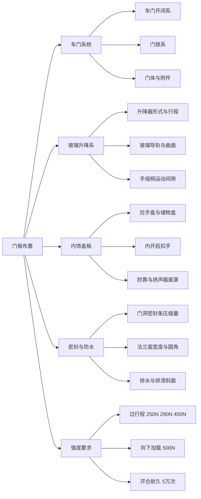
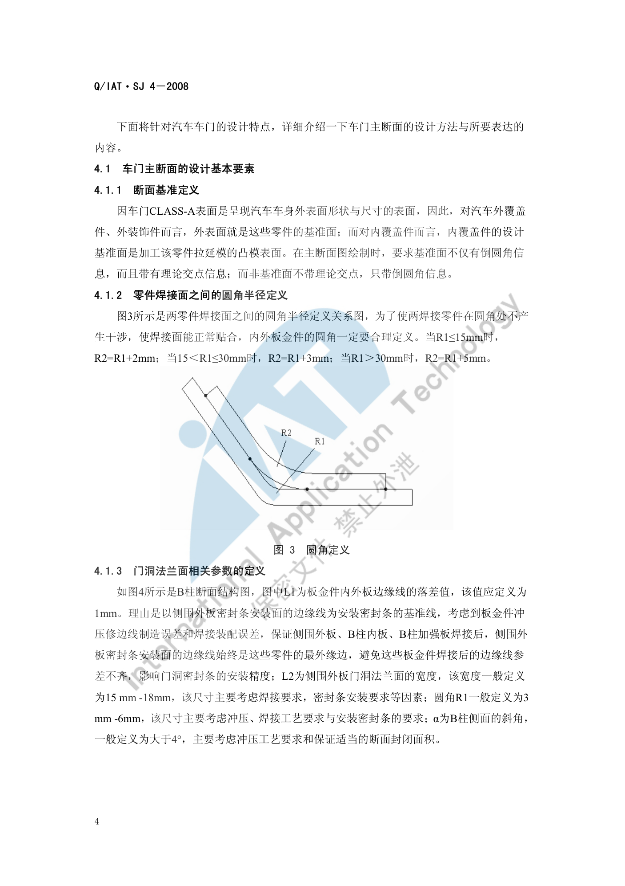
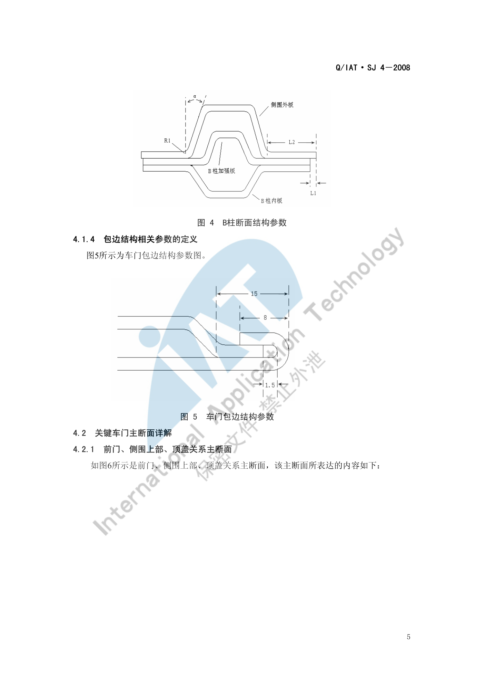
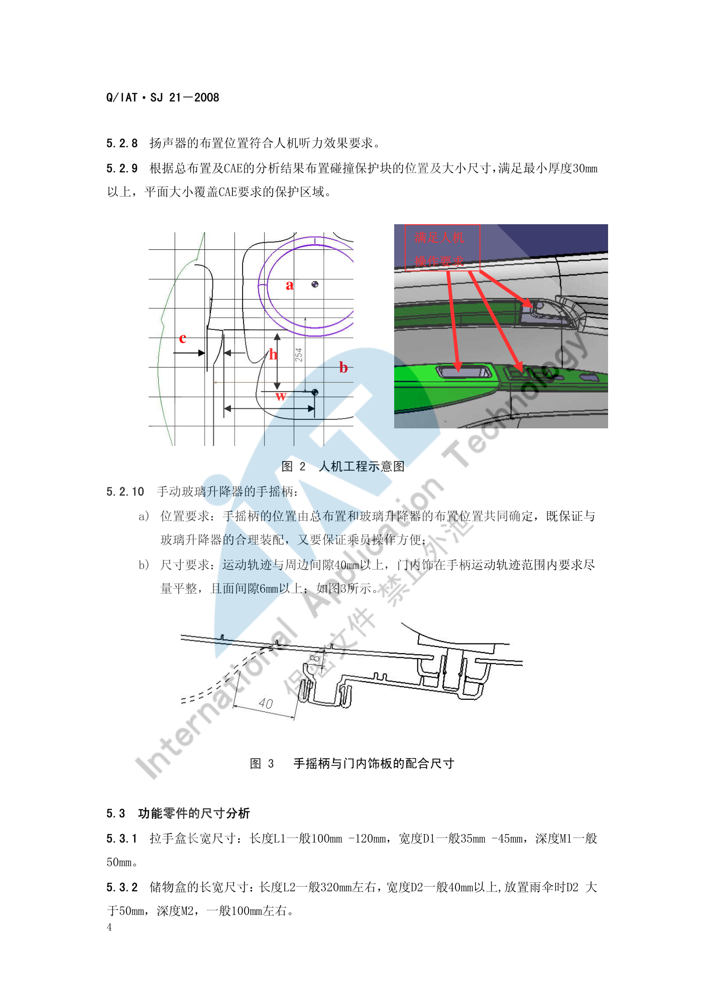

# 门板布置

!!! quote "内容来源"
    本页正文抽取自《总布置》知识库中**可文本解析**的文件：
    `SJ 2-2008 车门设计指导书`、`SJ 4-2008 轿车车门主断面设计流程`、
    `SJ 21-2008 前门内饰板设计指导书`、`SJ 43-2009 侧围外板设计指导书`。
    企业规范编号原样保留。

## 门板布置体系

## 概述

### 要点

**（1）车门系统的四大组成**（`SJ 2-2008` §2.1）

| 分系 | 内容 |
|---|---|
| 车门开闭系 | 铰链、限位器、门锁配合机构 |
| 玻璃升降系 | 升降器、玻璃、导轨、水切 |
| 门锁系 | 锁机构、内外手柄、锁扣、拉线 |
| 车门密封系 | 门洞密封条、门框密封条、防水膜 |

**（2）车门总成的三级构成**（`SJ 2-2008` §2.2）

| 层级 | 零部件 |
|---|---|
| **门体** | 车门外板、车门内板、车门加强横梁、车门加强板、车门铰链、门锁机构及内外手柄 |
| **车门附件** | 车门玻璃、玻璃升降器、密封条 |
| **内饰盖板** | 固定板、芯板、内饰蒙皮、内扶手 |

**（3）适用范围**（`SJ 2-2008` §1）

适用于乘用车、商用车**侧开启式车门**（轿车前/后门、卡车驾驶室车门等）；**不适用于滑门、向上开启式（上掀式）车门**。

**（4）设计总原则**（`SJ 2-2008` §3.2.1）

**由外而内、先外板再内板、先断面再数模、先周边再内部**。主要设计要点：外板曲面、分缝线、门锁结构、内板结构、密封间隙、铰链中心线长度姿态、玻璃升降器位置和玻璃曲面。车门设计与车身设计**同步进行**。

### 示例

主断面是车门设计的第一手依据，其绘制规范决定了后续所有间隙的表达方式。内覆盖件的设计基准面是**加工该零件拉延模的凸模表面**；断面绘制时要求**基准面带理论交点**、非基准面只带倒圆角信息。

内外板金件焊接面的圆角必须合理定义，以避免圆角处干涉、保证焊接面正常贴合：

### 注意事项

- 车门设计**不适用于滑门与上掀门**，遇到此类结构（如 MPV 侧滑门、掀背尾门）需另找依据；
- 内饰盖板（门板）只是车门总成的一部分，**门板的所有边界都由门体与附件反推**，不能先定门板再塞附件。

## 设计流程与输入条件

### 要点

**（1）六个设计阶段**（`SJ 2-2008` §3.2.2）

| 阶段 | 主要工作 |
|---|---|
| 前期分析 | 竞品车门结构调查；制作**造型控制要点**并输入造型；效果图初步分析与反馈；编制**车门总成设计构想书** |
| 可行性分析与方案设计 | 主断面与断面设计、造型可行性分析；确定铰链/玻璃曲面/锁机构/升降器/导轨/限位器/内外扣手/扬声器/外后视镜/防撞梁/密封方案/车门灯与开关/防撞块的**形式、位置、安装方式**；断面强度解析、活动件运动分析、附件拆装分析、组焊顺序与焊接方式分析 |
| 结构设计 | 详细 3D 数模；CAE 与工艺分析并优化；完整的 2D 工程图纸与设计文件 |
| 试制 | 试制问题整理分析，改进设计缺陷 |
| 试验 | 试验问题整理分析，改进设计缺陷 |
| 定型 | 试生产问题整理分析并设计定型 |

**（2）设计输入条件**（`SJ 2-2008` §5.3）

车型总体布置图（定义车门数量、门洞开口位置与尺寸、门开度等关键参数）、车身产品描述书、带分缝线的车身 CLASS-A 数据、车身主断面、参考样车、车门附件引用件、新开发件清单。

**（3）参考样车的选择原则**（`SJ 2-2008` §4.1.2、`SJ 4-2008` §3）

① 车身结构形式借鉴意义较大；② 造型风格类同；③ 车型、档次类同。一般先对标杆样车进行**逆向建模**（三维数模与二维主断面），并保证**标杆样车与新车型主断面的位置协调一致**。

**（4）五类关键车门主断面**（`SJ 2-2008` §4.3.2）

| 主断面 | 表达的装配关系 |
|---|---|
| 前门、侧围上部、顶盖关系 | 侧围外板、顶盖、顶盖侧梁及加强板、顶棚、前门门框上部、门洞密封条、门框密封条、玻璃导槽、流水槽装饰条 |
| 前门、后门、中支柱、后门铰链关系 | 前门结构、后门结构、中支柱结构、前门锁、后门铰链、密封条 |
| 前门、门槛关系 | 前门外/内板、前门护板、侧围下门槛、门槛内/加强板、前地板、门槛外侧装饰件、地毯、线束、密封条 |
| 前门水切 | 前门内板、水切内外加强板、前门护板、内外水切密封条 |
| 前门、翼子板关系 | 前门内外板、翼子板、A 柱结构、前门铰链、密封条、前门护板、A 柱护板 |

**（5）设计顺序**（`SJ 21-2008` §6.1 等）

内饰类零件统一遵循 **"查定义、做边界、核人机、定结构、细化 3D"** 五步。

### 示例

门洞法兰面相关参数是断面设计的通用语言（以下取自 B 柱断面）：

| 参数 | 含义 | 取值 |
|---|---|---|
| L1 | 板金件内外板边缘线的落差值 | **1 mm** |
| L2 | 侧围外板门洞法兰面宽度 | **15 mm–18 mm** |
| R1 | 圆角 | **3 mm–6 mm** |
| α | B 柱侧面的斜角 | **> 4°** |

### 注意事项

- L1 取 1 mm 的**理由**是保证侧围外板、B 柱内板、B 柱加强板焊接后，侧围外板密封条安装面的边缘线**始终是最外缘边**，避免边缘线参差不齐影响门洞密封条安装精度——这类"取值背后的理由"往往比数值本身更重要。
- L2 的 15–18 mm 同时受**焊接要求**与**密封条安装要求**约束；α > 4° 主要考虑冲压工艺与断面封闭面积。

## 结构与强度要求

### 要点

**（1）过行程强度**（`SJ 2-2008` §5.2.1，在车门后端加载使车门在开启方向发生规定过行程的载荷）

| 载荷 | 要求 |
|---|---|
| 250 N | 车门下沉 **≤ 1.0 mm** |
| 250 N | 开启方向角度变形 **≤ 10°** |
| 290 N | 与各个部件之间**没有干涉** |
| 450 N | **不发生龟裂、破断**以及使性能降低的变形 |

**（2）向下加载负荷强度**（§5.2.2）：加载 **500 N** 时向下位移量 **≤ 10 mm**，残留位移量（永久变形）**≤ 1.0 mm**。

**（3）全力关门强度**（§5.2.3）：在车门全开状态下用全力关闭时，外板、玻璃、车锁及其他部位**不能发生龟裂、破断**及使性能降低的变形。

**（4）开合耐久强度**（§5.2.4）：在白车身或涂装后的车身上安装车门，实施 **5 万次**反复开合试验时：① 不能发生影响性能、外观质量的裂纹、磨损、变形、干涉、螺栓松动；② 不能发生破坏外观涂装质量、脱落、扭曲等问题。

**（5）车门结构 CAE 项**（`SJ 2-2008` §4.4.2）：车门刚度分析、模态分析、**门下垂分析**、碰撞分析（与整车一起）、**抗凹性分析**。

**（6）基本设计要求**（§5.1）：车门开启应保证上下车方便性并**能停留在最大开度位置**；开启过程不得与车身其他部位干涉；关闭时锁止可靠、行车中不会自动打开；操纵方便、玻璃升降轻便；密封良好；有大的透光面满足侧向视野；门体有足够强度与刚度（含安装刚度，**防止车门下沉**）；良好的制造装配工艺；造型与整车协调。

### 示例

门下垂（下垂量）是车门强度的核心指标，它与过行程强度、下加载位移共同构成门体刚度的验收体系；`SJ 4-2008` 还要求对标杆样车做**整体扭转/弯曲刚度、接头刚度、门洞部位刚度**分析，以及各关键断面**封闭面积与转动惯量系数**的计算，据此在新车型上对"刚度过剩处削弱、不足处加强"。

### 注意事项

- 强度要求是**整车级指标**：`SJ 2-2008` 明确碰撞分析须**与整车一起**做，门单体强度合格不代表整车侧碰合格。
- **抗凹性**（外板）与**门下垂**（安装刚度）是两类不同问题，前者靠外板料厚与加强筋，后者靠铰链安装面与内板刚度。

## 玻璃升降系统

### 要点

**（1）方案设计阶段必须确定的内容**（`SJ 2-2008` §3.4.1）

| 项目 | 需确定内容 |
|---|---|
| 玻璃曲面 | 位置、曲率 |
| 玻璃升降器机构 | 形式、位置、**行程**、安装方式 |
| 玻璃导轨 | 形式、位置、安装方式 |
| 内外水切 | 内外水切密封条形式（`SJ 4-2008` 前门水切主断面） |
| 驱动形式 | 电动或手动；电动按钮的定义要求，手动摇柄的定义要求（`SJ 21-2008` §5.1.10） |

**（2）手动玻璃升降器手摇柄的要求**（`SJ 21-2008` §5.2.10）

| 项目 | 要求 |
|---|---|
| 位置 | 由总布置与玻璃升降器布置位置**共同确定**，既保证与升降器合理装配，又保证乘员操作方便 |
| 运动轨迹与周边间隙 | **40 mm 以上** |
| 门内饰面间隙 | 在手柄运动轨迹范围内**尽量平整**，且面间隙 **6 mm 以上** |

**（3）与门内板的配合**（`SJ 21-2008` §5.4.7）：门内饰板与门内板配合的周边**一般要求零接触**，同时边界过渡均匀、无安装阻碍。

### 示例

升降器与导轨的布置空间是门板断面设计中最先被"占满"的部分：门体内板上需同时容纳升降器机构、导轨、防撞梁、扬声器与线束，`SJ 2-2008` 要求在方案设计阶段就完成**活动件运动分析**与**附件拆装分析**，并在主断面中表达各件关系。

### 注意事项

- **与扬声器、线束的空间冲突**是门板区域的典型问题：`SJ 21-2008` §3.10 要求门内饰设计时预留与电器零件（按钮、线束、扬声器、灯具）及车门附件（玻璃升降器、导轨、锁拉线）的装配/配合空间，这些空间**必须在断面阶段就固定下来**。
- 电动升降器的线束随玻璃运动，需按**全行程**校核线束与导轨、防撞梁的间隙。

## 扬声器与线束

### 要点

**（1）扬声器**（`SJ 2-2008` §3.4.1 i、`SJ 21-2008`）

| 项目 | 要求 |
|---|---|
| 布置内容 | 扬声器的**形式、位置、安装方式**在方案设计阶段确定 |
| 人机要求 | 扬声器布置位置应符合**人机听力效果**要求（§5.2.8） |
| 面罩开孔面积 | 开孔面积 S **大于扬声器面积的 40%** |
| 开孔尺寸 | 开孔大小一般 **φ2 左右** |
| 孔边间距 | 前门内饰板 **1.2 mm–1.8 mm**；立柱内饰板约 **1 mm**（`SJ 20-2008` §5.3） |
| 高音扬声器 | 需明确要求（`SJ 21-2008` §5.1.8）；A 柱高音扬声器另有专项要求（`SJ 20-2008` §5.1.4） |

**（2）线束与电气件**（`SJ 2-2008` §3.4.1 m、`SJ 21-2008` §3.10）

- 车门灯及**各种开关的位置、安装方式**需在方案阶段确定；
- 门内饰需与电器零件（各种按钮、线束、扬声器、灯具）**预留装配或配合空间**；
- 前门内饰板组成中与电气相关件包括：前门电动窗开关盖板总成、扬声器面罩、**前门脚灯盖板**。

### 示例

前门内饰板的零件组成直接反映了电气件的集成方式（仅以某已开发车型 X8 为例）：

> 内饰板本体（一个或多个本体）、前门锁内开拉手、扣手装饰盖、前门电动窗开关盖板总成、前门内饰板储物盒、扬声器面罩、前门脚灯盖板、前门内饰板拉手盒、前门内饰板扶肘、前门内饰装饰条。

### 注意事项

- **防水与振动异响属待人工补充项**：已解析条款中未见车门淋雨试验与异响的量化判据，需人工补充；
  可借用的相关约束：`SJ 2-2008` §5.1 e) 要求"车门应具有良好的密封性能"，`SJ 4-2008` §4.2.3.6 要求排水面与水平方向至少 **5° 以上斜面**。
- 扬声器面罩的开孔率（> 40%）是**声学与结构强度的折中**：开孔过小影响出音，过大会削弱面罩刚度，孔边间距正是为此设定下限。

## 扶手与地图袋

### 要点

**（1）功能件尺寸**（`SJ 21-2008` §5.3）

| 零件 | 尺寸要求 |
|---|---|
| 拉手盒 | 长度 L1 **100 mm–120 mm**；宽度 D1 **35 mm–45 mm**；深度 M1 **约 50 mm** |
| 储物盒（地图袋） | 长度 L2 **约 320 mm**；宽度 D2 **40 mm 以上**（放置雨伞时 **> 50 mm**）；深度 M2 **约 100 mm** |
| 水杯架 | 底部直径 **φ70 左右**；作用深度 **约 50 mm**（可按当地最常用水杯尺寸定义） |
| 内开启扣手 | 长度 L3 **110–120 mm**；宽度 D3 **62–70 mm**；深度 M3 **约 30 mm**；D4 **35–50 mm**；L4 **60–80 mm** |

**（2）肘靠的人机要求**（`SJ 21-2008` §5.2.5～5.2.7）

| 项目 | 要求 |
|---|---|
| 肘靠宽度 c | 一般 **> 70 mm** |
| 肘靠高度 h | 一般在 **H 点上方 170 mm–220 mm** |
| 肘靠到 H 点的横向水平距离 w | 一般在 **300 mm 以上** |

**（3）布置位置要求**

- 内开启扣手位置需满足人机操作范围，**EO 点 520–685** 范围内（§5.2.3）；
- 拉手盒或关门扶手的位置满足人机操作范围（§5.2.4）；
- 肩部空间尺寸 a、臀部空间尺寸 b 由总布置给出（§5.2.1～5.2.2）。

**（4）与周边件的运动间隙**（§5.4）

| 对象 | 间隙 |
|---|---|
| 与座椅靠背 | 运动间隙 **> 20 mm** |
| 与坐垫总成机构 | 运动间隙 **> 40 mm**（便于操作各种调节结构） |
| 与门槛踏板（压板） | 一般 **8 mm**（考虑车门安装后有下沉趋势） |
| 与前立柱及中立柱密封条 | 一般 **7 mm–8 mm** |
| 与 IP | 配合间隙一般 **> 6 mm**，配合宽度 **> 8 mm**，内部无配合区 **10 mm 以上** |

### 示例

人机工程示意图给出肩部/臀部空间（a、b）与肘靠三参数（宽度 c、高度 h、到 H 点横向距离 w）的几何定义：

### 注意事项

- **扶手承重与操作力属待人工补充项**：已解析条款未给出扶手承重与开启力要求；
- 内开启扣手 **EO 点 520–685** 是硬约束，与换挡/驻车制动点（距 EO 530–670 mm）同源，都来自 EO 点派生体系（见 [操作可达性](../ergonomics/reach.md)）；
- 储物盒宽度 D2"放雨伞时 > 50 mm"这类要求属于**使用场景驱动**的定义，说明功能件尺寸必须结合真实使用场景取值。

## 密封与防水

### 要点

**（1）密封条的压缩量体系**（`SJ 4-2008` §4.2.1.3、§4.2.2.5、§4.2.3.3）

| 密封方案 | 压缩量要求 |
|---|---|
| 单道密封（密封条装在侧围门洞法兰面上） | 压缩量一般为**压缩泡的 1/3～1/2** |
| 多道密封（门洞密封条作**辅助**密封） | **3 mm** |
| 密封条装在**车门门框**上时 | **6 mm** |
| 双道密封 | 门洞密封（次密封）**3 mm**，门框密封（主密封）**6 mm** |

**（2）法兰面与配合尺寸**

| 项目 | 数值 |
|---|---|
| 侧围门洞法兰面宽度 | **15 mm–18 mm**（考虑焊接工艺与密封条装配稳定性） |
| 侧围门洞法兰面与车门密封面之间的距离 | **12 mm–16 mm**（按密封条断面形状与压缩特性确定），压缩量 6 mm |
| 门洞密封条安装槽侧壁与侧围法兰安装面边缘线间隙 | **1 mm–1.5 mm** |
| 门洞密封条与门护板之间的距离 | **> 6 mm**（防密封条变形后碰到门护板凸尖，影响寿命） |
| 侧围法兰边相对顶盖边梁及加强板法兰边 | **凸出 1 mm** |

**（3）排水与排漆**（`SJ 4-2008` §4.2.3.6）

车门内板、侧围门槛部的结构应充分考虑排水、排多余漆要求，**这些面应与水平方向至少 5° 以上斜面**，便于排水、排尘、排多余漆。

**（4）前后门之间的间隙要求**（`SJ 4-2008` §4.2.2.2～4.2.2.4）

| 项目 | 要求 |
|---|---|
| 后门开度 | 一般定义在 **60°–70°** 之间 |
| 后门开启过程中的相关间隙 | 应 **> 3 mm**（含前门与后门之间、后门前包边与铰链体、后门前包边与 B 柱） |
| 前门门框与 B 柱、后门门框与 B 柱的所有间隙 | **> 8 mm**（考虑关闭过行程、使用下沉量、车门/门洞/B 柱变形） |
| 前门下边缘线与侧围门槛线之间的间隙 | **5 mm–8 mm** |
| 前门门框与侧围门洞之间的周边间隙 | **> 8 mm** |

### 示例

密封性能的可靠性同时依赖**密封条压缩量**与**断面封闭面积**：`SJ 4-2008` 要求由 B 柱内外板、B 柱加强板所围成的封闭区域、以及由侧围门槛/门槛内板/门槛加强板所围成的封闭区域，都要有**足够的面积和转动惯量系数**，以确保整车刚度与防侧碰能力。

### 注意事项

- **淋雨试验常见问题属待人工补充项**：知识库中未见淋雨试验的判据与失败模式清单；可借用的只有排水斜面 **≥ 5°** 与密封压缩量体系。
- 密封条压缩量不能"越大越好"：压缩量过大将导致关门力增大与密封条早期失效；`SJ 4-2008` 对单道/多道/门框密封分别给出 1/3～1/2 泡径、3 mm、6 mm 三档，**必须按方案选档**。
- 前后门间隙（> 3 mm）与门框与 B 柱间隙（> 8 mm）是两个不同量级的要求，前者是**动态开启间隙**、后者需吸收**过行程与下沉**，不可混用。

## 待人工补充

!!! warning "本页待人工补充清单"
    - **防水膜（防水帘）与淋雨试验**的量化判据与常见失败模式：知识库中无专门条款；
    - **扶手承重与操作力**要求：知识库中无专门条款；
    - **玻璃升降器**的行程与导轨布置数值：`SJ 2-2008` 仅给出"形式、位置、行程、安装方式"的确定要求，未见具体行程推荐值；
    - **车门防撞梁**的位置与形式要求：`SJ 2-2008` §3.4.1 k) 列入待确定项，但未见量化条款；
    - `SJ 3-2008 车门设计检查指导书` 已下载（62 页）但尚未逐条解析，其中含**车门设计检查清单**，建议下一轮补充；
    - `SJ 43-2009 侧围外板设计指导书` 已下载但本页未展开；
    - 知识库中以下文件虽相关但因读取问题**未采用**：`AEM-A1-501 门洞尺寸及位置`、
      `AEM-A1-502 门开度的设置`、`AEM-A1-503 踏步设计布置规范`。

    建议：在 IMA 客户端中打开对应文件补充条款，或按"规范编号 + 页码"方式人工引用。

---

## 下一步阅读

- [立柱布置](pillar.md)：A/B/C 柱饰板与侧碰断面系数
- [顶棚布置](roof.md)：顶篷、天窗与空气室盖板
- [校核标准](check.md)：门板&立柱&顶棚区域的校核清单
- [空间与进出便利性](../ergonomics/comfort.md)：进出便利性与踏板体系
