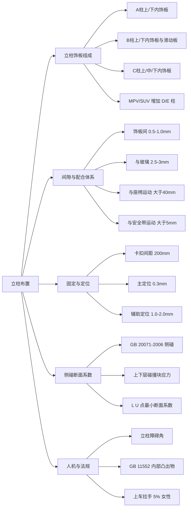
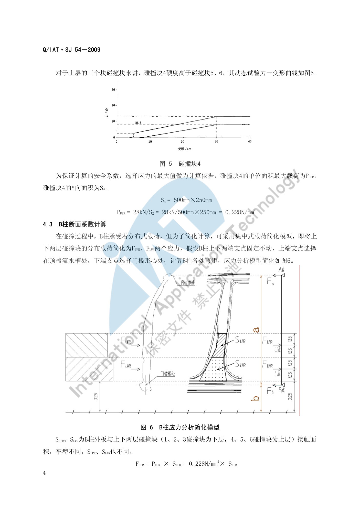

# 立柱布置

!!! quote "内容来源"
    本页正文抽取自《总布置》知识库中**可文本解析**的文件：
    `SJ 20-2008 立柱内饰板设计指导书`、`SJ 54-2009 侧碰对应B柱断面系数设定指导书`、
    `SJ 4-2008 轿车车门主断面设计流程`、`SJ 9-2008 A类汽车眼椭球、头部包络面设计规范`。
    企业规范编号原样保留。

## 立柱布置体系



## 概述

### 要点

**（1）立柱内饰板的基本组成**（`SJ 20-2008` §4）

一般轿车由以下部件组成：

| 立柱 | 部件 |
|---|---|
| A 柱 | A 立柱上内饰板、A 立柱下内饰板 |
| B 柱 | B 立柱上内饰板、**B 立柱上内饰板滑动板**、B 立柱下内饰板 |
| C 柱 | C 立柱上内饰板、C 立柱中内饰板、C 立柱下内饰板 |

MPV、SUV、商用车在一般轿车基础上**增加** D 立柱内饰板、E 立柱内饰板、A 立柱扬声器、上车拉手、侧滑门开关等部件。

**（2）设计基本要求**（`SJ 20-2008` §3）

| 要求 | 内容 |
|---|---|
| 法规 | 满足 `GB 11552-1999《轿车内部凸出物》`，技术上等效采用 74/60/EEC 及 78/632/EEC，满足圆角大小及凸出量要求 |
| 造型 | 在工程结构可实现、人机无问题的前提下尽可能满足造型意图 |
| 人机 | 满足总布置尺寸与人机工程分析要求 |
| 工艺 | 安装结构结合企业现有工艺；标准件首选客户企标件、其次国标件，**尽量统一、类型尽量少** |
| 安装维修 | 现场装配方便省时，进行安装模拟，安装与拆卸都可实现 |
| 成型 | 满足拔模、空间等工艺要求，并结合供应商工艺水平 |
| 定位可靠 | 卡扣结构设计合理，**预留合适的活动余量和钣金压缩余量** |
| 其他零件配合 | 与电器零件（按钮、线束、扬声器、感应器）、钣金及附件（如安全带）预留装配或配合空间 |

**（3）前期（造型）分析的定义项**（`SJ 20-2008` §5.1）

立柱内饰板的分块要求；包裹织物或皮革织物需求及范围；上车拉手借用或开发要求（形式、材质、皮纹）；A 柱高音扬声器要求；**安全带形式的定义要求**。

### 示例

立柱饰板的分块与造型强相关，但其**边界由功能件反推**：上车拉手、侧滑门开关、高音扬声器都挂在立柱饰板上，`SJ 20-2008` §3.9 要求在设计时预留与这些零件的装配或配合空间。

### 注意事项

- 立柱饰板的**滑动板**（B 立柱上内饰板滑动板）是为安全带高度调节器服务的，其行程必须与高调器行程匹配；
- 立柱是**侧碰的主要传力路径**，饰板下方往往布置气帘、安全带卷收器与加强板，饰板分块必须先锁定这些功能件位置。

## A 柱布置

### 要点

**（1）人机要求**（`SJ 20-2008` §5.2）

| 项目 | 要求 |
|---|---|
| 立柱障碍角 | 需满足要求（`SJ 20-2008` §5.2.1；具体限值见 [视野校核](../ergonomics/vision.md)：A 柱双目障碍角 < 6°，推荐 < 5°，建议设计 < 4.5°） |
| A 柱高音扬声器 | 需定义要求并满足人机听力效果 |
| 上车拉手位置 | 满足人机操作范围，**以 5% 女性为准** |

**（2）A 柱相关间隙**（`SJ 20-2008` §5.4）

| 对象 | 间隙 |
|---|---|
| A 柱上内饰板与 IP 的表面配合 | 一般 **0.5 mm** |
| A 柱下饰板与发罩扣手的表面间隙 | 一般 **2 mm** |
| 立柱内饰板与玻璃 | **2.5 mm–3 mm** |
| 立柱内饰板与顶棚（紧配合） | 过盈量 **0.5 mm–1.0 mm** |
| 立柱内饰板与密封条周边 | 间隙需合适、配合合理（§5.4.11） |

**（3）A 柱与侧碰/气帘**

A 柱上饰板区域是**侧气帘展开路径**的起始段，`SJ 20-2008` §5.5.2 要求零件的分块需考虑现场工装要求（例如**安全带的装配**）；气帘饰板通常需设计可撕裂缝或弱化结构，其分块也受此约束。

### 示例

A 柱上饰板与 IP 的 0.5 mm 配合、与发罩扣手的 2 mm 间隙，是"**A 柱与 IP 交界**"这一高可见区域的典型取值；`SJ 46-2009` §6.7 进一步给出 A 柱卡脚与仪表板外端 **0.2 mm 或 0 间隙**、内端与仪表板 **2 mm 装配空间间隙**的要求（见 [IP 布置](../ip-cnsl/ip.md)）。

### 注意事项

- **视野与碰撞保护是一对矛盾**：A 柱越粗对侧碰/翻滚越有利，但 A 柱障碍角越大、视野越差。`SJ 7-2008` 的设计目标是障碍角 < 5°（法规 6°），这个目标必须**在造型阶段就作为边界输入**，等到饰板设计阶段已无调整空间。
- A 柱外覆盖件是**钣金与饰板的双重约束区**：饰板边界受玻璃（2.5–3 mm）、密封条、顶棚（过盈 0.5–1.0 mm）三重约束。

## B 柱布置

### 要点

**（1）B 柱饰板相关要求**（`SJ 20-2008`）

| 项目 | 要求 |
|---|---|
| 组成 | B 立柱上内饰板、**B 立柱上内饰板滑动板**（配合安全带高调器）、B 立柱下内饰板 |
| 与安全带的运动间隙 | 一般 **> 5 mm**（§5.4.7） |
| 与座椅的运动间隙 | **> 40 mm**（§5.4.6） |
| 与门槛踏板（紧配合） | 表面间隙 **0.5 mm–1.0 mm**；搭接配合时阶差 **1 mm**、搭接长度 **> 20 mm**（§5.4.2） |
| 与电器开关表面 | 间隙一般 **2 mm**（§5.4.8） |
| 侧滑门开关（MPV 等） | 布置位置需满足人机操作范围（§5.2.4） |

**（2）B 柱与车门/门洞的配合**（`SJ 4-2008` §4.2.2）

| 项目 | 要求 |
|---|---|
| 前门门框与 B 柱、后门门框与 B 柱的所有间隙 | **> 8 mm** |
| 后门开启过程中后门前包边与 B 柱、铰链座的间隙 | **最小 > 3 mm** |
| 车门内板的铰链安装面、锁体安装面与 YZ 平面（冲压方向） | 成 **3° 以上**角度 |
| B 柱结构深宽比 | 应避免产生窄深结构（**深宽比 > 1.5**）而影响冲压工艺性 |

### 示例

B 柱断面的最大难点是**协调三个面**：前门锁安装面、后门铰链在 B 柱上的安装面、前门框密封面。`SJ 4-2008` §4.2.2.6 明确要求该断面需重点检查：前门关闭时锁的切入角、锁安装在门内板上的方便性、前门/后门里板的冲压工艺性、B 柱相应部位的冲压工艺性、锁扣的装配工艺性、后门开启过程中后门前包边与 B 柱及铰链座的间隙（最小 > 3 mm）、前后门的门洞与门框密封面位置。

### 注意事项

- **安全带佩戴舒适性校核属待人工补充项**：本页可引用的只有"立柱内饰板与安全带的运动间隙 > 5 mm"（`SJ 20-2008` §5.4.7）；安全带固定点与佩戴舒适性的具体判据需补充
  （可参考 `SJ 26-2008 座椅及座椅安全带设计指导书` 与 `GB 14167-2006 汽车安全带安装固定点`）。
- B 柱上饰板的**滑动板**与高调器是一套机构：滑动板的分块与运动空间必须与高调器全行程一致，否则安全带会与饰板干涉。

## C 柱布置

### 要点

**（1）组成与要求**（`SJ 20-2008` §4、§5）

| 项目 | 要求 |
|---|---|
| 组成 | C 立柱上内饰板、C 立柱中内饰板、C 立柱下内饰板（D/E 立柱同理） |
| 与玻璃的间隙 | **2.5 mm–3 mm**（§5.4.5） |
| 与顶棚（紧配合） | 过盈量 **0.5 mm–1.0 mm**（§5.4.3） |
| 与地毯 | 一般过盈量 **1.0 mm–2.0 mm**；**地毯长出立柱 10 mm**（§5.4.4） |
| 与扬声器的配合 | 扬声器面罩开孔面积 S **> 扬声器面积的 40%**，开孔 φ2 左右，孔边间距一般 **1 mm**（§5.3） |
| 内部凸出物 | 满足 `GB 11552-1999` 圆角与凸出量要求 |

**（2）顶棚与侧围边梁的配合**（`SJ 18-2008` §5.3.4，与 C 柱区域直接相关）

| 情形 | 顶篷与侧围边梁的配合间隙 |
|---|---|
| 之间未加装任何部件、不考虑侧碰 | **8 mm–15 mm** |
| 之间未加装任何部件、**考虑侧碰** | **25 mm 以上** |
| 之间加装**气帘** | 理想间隙 **> 3 mm**；特殊情况下局部不干涉即可（> 0 mm） |
| 之间安装**塑料护板** | 间隙 **0 mm** |
| 之间粘接**泡沫块** | 间隙 **0 mm** |

### 示例

顶篷与侧围边梁的四种配合情形直接决定了 C 柱上饰板的边界：


### 注意事项

- **后视野影响评估属待人工补充项**：已解析条款中未见 C/D 柱对后视野（含内后视镜间接视野）影响的量化判据；可借用的判据是 `SJ 14-2008` 的内后视镜视野要求与**遮挡限值（15% 以下）**，见 [视野校核](../ergonomics/vision.md)。
- C 柱下饰板与地毯的 1.0–2.0 mm 过盈、地毯长出立柱 10 mm，是**感知质量**类要求——过盈不足会出现缝隙漏白，过盈过大则饰板被顶起。

## 固定与定位

### 要点

**（1）固定方式**（`SJ 20-2008` §6.2.1）

| 项目 | 要求 |
|---|---|
| 主要固定方式 | 一般采用**塑料卡扣**，局部位置可用螺钉固定 |
| 卡扣固定间距 | 一般 **200 mm 左右** |
| 卡扣布置 | 均匀布置在立柱内饰板上 |
| 滑块空间 | 卡扣座外部要留出**大于卡扣座内部深度 2 倍以上**的距离作为滑块的滑动空间 |
| 窄长件处理 | 立柱内饰板宽度较窄、纵向只能布置一排固定点且没有限制旋转的部件时，一般设计一定数量的**限位加强筋**与钣金配合以限制旋转 |

**（2）定位设计**（`SJ 20-2008` §6.2.2）

| 项目 | 内容 |
|---|---|
| 定位方式 | 一般利用**卡扣座自身结构**定位 |
| 主定位 | **一个主定位控制 X、Z 方向**；主定位在高度方向上一般布置在**靠近配合边**的地方（特殊情况可调整） |
| 辅助定位 | **一个辅助定位控制 X 方向** |
| 主定位间隙 | 卡扣座开孔与定位卡扣处间隙一般为 **0.3 mm**（按精度不同调整） |
| 辅助定位间隙 | 在**非限位方向上**间隙为 **1.0 mm–2.0 mm** |

**（3）工艺要求**（§5.5）

| 项目 | 要求 |
|---|---|
| 拔模 | 整体表面出模要求沿拔模方向 **> 5°**，特殊情况下最小 **3°**；有特殊深度皮纹要求时 **> 7°** |
| 分块 | 考虑现场工装要求（如**安全带的装配**） |
| 供应商工艺 | 织物的覆盖范围与厚度、分块方式、卡扣座处滑块的滑动距离、加强筋的厚度（避免缩痕）与高度 |

### 示例

定位与固定的一体化设计是内饰件的通用做法：**主定位承担尺寸基准（0.3 mm 紧），辅助定位只控制方向（1.0–2.0 mm 松）**，其余固定点全部放开——这样的"一主一辅、其余浮动"方案可以把累积公差释放到饰板边缘，避免装配后出现翘边。

### 注意事项

- 卡扣间距 200 mm 不是任意值：间距过大饰板会离缝，过小则增加成本与装配工时；**表观曲率大的部位应加密**。
- 主定位孔取 0.3 mm 的紧配合意味着它同时是**检具基准**；一旦选错位置（例如选在易变形的悬臂端），测量结果将失去代表性。

## 侧碰断面系数

### 要点

**（1）断面系数的意义**（`SJ 54-2009` §3）

在整车开发流程的**概念设计阶段**，根据新车 B 柱形状、位置和尺寸，通过简化的力学模型计算 B 柱各位置弯矩，并**按照 B 柱不同位置设定不同的断面系数目标值**，使 B 柱变形趋势更合理，从而降低 B 柱的侵入速度和减小侵入量，减轻侧碰时对乘员的伤害。适用范围：**R 点与地面距离不超过 700 mm 的 M1 与 N1 类车辆**。

**（2）侧碰试验条件**（`SJ 54-2009` 表 1）

| 测试规程 | 障碍壁类型 | 障碍壁质量 | 撞击速度 | 撞击角度 | 碰撞假人 |
|---|---|---|---|---|---|
| GB 20071-2006 | 可变形移动障碍壁（MDB） | **950 kg** | **50 km/h** | **90°** | EuroSID-1 或 EuroSID-2 |

引用标准：`GB 20071-2006 汽车侧面碰撞的乘员保护`、`ECE R95`。

**（3）碰撞块与载荷**（§4.1～4.2）

- 可变形移动障碍壁的蜂窝铝碰撞块分**上下两层、共 6 块**；将碰撞块中心沿 Y 向对准**座椅滑轨中间位置**时的 H 点；
- `GB 20071-2006` 规定碰撞块最下沿距地面 **300 mm**，考虑试验误差可设定碰撞块 3D 数模最下沿距地面 **325 mm**（含 25 mm 试验公差）；
- 下层以**碰撞块 2** 最硬，其 Y 向面积 `S2 = 500 mm × 250 mm`，取最大应力 70 kN 计算：
  `PLWR = 70 kN / (500×250) = 0.56 N/mm²`；
- 上层以**碰撞块 4** 最硬，`S4 = 500 mm × 250 mm`，取最大应力 28 kN 计算：
  `PUPR = 28 kN / (500×250) = 0.228 N/mm²`。

**（4）计算模型与最小断面系数**（§4.3）

简化模型：把上下两层分布载荷简化为 `FUPR`、`FLWR` 两个集中力；假设 B 柱上下两端支点固定不动，**上端支点选在顶盖流水槽处，下端支点选在门槛形心处**，据此计算 B 柱各处弯矩。支承点距离参数为 a，L 点（下层碰撞块中心）距下端 b。

最小断面系数公式：

```text
ZLWR = MLWR / δ
     = (0.56 × SLWR × (a + b - 450) + 0.228 × SUPR × (a + b - 700)) × (450 - b) / (a × δ)
ZUPR = MUPR / δ
     = (0.56 × SLWR × (450 - b) + 0.228 × SUPR × (700 - b)) × (a + b - 700) / (a × δ)
```

其中 `SLWR`、`SUPR` 为 B 柱外板与上下两层碰撞块的接触面积（车型不同取值不同），δ 为钢板许用强度。

### 示例

**（5）车型算例**（`SJ 54-2009` §5）

| 车型 | SLWR (mm²) | SUPR (mm²) | a (mm) | b (mm) | ZLWR (mm³) | ZUPR (mm³) |
|---|---|---|---|---|---|---|
| 丰田 COROLLA | 5.2×10⁴ | 2.2×10⁴ | 1144 | 259 | **1.93×10⁴** | **1.77×10⁴** |
| 海马 M2 | 4.06×10⁴ | 2.46×10⁴ | 1166 | 246 | **1.68×10⁴** | **1.62×10⁴** |

校核方法：在 B 柱各位置剖切断面并计算其断面系数，与"最小断面系数要求线"比较，**要求各处的断面系数均位于要求线右侧**。

> 结论参考：COROLLA 的断面系数**远高于**应对 GB 20071-2006 的最低要求，原因是其并非仅针对中国市场设计，同时考虑出口对应美国 NAS 标准等，预留了足够的断面系数安全余量，因此在 C-NCAP 取得侧碰 16 分满分、整车 5 星成绩。



### 注意事项

- 断面系数是**概念设计阶段的"定量造型约束"**：它能直接告诉造型"B 柱这个高度上最小要多大截面"，避免在侧碰 CAE 阶段才发现结构不足而返工。
- 多车型沿用同一 B 柱断面时，应**按最不利的 R 点高度与轴距重新计算**——a、b 两个支点距离一变，最小断面系数要求线就整体移动。
- 断面系数只解决**弯曲溃变**问题；侧碰还包括侵入量、侵入速度、乘员伤害指标（假人响应）等，需与整车侧碰 CAE 联合评价。

## 待人工补充

!!! warning "本页待人工补充清单"
    - **安全带佩戴舒适性**的具体校核判据（本页仅有"与安全带运动间隙 > 5 mm"）；
    - **气帘展开路径**与饰板弱化结构的设计要求：已解析条款未涉及；
    - **C/D 柱对后视野的影响**的量化评估要求；
    - `SJ 55-2010 乘用车外后视镜设计指导书`、`SJ 29-2008 车身RPS设计指导书` 已下载，可作为立柱 RPS
      定位体系的补充（本页定位要求来自 `SJ 20-2008`）；
    - `SJ 54-2009` 附录中的图示（图7 断面系数对比曲线）为图片页，本页以算例数值代替；
    - 知识库中以下文件虽相关但因读取问题**未采用**：`AEM-A4-101 汽车座椅头枕性能校核规范`、
      `AEM-A4-102 汽车安全带固定点校核规范与流程`。

    建议：在 IMA 客户端中打开对应文件补充条款，或按"规范编号 + 页码"方式人工引用。

---

## 下一步阅读

- [门板布置](door.md)：车门系统、密封与强度要求
- [顶棚布置](roof.md)：顶篷、天窗与空气室盖板
- [校核标准](check.md)：门板&立柱&顶棚区域的校核清单
- [视野校核](../ergonomics/vision.md)：A 柱障碍角与盲区
