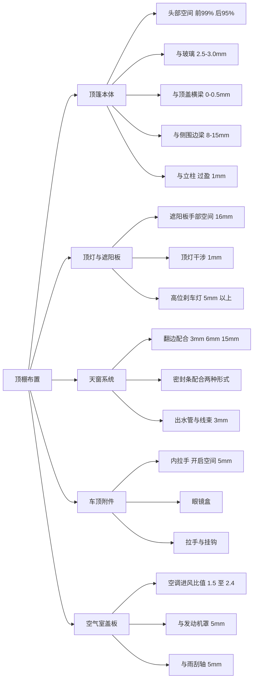
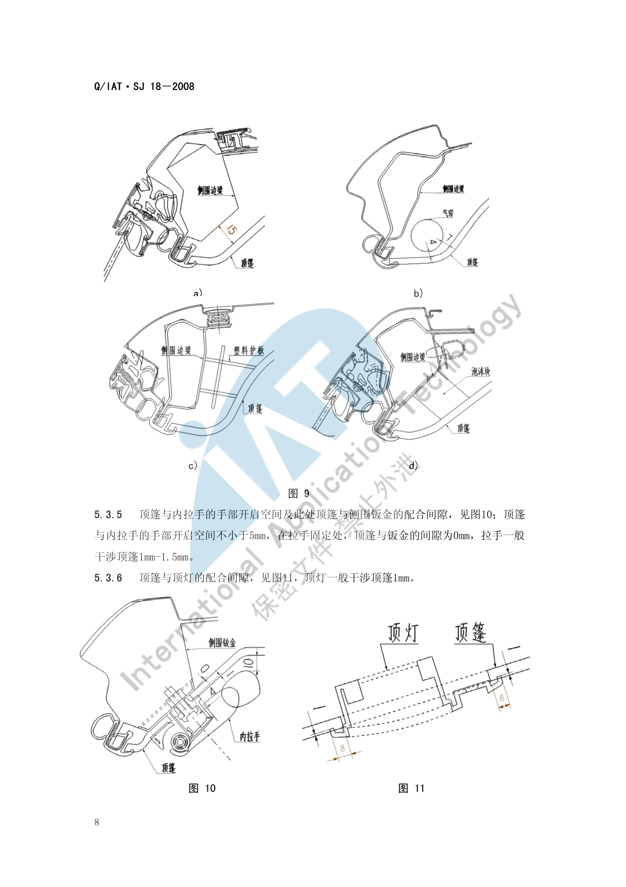
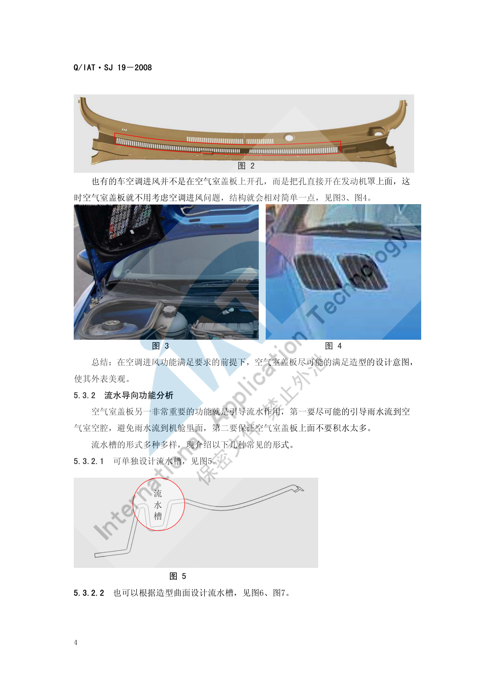

# 顶棚布置

!!! quote "内容来源"
    本页正文抽取自《总布置》知识库中**可文本解析**的文件：
    `SJ 18-2008 顶篷设计指导书`、`SJ 19-2008 空气室盖板设计指导书`、
    `SJ 9-2008 A类汽车眼椭球、头部包络面设计规范`。
    企业规范编号原样保留。

## 顶棚布置体系

## 概述

### 要点

**（1）设计基本要求**（`SJ 18-2008` §3）

| 要求 | 内容 |
|---|---|
| 满足法规 | 满足 `GB 11552-1999《轿车内部凸出物》`（技术上等效采用 74/60/EEC 及 78/632/EEC），满足法规规定的圆角大小及凸出量要求 |
| 满足造型 | 在工程结构可实现、人机无问题的前提下尽可能满足造型意图 |
| 满足人机 | 满足总布置尺寸与人机工程分析要求 |
| 标准件 | 首选客户企标件、其次国标件，尽量统一、类型尽量少 |
| 安装维修 | 现场装配方便省时，进行**安装模拟**，安装与拆卸都可实现 |
| 成型工艺性 | 满足拔模、空间等工艺要求，结合供应商工艺水平（**顶篷长度过大模具不能实现时考虑分块**） |
| 安装准确性及可靠性 | 利用定位点保证安装可靠性，卡扣结构合理，预留合适的活动余量与钣金压缩余量 |

**（2）顶篷结构组成**（`SJ 18-2008` §4、§5.4.1）

- 材料结构：一般由**饰布材料 + 隔热吸音层 + 增强层**组成，**模压成型**；
- 分区结构（以 1～9 编号表示配合部位）：1、2、3 与**立柱**配合；4 与**前顶灯**配合；5 与**刹车灯**配合；6 为**顶棚固定点安装孔**；7 与**拉手**配合；8 与**遮阳板**配合；9 与**天窗**配合；
- 分非天窗版顶篷与天窗版顶篷两种基本形式。

**（3）前期（造型）分析的定义要求检查**（`SJ 18-2008` §5.1 共 12 项）

顶篷材料与料厚、分块要求；顶篷毛毡定义；根据碰撞要求安装**侧气帘、塑料护板或粘接泡沫块**的定义要求；遮阳板；顶灯；眼镜盒；内拉手；内扶手；高位刹车灯；遮阳板照明灯；**天窗及出水管**；电器线束和其他电器元件。

**（4）工艺要求**（§5.4）

| 项目 | 要求 |
|---|---|
| 材料 | 饰布 + 隔热吸音层 + 增强层，模压成型 |
| 拔模 | 整体表面的 **Z 向拔模角度 3°–5°** |
| 分块 | 考虑供应商工艺水平，顶篷长度过大模具不能实现时考虑分块设计 |

### 示例

顶篷与侧围边梁的配合是"侧碰—气帘—内饰"三者交汇的典型位置，共有四种结构情形：

| 情形 | 顶篷与侧围边梁间隙 |
|---|---|
| 未加装任何部件、不考虑侧碰 | **8 mm–15 mm** |
| 未加装任何部件、**考虑侧碰** | **25 mm 以上** |
| 加装**气帘** | 理想 **> 3 mm**；特殊情况下局部不干涉即可（> 0 mm） |
| 安装**塑料护板** | **0 mm** |
| 粘接**泡沫块** | **0 mm** |

### 注意事项

- **下垂量与异响控制属待人工补充项**：已解析条款给出了防下沉措施（如高位刹车灯护板为一体时"只需增加粘扣结构，防止顶篷下沉"），但未见下垂量的量化限值与异响判据；
- 顶篷是**软材料**，所有配合都必须按"有过盈或有间隙"分别定义，不能按刚性件思维处理。

## 顶棚本体

### 要点

**（1）头部空间与乘坐空间**（`SJ 18-2008` §5.2.1）

| 空间项 | 定义 |
|---|---|
| 前乘客区头部空间 | 前乘客区顶篷距 **99%** 百分位人体头部包络线的**最小距离** |
| 后乘客区头部空间 | 后乘客区顶篷距 **95%** 百分位人体头部包络线的**最小距离** |
| 前/后乘客区乘坐空间 | 过 H 点作与 zx 面平行的平面，在该平面内过 H 点作与竖直方向成 **8°** 的直线，其与顶篷的交点到 H 点的距离 |

> `SJ 18-2008` 明确标注上述头部空间与乘坐空间**"此数值为经验数值"**。

头部包络面与内饰的间隙以尺寸代码表达：**W27**（斜向 30° 方向）、**W35**（水平）、**H35**（垂直）、**H61**（有效头部空间），详见 [空间与进出便利性](../ergonomics/comfort.md)。

**（2）视野要求**（§5.2.2、§5.2.3）

| 要求 | 内容 |
|---|---|
| 前视野 | 顶篷**不能遮挡前视野**；特殊情况下为满足前顶灯安装等要求，在客户确认下此处顶篷允许遮挡视野线，**其他部位不能遮挡** |
| 间接后视野 | 顶篷**不能遮挡间接后视野**；但**高位刹车灯布置在后风挡玻璃上部**时，顶篷会做出与刹车灯相配合的结构，此时**与后刹车灯配合处允许遮挡**间接后视野 |

**（3）与玻璃的配合间隙**（§5.3.1）

| 项目 | 要求 |
|---|---|
| 顶篷与玻璃（前后风挡、侧围角窗等） | 配合间隙 **2.5 mm–3.0 mm**，且要求**均匀一致** |
| 与玻璃黑区 | 保证 **H 值 > 2 mm**、**L 值 > 5 mm** |
| 与风窗止口边 | 一般 **不大于 3 mm** |
| 配合角度 | 顶篷配合边一般与玻璃垂直；但前风挡玻璃处为美观（使人眼看不到顶棚边界）配合角度会相应调整 |

**（4）与密封条的配合**（§5.3.2）

| 密封条形式 | 要求 |
|---|---|
| **有"翅膀"翻边** | 顶篷距密封条本体 **2 mm 左右**；保证"翅膀"工作状态时覆盖顶棚 **5 mm 以上**；尺寸 A（顶篷底边与密封条本体距离，非标注值）一般 **1.5 mm–2 mm**；尺寸 C（顶篷边界到密封条密封翻边距离，非标注值）一般 **1.0 mm–1.5 mm** |
| **无"翅膀"翻边** | 顶篷与密封条 **0 接触**配合，但应与密封条**圆角区保持 2 mm 以上距离**，防止顶棚下沉后配合漏空 |

> 结论：顶篷边界由 A、B、C、D 四个值确定后位置即相对固定，**顶篷边界与密封条形式强相关**——不同密封条形式，顶篷边界就不同。

**（5）与顶盖横梁的配合**（§5.3.3）

顶篷安装结构处与横梁的间隙 **0 mm ~ −0.5 mm**；**无安装结构处间隙要大于 3 mm**。

**（6）固定点与定位点的设计**（§6.2）

| 项目 | 要求 |
|---|---|
| 固定方式 | 一般采用**塑料卡扣直接卡接到钣金**上，通过遮阳板、顶灯、内拉手等安装把顶篷**完全固定**到钣金；为美观可采用**粘扣结构**、顶篷内粘接钣金支架加卡扣、顶篷内粘接塑料卡接结构，或上述混用 |
| 安装点布置 | 安装点应布置在**顶盖横梁或钣金支架**上，**每个横梁上布置 1～2 个**，均匀布置且**左右对称** |
| 第一根横梁 | 已安装遮阳板和前顶灯，**一般不需布置安装点**（个别车型为牢固也有加的） |
| 最后一根横梁 | 一般布置 **3～4 个**安装点；当有**高位刹车灯**与顶篷配合时一般布置 **2 个** |
| 天窗车型 | 当有天窗、**后阅读灯布置到横梁位置**时，横梁上一般**不再布置安装点** |
| 角窗配合 | 顶篷与角窗配合时，一般在**侧围边梁**上要布置安装点 |
| 高档车 | 或顶篷上安装空调出风口、较多顶灯时，应考虑**尽量减少或不外露**安装点 |
| 商务车分块 | 根据顶篷长度与供应商工艺水平采取分块安装，此处一般布置 **5 个以上**安装点 |
| 主定位 | 控制 **X、Y 方向**，开孔与卡扣安装部位**半径差 0.3 mm**；一般为**最后排安装孔**，优先选择中间的孔 |
| 副定位 | 控制 **Y 方向**，开孔在 **X 方向**与卡扣安装部位半径差 **1.5 mm–2 mm**，在 **Y 方向**差值 **0.3 mm**；一般为**最前排安装孔**，与主定位孔在**同一侧** |
| 备选主定位 | 有时也把**遮阳板的安装孔**设定为主定位孔，最后排安装孔与之为同侧的孔设定为副定位孔 |
| 非定位孔 | 开孔与卡扣安装部位**直径差 1.5 mm–2 mm** |

**（7）与立柱的配合结构**（§6.3）

| 项目 | 要求 |
|---|---|
| 通用规则 | 立柱装饰板**压顶棚过盈 1 mm**；立柱**盖住顶篷的长度要求 8 mm 以上** |
| 成型结构配合 | 顶篷与立柱间隙 **1 mm**，面差 **0 mm**，顶篷翻边长度 **> 8 mm**，立柱干涉顶篷 1 mm。优点：配合美观紧凑；缺点：装配精度要求高（一旦有误差不是立柱饰板翘起就是间隙过大） |
| 搭接配合 | 结构简单、容易保证外观质量，但**面差较大**（可通过结构或料厚减薄改善）；**目前多数车型采用** |
| 防变形 | 顶篷距钣金较远时，一般在配合结构两侧**粘接泡沫块**支撑到钣金上，防止顶篷变形 |

### 示例

顶篷固定点的定位方案采用与仪表板相同的"一主一副 + 其余浮动"思路：**主定位孔 (0.3 mm) 放最后排、副定位孔 (X 向 1.5–2 mm，Y 向 0.3 mm) 放最前排同侧**，其余为非定位孔（直径差 1.5–2 mm）。

### 注意事项

- 头部空间是**经验数值**，且**带天窗会显著压缩头部空间**：`SJ 9-2008` 附录 A 显示天窗版车型 W35 仅 18 mm，而非天窗版为 47–76 mm；有天窗车型 H61 也明显偏低。项目确定天窗配置后应在造型阶段就预留空间。
- 前视野与后视野的"允许遮挡"是**有条件的例外**：前者需**客户确认**，后者仅限**高位刹车灯配合处**，不能当作通用豁免。

## 顶灯与遮阳板

### 要点

**（1）遮阳板**（`SJ 18-2008` §5.3.7、§6.4）

| 项目 | 要求 |
|---|---|
| 前端配合间隙 | 顶篷与遮阳板前端的配合间隙为 **0 mm** |
| 后端运动间隙 | 遮阳板旋转中心到顶篷的距离要**大于遮阳板后端的旋转半径 2 mm 以上** |
| 手部开启空间 | ① 遮阳板高出顶篷自身厚度时**不用考虑**开启空间；② 高出约 **1/2** 时要留 **16 mm 以上**手部开启空间；③ 低于顶篷或与顶篷平齐时要留 **16 mm 以上**手部开启空间 |
| 安装结构 | 遮阳板安装支座与顶篷配合为**凹台**，形状与安装支座相同，**周圈配合间隙一般 5 mm–8 mm** |
| 支座与顶篷 | 安装支座一般**干涉顶篷外表面 1 mm–1.5 mm** |
| 凹台与横梁/支架 | 凹台的外表面与顶盖横梁或安装支架间隙为 **0 mm**，因此**凹台料厚取决于安装支架与钣金的距离** |
| 开孔 | 一般开孔形状与安装支座形状相同；开孔尺寸要保证安装支架**搭接顶篷 5 mm 左右**；用遮阳板安装孔作定位孔时，**首先要保证开孔尺寸符合定位要求** |

**（2）顶灯**（§5.3.6、§6.5.1）

| 项目 | 要求 |
|---|---|
| 与顶篷干涉 | 顶灯一般**干涉顶篷 1 mm** |
| 开孔 | 开孔尺寸要保证灯**搭接顶篷 8 mm 以上** |
| 防变形 | 此处顶篷与钣金距离过大时，应**粘接泡沫块**撑到钣金上，防止顶篷变形 |

**（3）眼镜盒**（§5.3.8、§6.5.3）

与前顶灯安装在一起时，与顶篷的配合间隙参考顶灯（图 11）；安装在司机内拉手的位置时，与顶篷的配合间隙参考内拉手（图 10）。

**（4）高位刹车灯**（§5.3.10、§6.6）

| 项目 | 要求 |
|---|---|
| 与顶篷配合间隙 | **5 mm 以上**；特殊情况下局部只要不干涉即可（此结构**不利于高位刹车灯的维修**）；加装塑料护盖时不用考虑间隙问题 |
| 一体式护板 | 当高位刹车灯护板与顶篷为一体时，只需**增加粘扣结构，防止顶篷下沉** |
| 加装塑料护板 | 护板**干涉顶篷 1 mm**，开孔尺寸保证护板**搭接顶篷 8 mm 以上** |

### 示例

遮阳板的三种手部开启空间情形，本质是"遮阳板相对顶篷外表面的相对高度"决定了手指能否插入——这也是为什么**支座凹台料厚受制于安装支架与钣金的距离**：料厚不够就要反推调整钣金安装结构、遮阳板位置或造型。

### 注意事项

- **遮阳板翻转干涉属高频问题**：需要同时满足"前端 0 mm 配合"与"后端旋转半径 + 2 mm"，两端要求方向相反，**必须用全行程运动包络校核**。
- 高位刹车灯的"局部不干涉即可"是**已知的维修性妥协**，`SJ 18-2008` 明确写了"此结构不利于高位刹车灯的维修"，采用时应在设计文件中留痕。

## 天窗系统

### 要点

**（1）天窗开孔处的两种配合形式**（`SJ 18-2008` §5.3.9）

**形式一：翻边配合**

| 项目 | 要求 |
|---|---|
| 翻边侧面距天窗 | **3 mm** |
| 翻边顶部距天窗 | 一般 **不小于 6 mm** |
| 翻边高度 | 一般**不小于 15 mm**；当翻边高度小于 15 mm 时，可适当调整翻边顶部到天窗的距离以保证翻边高度 > 15 mm，但**此距离不能小于 3 mm** |
| 固定方式 | 顶篷与天窗固定一般采用**粘扣**形式；此处顶篷与天窗间隙**不小于 8 mm**，且要保证间隙一致，最好顶篷与天窗配合面**平行或保证较小角度** |

**形式二：密封条配合**

| 型式 | 要求 |
|---|---|
| 第一种 | 顶篷与天窗**零接触**配合 |
| 第二种 | 顶篷与天窗配合**有间隙**（示例 2 mm） |
| 说明 | 采用密封条配合时，顶篷与天窗的配合间隙**取决于密封条的形式** |

**其他部位**：除上述部位外，顶篷与天窗其他部位配合间隙要**保证不小于 3 mm**；特殊情况下局部间隙可为 **2 mm**。

**（2）出水管、线束与电器元件**（§5.3.11）

| 对象 | 一般要求 | 特殊情况 |
|---|---|---|
| 天窗出水管、电器线束和电器元件 | 间隙一般 **不小于 3 mm** | 与出水管和线束局部可为 **1 mm**，甚至不干涉即可；与电器元件局部可为 **2 mm** |

**（3）定义要求**（§5.1.11、§5.1.12）

天窗及出水管的定义要求；电器线束和其他电器元件的定义要求，需在前期造型分析阶段明确。

### 示例

天窗配合的核心矛盾是**头部空间损失与配合可靠性**：翻边高度 ≥ 15 mm 是为了保证足够的搭接与密封，但翻边越高、顶篷下表面越低；`SJ 9-2008` 附录 A 的实测数据正说明了这一点——天窗版车型的 W35（水平头部间隙）远小于非天窗版。

### 注意事项

- **排水可靠性属待人工补充项**：已解析条款只给出出水管间隙（≥ 3 mm）与定义要求，未见**排水路径、坡度与流量校核**的量化条款；
- 天窗车型还需注意**后阅读灯布置在横梁位置时不再布置安装点**（§6.2.1），这会直接影响顶篷的固定方案，属于"天窗与电器布置的耦合约束"。

## 车顶附件

### 要点

**（1）内拉手**（`SJ 18-2008` §5.3.5、§6.5.2）

| 项目 | 要求 |
|---|---|
| 手部开启空间 | 顶篷与内拉手的手部开启空间**不小于 5 mm** |
| 固定处间隙 | 在拉手固定处，顶篷与钣金的间隙为 **0 mm** |
| 干涉量 | 拉手一般**干涉顶篷 1 mm–1.5 mm** |
| 开孔 | 开孔尺寸要保证内拉手安装座**搭接顶篷 4 mm 左右**；此处顶篷料厚取决于内拉手安装支座与钣金的距离，不能满足本身料厚时可调整钣金安装结构、内拉手位置或造型，特殊情况下可做**减薄处理** |

**（2）前期需定义的车顶附件**（§5.1）

顶篷毛毡；根据碰撞要求安装**侧气帘/塑料护板/粘接泡沫块**；遮阳板；顶灯；**眼镜盒**；内拉手；**内扶手**；高位刹车灯；遮阳板照明灯；天窗及出水管；电器线束和其他电器元件。

**（3）与安全带的关联**（`SJ 20-2008`）

立柱内饰板（含 B 立柱上内饰板滑动板）需与**安全带形式**联动定义；立柱内饰板与安全带的运动间隙一般 **> 5 mm**。

### 示例

车顶附件的共同特征是"**都挂在顶篷上，且都以钣金为最终承力体**"：顶篷本身是软材料，所有附件的安装点都必须通过粘接支架、卡扣或泡沫块把载荷传到顶盖横梁或钣金支架上。

### 注意事项

- **附件承重与固定强度属待人工补充项**：已解析条款未见车顶附件（拉手、衣帽钩、行李架）的承重与固定强度要求；
- **天线、行李架**在知识库中无对应条款（`SJ 7-2008` 仅把车外无线电天线列为视野障碍的**例外项**：直径 < 0.5 mm 嵌入式天线或 < 1.0 mm 印刷式天线不认为是视野障碍），需人工补充。

## 空气室盖板

### 要点

**（1）功能与法规**（`SJ 19-2008` §3.1、§4）

| 项目 | 内容 |
|---|---|
| 法规 | 满足 `GB 11566-1995 轿车外部凸出物` |
| 主要功能 | ① 装饰作用；② **空调进风**；③ **前风挡玻璃的流水导向**；④ **密封发动机舱** |
| 组成 | 空气室盖板本体、卡扣、密封条 |

**（2）空调进风功能**（§5.3.1）

| 状态 | 面积比值要求 |
|---|---|
| **理想状态** | 空气室盖板进风口总面积 / 空气室腔截面积 / 空调进风口面积 **≥ 2.4 / 1.6 / 1**（经验证此比值绝对满足空调进风要求） |
| **实际状态** | 空气室盖板进风口总面积 / 空调进风口面积 **≥ 1.5 / 1**（受盖板表面积影响，国内多数车型难以达到理想比值，达到实际比值即基本满足要求） |

两条开孔禁则：

- **空调进风口上方不能开孔**，开孔位置一般在 Y 向上与其间距**不能小于 80 mm**；
- **雨刮电机的正上方也不能开孔**。

若仅在盖板上表面开孔不能满足空调进风需要，需做出合理结构**扩大盖板面积**以开出足够的孔；也有车型把孔直接开在**发动机罩**上，此时空气室盖板可不考虑空调进风问题，结构相对简单。

**（3）流水导向功能**（§5.3.2）

三种常见形式：① 单独设计流水槽；② 根据造型曲面设计流水槽；③ 不设计流水槽，靠空气室盖板与发动机罩内板之间的**密封条**引导流水（对密封条防水性要求高，一般很少采用）。第 1、2 种较常见，且盖板与发动机罩之间的密封条还可起**第二次防水**作用。

**（4）间隙与边界要求**（§5.4）

| 对象 | 间隙要求 |
|---|---|
| 与发动机罩的运动间隙 | **≥ 5 mm** |
| 与发动机罩铰链的运动间隙 | **≥ 6 mm**（相对更大） |
| 与翼子板、侧围外板 | **0 mm–2 mm** |
| 与前风挡玻璃 | 一般**过盈配合，过盈量 1 mm**（可视结构不同而定） |
| 与雨刮旋转轴、雨刮摇臂的运动间隙 | **不能小于 5 mm** |
| 与雨刮电机的安全间隙 | **不能小于 5 mm** |

此外，空气室盖板**要满足前方视野要求，不能高于前方下视野**（§5.2）。

**（5）RPS 与工艺**（§3.8、§5.5）

- RPS 点适用于零件或装配部件在产品形成所有阶段中的尺寸标注、制造和检验。设计时应：① 尽可能早地与参与设计、模具开发、生产、检验的各部门商定 RPS 基准点；② RPS 点须定位在零件的**稳定部位**；③ 若零件提不出特征孔，必须选择**平面或棱边**作为 RPS 点；
- 拔模：整体表面拔模角度 **> 5°**，特殊情况下最小 **3°**；
- 加强筋根部厚度**不能超过本体厚度的 1/3 左右**（避免缩痕）。

### 示例

空气室盖板为满足空调进风而"扩孔"的典型结构——当上表面开孔不足时，需通过结构扩大盖板面积以开出足够的孔：

### 注意事项

- 空气室盖板跨越"**前风窗—雨刮—发动机罩—翼子板**"四个系统，是前部区域间隙最密集的零件之一，其间隙体系（5/6/0–2/过盈1/5/5 mm）应作为整体一次性冻结；
- 若采用"孔开在发动机罩上"的方案，虽然简化了盖板结构，但把空调进风的任务转移给了发动机罩，**系统级责任随之转移**，需在方案阶段明确。

## 待人工补充

!!! warning "本页待人工补充清单"
    - **顶篷下垂量的量化限值**与**异响判据**（知识库中仅有防下沉的结构措施）；
    - **天窗排水路径、坡度与流量校核**要求；
    - **车顶附件（拉手、衣帽钩、行李架）的承重与固定强度**要求；
    - **天线（含鲨鱼鳍）布置**要求：知识库中仅在 `SJ 7-2008` 视野条款中作为例外项出现；
    - `SJ 18-2008` 的图 22（顶篷设计步骤图）、图 17（顶篷安装点布置示图集）、图 21（遮阳板安装结构）
      等为图片页，相关结构细节需人工查阅原图；
    - 知识库中以下文件虽相关但因读取问题**未采用**：`AEM-A5-501 上下车方便性校核规范`、
      `AEM-A0-005 概念草图阶段总布置工作手册`。

    建议：在 IMA 客户端中打开对应文件补充条款，或按"规范编号 + 页码"方式人工引用。

---

## 下一步阅读

- [门板布置](door.md)：车门系统、密封与强度要求
- [立柱布置](pillar.md)：A/B/C 柱饰板与侧碰断面系数
- [校核标准](check.md)：门板&立柱&顶棚区域的校核清单
- [空间与进出便利性](../ergonomics/comfort.md)：头部空间与头部包络面
