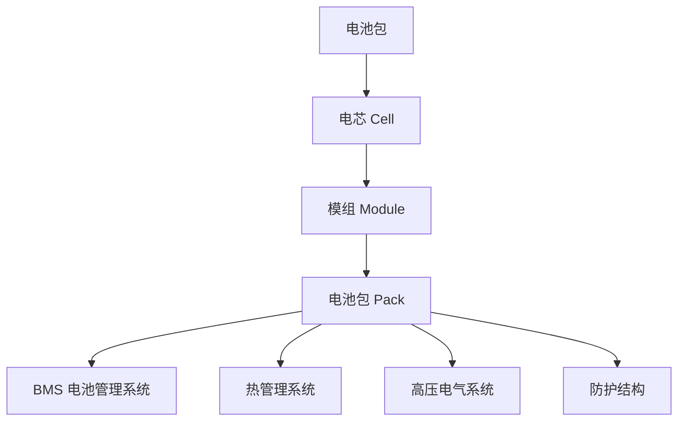
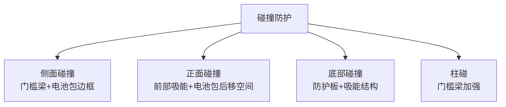
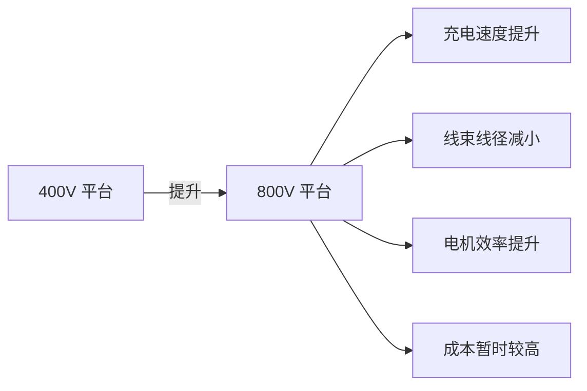

# 电池布置

## 概述

动力电池是纯电动车的核心总成，占整车成本的 30-40%、质量的 20-35%。电池布置直接决定**续航、安全、空间和操控**，是电动车总布置的核心课题。

## 电池包结构



| 层级 | 说明 |
|------|------|
| 电芯 | 最小单元（如 18650/21700/方形/软包） |
| 模组 | 多个电芯串联/并联 |
| 电池包 | 多个模组 + BMS + 热管理 + 外壳 |

## 电池包布置形式

### 1. 底盘电池（主流）

```
┌──────────────────────────────────────┐
│              乘员舱                    │
│                                      │
│  ┌──────────────────────────────┐    │
│  │         电池包                │    │
│  │    （平整铺在底盘）            │    │
│  └──────────────────────────────┘    │
│  ◉─────────────◉──────────────◉    │
│  前轴            后轴                │
└──────────────────────────────────────┘
```

| 优点 | 缺点 |
|------|------|
| 质心低，操稳好 | 离地间隙受限 |
| 空间利用率高 | 碰撞防护需加强 |
| 轴荷可均衡 | 底盘需平整 |

### 2. T 型电池

```
┌──────────────────────────────────────┐
│              乘员舱                    │
│  ┌──────┐    ┌──────┐                │
│  │      │    │      │                │
│  │ 电池  │────│ 电池  │  ← T 型布置    │
│  │      │    │      │                │
│  └──────┘    └──────┘                │
│       │                              │
│       └── 中央通道电池                 │
│  ◉─────────────◉──────────────◉    │
└──────────────────────────────────────┘
```

| 应用 | 说明 |
|------|------|
| 早期电动车 | 基于燃油车平台改造 |
| 缺点 | 中央通道侵占乘员舱空间 |

### 3. 滑板底盘

```
┌──────────────────────────────────────┐
│         上车体（可更换）               │
│  ┌──────────────────────────────┐    │
│  │  滑板底盘（电池+电驱+底盘）    │    │
│  └──────────────────────────────┘    │
└──────────────────────────────────────┘
```

| 特点 | 说明 |
|------|------|
| 电池+底盘一体化 | 电池作为结构的一部分 |
| 上车体自由 | 可配不同车型 |
| 灵活 | 适合多车型平台 |

## 电池包尺寸与容量

### 容量与续航关系

```
续航里程 = 电池能量 / 综合电耗

电池能量 = 电池容量 × 额定电压

例：60kWh 电池，15kWh/100km 电耗
续航 = 60 / 0.15 = 400km
```

| 续航目标 | 电池容量 | 电池包体积 |
|----------|----------|------------|
| 300km | 30-40kWh | 200-280L |
| 400km | 45-55kWh | 300-380L |
| 500km | 60-70kWh | 400-480L |
| 600km | 75-90kWh | 500-600L |
| 800km+ | 100kWh+ | 680L+ |

> 假设电芯能量密度 250Wh/kg，包级 180Wh/kg。

### 电池包尺寸约束

```
电池包可用空间：
    ┌──────────────────────────────────┐
    │  ← 宽度：受轮距限制                │
    │  ← 长度：受轴距限制                │
    │  ← 高度：受离地间隙限制            │
    └──────────────────────────────────┘
```

| 约束 | 说明 |
|------|------|
| 宽度 | 左右轮罩之间 |
| 长度 | 前后悬架之间 |
| 高度 | 地板上方 + 离地间隙 |
| 形状 | 避让悬架、排气管等 |

## 电池包与整车协调

### 1. 离地间隙

```
    底盘
    ─────────────
         │ ← 电池包高度
         │
    ───────────── ← 电池包底部
         │ ← 离地间隙
    ═════════════ 地面
```

| 要求 | 说明 |
|------|------|
| 最小离地间隙 | ≥ 120-150mm（轿车） |
| 涉水深度 | 电池包底部需高于涉水线 |
| 防磕碰 | 底部防护板 |

!!! warning "电池包离地间隙"
    电池包离地间隙不足会导致：
    - 托底磕碰电池（安全隐患）
    - 涉水短路风险
    - 通过性差

### 2. 碰撞安全



| 碰撞工况 | 防护要求 |
|----------|----------|
| 正面碰撞 | 电池包不受直接冲击 |
| 侧面碰撞 | 门槛梁吸收能量，电池包不变形 |
| 底部碰撞 | 防护板防止电池直接受击 |
| 柱碰 | 电池包有足够侧面强度 |

### 3. 热安全

| 要求 | 法规（GB 38031） |
|------|-------------------|
| 热扩散 | 单体热失控后 5 分钟内不蔓延到乘员舱 |
| 挤压 | 不起火不爆炸 |
| 针刺 | 不起火不爆炸 |
| 过充 | 不起火不爆炸 |

## CTP / CTB 技术

### CTP（Cell to Pack）

```
传统：电芯 → 模组 → 电池包
CTP：  电芯 → 电池包（省去模组）
```

| 优点 | 说明 |
|------|------|
| 体积利用率提升 | 15-20% |
| 零件减少 | 模组结构件省去 |
| 能量密度提升 | 10-15% |

### CTB（Cell to Body）

```
CTB：电芯 → 电池包（作为车身结构的一部分）
```

| 特点 | 说明 |
|------|------|
| 电池上盖 = 车身地板 | 集成度最高 |
| 车身刚度提升 | 电池包参与承载 |
| 代表 | 比亚迪刀片电池 CTB |

## 电池热管理

### 冷却方式

| 方式 | 说明 | 应用 |
|------|------|------|
| 自然冷却 | 无主动冷却 | 低功率 |
| 风冷 | 风扇吹风 | 部分 PHEV |
| 液冷 | 冷却液循环 | 主流 |
| 浸没式冷却 | 电芯浸入冷却液 | 高性能 |

### 液冷系统布置

```
    冷却液入口
        │
    ┌───┴───────────────────┐
    │  ═══════════════════   │ ← 冷却板/冷却管
    │  电池电芯              │
    │  ═══════════════════   │
    └───────────────────────┘
        │
    冷却液出口 → 散热器
```

| 要点 | 说明 |
|------|------|
| 冷却均匀 | 各电芯温差 ≤ 5°C |
| 冷却板位置 | 电芯底部或侧面 |
| 管路密封 | 防漏液 |
| 加热 | 冬季电池预热（PTC/热泵） |

!!! tip "电池温度管理"
    - 最佳工作温度：20-35°C
    - 低温：充电慢、续航降，需加热
    - 高温：寿命降、安全风险，需冷却

## 电池包布置参数表

| 参数 | 典型值 |
|------|--------|
| 电池容量 | 60-80 kWh |
| 额定电压 | 350-400V（400V 平台）/ 700-800V（800V 平台） |
| 电池包质量 | 400-600 kg |
| 电池包尺寸 | 1600×1300×140 mm（参考） |
| 离地间隙 | ≥ 140mm |
| 能量密度（包级） | 160-200 Wh/kg |
| 冷却方式 | 液冷 |

## 800V 高压平台



| 对比 | 400V | 800V |
|------|------|------|
| 充电功率 | 150kW | 350kW+ |
| 充电时间 | 30-40min(10-80%) | 15-20min(10-80%) |
| 线束 | 较粗 | 较细 |
| 成本 | 低 | 高（暂时） |
| 应用 | 主流 | 高端车趋势 |

## 电池布置发展趋势

| 趋势 | 说明 |
|------|------|
| CTP/CTB | 无模组化，提升利用率 |
| 800V | 高压平台，快充 |
| 固态电池 | 更高能量密度、更安全 |
| 滑板底盘 | 电池+底盘一体化 |
| 换电 | 电池可快速更换 |

---

## 下一步阅读

- [热管理系统](thermal.md）：电池热管理详解
- [线束布置](wiring.md）：高压线束
- [纯电动平台](../cases/ev.md）：电动车总布置案例
