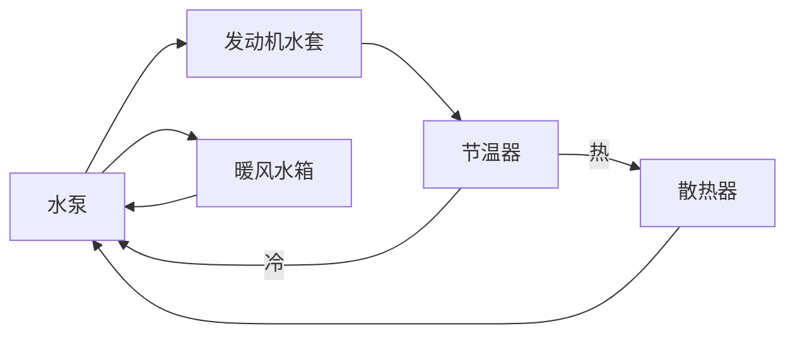
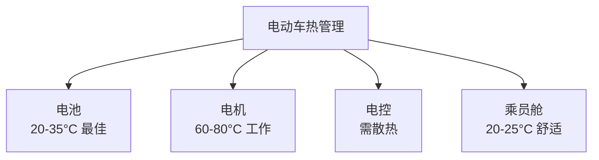
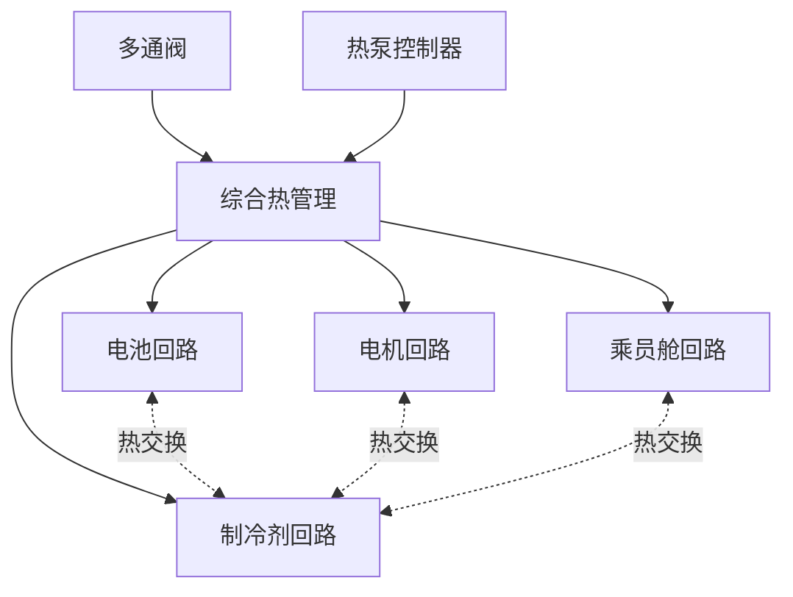
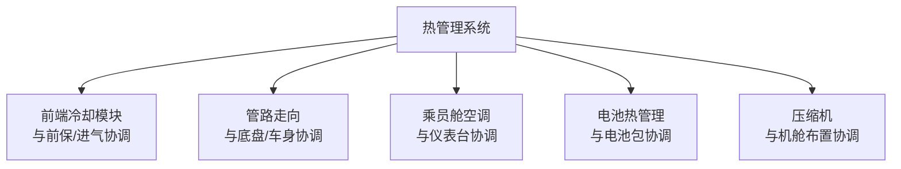

# 热管理系统

## 概述

热管理系统负责维持各部件在**最佳工作温度范围**。燃油车以发动机冷却为主，电动车则需统筹电池、电机、电控和乘员舱的综合热管理，复杂度大幅提升。

## 燃油车热管理

### 发动机冷却系统



| 部件 | 功能 |
|------|------|
| 水泵 | 驱动冷却液循环 |
| 散热器 | 散热给空气 |
| 节温器 | 控制冷却液大/小循环 |
| 暖风水箱 | 为乘员舱供暖 |
| 膨胀罐 | 补液排气 |
| 电子风扇 | 辅助散热 |

### 冷却液循环

```
低温（暖机）：
    水泵 → 发动机 → 节温器（关闭）→ 水泵
    （小循环，快速暖机）

高温（正常）：
    水泵 → 发动机 → 节温器（开启）→ 散热器 → 水泵
    （大循环，散热）
```

## 电动车热管理

### 热管理对象



| 对象 | 最佳温度 | 管理需求 |
|------|----------|----------|
| 电池 | 20-35°C | 冷却+加热 |
| 电机 | ≤80°C | 冷却 |
| 电控 | ≤65°C | 冷却 |
| 乘员舱 | 20-25°C | 制冷+制热 |

### 电池热管理

#### 冷却

| 方式 | 说明 |
|------|------|
| 液冷 | 冷却液通过冷却板（主流） |
| 风冷 | 风扇吹风（简单，效果有限） |
| 直冷 | 制冷剂直接蒸发冷却 |

#### 加热

```
冬季电池预热：
    PTC加热器 / 热泵 → 冷却液 → 电池冷却板 → 电池升温
```

| 方式 | 说明 |
|------|------|
| PTC 加热 | 电阻加热，简单但能耗高 |
| 热泵 | 从环境吸热，效率高 |
| 电机余热 | 利用电机工作热量 |

!!! note "冬季续航衰减"
    低温下电池活性降低 + 制热耗电，冬季续航衰减 20-40%。
    热泵系统可显著缓解冬季续航衰减。

### 电机/电控冷却


| 要点 | 说明 |
|------|------|
| 冷却液 | 乙二醇水溶液 |
| 工作温度 | 60-80°C |
| 散热器 | 前端迎风 |
| 电子水泵 | 按需控制流量 |

## 热泵系统

### 热泵原理

```
制热模式（冬季）：
    环境空气（热量源）
        ↓
    蒸发器 ←─ 制冷剂吸热
        ↓
    压缩机 ←─ 提升温度
        ↓
    冷凝器 → 制热给乘员舱/电池

制冷模式（夏季）：
    乘员舱（热量源）
        ↓
    蒸发器 ←─ 吸热制冷
        ↓
    压缩机
        ↓
    冷凝器 → 散热给环境
```

| 模式 | 说明 |
|------|------|
| 制冷 | 为乘员舱降温 |
| 制热 | 从环境吸热为乘员舱供暖 |
| 电池冷却 | 为电池降温 |
| 电池加热 | 为电池升温 |
| 除湿 | 乘员舱除湿 |

### 热泵效率

| 指标 | 说明 |
|------|------|
| COP（能效比） | 制热量/耗电量 |
| PTC COP | ≤ 1.0（1 度电产 1 度热） |
| 热泵 COP | 2.0-4.0（1 度电产 2-4 度热） |

!!! tip "热泵的优势"
    热泵 COP 可达 2-4，意味着同样制热量，耗电仅为 PTC 的 1/2 ~ 1/4。
    冬季续航可提升 10-20%。

### 综合热管理系统



| 集成方案 | 说明 |
|----------|------|
| 多回路独立 | 各回路独立，简单但效率低 |
| 多通阀集成 | 回路间可热交换，效率高 |
| 一体化模块 | 集成所有热交换器，紧凑 |

## 热管理布置要点

### 1. 散热器布置

```
前端冷却模块：
    ┌─ 前保险杠 ─┐
    │             │
    │  ┌───────┐ │
    │  │冷凝器  │ │ ← 空调冷凝器
    │  ├───────┤ │
    │  │散热器  │ │ ← 电机/电池散热器
    │  ├───────┤ │
    │  │低温散  │ │ ← 低温回路散热器（部分车型）
    │  └───────┘ │
    │      ↓ 风   │
    └─────────────┘
```

| 要点 | 说明 |
|------|------|
| 迎风面 | 前端最大迎风位置 |
| 冷凝器在前 | 温度更低，空调效率高 |
| 导风板 | 减少漏风 |
| 间隙 | 冷凝器与前保 ≥ 30mm |

### 2. 管路布置

| 要点 | 说明 |
|------|------|
| 走向 | 最短路径，减少弯折 |
| 固定 | 每 300mm 一个卡夹 |
| 间隙 | 与运动件 ≥ 15mm，热源 ≥ 50mm |
| 防护 | 飞溅区域加防护 |
| 排气 | 高点设排气阀 |

### 3. 空调系统

| 部件 | 位置 |
|------|------|
| 压缩机 | 机舱（燃油车皮带驱动/电动车电驱动） |
| 冷凝器 | 前端冷却模块 |
| 蒸发器 | 仪表台内 |
| 膨胀阀 | 蒸发器前 |
| 暖风水箱 | 仪表台内 |
| 风道 | 仪表台到各出风口 |

```
乘员舱空调布置：
    ┌─── 仪表台 ───┐
    │              │
    │  蒸发器      │
    │  暖风水箱    │
    │  鼓风机      │
    │      │       │
    │   风道分配    │
    │  ╱  │  ╲     │
    │除霜 中吹 脚部  │
    └──────────────┘
```

## 热管理系统参数

| 参数 | 燃油车 | 电动车 |
|------|--------|--------|
| 冷却液容量 | 6-10L | 8-15L |
| 制冷剂 | R134a | R134a/R1234yf |
| 散热器面积 | 0.25-0.35m² | 0.30-0.45m² |
| 压缩机功率 | 3-5kW（皮带） | 2-8kW（电动） |
| PTC 加热功率 | - | 5-7kW |
| 热泵 COP | - | 2.0-3.5 |

## 热管理发展趋势


| 趋势 | 说明 |
|------|------|
| 热泵普及 | 替代 PTC，提升冬季续航 |
| 集成化 | 多合一热管理模块 |
| 智能化 | 预测性热管理（导航+天气） |
| 800V | 高压压缩机效率提升 |
| 制冷剂 | 低 GWP 制冷剂（R1234yf/CO₂） |

## 热管理与总布置协调



---

## 下一步阅读

- [电池布置](battery.md）：电池热管理
- [电机布置](../powertrain/motor.md）：电机冷却
- [纯电动平台](../cases/ev.md）：电动车热管理案例
