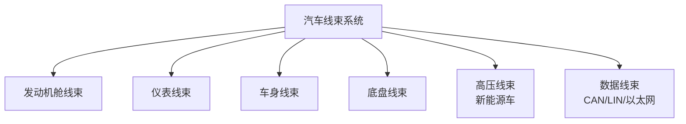
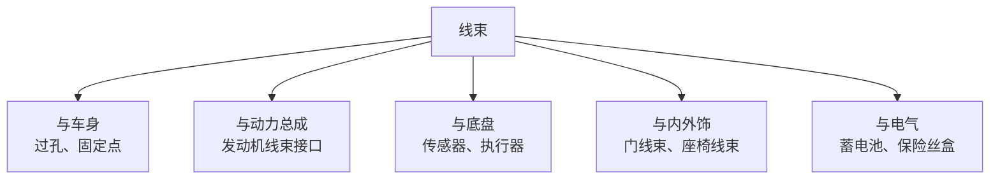
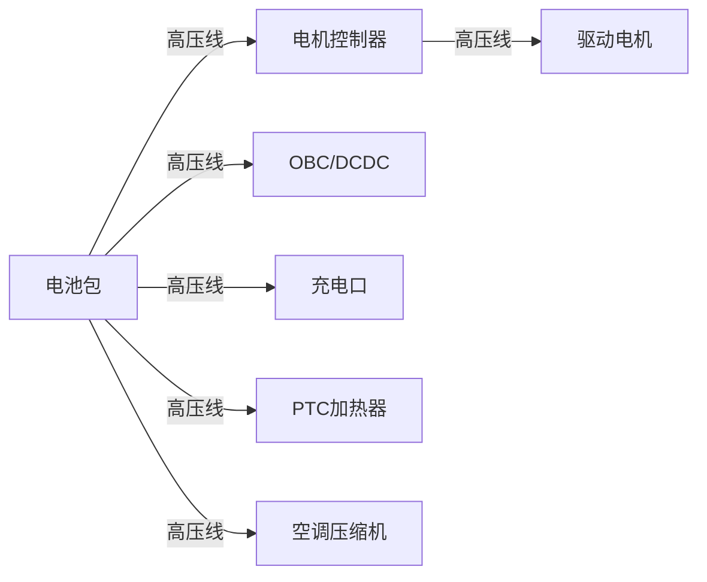
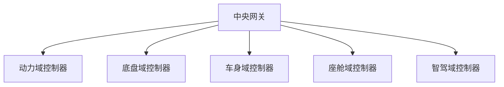

# 线束布置

## 概述

汽车线束是车辆的"神经系统"，连接所有电气电子部件。线束布置影响**功能实现、电磁兼容、装配工艺和成本**。随着智能化程度提高，线束越来越复杂。

## 线束系统组成



| 线束类型 | 连接对象 | 特点 |
|----------|----------|------|
| 低压线束 | 12V 系统 | 电压低、电流大 |
| 高压线束 | 300-800V | 屏蔽、橙色标识 |
| 信号线束 | 传感器/控制器 | 抗干扰 |
| 数据总线 | CAN/LIN/FlexRay | 网络通信 |

## 线束布置原则

### 1. 走向规划

```
线束主干走向：
┌──────────────────────────────────────┐
│  发动机舱                              │
│  ┌──────┐    穿过前围板                 │
│  │ 电气  │───→ ──────────────────     │
│  │ 部件  │                            │
│  └──────┘                            │
│         仪表线束（沿仪表台）            │
│  ─────────────────────────────       │
│         车身线束（沿门槛/底板）         │
│  ─────────────────────────────       │
│                          后部线束      │
│                          ┌──────┐    │
│                          │ 尾灯  │    │
│                          └──────┘    │
└──────────────────────────────────────┘
```

| 原则 | 说明 |
|------|------|
| 最短路径 | 减少线束长度，降本减重 |
| 沿结构走向 | 沿车身梁、骨架，便于固定 |
| 避免运动件 | 远离运动部件 |
| 避免热源 | 远离排气管等热源 |
| 分区布置 | 按功能区域分组 |

### 2. 固定与保护

| 要点 | 说明 |
|------|------|
| 固定间距 | 每 200-300mm 一个卡扣 |
| 弯曲半径 | ≥ 线束直径 3 倍 |
| 波纹管 | 防护磨损 |
| 胶带 | 包扎、阻燃 |
| 卡扣 | 固定在车身孔位 |

### 3. 过孔处理

```
线束穿过钣金件：
    ┌─── 钣金 ───┐
    │   ◯ 橡胶圈  │
    │   ║线束║   │
    │   ◯        │
    └────────────┘
```

| 过孔要求 | 说明 |
|----------|------|
| 橡胶圈 | 防止线束磨损 |
| 密封 | 防水防尘 |
| 前围板过孔 | 机舱与乘员舱隔离 |
| 底板过孔 | 防水要求高 |

## 线束与各系统协调



### 线束与车身

| 协调项 | 说明 |
|--------|------|
| 过孔位置 | 钣金开孔需提前定义 |
| 固定卡扣孔 | 车身焊接件上预留 |
| 线槽 | 部分车型有专用线槽 |
| 密封 | 前围板、底板过孔密封 |

### 线束与门

```
车门线束连接：
    车身线束 ──→ 铰链 ──→ 车门线束
              (波纹管)
```

| 要点 | 说明 |
|------|------|
| 过门铰链 | 波纹管保护 |
| 弯曲寿命 | 门开闭 ≥ 10 万次 |
| 门内线束 | 车窗、门锁、音响 |

## 高压线束（新能源车）

### 高压线束特点

| 特点 | 说明 |
|------|------|
| 电压 | 300-800V DC |
| 颜色 | 橙色（警示） |
| 屏蔽 | 防止电磁干扰 |
| 截面积 | 35-95mm² |
| 连接器 | 高压互锁（HVIL） |

### 高压线束走向



| 高压部件 | 布置位置 |
|----------|----------|
| 电池包 | 底盘 |
| 电机控制器 | 机舱或后部 |
| 充电口 | 前部或后部 |
| OBC/DCDC | 机舱 |
| 高压配电盒 | 机舱或电池包内 |

### 高压安全

!!! danger "高压安全要求"
    - 高压线束橙色标识，清晰区分
    - 高压连接器带互锁（HVIL），断开先断电
    - 高压线束与低压线束分离走向
    - 高压部件可靠接地
    - 碰撞自动切断高压

## 电气架构

### 传统分布式架构

```
每个控制器独立连接：
    电池 ──→ 保险丝盒 ──→ 各控制器
                        ├──→ 发动机ECU
                        ├──→ 变速器TCU
                        ├──→ ABS
                        ├──→ 车身控制器
                        └──→ ...
```

| 特点 | 说明 |
|------|------|
| 结构 | 各 ECU 独立，通过总线通信 |
| 线束 | 多、长、重 |
| 应用 | 传统燃油车 |

### 域控制器架构



| 优点 | 说明 |
|------|------|
| 线束减少 | 域内集中，减少长线 |
| 功能集成 | 域控制器统一管理 |
| OTA 升级 | 软件定义汽车 |

### 区域架构（Zone）

```
    中央计算平台
         │
    ┌────┼────┐
    ↓    ↓    ↓
  前区  中区  后区
  控制  控制  控制
```

| 特点 | 说明 |
|------|------|
| 按位置分区 | 前部/中部/后部各一个区域控制器 |
| 线束最短 | 就近连接传感器/执行器 |
| 未来趋势 | 软件定义汽车的基础 |

## 线束设计参数

### 导线截面积选择

| 电流 | 截面积 | 应用 |
|------|--------|------|
| < 5A | 0.5mm² | 信号线 |
| 5-10A | 0.75-1.0mm² | 小功率 |
| 10-20A | 1.5-2.5mm² | 中功率 |
| 20-40A | 4-6mm² | 大功率 |
| > 40A | 10mm²+ | 起动等 |

### 线束质量与成本

| 车型 | 线束质量 | 线束成本占比 |
|------|----------|-------------|
| 传统燃油车 | 15-25kg | 2-3% |
| 智能电动车 | 25-40kg | 4-6% |

!!! tip "线束轻量化"
    - 铝导线替代铜导线（减重 30-40%）
    - 域控制器架构减少线束长度
    - 高压线束优化走向

## 线束布置常见问题

| 问题 | 原因 | 解决 |
|------|------|------|
| 电磁干扰 | 高低压线并行 | 分离走向、屏蔽 |
| 磨损 | 与钣金摩擦 | 波纹管保护 |
| 进水 | 过孔密封不良 | 改进密封 |
| 装配困难 | 空间狭窄 | 优化走向 |
| 质量大 | 铜线过多 | 铝线替代 |

## 线束发展趋势


| 趋势 | 说明 |
|------|------|
| 域控制 | 减少控制器数量 |
| 区域架构 | 就近连接，线束最短 |
| 以太网 | 高带宽，支持智能驾驶 |
| 高压化 | 800V 平台，减小线径 |
| 无线 | 部分传感器无线连接 |

---

## 下一步阅读

- [电池布置](battery.md）：高压系统核心
- [热管理系统](thermal.md）：电气与热管理协调
- [纯电动平台](../cases/ev.md）：电动车电气架构
