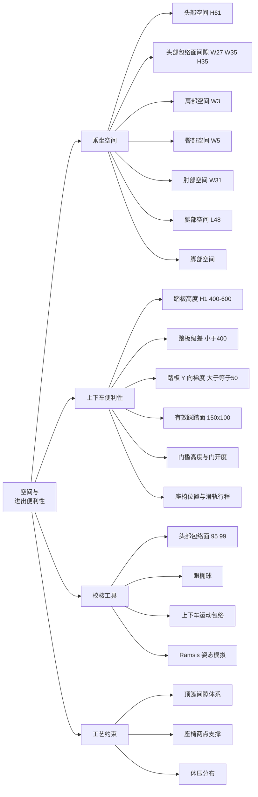
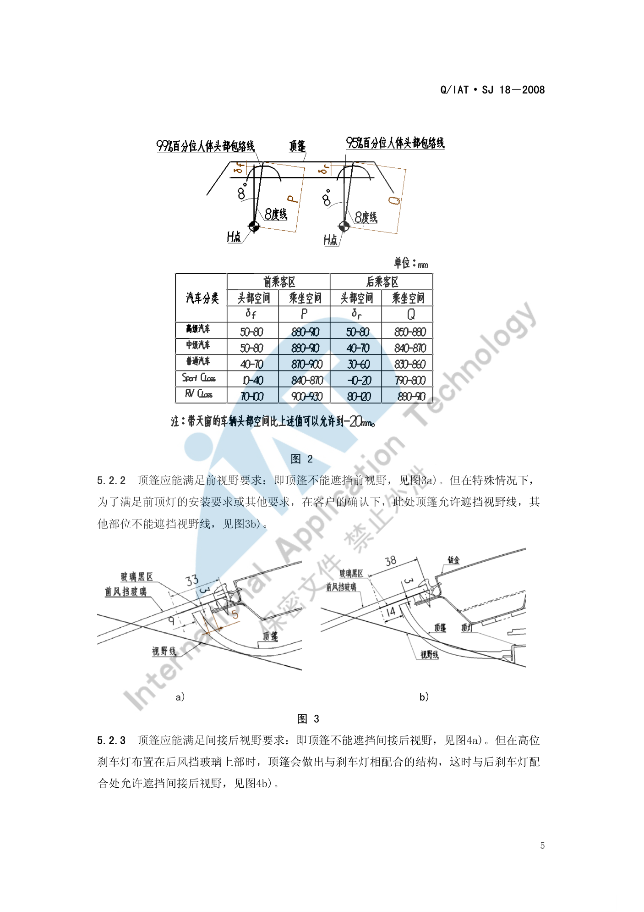
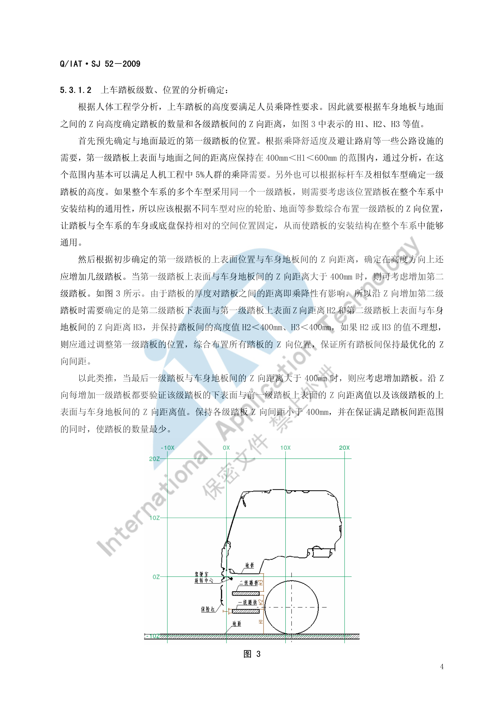

# 空间与进出便利性

!!! quote "内容来源"
    本页正文抽取自《总布置》知识库中**可文本解析**的文件：
    `SJ 9-2008 A类汽车眼椭球、头部包络面设计规范`、`SJ 18-2008 顶篷设计指导书`、
    `SJ 26-2008 座椅及座椅安全带设计指导书`、`SJ 52-2009 N类商用车前门上车踏板设计指导书`、
    `QCD-A0-005 概念草图阶段总布置检查规范`。
    企业规范编号原样保留。

## 空间与进出便利性体系



## 概述

### 要点

空间与进出便利性回答的是"**坐得下、坐得住、上得去**"三个问题，评价维度与依据如下：

| 维度 | 具体指标 | 主要依据 |
|---|---|---|
| 头部空间 | 头部包络面与顶篷内饰的最小间隙（前乘客区按 **99%**，后乘客区按 **95%**） | `SJ 9-2008`、`SJ 18-2008` |
| 乘坐空间 | 过 H 点作与竖直方向成 **8°** 的直线与顶篷交点至 H 点的距离 | `SJ 18-2008` §5.2.1 |
| 横向空间 | 肩部 W3、臀部 W5、肘部 W31 | `SJ 9-2008`、H20 硬点报告 |
| 腿部/脚部空间 | L48 膝部空间、脚部空间、L50 排间 R 点距离 | `SJ 9-2008`、H20 硬点报告 |
| 上下车便利性 | 踏板高度/级差/横向梯度、有效踩踏面、门槛高度、门开度 | `SJ 52-2009`、`QCD-A0-005` |
| 座椅支撑 | 两点支撑、体压分布、头枕间隙 | `SJ 26-2008` |

**尺寸代码统一参照 SAE J1100**（`SJ 6-2008` 引用 JUL2002 版，`QCD-A0-005` 引用 2002 版，H20 硬点报告使用 **2009 版**，跨阶段对照时需留意版本差异）。

### 示例

顶篷设计中"前乘客区头部空间"与"乘坐空间"的几何定义：前者以头部包络线为基准，后者以过 H 点与竖直方向成 8° 的直线与顶篷交点为准。



### 注意事项

- 头部空间是**经验数值**：`SJ 18-2008` 明确标注其"此数值为经验数值"，应结合以往车型附录数据与竞品对标共同确定。
- 空间感与实测值存在差异：受顶篷材质、颜色、天窗、内饰造型影响，同样的 H61 数值主观空间感可能明显不同。

## 乘坐空间

### 要点

**（1）头部空间定义与限值**（`SJ 18-2008` §5.2.1、`SJ 9-2008` §6.3）

| 空间项 | 定义 |
|---|---|
| 前乘客区头部空间 | 前乘客区顶篷距 **99%** 百分位人体头部包络线的**最小距离** |
| 后乘客区头部空间 | 后乘客区顶篷距 **95%** 百分位人体头部包络线的**最小距离** |
| 前/后乘客区乘坐空间 | 过 H 点作与 zx 面平行的平面，在该平面内过 H 点作与竖直方向成 **8°** 的直线，其与顶篷的交点到 H 点的距离 |
| W27 | 头部包络面在**斜向 30°** 方向上与内饰的间隙 |
| W35 | 头部包络面与内饰的**水平**间隙 |
| H35 | 头部包络面与内饰的**垂直**间隙 |
| H61 | **有效头部空间** |

**（2）头部包络面的定位**（`SJ 9-2008` §6.2）

中心点定位公式按座椅滑移量 TL23 分两种：

```text
TL23 > 0 时：
  X = L1 + 664 + 0.587×L6 - 0.176×H30 - 12.5×t + Xh
  Y = W20
  Z = H8 + 638 + H30 + Zh

TL23 = 0（固定座椅）时：
  X = L31 + 640×sinδ + Xh
  Y = W20
  Z = H70 + 640×cosδ + Zh
  其中 δ = 0.719×A40 - 9.6
```

`Xh`、`Zh` 按座椅滑移量选取：

| TL23 | Xh | Yh | Zh |
|---|---|---|---|
| > 133 mm | 90.6 | 0 | 52.6 |
| ≤ 133 mm | 89.5 | 0 | 45.9 |
| 0 mm（固定座椅） | 85.4 | 0 | 42.0 |

轴倾角规则：**可调座椅**在侧视图上过中心有 **β = 12°**（同眼椭圆）前低后高的长轴；**不可调座椅没有倾角**。

**（3）座椅的支撑与体压要求**（`SJ 26-2008` §5.2）

- **两点支撑原则**：肩靠设在第 **5、6 胸椎**之间以减轻颈曲变形；腰靠支撑在第 **2、3 腰椎**上以保证腰曲弧线正常；头枕支撑头部；
- **体压分布**：体重应以较大支承面积、较小压力**合理而非平均**地分布；坐垫上**坐骨部分压力最高**、向臀部外围逐渐降低、至大腿下平面趋于最低值；靠背上**肩胛骨与腰椎骨两部分压力最高**（即两点支承位置）；
- 头枕与靠背间距：**不可调**头枕 ≤ **60 mm**；**可调**头枕调至最低位置时 ≤ **25 mm**（GB 15083-2006）；头枕与躯干线的垂直距离宜为 **45～55 mm**。

### 示例

以往车型的前排驾驶员最小头部空间统计（`SJ 9-2008` 附录 A），括号内为 99%/95% 两个百分位的取值：

| 车型 | W27-1a | W35-1b | H35-1c | H61-1d |
|---|---|---|---|---|
| M2 两厢轿车 | 65 | 87 / 88 / 54 | 71 | 889 + 102 |
| V221（天窗版） | — | 18 | — | 840 + 102 |
| V221（非天窗版） | 37 | 58 / 47 / 76 | 45 | 885 + 102 |
| A230（有天窗） | 11 | 32 / 15 / 45 | 27 | 853 + 102 |
| S21 三厢轿车 | 78 | 110 / 99 / 129 | 68 | 869 + 102 |

> a W27-1：头部包络面在斜向 30° 方向上与内饰的间隙；b W35-1：水平间隙；c H35-1：垂直间隙；d H61-1：有效头部空间。
> 上表最直观的结论是：**带天窗的车型头部空间被压缩**（A230 有天窗 W27 仅 11 mm、H61 为 853 mm，明显低于 S21 的 78 mm 与 869 mm）。

### 注意事项

- **带天窗会显著压缩头部空间**：天窗版 V221 的 W35 仅 18 mm，而非天窗版为 47～76 mm；项目立项时若确定天窗配置，应在造型阶段就预留。
- 头部包络面的百分位选用与法规/舒适性目标相关：**前乘客区用 99%**、**后乘客区用 95%**，不可随意互换。
- 座椅骨架的借用程度会约束型面（`SJ 26-2008` §4.3），**空间不是可以自由争取的**，需在借用件边界内优化。

## 进出便利性

### 要点

**（1）上车踏板的乘降性要求**（`SJ 52-2009` §5.3.1）

| 参数 | 要求 |
|---|---|
| 踏板厚度 T | 非金属材质一般 **T > 20 mm**；在满足强度与造型前提下尺寸最小；前期厚度需经 CAE 强度复核 |
| 第一级踏板高度 H1 | **400 mm < H1 < 600 mm**（距地面），可满足 5% 人群乘降需要，同时避让路肩等公路设施 |
| 各级踏板 Z 向间距 | H2、H3 均 **< 400 mm**；若第一级踏板上表面与车身地板间距 > 400 mm 则需增加第二级；每增加一级都要验证该级下表面与前一级上表面的间距以及该级上表面与车身地板的间距 |
| 踏板数量原则 | 在保证间距范围的同时**使踏板数量最少** |
| 第一级踏板 Y 向位置 | 以车门及车门下端附件最外边界为起点，向车内偏置 **≥ 5 mm** |
| 第二级及以上 Y 向梯度 | 以前一级踏板最外边界为起点向车内偏置 **≥ 50 mm** |
| 最后一级踏板 Y 向位置 | 最外端须在门槛外侧，且与门槛最外端保持 **≥ 50 mm** |
| 有效踩踏面 | SAE 95% 人体脚部（含鞋）为 **320 mm × 116 mm**，故最小有效踩踏面取 **150 mm (L) × 100 mm (W)** |
| 最后一级踏板宽度分配 | 以门槛为参考：超出门槛向车内 **W1 ≤ 2/3 W**，向车外 **W2 ≥ 1/3 W**（W1 + W2 = W） |
| 翻转校核 | 驾驶室可翻转时，踏板旋转最大轨迹与**静态轮胎**距离 **> 60 mm** |

**（2）踏板的功能与工艺要求**（§4、§5.3.3、§5.4）

- 功能：为乘员提供上下车的中间踏步平台；**反射器**标识踏板位置并起警示作用；与保险杠及车门造型呼应起装饰作用；
- 防滑与泥水下漏：塑料踏板在上表面设计突起结构防滑、开方孔下漏泥水；金属踏板采用向上（防滑/加强）与向下（漏泥水）双向翻边孔；踏板与轮胎之间设 **挡泥皮**（EPDM 等橡胶，2～3 个子母卡扣连接）防止泥水飞溅；
- 几何约束：与轮胎保持 **≥ 60 mm** 安全距离；
- 工艺：塑料踏板多用 **PP + GF40（玻璃纤维）**注塑；金属件多为铸造（如铸铝）；
- 法规依据：`GB 20182-2006 商用车驾驶室外部凸出物`、`ECE R61`。

**（3）其它影响因素**

| 因素 | 影响 |
|---|---|
| 门槛高度 | 与最后一级踏板宽度分配（W1/W2）直接耦合 |
| 车门开度 | 影响进出通道宽度与踏板布置空间 |
| 座椅位置与滑轨行程 | 影响上下车时的腿部通道与落脚点 |
| 门洞尺寸 | 约束乘员通过姿态 |

### 示例

各级踏板之间必须有**横向（Y 向）梯度**：踏板沿 Z 向上升时，各级踏板最外端逐渐向车内缩进，形成台阶特征。这样从俯视模拟视线看下去才能看见并分清各级踏板的最外端轮廓。



### 注意事项

- **老人与儿童的特殊需求**：第一级踏板 400～600 mm 的高度区间是按"满足 5% 人群乘降需要"设定的下限保障；面向家庭用户的车型应向下限取值，而非取上限以图省空间。
- **裙边蹭脏裤腿**是常见抱怨点：需结合门槛外凸量、密封条位置与最后一级踏板宽度分配（W1/W2）综合校核，必要时在门洞下部增加导向。
- 踏板为**多次使用的功能部件**，固定时应尽量采用全方位固定方式（Y 向 ≥ 3 点紧固、X/−X 各向至少 1 点），安装点处料厚至少为正常料厚的 **2 倍**。
- 多车型共用车系踏板时，须以基准车型为准横向综合分析，保证安装结构在整个车系中通用。

## 上下车校核

### 要点

| 环节 | 方法 | 判据 |
|---|---|---|
| 踏板位置与数量 | 按地板与地面 Z 向高差反推 | H1 在 400～600 mm，各级间距 < 400 mm |
| 运动包络 | 驾驶室翻转/车门开闭时踏板轨迹与轮胎、保险杠的间隙 | > 60 mm |
| 姿态模拟 | Ramsis 等工具模拟不同百分位假人的上下车动作 | 无干涉、无不舒适告警 |
| 空间余量 | 门洞尺寸、门槛高度、座椅位置 | 满足目标人群通过性 |
| 主观评价 | 样椅/油泥阶段让不同身材评价者实际体验 | 无蹭腿、无绊脚、无需攀爬 |

### 示例

上下车校核的最小闭环：**确定地板与地面高差 → 定第一级踏板 → 逐级验证 Z 向间距与 Y 向梯度 → 运动校核确定安装方式 → 主观评价验证**。`SJ 52-2009` 指出，若旋转分析显示某级踏板与轮胎干涉（例如第一级踏板随车身旋转会产生干涉），则该级**不能安装在车身上**，应考虑与车架等固定结构连接。

### 注意事项

- 运动校核会**反向决定安装方式**：不是先定安装再校核，而是"旋转轨迹不满足就换安装基准"。
- 校核结果对**载荷状态**敏感（空载/满载地面线不同），须在项目定义的校核状态下统一评价。

## 待人工补充

!!! warning "以下条目无法自动提取或尚未纳入，需人工补充"
    - `SJ 9-2008` 附录 A 的分布图 A.1～A.4（头部空间实测分布图）为图片，无文本层；
    - `SJ 52-2009` 表 1（踏板参数汇总表）、附表 A.1（人体足部尺寸）、附表 B.1（人体关节活动范围）
      与图 B.1、B.2 为图片页，需人工查阅原表；
    - 车门开度与门洞尺寸的量化要求应参照 `SJ 2-2008 车门设计指导书`、`SJ 3-2008 车门设计检查指导书`、
      `SJ 21-2008 前门内饰板设计指导书`（本轮未解析，建议下一批补充）；
    - 知识库中以下文件虽相关但因读取问题**未采用**：`AEM-A5-106 脚部腿部空间校核设计要素流程`、
      `AEM-A5-111 脚部空间校核规范`、`AEM-A5-501 上下车方便性校核规范`、`AEM-A1-503 踏步设计布置规范`、
      `AEM-A1-501 门洞尺寸及位置`、`AEM-A1-502 门开度的设置`。

    建议：在 IMA 客户端中打开对应文件补充条款，或按"规范编号 + 页码"方式人工引用。

---

## 下一步阅读

- [坐姿与 H 点](posture.md)：H30、头部包络面与最小头部间隙的完整定义
- [视野校核](vision.md)：后风窗黑区与顶篷遮挡的关系
- [门板&立柱&顶棚区域总布置](../door-trim/door.md)：顶篷与立柱的配合间隙体系
