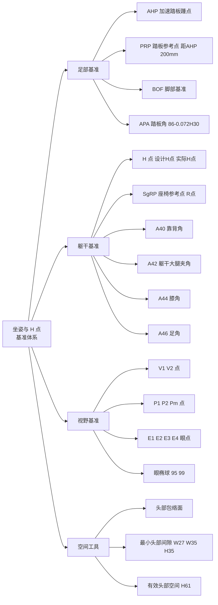
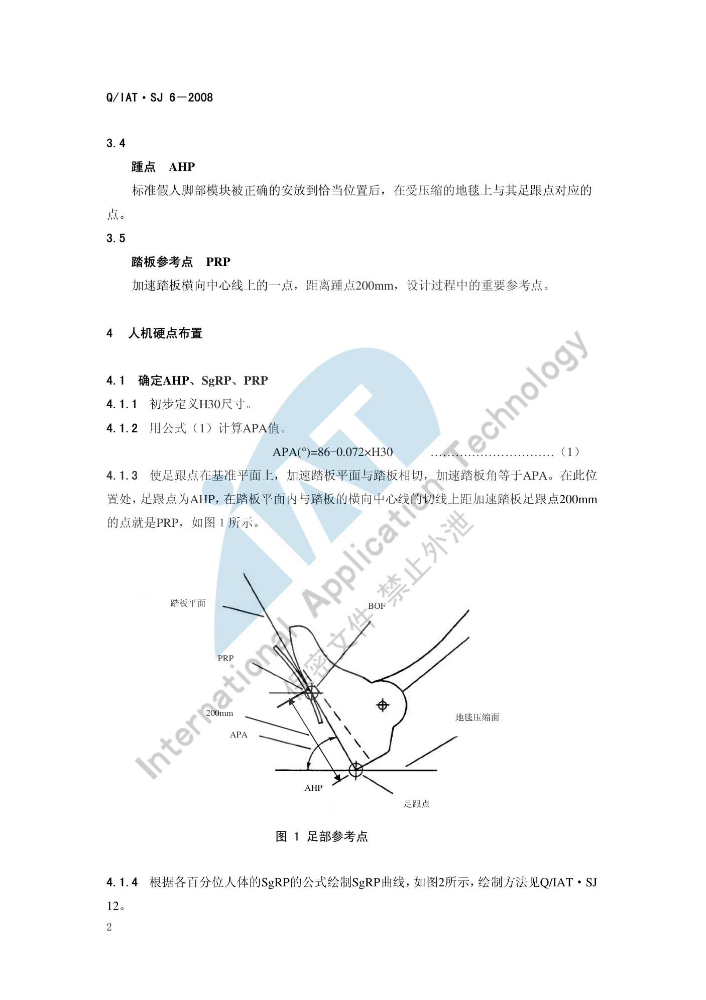
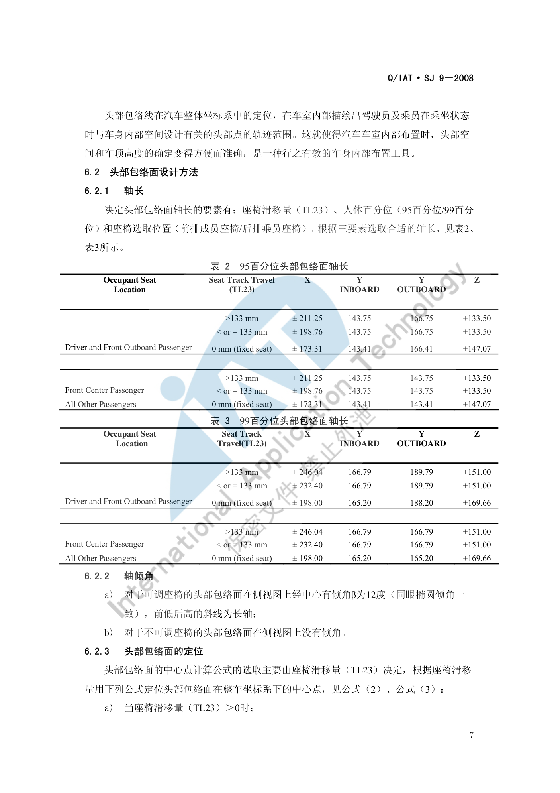

# 坐姿与 H 点

!!! quote "内容来源"
    本页正文抽取自《总布置》知识库中**可文本解析**的文件：
    `SJ 6-2008 驾驶员人机硬点设计规范`、`SJ 7-2008 前方视野设计规范`、
    `SJ 9-2008 A类汽车眼椭球、头部包络面设计规范`、`SJ 26-2008 座椅及座椅安全带设计指导书`、
    `QCD-A0-005 概念草图阶段总布置检查规范`。
    企业规范编号（SJ/AEM/EDD/QCD/H20/ZBZ）原样保留，便于回到知识库对号入座。

## 人机布置基准体系



## 概述

### 要点

坐姿与 H 点是**车内一切人机尺寸的原点**：座椅、方向盘、踏板、后视镜、顶棚、A 柱盲区全部以它为基准展开。阿尔特企业标准体系把这条主线拆成三份互为引用的规范：

| 规范 | 定位 | 输出 |
|---|---|---|
| `SJ 6-2008 驾驶员人机硬点设计规范` | 定**基准点**：AHP / PRP / SgRP / 转向盘中心 / EO 点 | 人机硬点坐标 |
| `SJ 7-2008 前方视野设计规范` | 定**视野基准**：V 点 / P 点 / E 点 | A 柱障碍角、上下视野 |
| `SJ 9-2008 A类汽车眼椭球、头部包络面设计规范` | 定**空间工具**：眼椭球 / 头部包络面 | 头部间隙、顶棚高度 |

三者共同的输入是 **H30**（R 点到 AHP 的 Z 向距离）与 **A40**（靠背角）。

### 示例

整套基准的起点是一组**足部参考点**：由 H30 算出 APA，再定出 AHP 与 PRP，后续 SgRP 曲线、转向盘中心、EO 点全部由此推出。



### 注意事项

- 基准点之间存在**强耦合**：改动 H30 会同时改变 APA、转向盘中心、EO 点、眼椭球与头部包络面定位，进而影响 A 柱障碍角与视野校核，必须整链重算，不能只改一处。
- `SJ 6-2008` 与 `SJ 9-2008` 都规定适用于 **A 类汽车**（定义见下），不适用于方向盘大、坐姿高的商用车。

## H 点定义与定位

### 要点

**（1）四个关键点的定义**（`SJ 26-2008` §3、`SJ 6-2008` §3）

| 术语 | 定义 |
|---|---|
| 臀点 H Point | 三维 H 点装置躯干与大腿的铰接中心，位于装置两侧 H 点标记钮的中心线上；分**设计 H 点**与**实际 H 点** |
| 座椅参考点 SgRP | 一个指定的座椅位置上的臀点，每个座椅**唯一**；即通常所称的驾驶员 R 点 |
| 踵点 AHP | 标准假人脚部模块正确安放后，在**受压缩的地毯**上与其足跟点对应的点 |
| 踏板参考点 PRP | 加速踏板横向中心线上、距踵点 **200 mm** 的点，是设计过程中的重要参考点 |
| 实际座椅靠背角 | 座椅处于**最低和最后位置**时，过 H 点的铅垂线与三维 H 点装置躯干线之间的夹角（理论上等于设计靠背角） |

**（2）AHP、SgRP、PRP 的确定顺序**（`SJ 6-2008` §4.1）

1. 初步定义 **H30**；
2. 由下式计算 **APA**（加速踏板角）：

    ```text
    APA(°) = 86 - 0.072 × H30
    ```

3. 使足跟点落在基准平面上，加速踏板平面与踏板相切且踏板角等于 APA。此位置的足跟点为 **AHP**；在踏板平面内、距 AHP 沿踏板横向中心线切线 **200 mm** 的点即为 **PRP**；
4. 按各百分位人体的 SgRP 公式绘制 **SgRP 曲线**（绘制方法见 `Q/IAT·SJ 12  A类汽车驾驶员适意位置线设计规范`）；
5. 在**第 95 百分位人体适意曲线与 H 点范围的交线**上选定 SgRP（特殊情况可按客户要求或实际选用第 50 百分位曲线上的交点）；
6. 若受座椅布置影响找不到 H 点轨迹与 SgRP 曲线的匹配区域，则**重新选定 H30 并重复上述步骤**——这是"坐姿与座椅布置相互迭代"的典型环节。

**（3）A 类汽车的判定**（`SJ 6-2008` §3.1，依据 SAE J1100 JUL2002）

| 条件 | 范围 |
|---|---|
| SgRP 到踵点垂直距离 H30-1 | 127～405 mm |
| H 点垂直行程 TH17 | 0～50 mm |
| 座椅水平行程 TL23 | > 100 mm |
| 转向盘直径 W9 | < 450 mm |
| 靠背角 A40-1 | 5～40° |

**（4）V 点、P 点与 E 点**（`SJ 7-2008` §4.3～4.5）

设计座椅靠背角为 **25°** 时的基本坐标（相对 R 点，mm）：

| 点 | X | Y | Z |
|---|---|---|---|
| V1 点 | 68 | -5 | 665 |
| V2 点 | 68 | -5 | 589 |
| P1 点 | 36 | -20 | 627 |
| P2 点 | 63 | 47 | 627 |
| PM 点 | 43.36 | 0 | 627 |

- 靠背角不是 25° 时，各 V、P 点的 X/Z 坐标须按 `SJ 7-2008` 表 4 修正；
- 座椅水平调节范围超过 108 mm 时，P 点 X 坐标另有校正值（108～120 mm 取 -13，121～132 mm 取 -22，133～145 mm 取 -32，146～158 mm 取 -42，158 mm 以上取 -48）；
- E 点与 P 点**在同一水平面内**：E1、E2 距 P1 各 **104 mm**，E1 距 E2 为 **65 mm**；E3、E4 距 P2 各 104 mm，E3 距 E4 为 65 mm；
- **A 柱的定义**：位于 V 点前 **68 mm** 处横向铅垂平面以前的任何车顶支撑（不透明零件），如门框、风窗玻璃镶条、支撑附件等。

### 示例

由 H30 推出转向盘中心点与 EO 点的位置，是"先定坐姿、再定操纵件"的直接体现：


### 注意事项

- **设计 H 点 ≠ 实际 H 点**：设计 H 点由 CAD 工具按程序建立，实际 H 点由 3D-H 装置在实车上测得；两者偏差是座椅布置的验收项之一。
- SgRP 是"座椅调至最后、最下位置"的胯点，是定义尺寸的基准；**不要**用乘员常用位置代替。
- 实际座椅靠背角理论上等于设计靠背角，实测偏差需在座椅认可阶段确认。

## 坐姿角度设计

### 要点

**（1）推荐角度范围**（`QCD-A0-005` 表 1、`SJ 26-2008` §5）

| 角度 | H30 (mm) | A40 (°) | A42 (°) | A44 (°) | A46 (°) |
|---|---|---|---|---|---|
| 推荐范围 | 220–350 | 22–28 | 85–105 | 110–125 | 87（±2） |

H30 按车型级别取值：

| 车型级别 | 轿跑 | B 级车 | A 级车 | A0 级车 | A00 级车 | SUV |
|---|---|---|---|---|---|---|
| H30 (mm) | 220–240 | 230–270 | 280–310 | 300–330 | 320–350 | 320–350 |

**（2）由 H30 派生的操纵件位置公式**（`SJ 6-2008` §4.2～4.5）

| 项目 | 公式 / 要求 |
|---|---|
| 转向盘中心相对 AHP 的 X 向距离 | `WX = 676 - 0.786 × H30` |
| 转向盘中心相对 AHP 的 Z 向距离 | `WZ = 1063 - 0.903 × WX` |
| 转向盘倾角 | `Wa = 0.08 × H30 + 3` |
| EO 点相对踵点的 X 向距离 | `EOX = 1208 - 0.8917 × H30` |
| EO 点相对踵点的 Z 向距离 | `EOZ = 1574 - 0.9818 × EOX` |
| EO 点 Y 向位置 | `EOy = SgRPy ± 135` |
| 空挡换挡操作点 | 与 EO 点距离 530～580 mm，**推荐 555 mm** |
| 驻车制动操作点 | 与 EO 点距离 550～670 mm，**推荐 595～640 mm** |

**（3）座椅与人体生理角度的配合**（`SJ 26-2008` §5.2）

- **两点支撑原则**：靠背要能合理支撑**肩部**与**腰部**——肩靠设在第 **5、6 胸椎**之间，可减轻颈曲变形；腰靠支撑在第 **2、3 腰椎**上，保证腰曲弧线呈正常形状；头枕用于支撑头部；
- **体压分布**：体重应以较大支承面积、较小压力**合理而非平均**地分布在坐垫与靠背上；坐垫上坐骨部分压力最高、向臀部外围逐渐降低至大腿下平面最低值；靠背上肩胛骨与腰椎骨两部分压力最高（即"两点支承"位置）；
- 头枕与靠背的间距：**高度不可调**头枕不大于 **60 mm**；**高度可调**头枕在调至最低位置时不大于 **25 mm**（GB 15083-2006）；
- 座椅安装螺栓通常为 **M10**。

### 示例

典型项目的人机硬点实测统计（`SJ 6-2008` 附录 A，选取部分车型）：

| 车型 | 轴距 (mm) | H30 (mm) | W20 (mm) | APA (°) | 转向盘角度 (°) |
|---|---|---|---|---|---|
| S21 三厢轿车 | 2340 | 300 | -345 | 48 | 25 |
| X121 三厢轿车 | 2440 | 308 | -340 | 56 | 27 |
| A230 三厢轿车 | 2600 | 252 | -355 | 60 | 24 |
| V221 三厢轿车 | 2550 | 307 | -330 | 58 | 26 |
| M2 两厢轿车 | 2500 | 290 | -330 | 60 | 21 |
| S22 MPV | 2625 | 310 | -345 | 50 | 25 |
| X8 SUV | 2760 | 285 | -375 | 61 | 26 |

> 上表可直接作为新项目"坐姿对标"的参照区间：H30 落在 252～310 mm，APA 落在 48～61°，转向盘倾角 21～27°。

### 注意事项

- 长途驾驶疲劳与坐姿强相关，**A44（膝角）过小**是最常见的疲劳来源；`QCD-A0-005` 专门给出降级规则（见下节）。
- H30 越大（坐姿越"直"），方向盘倾角 Wa 越大、转向盘中心越靠前，会挤压腿部空间——**H30 不是可以单独调优的参数**。
- 靠背角 A40 直接参与 V 点/P 点坐标修正，**先冻结 A40 再算视野**，可避免返工。

## 百分位人体应用

### 要点

**（1）基础人体模型的选取规则**（`QCD-A0-005` §4.2）

- 前排驾驶员和后排乘客**尽量考虑 SAE 95% 假人**的空间，优先保证驾驶员舒适性；
- 若后排乘客 **A44 < 85°**，建议后排乘客定义为 **SAE 50%** 假人；
- 若后排乘客 50% 假人的 A44 仍 < 85°，建议后排乘客定义为 **SAE 5% 女性假人**。

**（2）眼椭球的百分位与含义**（`SJ 9-2008` §5.1）

- SAE 通过对 2300 多名男女驾驶员的试验测定与统计分析得出：驾驶员眼睛位置在**纵向垂直面和水平面**上的分布范围均呈椭圆形，即眼椭圆（Eye Ellipse），分第 90、95、99 百分位等；
- 百分位由**视切比**定义：若一条切线切在第 P 百分位的眼椭圆上，则落在切线含眼椭圆一侧的眼睛百分比为 **P%**，另一侧为 (100−P)%；即"看到该目标的驾驶员眼睛数占眼睛总数的 P%"。

**（3）眼椭球的轴长与定位**（`SJ 9-2008` §5.2）

轴长按座椅调节行程 TL1 选取（mm）：

| 座椅行程 TL1 | 百分位 | X 轴长 | Y 轴长 | Z 轴长 |
|---|---|---|---|---|
| > 133 | 95% | 206.4 | 60.3 | 93.4 |
| > 133 | 99% | 287.1 | 85.3 | 132.1 |
| 1–133 | 95% | 173.8 | 60.3 | 93.4 |
| 1–133 | 99% | 242.1 | 85.3 | 132.1 |

- 轴倾角：侧视图上过眼椭球中心画 **β = 12°**、前低后高的斜线为长轴；
- 中心点定位公式：

    ```text
    Xc  = L1 + 664 + 0.587×L6 - 0.176×H30 - 12.5×t      （t=1 有离合器，t=0 无离合器）
    Ycl = W20 - 32.5
    Ycr = W20 + 32.5
    Zc  = H8 + 638 + H30
    ```

### 示例

头部包络线的形成方法是把**平均头部线样板**放在眼椭圆样板上，让样板上的眼点沿眼椭圆上半部运动、并保持两样板的身坐标平行，头部线的运动包络即为头部包络线：



### 注意事项

- **不同市场的人体尺寸不同**：SAE 眼椭球/头部包络面源自北美人群统计，直接套用到其他市场需谨慎；知识库中的企业标准以 SAE 数据为基础编写，项目上若有目标市场人体数据应优先采用。
- 眼椭球/头部包络面是**统计**图形工具，其百分位是概率含义，不等于"某个人"；用它定义的间隙（如 W27/W35/H35）应理解为"满足 P% 人群"。
- 头部包络面的轴倾角规则不同：**可调座椅**侧视图上有 12° 倾角（同眼椭圆），**不可调座椅**没有倾角。

## 待人工补充

!!! warning "以下条目在知识库中为扫描图像版或无文本层，需人工阅读后补齐"
    本页上述内容覆盖了可直接文本解析的条款。以下文件在《总布置》知识库中存在，
    但**无法自动提取正文**，相关细节需人工补充：

    - `SJ 12   A类汽车驾驶员适意位置线设计规范` —— SgRP 曲线的具体绘制步骤（本页仅引用）
    - `SJ 6-2008` 附录 A 的图示（H 点分布范围示意）与 `SJ 9-2008` 附录 A 的分布图 A.1～A.4
    - `SJ 15-2008` 附录 A 的 SAE 表格页（为图片，无文本层）
    - 知识库中以下文件虽相关但因读取问题**未采用**：`AEM-A5-001 人体布置流程`、
      `AEM-A5-105 眼椭圆头部包络制作及周边间隙校核规范`、`AEM-A0-011 样车H点确定规范`

    建议：在 IMA 客户端中打开对应文件补充条款，或按"规范编号 + 页码"方式人工引用。

---

## 下一步阅读

- [操作可达性](reach.md)：由坐姿推出的操纵件布置与手伸及界面
- [视野校核](vision.md)：V 点/P 点/E 点在校核中的实际用法
- [空间与进出便利性](comfort.md)：头部包络面与乘坐空间评价
