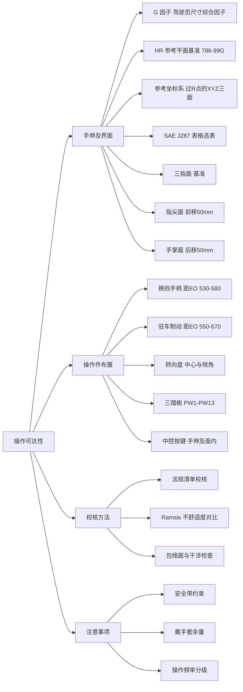
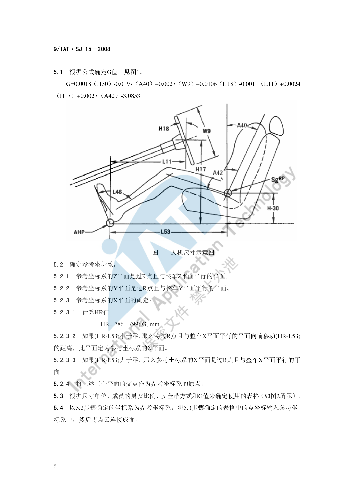
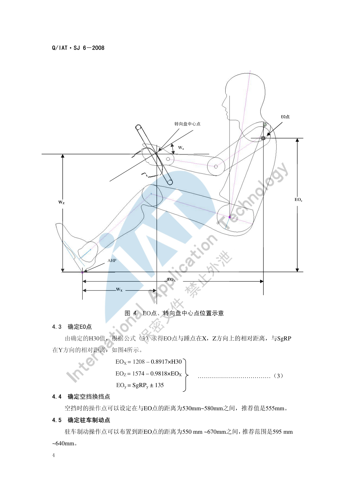

# 操作可达性

!!! quote "内容来源"
    本页正文抽取自《总布置》知识库中**可文本解析**的文件：
    `SJ 15-2008 手伸及界面设计规范`、`SJ 6-2008 驾驶员人机硬点设计规范`、
    `QCD-A0-005 概念草图阶段总布置检查规范`。
    另可参照《通用汽车设计标准》（GM `U00`～`U20` 手部操作件系列、`T01`～`T05` 踏板与点火锁系列）。
    企业规范编号原样保留。

## 可达性校核体系



## 概述

### 要点

操作可达性解决的是"**驾驶员在系好安全带的约束姿态下，能不能够到、够得舒不舒服**"。它由三部分构成：

| 层次 | 内容 | 主要依据 |
|---|---|---|
| 基准 | 由坐姿推出的 EO 点、转向盘中心、H30/A40/W9/H18 等 | `SJ 6-2008` |
| 工具 | **手伸及界面**（三指/指尖/手掌三种曲面） | `SJ 15-2008`（依据 SAE J287-1988-06） |
| 判据 | 操作件是否落在界面内 + 不舒适度是否优于竞品 | `QCD-A0-005` §4.3 |

核心判据一句话：**换挡手柄包络与手刹包络必须落在驾驶员手握式手伸及界面之内**；更合理的做法是用 Ramsis 模拟校核 95%/50%/5% 假人在对应 H 点位置操作换挡手柄与手刹的舒适性，用**不舒适度值**与竞争车型对比后改进。

### 示例

手伸及界面的制作必须先把 G 因子与参考坐标系算出来，再据此选表生成点云——这是"**公式定表、表定曲面**"的三步结构。



### 注意事项

- 手伸及界面的适用车型为 **A 类车和部分 B 类车（不含重卡）**；商用车需另选标准。
- 界面是"**可触及**"的几何边界，不等于"**舒适可达**"——舒适性需用不舒适度或不舒适度对比法单独评价。

## 手伸及包络

### 要点

**（1）输入条件**（`SJ 15-2008` §4）

| 代码 | 含义 |
|---|---|
| A40 | 靠背角 |
| H30 | R 点到 AHP 的垂直距离 |
| W9 | 转向盘直径 |
| H18 | 转向盘倾角 |
| L11 | 转向盘中心到踵点的水平距离 |
| H17 | 转向盘中心到踵点的垂直距离 |
| A42 | 躯干线与大腿线夹角 |
| L53 | R 点到 AHP 的水平距离 |

**（2）G 因子**（驾驶员尺寸的综合因子）

```text
G = 0.0018×H30 - 0.0197×A40 + 0.0027×W9 + 0.0106×H18
    - 0.0011×L11 + 0.0024×H17 + 0.0027×A42 - 3.0853
```

**（3）参考坐标系**（`SJ 15-2008` §5.2）

1. **Z 平面**：过 R 点且与整车 Z 平面平行；
2. **Y 平面**：过 R 点且与整车 Y 平面平行；
3. **X 平面**：先计算 `HR = 786 - 99 × G`（mm）；
   - 若 `(HR - L53) < 0`，把过 R 点且与整车 X 平面平行的平面**向前移动 (HR − L53)** 的距离，该平面即为参考坐标系 X 平面；
   - 若 `(HR - L53) > 0`，则参考坐标系 X 平面就是过 R 点、与整车 X 平面平行的平面；
4. 三个平面的交点即为**参考坐标系原点**。

**（4）选表与生成**（§5.3～§5.4）

按"尺寸单位 + 男女比例 + 安全带形式 + G 值"选定 SAE J287 表格，再把表中点坐标输入参考坐标系，**将点云连接成面**即得手伸及界面。选表顺序为：

1. 选单位为 **mm** 的表格（不用英寸表）；
2. 按 **G 值**筛出对应表格；
3. 排除男女比例**不是 50/50** 的表格；
4. 最后按**安全带形式**确定唯一表格。

### 示例

`SJ 15-2008` §6.1 给出三种操作界面的换算关系：表中确定的曲面是**三指操作**曲面，要得到**指尖操作**和**手掌操作**界面，可分别把三指界面**向前或向后偏移 50 mm**。

| 界面类型 | 相对三指面的偏移 | 典型适用 |
|---|---|---|
| 指尖操作面 | 向后（靠内）偏移 50 mm | 屏幕、按键、旋钮等精细操作 |
| 三指操作面 | 基准面 | 拨杆、拉手等常规操作 |
| 手掌操作面 | 向前（外扩）偏移 50 mm | 换挡杆、手刹等大行程操作 |

### 注意事项

- **安全带约束状态**是选表的必要条件之一——同一车型在三点式安全带与两点式安全带下界面不同，不能混用。
- G 值对结果敏感：W9（方向盘直径）与 H18（倾角）的改动都会平移 G，进而改变整个界面曲面的前后位置，**方向盘硬点冻结后应重算界面**。

## 常用操作件布置

### 要点

**（1）换挡与驻车制动**（`SJ 6-2008` §4.4～4.5）

| 操作件 | 布置要求 | 推荐值 |
|---|---|---|
| 空挡换挡操作点 | 与 EO 点距离 530～580 mm | **555 mm** |
| 驻车制动操作点 | 与 EO 点距离 550～670 mm | **595～640 mm** |

EO 点由 H30 推出（见[坐姿与 H 点](posture.md)）：`EOX = 1208 - 0.8917×H30`，`EOZ = 1574 - 0.9818×EOX`，`EOy = SgRPy ± 135`。

**（2）转向盘**（`SJ 6-2008` §4.2，`QCD-A0-005` §4.3）

- 转向盘中心相对 AHP：`WX = 676 - 0.786×H30`，`WZ = 1063 - 0.903×WX`；
- 转向盘倾角：`Wa = 0.08×H30 + 3`；按车型经验值——**轿跑 22°–24°、轿车 23°–26°、SUV 25°–28°**。

**（3）三踏板**（`QCD-A0-005` 表 3）

| 代码 | 含义 | 推荐值 | 备注 |
|---|---|---|---|
| PW1 | 油门踏板与内饰 Y 向距离 | > 40 mm | |
| PW11 | 油门踏板与制动踏板 Y 向距离 | 60–80 mm | |
| PW12 | 制动踏板与离合踏板 Y 向距离 | 70–80 mm | 手动档 |
| PW13 | 离合踏板与歇脚板 Y 向距离 | 80–120 mm | 手动档 |
| PW7 | 油门踏板与人体中心线 Y 向距离 | 155–200 mm | |
| PW8 | 制动踏板与人体中心线 Y 向距离 | 50–80 mm | |
| PW9 | 离合踏板与人体中心线 Y 向距离 | 80–90 mm | 手动档 |

**（4）操作件分区原则**

按"操作频率 × 视线离开需求"把操作件分三档布置：

| 档位 | 特征 | 布置位置 | 示例 |
|---|---|---|---|
| 高频—盲操作 | 行驶中频繁使用、不离开视线 | 必须落在手伸及界面内且靠近转向盘 | 转向灯拨杆、雨刮拨杆、喇叭、换挡 |
| 中频—短时视线 | 需要短暂注视 | 手伸及界面内、视线可快速扫到 | 空调出风口调节、中控按键、驻车制动 |
| 低频—停车操作 | 行驶中不用 | 允许在界面边缘或界面外 | 手套箱、点烟器、储物盒 |

### 示例

由 H30 直接推出转向盘中心与 EO 点的做法，体现了"**先定坐姿、再定操纵件**"的顺序——把操纵件位置表达为坐姿参数的函数，而不是各自独立取值：



### 注意事项

- **操作频率决定布置优先级**：当空间冲突时，高频盲操作件的可达性**不得**让步给低频件。
- 换挡/手刹使用**包络**而非单体校核：手柄的全行程运动包络都必须在界面内，否则极限挡位会出现够不到的情况。
- 中控屏幕的"可达性"不能只看指尖是否够到，还需同时满足**可见性**与**反光/眩目**要求（见 `SJ 8-2008 仪表反光及炫目设计规范`）。

## 可达性校核方法

### 要点

| 方法 | 做法 | 适用阶段 |
|---|---|---|
| 包络面法 | 先生成手伸及界面，再把操作件包络投影进去逐项检查 | 概念草图 → 详细设计 |
| 假人姿态法 | 用 Ramsis 等软件加载 95%/50%/5% 假人在对应 H 点位置模拟操作 | 效果图 → 详细设计 |
| 不舒适度对比法 | 输出不舒适度值，与竞争车型对比后改进 | 详细设计 |
| 法规清单法 | 按 `QCD-A0-005` 检查项逐条打勾，保留"结论 + 图片示意" | 各阶段 |

**Ramsis 校核的推荐用法**（`QCD-A0-005` §4.3）：分别校核 **95%、50%、5%** 假人在各自 H 点位置操作换挡手柄与手刹的舒适性，得出不舒适度值并与竞争车型对比；根据不舒适度值大小的对比即可知道新车型与竞品差异并作出改进。

### 示例

可达性校核的最小闭环：**界面生成 → 操作件包络投影 → 逐项打勾 → 记录结论与图片 → 不舒适度对标 → 整改 → 复算**。校核结论建议保留"结论 + 图片示意"两列以留痕。

### 注意事项

- **戴手套操作的余量要求**：涉寒区或商用车型需为手套厚度留出可达性余量，做法是把三指界面适当外扩（参考 §6.1 的 ±50 mm 思路）后重新校核。
- 不舒适度是**相对指标**：没有竞品基准时，应改用绝对姿态角范围（如 A42/A44）与手伸及界面双重判据。
- 校核工具只回答"能否够到"，**不能替代实车主观评价**；样椅阶段应让不同身材的评价者实际体验。

## 待人工补充

!!! warning "以下条目无法自动提取或尚未纳入，需人工补充"
    - `SJ 15-2008` 附录 A（SAE J287 中单位为 mm、男女比例 50/50 的表格页）为**图片**，无文本层，
      界面点坐标需人工查阅原表；
    - 《通用汽车设计标准》（GM）中与手部操作件直接相关的条目尚未逐份解析，可作为补充素材：
      `U00_GenHandContOp`（通用手部操作件）、`U01_ContMotiOpExp`、`U02_PushBttn`（按钮）、
      `U06_RoundKnob`（旋钮）、`U08_ThumbWhl`、`U09_Joystick`、`U14_StalkLvr`（拨杆）、
      `T01_IgnitionCyl`（点火锁）、`T05_PkBrkPed`（驻车制动踏板）、`T04_LeftFootRest`（左脚歇脚板）；
    - 知识库中以下文件虽高度相关但因读取问题**未采用**：`AEM-A5-201 手伸及界面及仪表控制面板校核规范与流程`、
      `AEM-A5-203 方向盘位置设计`、`AEM-A5-107/108 内外扣手布置规范`。

    建议：在 IMA 客户端中打开对应文件补充条款，或按"规范编号 + 页码"方式人工引用。

---

## 下一步阅读

- [坐姿与 H 点](posture.md)：EO 点、H30 与操纵件位置公式的来源
- [视野校核](vision.md)：转向盘障碍角与仪表板盲区
- [空间与进出便利性](comfort.md)：踏板与门槛的乘降性要求
