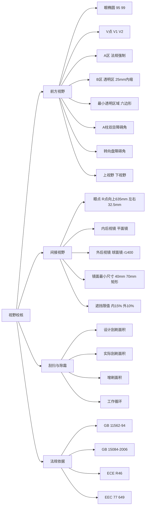
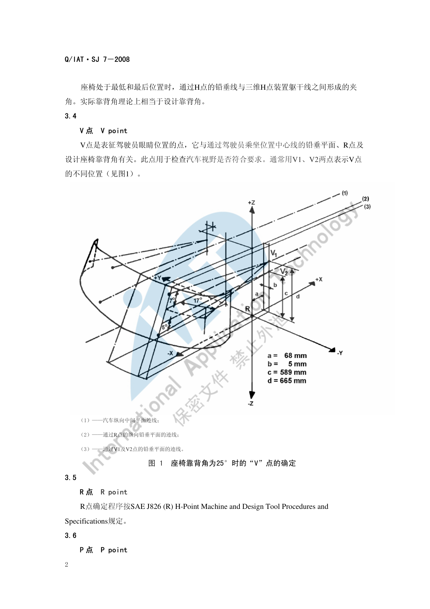
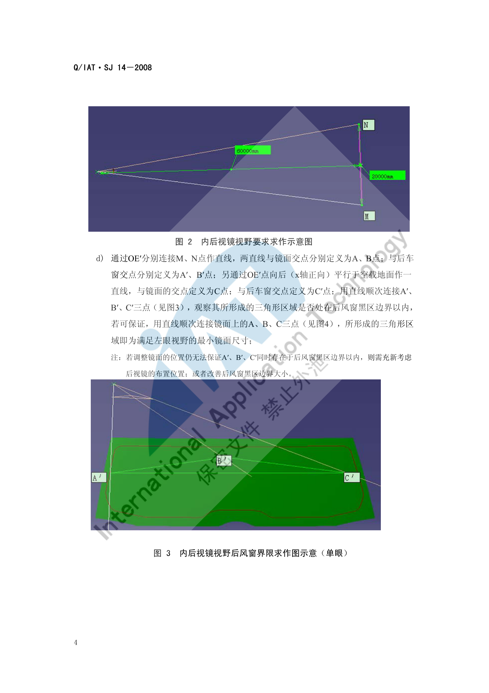
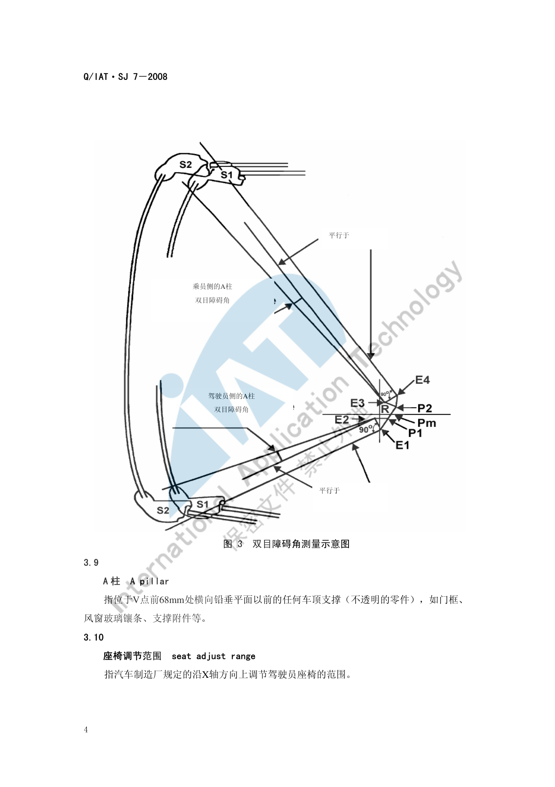

# 视野校核

!!! quote "内容来源"
    本页正文抽取自《总布置》知识库中**可文本解析**的文件：
    `SJ 7-2008 前方视野设计规范`、`SJ 14-2008 乘用车后视镜布置及视野校核规范`、
    `SJ 5-2009 前风窗刮扫区域校核规范`、`SJ 9-2008 A类汽车眼椭球、头部包络面设计规范`、
    `QCD-A0-005 概念草图阶段总布置检查规范`。
    企业规范编号原样保留。

## 视野校核体系

## 概述

### 要点

视野校核分**直接视野（前方视野）**与**间接视野（后视镜）**两条线，共用同一套几何基准：

| 基准 | 定义 | 用途 |
|---|---|---|
| R 点 | 座椅参考点，全车人机基准 | 所有视野工具的原点 |
| V 点（V1/V2） | 表征驾驶员眼睛位置的点，与乘坐位置中心线铅垂平面、R 点及设计靠背角有关 | 前方视野、A/B 区、刮扫区域 |
| P 点（P1/P2/PM） | 驾驶员眼睛高度上的头部中心点 | A 柱双目障碍角 |
| E 点（E1–E4） | 驾驶员眼睛的中心（眼点） | A 柱双目障碍角评价 |
| 眼椭圆 | 驾驶员眼睛位置的统计分布（90/95/99 百分位） | 风挡刮扫/除霜区域、立柱盲区、仪表板盲区 |
| 眼点 | R 点向上 635 mm、水平各偏 32.5 mm 的两点 | 后视镜视野校核 |

**核心法规依据**：`GB 11562-94 汽车驾驶员前方视野要求及测量方法`、`EEC 77/649`、`SAE J941`、`GB 15084-2006 机动车辆后视镜的性能和安装要求`、`ECE R46-2006`、`GB 11565-89 轿车风窗玻璃刮水器刮刷面积`。

### 示例

V 点的位置完全由 R 点与设计靠背角决定：设计靠背角为 25° 时，V1 点相对 R 点为 (68, −5, 665)，V2 点为 (68, −5, 589)；靠背角不是 25° 时须按修正表调整 X、Z 坐标。

### 注意事项

- 视野是**法规项**：`QCD-A0-005` 明确要求概念草图阶段就校核视野参数设定，不能等到详细设计才发现不达标。
- 眼椭圆是**统计工具**，其百分位是概率含义；用眼椭圆定义的"盲区"应理解为"满足 P% 人群"。

## 前视野

### 要点

**（1）最小透明区域**（`SJ 7-2008` §5.1）

风窗玻璃透明区**至少包括风窗玻璃基准点连线所包围的面积**，基准点为：

| 基准点 | 定义 |
|---|---|
| a | V1 点**水平向前偏左 17°** 与风窗玻璃外表面的交点 |
| b | V1 点**向前沿铅垂平面偏上 7°** 与风窗玻璃外表面的交点 |
| c | V2 点**向前沿铅垂平面偏下 5°** 与风窗玻璃外表面的交点 |
| a′、b′、c′ | 以 ZX 面（纵向对称面）为对称平面作出的镜像点 |

用直线顺次连接 ab、bb′、b′a′、a′c′、c′c、ca，所形成的**六边形 abb′a′c′c** 所包围的范围即为最小透明区域。

**（2）驾驶员前方 180° 内的障碍校核**（§5.3）

在驾驶员前方 180° 范围内、通过 V1 的水平面下方和通过 V2 的三个平面（均向下成 4° 夹角）上方范围内，除 A 柱、三角窗分隔条、车外无线电天线、后视镜和风窗玻璃刮水器等造成的障碍外**不得有其他障碍**，但以下除外：

- 直径小于 **0.5 mm** 的嵌入式天线，或小于 **1.0 mm** 的印刷式天线，不认为是视野障碍；
- 无线电天线导线一般不得进入规定的 A 区，但直径小于 0.5 mm 时允许三根进入；
- 最大直径 0.03 mm 的导线，竖直时最小间距 1.25 mm、水平时最小间距 2.0 mm 的除霜/除雾导线，不认为是视野障碍。

**（3）设计目标**（`SJ 7-2008` 表 5）

| 项目 | 推荐值 | 界限值 | 法规限值 | 备注 |
|---|---|---|---|---|
| A 柱障碍角 | < 5° | < 6° | < 6° | — |
| 转向盘障碍角 | > 5° | > 2° | > 1° | — |
| 上视野 | > 14° | — | > 12° | 规定：可以看到 12 m 远处 5 m 高的交通信号灯 |
| 下视野 | — | > 5° | — | 规定：可以看到 0.3 m 远处 1 m 高的小孩；接近下限值时需确认雨刮的视野障碍 |

> `QCD-A0-005` 给出的经验值与此一致并可作车型区分：**下视野**轿车 > 6°、SUV > 6.5°；**上视野**轿车 > 15°、SUV > 16°；**A 柱障碍角** GB 11562-94 要求 < 6°，**建议设计 < 4.5°**。

### 示例

以往项目的视野实测统计（`SJ 7-2008` 附录 A）可直接作为新项目的对标区间：

| 车型 | 上视野 | 下视野 | 转向盘障碍角 | 测量基准 |
|---|---|---|---|---|
| S21 CAR | 10.7° | 5.9° | 5.2° | 眼椭圆 / V2 点 |
| S22 MPV | 21.3° | 9.9° | 7.5° | 眼椭圆 / V2 点 |
| P11 SUV | 14.7° | 6.0° | 9.3° | 眼椭圆 / V2 点 |
| X121 CAR | 15.5° | 7.0° | 6.0° | V 点 / V2 点 |
| X8 SUV | 14.7° | 7.1° | 6.2° | V 点 / V2 点 |
| V221 CAR | 16.0° | 6.3° | 5.2° | V 点 / V2 点 |
| M2 CAR | 16.3° | 5.9° | 6.1° | V 点 / V2 点 |

### 注意事项

- **雨刮刮刷区域与视野强相关**：`SJ 5-2009` 规定 A 区、B 区两个必须被刮净的区域（适用于 M1 类车）：

  | 区域 | 构成平面 | 附加要求 |
  |---|---|---|
  | **A 区** | ① 过 V1、V2 且在 X 轴左侧与 X 轴成 **13°** 的铅垂平面；② 过 V1 与 X 轴成 **3° 仰角**且平行 Y 轴的平面；③ 过 V2 与 X 轴成 **1° 俯角**且平行 Y 轴的平面；④ 过 V1、V2 向 X 轴**右侧成 20°** 的铅垂平面 | — |
  | **B 区** | ① 过 V1 与 X 轴成 **7° 仰角**；② 过 V2 与 X 轴成 **5° 俯角**；③ 过 V1、V2 在 X 轴左侧成 **17°**；④ 以纵向中心面为基准且与 ③ 对称的平面 | 距风窗玻璃透明部分面积边缘**向内至少 25 mm**，以较小面积为准 |

- 刮刷面积需区分**设计刮刷面积**（理论计算）与**实际刮刷面积**（刮片最高频率工作时实际刮到），二者之差为惯性导致的**增刷面积**。
- `SJ 5-2009` 引用的标准为 `GB 11565-89`、`GB 11562-94`、`GB 11556-94`、`77/649/EEC`、`78/318/EEC`。

## 侧视野与后视野

### 要点

**（1）眼点的位置**（`SJ 14-2008` §3.6、§5.1）

过驾驶员设计乘坐位置中心（座椅 R 点）作平行于汽车纵向基准面的平面；在该平面内从 R 点**向上 635 mm** 作垂直于该平面的直线段；在直线段与该平面交点的**两侧各 32.5 mm** 处（总距离 **65 mm**）作两个点，即为驾驶员的左、右眼点 OE、OD。

> 例：某车型 R 点为 (2308, −330, 1315)，则 OE = (2308, −362.5, 1950)，OD = (2308, −297.5, 1950)。

**（2）内后视镜**（平面镜）

- 布镜需先对镜面所处平面设定**五个自由度**（除绕 X 轴旋转）；
- 利用物像关于镜面对称原理，在眼点所在一侧找镜像 OE′、OD′，调整镜面位置使两点位于 Y=0 平面两侧且距该平面尽量等距；
- 按 `GB 15084-2006` 第 6.4.2 条，在眼点后 **60 m** 处以 Y=0 平面为中心对称面、基于空载地平线作**宽 20 m** 的线段 MN，由 OE′ 连接 M、N 与镜面交于 A、B 点、与后车窗交于 A′、B′；再由 OE′ 向后平行于空载地面作直线交镜面于 C、后车窗于 C′；
- 若 A′B′C′ 三点三角形位于**后风窗黑区边界以内**，则镜面上的 A、B、C 三角形即为**单眼最小镜面尺寸**；左右眼各自求作后，**取并集**得到双眼视野所需的最小镜面（仅从法规角度看取交集即可）。

**（3）外后视镜**（球面凸面镜）

| 项目 | 要求 |
|---|---|
| 曲率半径 r | 过小易致影像失真（无法正确感知来车速度），过大则镜面尺寸剧增；乘用车多数厂家推荐 **r = 1400 mm**（单曲率） |
| 镜面中心法线与 Y=0 平面夹角 | 驾驶员侧 **14°～17°**；副驾驶侧 **25°～28°**（多为**非对称布置**） |
| 有效反射面轮廓 | 无法确认时，把镜面最外轮廓**向内偏置 3 mm** 定义为有效反射面轮廓 |
| 求作方法 | 取法规地面视野边界点 A、B、C…，与眼点、镜面球心 O 三点作平面，交镜面得曲线 T；在该平面内作入射线与反射线，交点在 T 上滑动，用"入射线与反射线关于 OP 对称"约束定出镜面边界点，顺次投射描出最小镜面 |

**（4）视野判定标准**（`SJ 14-2008` 附录 A，乘用车 M1 类）

| 后视镜 | 标准 | 判定内容 |
|---|---|---|
| 内后视镜（Ⅰ类） | GB 15084-2006 7.5.2.1 / ECE R46 15.2.4.1 | 水平路面上至少看到宽 **20 000 mm** 的视野区域，其中心平面为汽车纵向基准面，并从眼点后 **60 000 mm** 处延伸至地平线 |
| 内后视镜遮挡 | GB 15084-2006 7.5.2.2 / ECE R46 15.2.4.8.1 | 允许头枕、遮阳板、后风窗刮雨器、加热元件、S3 类制动车灯或车身构件遮挡，但其投影在垂直纵向基准面的铅垂面上时，**总和应占所规定视野的 15% 以下**（在头枕降至最低位置、遮阳板收回位置测定） |
| 外后视镜 | GB 15084-2006 7.5.3.1 | 水平路面上至少看到宽 **2 500 mm** 的视野区域，从眼点后 **10 000 mm** 处延伸至地平线 |
| 外后视镜遮挡 | 同上标准 | 车身结构、门把手、示廓灯、转向指示灯、后保险杠两端、后视镜反射面清洗装置等遮挡部分总和**占所规定视野的 10% 以下** |

此外校核时须检查反射面能否绘制规定矩形：内后视镜为**高 40 mm**、底边长 `a = 150/(1+1000/r)` mm；外后视镜为**高 70 mm**、底边长 `a = 130/(1+1000/r)` mm。

### 示例

内后视镜视野求作的原理图——在眼点后 60 m 处以 Y=0 平面为中心作宽 20 m 的线段 MN，经镜像眼点投射到镜面与后车窗，得到最小镜面尺寸的边界：

### 注意事项

- **法规视野区域与实测存在差异**：`SJ 14-2008` 规定的遮挡限值是在"头枕降至最低、遮阳板收回"的标准状态下测定的；实际使用中头枕位置、乘员载荷、行李堆高等都会改变有效视野，校核结论必须注明测定状态。
- 内后视镜的**后风窗黑区边界**是硬约束：若调整镜面位置仍无法让 A′、B′、C′ 同时落在黑区边界以内，需**重新考虑布置位置或改善后风窗黑区**。
- 外后视镜的非对称布置是"被法规逼出来"的结果：左右镜同曲率半径时，副驾侧视野更难满足，因此工程上普遍采用不同偏转角。

## A 柱障碍角与盲区

### 要点

**（1）定义**

- **A 柱**：位于 V 点前 **68 mm** 处横向铅垂平面以前的任何车顶支撑（不透明零件），如门框、风窗玻璃镶条、支撑附件等；
- **双目障碍角**：在 P 点所在的水平面内测量，是通过左右眼点与 A 柱截面的两条切线所夹的平面视野角（左右眼各测量一次）。

**（2）校核步骤**（`SJ 7-2008` §5.2）

1. 由 R 点确定 P 点（P1、P2），靠背角不是 25° 时按表修正；
2. 在 A 柱上做两个水平截面：
   - **S1 截面**：从 Pm 点向前作与水平面**向上成 2°** 的平面，过此平面与 A 柱相交的最前点作水平截面；
   - **S2 截面**：从 Pm 点向前作与水平面**向下成 5°** 的平面，过此平面与 A 柱相交的最前点作水平截面；
3. 把 S1、S2 截面投影到 P 点所在的水平面内，在该平面内测量双目障碍角；
4. 过 E1、E2 的连线绕 P1 旋转，使 E1 至左 A 柱 S1 截面外侧的切线与之成直角；从 E1 向左 A 柱 S2 截面外侧作切线、从 E2 点作前一切线的平行线，两切线与后一切线所成的角度即为**驾驶员侧（左）A 柱双目障碍角**；
5. 由 P2 制作 E3、E4，同法得到**乘员侧（右）**的双目障碍角。若两侧 A 柱相对汽车纵向铅垂面对称，则右柱不需再测量。

**（3）判定**

- 每根 A 柱双目障碍角**不得超过 6°**；汽车不得有两根以上的 A 柱；
- 推荐值 **< 5°**，`QCD-A0-005` 建议设计 **< 4.5°**。

### 示例

双目障碍角的测量原理与 A 柱水平截面（S1/S2）的投影关系：

以往项目的 A 柱障碍角统计（`SJ 7-2008` 附录 A）可作为对标基准：

| 项目代号 | 车型 | 左 A 柱障碍角 | 右 A 柱障碍角 |
|---|---|---|---|
| S21 | CAR | 3.24° | 0.72° |
| S22 | MPV | 5.3° | 2.97° |
| P11 | SUV | 4.5° | 1.4° |
| X121 | CAR | 4.2° | 1.0° |
| X8 | SUV | 4.85° | 0.65° |
| V221 | CAR | 3.65° | 0.81° |
| M2 | CAR | 2.6° | — |

### 注意事项

- **双目障碍角与单眼障碍角不可混用**：法规与设计目标均以双目障碍角为准，本页所有限值均为双目值。
- 左右障碍角差异通常较大（左侧普遍大于右侧），源自驾驶位偏置；对标时应**分侧**比较，不要只看平均值。
- A 柱障碍角的锅往往在造型端（A 柱断面与倾角），总布置能调整的余量有限——**应尽早把限值作为造型边界输入**。

## 待人工补充

!!! warning "以下条目无法自动提取，需人工补充"
    - `SJ 14-2008` 附录 A 的表 A.1 后半部分与图 A.1、A.2（外后视镜视野判定区域图）为图片，无完整文本层；
    - `SJ 5-2009` 的刮刷面积计算与判定条款（第 5.4 节以后）为图片页，需人工查阅；
    - `SJ 8-2008 仪表反光及炫目设计规范` 尚未逐条解析，可作为仪表板反光校核的补充素材；
    - 知识库中以下文件虽相关但因读取问题**未采用**：`AEM-A4-301 汽车前方视野校核规范与流程`、
      `AEM-A4-302/303 内外后视镜校核规范`、`AEM-A5-105 眼椭圆头部包络制作及周边间隙校核规范`。

    建议：在 IMA 客户端中打开对应文件补充条款，或按"规范编号 + 页码"方式人工引用。

---

## 下一步阅读

- [坐姿与 H 点](posture.md)：R 点、V 点、P 点、E 点与眼椭球的完整定义
- [操作可达性](reach.md)：转向盘位置与倾角对转向盘障碍角的影响
- [空间与进出便利性](comfort.md)：头部包络面与乘坐空间评价
