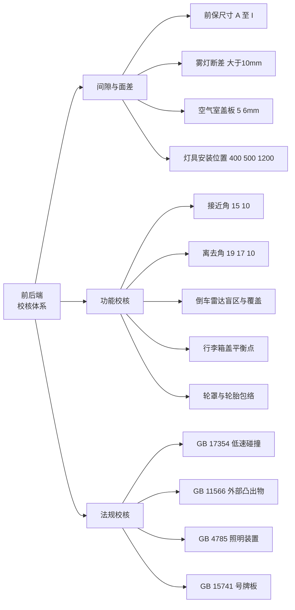
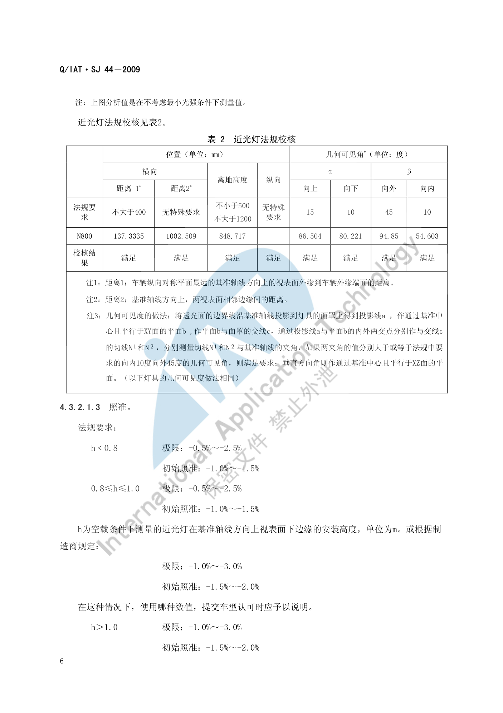
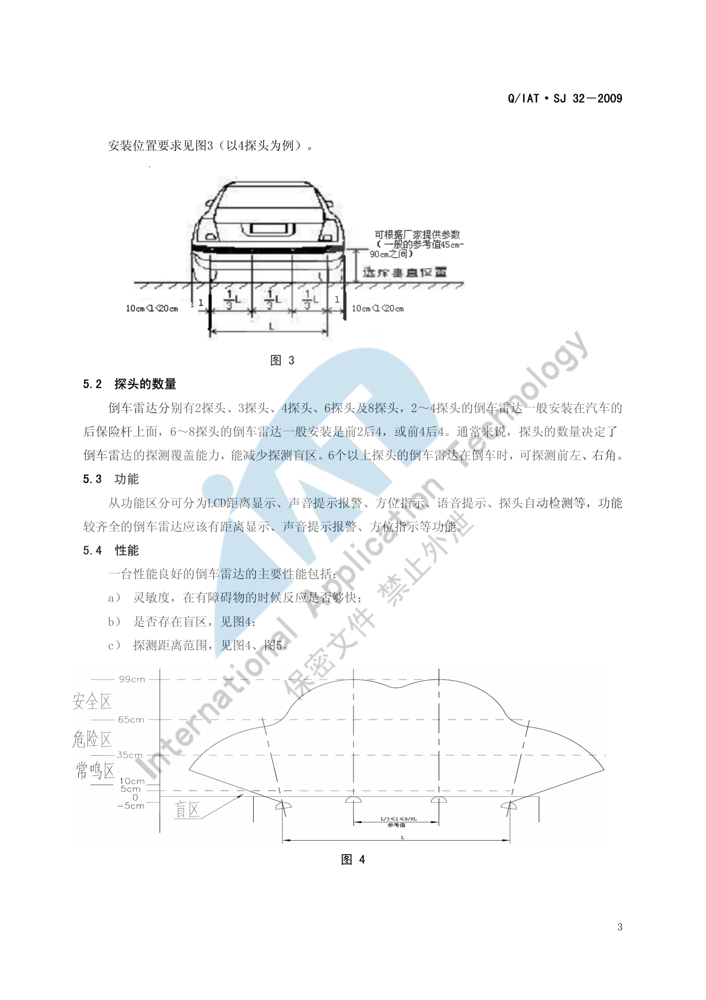

# 前后端校核标准

!!! quote "内容来源"
    本页正文抽取自《总布置》知识库中**可文本解析**的文件：
    `SJ 24-2008 前后保险杠设计指导书`、`SJ 44-2009 整车外部照明及光信号装置的技术要求和校核规范`、
    `SJ 32-2009 倒车雷达设计规范`、`SJ 53-2010 行李箱盖扭簧设计指导书`、
    `SJ 19-2008 空气室盖板设计指导书`、`SJ 51-2009 轮胎间隙校核规范`、
    `QCD-A0-005 概念草图阶段总布置检查规范`。
    企业规范编号原样保留。

## 校核体系

## 概述

### 要点

前后端区域是**法规密度最高**的区域：低速碰撞、外部凸出物、照明装置安装、号牌板位置四类法规同时作用，且都要在造型阶段就锁定。

| 类别 | 判据来源 | 主要校核项 |
|---|---|---|
| 间隙与面差 | `SJ 24/44/19` | 前保内部尺寸链、雾灯断差、灯具安装位置与几何可见度、空气室盖板间隙 |
| 功能校核 | `SJ 24/32/53/51` | 接近角/离去角、倒车雷达盲区、行李箱盖平衡点、轮胎包络 |
| 法规校核 | `GB 17354/11566/20182/4785/15741/GA 36` | 低速碰撞、外部凸出物、照明装置、号牌板 |

### 示例

校核的输入是**空载/满载地面线**与**造型 CAS 面**：接近角、离去角、灯具离地高度、雷达探头离地高度都以地面线为基准，任何悬架或轮胎规格变更都会同时影响这几项。

### 注意事项

- **不同市场法规差异属待人工补充项**：本页依据均为国标（GB），未见 ECE / FMVSS 的对应差异清单；
  可参考的线索：`SJ 44-2009` 的配置要求表同时列出 `GB 4785-2007` 与 `ECE R48` 的配备要求，
  说明该规范本身是按"国标 + 欧标"双轨编写的。

## 间隙与面差

### 要点

**（1）前保险杠内部尺寸链**（`SJ 24-2008` §5.2.5，均为经验值，需按车型具体分析）

| 代号 | 含义 | 要求 |
|---|---|---|
| A | 发罩最前端与保险杠 YO 处正向碰撞点的距离 | **≥ 70 mm**；考虑行人保护 **≥ 90 mm** |
| B | 前保险杠面板厚度 | **2.5 mm–3 mm** |
| C | 前保险杠与缓冲块的间隙 | **≥ 2 mm** |
| D | 缓冲块厚度 | **≥ 55 mm**；考虑行人保护 **≥ 75 mm**；不加缓冲块时保险杠面板与防撞梁间隙 **≥ 15 mm** |
| E | 防撞梁最前端与发罩最前端的距离 | **≥ 10 mm** |
| F | 防撞梁撞击后最小移动距离 | 钢板件 **≥ 20 mm**；塑料件 **≥ 90 mm** |
| G | 防撞梁撞击后的位置到最近零件的距离 | **≥ 10 mm** |
| H | 缓冲块及防撞梁有效宽度 | **≥ 80 mm** |
| I | 前保险杠在中格栅安装处的 X 向尺寸差 | **≤ 10 mm** |

**（2）灯具与保险杠的断差**（§5.2.4）

| 项目 | 要求 |
|---|---|
| 前雾灯与前保险杠的断差（位于侧面 30° 碰撞位置时） | **> 10 mm**；雾灯面板材料为 PVC 等软材料时可小于 10 mm |
| 后雾灯与后保险杠的断差 | **同前保要求** |

> 另一条更优的策略是：**前雾灯尽量不要布置在侧面碰撞位置上**。

**（3）照明装置的位置与几何可见度**（`SJ 44-2009` §4.3.2.1 以近光灯为例）

| 参数 | 法规要求 |
|---|---|
| 距离 1（纵向对称平面最远的基准轴线方向上的视表面外缘 → 车辆外缘端面） | **≤ 400 mm** |
| 离地高度 | **不小于 500 mm**，**不大于 1200 mm** |
| 几何可见度：向上 / 向下 | **15° / 10°** |
| 几何可见度：向外 / 向内 | **45° / 10°** |
| 部分遮蔽的处理 | 应提供证明，表明**未受遮蔽的部分仍满足型式检验所需的配光值**；水平面以下的垂直几何可见度角可减至 **5°**（灯离地高度 < 750 mm）时，配光测量范围可减至**水平以下 5°** |

**（4）空气室盖板**（`SJ 19-2008` §5.4）

| 对象 | 间隙 |
|---|---|
| 与发动机罩运动间隙 | **≥ 5 mm** |
| 与发动机罩铰链运动间隙 | **≥ 6 mm** |
| 与翼子板、侧围外板 | **0 mm–2 mm** |
| 与前风挡玻璃 | 一般**过盈 1 mm** |
| 与雨刮旋转轴、雨刮摇臂运动间隙 | **≥ 5 mm** |
| 与雨刮电机安全间隙 | **≥ 5 mm** |
| 前方视野 | **不能高于前方下视野** |

### 示例

近光灯的安装位置校核以"距离 1、距离 2、离地高度"三个量为一组，配合几何可见度的四个角度（向上 15°、向下 10°、向外 45°、向内 10°）共同判定：

几何可见度的测量方法需按"透光面边界投影 → 面罩交线 → 切线夹角"的顺序求作：

### 注意事项

- **公差链分析要点属待人工补充项**：已解析条款中未见前后端区域的公差链（钣金—灯具—保险杠—饰件）分析方法与分配原则；
  可借用的工程线索：前保通过"安装支架 + 定位点"与车身连接，`SJ 24-2008` §3.6 要求"安装点、定位点设计应保证定位合理、装配紧固，与周围零件**配合公差易于控制和调整**"；
- **断差（面差）与间隙是两个独立公差**：雾灯断差 > 10 mm 是碰撞法规要求（碰撞点必须落在保险杠大面上），与间隙公差不是同一体系，不可互相抵扣。

## 功能校核

### 要点

**（1）通过性**（`SJ 24-2008` §5.3、§5.4）

| 项目 | 空载 | 满载 |
|---|---|---|
| 接近角 | **≥ 15°** | **≥ 10°** |
| 离去角（两厢车） | **> 19°** | **> 10°** |
| 离去角（三厢车） | **> 17°** | **> 10°** |

**（2）倒车雷达视野与盲区**（`SJ 32-2009`）

| 校核项 | 判据 |
|---|---|
| 工作速度条件 | 泊车测距警示装置在**泊车速度不超过 0.5 m/s** 时能探测监控范围内的障碍物并发出警示信号 |
| 探头数量与覆盖 | **2～4 探头**一般安装在后保险杠上；**6～8 探头**一般为**前 2 后 4**或**前 4 后 4**；**6 个以上**可探测前左、右角 |
| 盲区 | 是否存在盲区是首要性能项（其他两项为灵敏度与探测距离范围） |
| 安装方式 | 内嵌式（开孔安装）为主；外置粘贴式已基本不用 |
| 外观一致性 | **探头颜色应与车身颜色相符** |
| 显示与报警 | 显示：数字/颜色/距离；报警：声音/颜色/距离 |

**（3）行李箱盖开启力与平衡点**（`SJ 53-2010` §2.2.1.1）

| 校核项 | 判据 |
|---|---|
| 下平衡点 | 关闭状态开锁后，**开启弹力应足以使行李箱盖转动 10° 左右** |
| 上平衡点 | 位于最大开启角度**之前约 10°–20°** |
| 平衡区间 | 上、下平衡点之间**任意位置都能停止**（`MT − MF ≤ MS ≤ MT + MF`） |
| 全开支撑 | 最大角度时扭簧**应有足够扭矩支撑**行李箱盖以承受一般风力，**否则回落会造成意外事故** |
| 关闭力 | 需能克服**扭簧扭矩 + 密封条反作用力** |

**（4）轮罩与轮胎包络**（`SJ 51-2009`）

| 悬架形式 | 工况 |
|---|---|
| **独立前悬架**（4 工况） | ① 转向角 0°、下极限到上极限；② 转向角 10°、上跳至上极限；③ 转向角 20°、上跳至缓冲块压缩 1/2；④ 全转向、上跳至缓冲块压缩 1/3 |
| **非独立前悬架**（4 工况） | ① 0°、下极限到上极限；② 0°、一侧跳动至轴线翘起 5°；③ 全转向、下极限到上极限；④ 全转向、一侧跳动至轴线翘起 5° |
| **独立后悬架** | 从下极限到上极限 |
| **非独立后悬架**（3 工况） | ① 两侧同时跳动；② 一侧在设计位置、另一侧上跳至上极限；③ 一侧跳至上极限使后轴翘起 5°（备选） |

输入条件须包含：**最大胎**数据（底盘无法提供准确最大胎断面时按规范绘制）、**有防滑链要求时考虑防滑链尺寸**、车身相关数据（纵梁、轮罩、翼子板、挡泥板）与前后悬架运动分析数据。依据 `SAE J1214 JAN1992`、`GB/T 2978-2008`、`GB/T 3487-2005`。

### 示例

倒车雷达的探头位置（以 4 探头为例）需在保险杠曲面上布置，保证探测锥重叠覆盖、减少盲区：

### 注意事项

- **遮挡与误报风险**：倒车雷达探头的探测锥必须避开自身保险杠的**曲面凸出部分**与后拖钩、排气口等附件，否则会产生稳定误报；工程上应做**探头后方遮挡检查**（探头正前方的保险杠开孔是否遮挡）；
- 行李箱盖的"平衡状态"体验直接取决于摩擦力矩 MF：MF 过小则中间位置难以停住，过大则手感沉重——**MF 不是越小越好**。

## 法规校核

### 要点

**（1）汽车前后端碰撞保护装置**（`GB 17354`）

| 项目 | 要求 |
|---|---|
| 碰撞位置 | 正前方两次、正后方两次（整备质量 / 加载试验车质量各一次）；侧向前 30° 角与侧向后 30° 角各一次；"加载试验车质量"时对另一前车角与另一后车角各一次 |
| 碰撞高度 | **445 mm** |
| 碰撞速度 | 正向 **4 km/h**；侧向 30° 角 **2.5 km/h** |
| 正碰点位置 | 必须在前后保的**大面**（类似铅垂面）上，与质量状态无关 |

**（2）外部凸出物**

| 标准 | 适用范围 |
|---|---|
| `GB 11566`（`GB 11566-1995 轿车外部凸出物`） | **轿车** |
| `GB 20182`（`GB 20182-2006 商用车驾驶室外部凸出物`） | **商用车驾驶室**（采用 `ECE R61`） |

**（3）外部照明和光信号装置的安装**（`GB 4785-2007`）

校核步骤分两步：**① 配置校核**（逐项核对"必备/选装/禁用"）；**② 布局、位置、几何可见度和电路连接校核**。配置要求的关键结论：

| 装置 | 要求 |
|---|---|
| 远光灯 / 近光灯 | 汽车**必备**，挂车**禁用** |
| 制动灯 | **2 只 S1 或 S2 类必备**，1 只 S3 类选装 |
| 前位灯 | 汽车和**宽度 > 1600 mm** 的挂车必备 |
| 后雾灯 | **必装 1 只或两只** |
| 前雾灯 | 选装，**挂车禁止使用** |
| 三角形后回复反射器 | **汽车禁用** |
| 驻车灯 | 长度 ≤ 6 m 且宽度 ≤ 2 m 的汽车选装，**其它车辆禁用** |
| 示廓灯 | 宽度介于 **1.80 m–2.10 m** 的车辆选装 |
| 危险警告信号 | 必备，应由**诸转向信号灯同时工作**发出 |
| 昼间行驶灯 | 汽车选装，挂车禁用 |

**（4）号牌板（架）及其位置**

依据 `GB 15741 汽车和挂车号牌板（架）及其位置` 与 `GA 36 中华人民共和国机动车号牌`——号牌板的**位置、安装面角度与尺寸**需保证号牌可见性与牢固性（本页未展开细则，见"待人工补充"）。

**（5）其它相关法规**

| 标准 | 关联内容 |
|---|---|
| `GB 11551-2003 乘用车正面碰撞的乘员保护` / `ECE R94` | 小腿压力指标 TCFC ≤ 8 kN、胫骨指数 ≤ 1.3（见 [总布置工作流程](../basics/workflow.md)） |
| `GB 20071-2006 汽车侧面碰撞的乘员保护` / `ECE R95` | 侧碰试验条件 950 kg / 50 km/h / 90°（见 [立柱布置](../door-trim/pillar.md)） |
| `GB 11552-1999 轿车内部凸出物` | 内饰件凸出物（见 [IP&CNSL 校核标准](../ip-cnsl/check.md)） |
| `GB 11556-94 汽车风窗玻璃除霜系统的性能要求及实验方法` | 除霜性能（与空气室盖板、出风口相关） |

### 示例

法规区域划分的本质是"**用几何条件换法规符合性**"：低速碰撞要求碰撞点落在前后保大面上（决定造型的铅垂面位置），外部凸出物要求圆角与凸出量，照明装置要求几何可见度——三者共同构成了前后端造型的**可用边界**。

### 注意事项

- **校核时机**：`SJ 24-2008` §5.1 把前后保的前期分析分成两阶段——**效果图阶段**只做初步概念分析（对应 §5.2、§5.3、§5.4、§5.8、§5.9 的内容），**CAS 阶段**才要求对所有内容分析校核。**法规项在效果图阶段就要初判**，不能留到 CAS 之后；
- **号牌板位置**是常被忽视的法规项：`GB 15741` 与 `GA 36` 对位置有明确要求，且它与保险杠造型、倒车雷达位置可能冲突，应在布置阶段一并考虑；
- 已解析条款中**未见行人保护的具体法规判据**（本页仅有"考虑行人保护时 A ≥ 90 mm、D ≥ 75 mm"两条经验值），属待补充项。

## 待人工补充

!!! warning "本页待人工补充清单"
    - **公差链分析**方法与分配原则（前后端：钣金—灯具—保险杠—饰件）；
    - **行人保护**的法规判据（腿部与头部碰撞试验要求）；
    - **号牌板位置**细则：`SJ 24-2008` 引用了 `GB 15741`、`GA 36`，但本页未展开具体位置参数
      （知识库中对应的 `AEM-A4-006 号牌板位置校核规范` 因读取问题**未采用**）；
    - **不同市场法规差异清单**（GB vs ECE vs FMVSS）；
    - **前置摄像头、毫米波雷达**等新型传感器的视野校核：知识库中未见对应条款
      （`SJ 32-2009` 仅覆盖超声波倒车雷达）；
    - `SJ 44-2009` 共 26 页，本页仅解析了近光灯的校核示例，其余灯具（转向灯、后位灯、
      制动灯、回复反射器等）的位置与几何可见度条款尚未逐项提取；
    - 知识库中以下文件虽相关但因读取问题**未采用**：`AEM-A4-002 外部凸出物校核规范`、
      `AEM-A4-004 汽车前、后端保护装置校核规范`、`AEM-A4-006 号牌板位置校核规范`、
      `AEM-A4-005 挂车、货车侧面及后下部防护校核规范与流程`。

    建议：在 IMA 客户端中打开对应文件补充条款，或按"规范编号 + 页码"方式人工引用。

---

## 下一步阅读

- [前端区域布置](front.md)：前保险杠、前舱饰件与灯具接口
- [后端区域布置](rear.md)：后保险杠、行李箱与倒车雷达
- [IP&CNSL 校核标准](../ip-cnsl/check.md)：内部凸出物与膝部保护
- [立柱布置](../door-trim/pillar.md)：侧面碰撞与 B 柱断面系数
