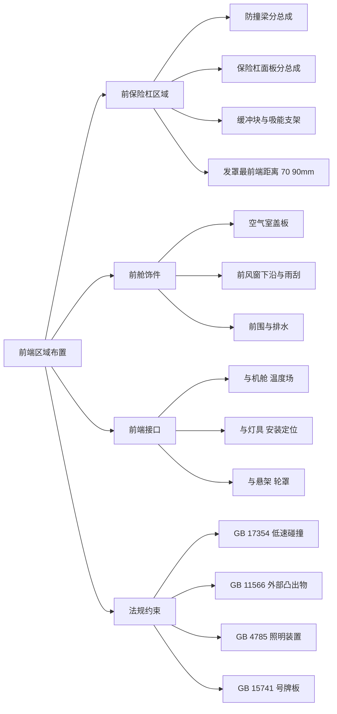
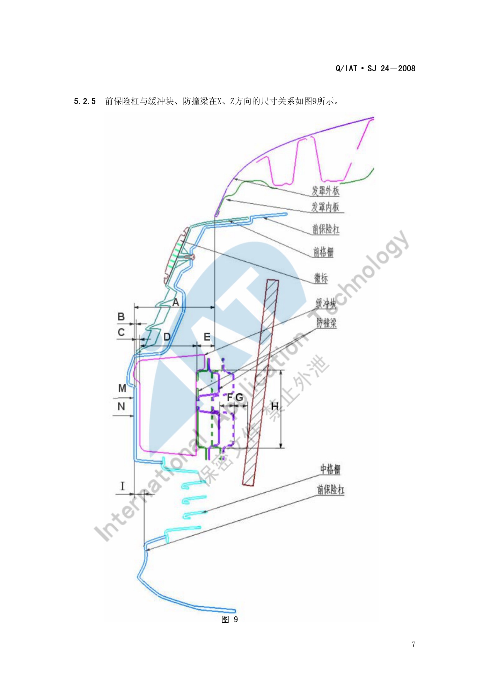
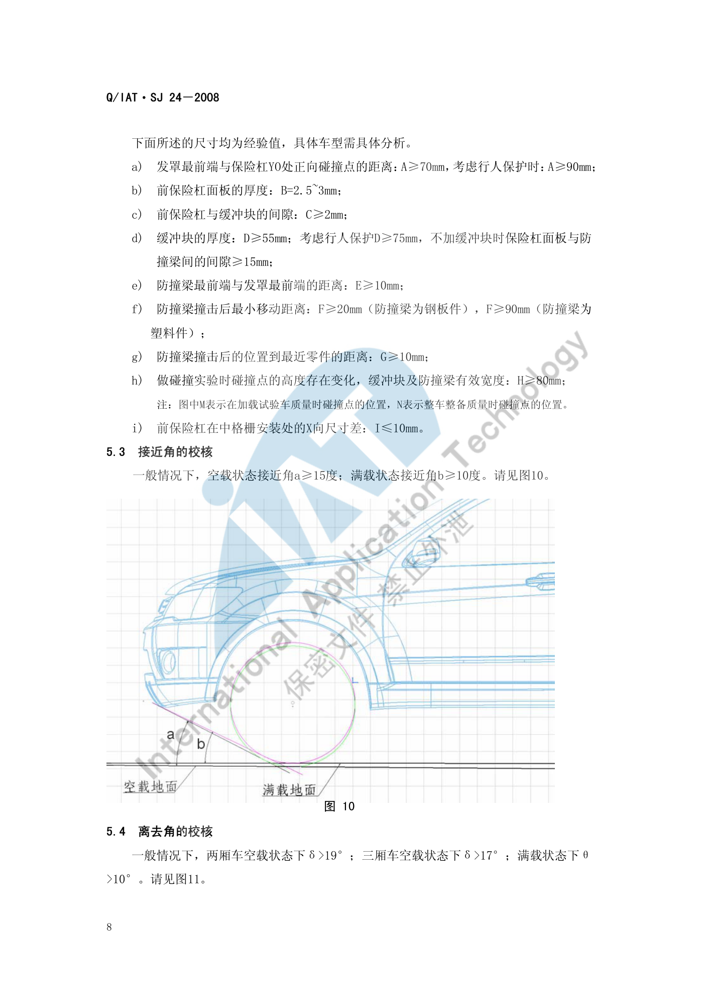
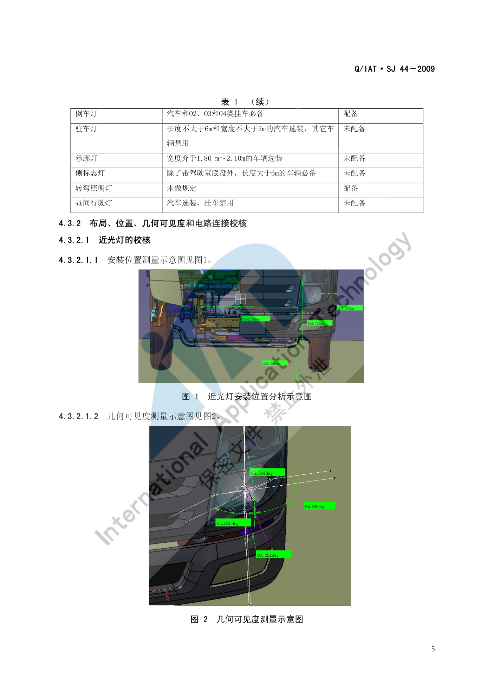

# 前端区域布置

!!! quote "内容来源"
    本页正文抽取自《总布置》知识库中**可文本解析**的文件：
    `SJ 24-2008 前后保险杠设计指导书`、`SJ 44-2009 整车外部照明及光信号装置的技术要求和校核规范`、
    `SJ 19-2008 空气室盖板设计指导书`、`SJ 36-2009 汽车前组合灯设计规范`。
    企业规范编号原样保留。

## 前端区域布置体系

## 概述

### 要点

前端区域 = **前保险杠总成 + 前舱饰件 + 灯具 + 进气/散热通道**，其布置由三类约束共同决定：

| 约束类型 | 内容 | 依据标准 |
|---|---|---|
| **碰撞** | 低速碰撞前后的吸能链路（保险杠面板 → 缓冲块 → 防撞梁 → 吸能支架 → 纵梁） | `GB 17354 汽车前后端碰撞保护装置` |
| **法规** | 外部凸出物、照明装置安装、号牌板位置 | `GB 11566`、`GB 20182`、`GB 4785`、`GB 15741`、`GA 36` |
| **人机与通过性** | 接近角、发罩开启、维修与检查可达性 | `SJ 24-2008` |

**前保险杠的两大分总成**（`SJ 24-2008` §4.1）：

| 分总成 | 组成 |
|---|---|
| **防撞梁分总成** | 缓冲块、防撞梁、吸能支架、安装支架——碰撞时吸收能量的机构。常见两种：① 只起碰撞吸能作用；② 既吸能，又兼作前保上边中部的**安装面** |
| **保险杠面板分总成** | 保险杠面板 + 分装其上的相关件，是具有车身显著特征的**外包围件** |

**前保险杠面板的两种类型**（§4.1.3，以是否与格栅分装区分）：

| 类型 | 装配方式 | 优劣 |
|---|---|---|
| **带"羊角"** | 前格栅**先分装**在前保险杠上，再在总装线上装配 | 模块化好，格栅与保险杠配合间隙可在分装线调节 |
| **不带"羊角"** | 总装线上**先装前保险杠**，再装前格栅 | **模块化集成较差**，前保与前格栅配合间隙不易调节，增加总装工时、影响下线节拍 |

### 示例

前保险杠与缓冲块、防撞梁在 X、Z 方向的尺寸关系是前端布置的核心断面：

### 注意事项

- **模块化装配方式应在结构设计前就决策**：带/不带"羊角"直接影响总装节拍与配合间隙可调性，属于"设计决定制造"的典型；
- 前端是**低速碰撞法规的唯一直接对象区域**，任何造型改动都可能改变正碰点位置（必须在前后保的**大面**即类似铅垂面上）。

## 前保险杠区域

### 要点

**（1）低速碰撞法规校核要点**（`SJ 24-2008` §5.2，依据 `GB 17354`）

| 项目 | 要求 |
|---|---|
| 碰撞次数与位置 | 车身纵向**正前方**两次碰撞（一次"整车整备质量"、一次"加载试验车质量"）；"整车整备质量"时对**侧向前 30° 角**一次侧向碰撞；"加载试验车质量"时对另一前"车角"各一次碰撞 |
| 碰撞高度 | **445 mm** |
| 碰撞速度 | 正向 **4 km/h**；侧向 30° 角 **2.5 km/h** |
| 正面碰撞位置 | 正碰点必须在前后保的**大面**上（类似铅垂面），且**不论在何种质量状态下**都必须在同一大面上 |
| 侧面 30° 角碰撞位置 | **前雾灯尽量不要布置在侧面碰撞位置上**；若必须布置，前保险杠与前雾灯**断差应大于 10 mm**（雾灯面板材料为 PVC 等软材料时可小于 10 mm） |

**（2）前保险杠关键尺寸（经验值，需按车型具体分析）**（§5.2.5）

| 代号 | 含义 | 要求 |
|---|---|---|
| **A** | 发罩最前端与保险杠 YO 处正向碰撞点的距离 | **≥ 70 mm**；考虑行人保护时 **≥ 90 mm** |
| **B** | 前保险杠面板的厚度 | **2.5 mm–3 mm** |
| **C** | 前保险杠与缓冲块的间隙 | **≥ 2 mm** |
| **D** | 缓冲块的厚度 | **≥ 55 mm**；考虑行人保护时 **≥ 75 mm**；**不加缓冲块**时保险杠面板与防撞梁间的间隙 **≥ 15 mm** |
| **E** | 防撞梁最前端与发罩最前端的距离 | **≥ 10 mm** |
| **F** | 防撞梁撞击后最小移动距离 | 钢板件防撞梁 **≥ 20 mm**；塑料件防撞梁 **≥ 90 mm** |
| **G** | 防撞梁撞击后的位置到最近零件的距离 | **≥ 10 mm** |
| **H** | 缓冲块及防撞梁有效宽度（碰撞试验时碰撞点高度存在变化） | **≥ 80 mm** |
| **I** | 前保险杠在中格栅安装处的 X 向尺寸差 | **≤ 10 mm** |

**（3）通过性校核**（§5.3、§5.4）

| 项目 | 空载 | 满载 |
|---|---|---|
| 接近角 | **≥ 15°** | **≥ 10°** |
| 离去角 | 两厢车 **> 19°**；三厢车 **> 17°** | **> 10°** |

### 示例

接近角是"前悬 + 前保下缘高度"的直接结果，其校核基准为空载地面线与前轮中心：

### 注意事项

- **行人保护与低速碰撞在空间上互相挤占**：考虑行人保护时 A 从 70 mm 增至 90 mm、D 从 55 mm 增至 75 mm，这两项同时加大意味着**前端总长增加或造型前脸后移**，必须在造型阶段就把结论作为边界输入；
- **雾灯位置与侧碰点的关系是硬约束**：雾灯体积大且刚性，布置在 30° 侧碰点上会显著改变碰撞响应，首选是避开，次选是保证断差 > 10 mm。

## 前舱饰件

### 要点

**（1）空气室盖板**（`SJ 19-2008`，详见 [顶棚布置](../door-trim/roof.md) 的同名小节）

| 项目 | 要求 |
|---|---|
| 法规 | 满足 `GB 11566-1995 轿车外部凸出物` |
| 功能 | 装饰；**空调进风**；**前风挡流水导向**；**密封发动机舱** |
| 空调进风面积比 | 理想状态：盖板进风口总面积 / 空气室腔截面积 / 空调进风口面积 **≥ 2.4 / 1.6 / 1**；实际状态：盖板进风口面积 / 空调进风口面积 **≥ 1.5 / 1** |
| 开孔禁则 | **空调进风口上方不能开孔**（Y 向间距 **≥ 80 mm**）；**雨刮电机正上方不能开孔** |
| 与发动机罩运动间隙 | **≥ 5 mm** |
| 与发动机罩铰链运动间隙 | **≥ 6 mm** |
| 与翼子板、侧围外板 | **0 mm–2 mm** |
| 与前风挡玻璃 | 一般**过盈 1 mm** |
| 与雨刮旋转轴、雨刮摇臂运动间隙 | **≥ 5 mm** |
| 与雨刮电机安全间隙 | **≥ 5 mm** |
| 前方视野 | **不能高于前方下视野** |

**（2）前风窗与雨刮**（`SJ 5-2009`，详见 [视野校核](../ergonomics/vision.md)）

- 前风窗 A 区、B 区两个必须被刮净的区域由四个平面定义（A 区：13°/3° 仰角/1° 俯角/20°；B 区：7° 仰角/5° 俯角/17°/对称面，且**距透明部分边缘向内至少 25 mm**）；
- 刮刷面积需区分**设计刮刷面积**（理论计算）与**实际刮刷面积**（刮片最高频率工作时的实际刮到面积）。

**（3）前组合灯**（`SJ 36-2009 汽车前组合灯设计规范`）

前组合灯的定位、安装结构与配光要求由专项规范约束，需与保险杠、翼子板、发罩的间隙体系统一校核（本页未展开，见"待人工补充"）。

### 示例

空气室盖板跨越"前风窗—雨刮—发动机罩—翼子板"四个系统，是前端间隙体系最密集的零件之一。

### 注意事项

- **排水与散热路径属待人工补充项**：已解析条款给出空气室盖板的**流水导向**三种形式（单独流水槽 / 按造型曲面做流水槽 / 靠密封条引导），但未见**前端整体散热路径**（进气格栅—散热器—机舱排气）的量化要求；
  相关的量化判据可参考 `SJ 17-2009 散热器开口比计算方法及判定`（已下载，尚未逐条解析）；
- 机舱大件的**温度场定位**由 `QCD-A0-005` 约束（蓄电池 -30~80 ℃、转向机与排气件 ≥ 60 mm、引气口 ≤ 40 ℃ 等），见 [总布置工作流程](../basics/workflow.md)。

## 前端接口关系

### 要点

**（1）与前部照明装置**（`SJ 44-2009`，依据 `GB 4785-2007`）

适用范围：M、N、O 类汽车及挂车。**配置校核**是第一步——按 `GB 4785-2007` / `ECE R48` 逐项核对配备要求：

| 装置 | 配备要求（示例） |
|---|---|
| 远光灯 / 近光灯 | **汽车必备，挂车禁用** |
| 转向信号灯 | 汽车和挂车**必备** |
| 制动灯 | **2 只 S1 或 S2 类必备**，1 只 S3 类选装 |
| 牌照灯 | 必备 |
| 前位灯 | 汽车和**宽度大于 1600 mm** 的挂车必备 |
| 后位灯 | 必备 |
| 非三角形后回复反射器 | 汽车必备 |
| 三角形后回复反射器 | **汽车禁用** |
| 非三角形侧回复反射器 | 长度 **> 6 m** 的汽车和挂车必备，≤ 6 m 选装 |
| 危险警告信号 | 必备，应**由诸转向信号灯同时工作**发出 |
| 前雾灯 | 选装，**挂车禁止使用** |
| 后雾灯 | **必装 1 只或两只** |
| 倒车灯 | 汽车和 O2、O3、O4 类挂车必备 |
| 驻车灯 | 长度 ≤ 6 m 且宽度 ≤ 2 m 的汽车选装，**其它车辆禁用** |
| 示廓灯 | 宽度介于 **1.80 m–2.10 m** 的车辆选装 |
| 侧标志灯 | 除带驾驶室底盘外，长度 **> 6 m** 的车辆必备 |
| 昼间行驶灯 | 汽车选装，挂车禁用 |

**（2）近光灯的位置与几何可见度校核**（`SJ 44-2009` §4.3.2.1）

| 参数 | 法规要求 |
|---|---|
| 距离 1（纵向对称平面最远的基准轴线方向上的视表面外缘到车辆外缘端面） | **不大于 400 mm** |
| 距离 2（基准轴线方向上，两视表面相邻边缘间的距离） | 无特殊要求 |
| 离地高度 | **不小于 500 mm**，**不大于 1200 mm** |
| 几何可见度：向上 | **15°** |
| 几何可见度：向下 | **10°** |
| 几何可见度：向外 | **45°** |
| 几何可见度：向内 | **10°** |

几何可见度的做法：将**透光面的边界线沿基准轴线投影到灯具面罩上**得到投影线 a；作通过基准中心且平行于 XY 面的平面 b；作平面 b 与面罩的交线 c；通过投影线 a 与平面 b 的内外两交点分别作与交线 c 的切线 N1 和 N2；分别测量 N1、N2 与基准轴线的夹角，**若分别大于或等于法规要求的向内 10°、向外 45°，则满足要求**；垂直方向角则作通过基准中心且平行于 XZ 面的平面。

> 若安装灯具时其视平面受到车辆部件**部分遮蔽**，应提供证明表明**未被遮蔽部分仍满足型式检验所需的配光值**。当水平面以下的垂直方向几何可见度角可减至 **5°**（灯的离地高度小于 750 mm）时，安装后的灯具配光测量范围可减至**水平以下 5°**。

**（3）与机舱、悬架、轮罩**（`QCD-A0-005`、`SJ 51-2009`）

- 机舱布置以**温度场**为大件定位依据（见 [总布置工作流程](../basics/workflow.md)）；
- 前轮包络面按**独立/非独立前悬的四种工况**制作（见 [校核标准](check.md)），轮罩与翼子板边界由此确定。

### 示例

近光灯的法规校核以"安装位置 + 几何可见度"两张图为核心，几何可见度必须按"透光面投影 → 面罩交线 → 切线夹角"的步骤逐项测量：

### 注意事项

- **接口变更的传递机制**：前端区域是"造型—钣金—灯具—线束"多专业交汇区，任何一方的位置变更都会改变灯具的几何可见度，**灯具校核必须跟随造型版本重跑**；
- 几何可见度是**配光量的几何前提**：`SJ 44-2009` 明确"视平面受部分遮蔽时应提供证明"——说明**遮挡不是绝对禁止，而是需要证明**，工程上应优先通过造型解决而非走证明路径。

## 待人工补充

!!! warning "本页待人工补充清单"
    - **行人保护**的量化要求：本页仅有"考虑行人保护时 A ≥ 90 mm、D ≥ 75 mm"两条经验值，
      未见腿部碰撞试验（小腿/大腿）与头部碰撞基准区的具体要求；
    - **前组合灯**的定位与配光要求：`SJ 36-2009` 已下载（21 页）但本页未展开；
    - **散热器开口比**：`SJ 17-2009 散热器开口比计算方法及判定` 已下载（7 页）但未解析；
    - **前端整体散热路径**（进气—散热器—机舱排气）的量化要求；
    - `SJ 24-2008` 的图 1～图 6（防撞梁与面板分总成结构）、图 7/8（低速碰撞试验布置）
      等为图片页，本页只引用了图 9～图 11；
    - 知识库中以下文件虽相关但因读取问题**未采用**：`AEM-A4-002 外部凸出物校核规范`、
      `AEM-A4-004 汽车前、后端保护装置校核规范`、`AEM-A4-006 号牌板位置校核规范`、
      `AEM-A1-103 机舱布置流程`。

    建议：在 IMA 客户端中打开对应文件补充条款，或按"规范编号 + 页码"方式人工引用。

---

## 下一步阅读

- [后端区域布置](rear.md)：后保险杠与行李箱区域
- [前后端校核标准](check.md)：间隙、功能与法规校核清单
- [顶棚布置](../door-trim/roof.md)：空气室盖板与流水导向
- [总布置工作流程](../basics/workflow.md)：机舱温度场与吸能距离 L1/L2
