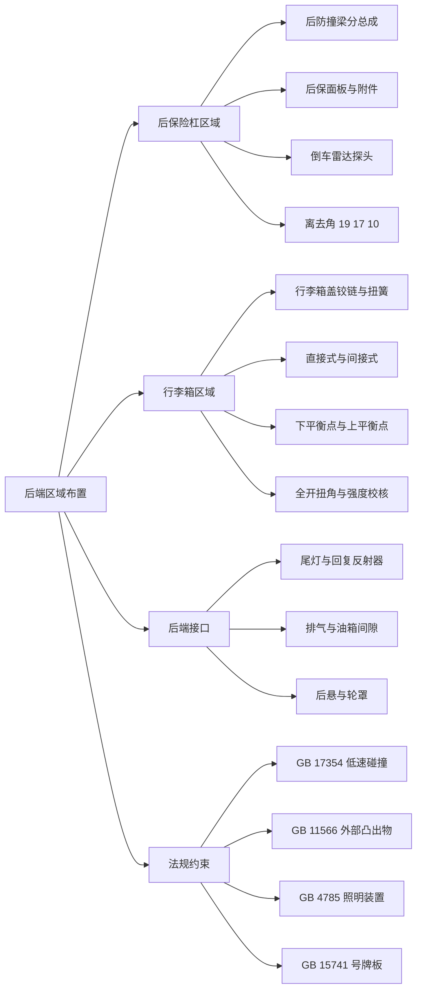
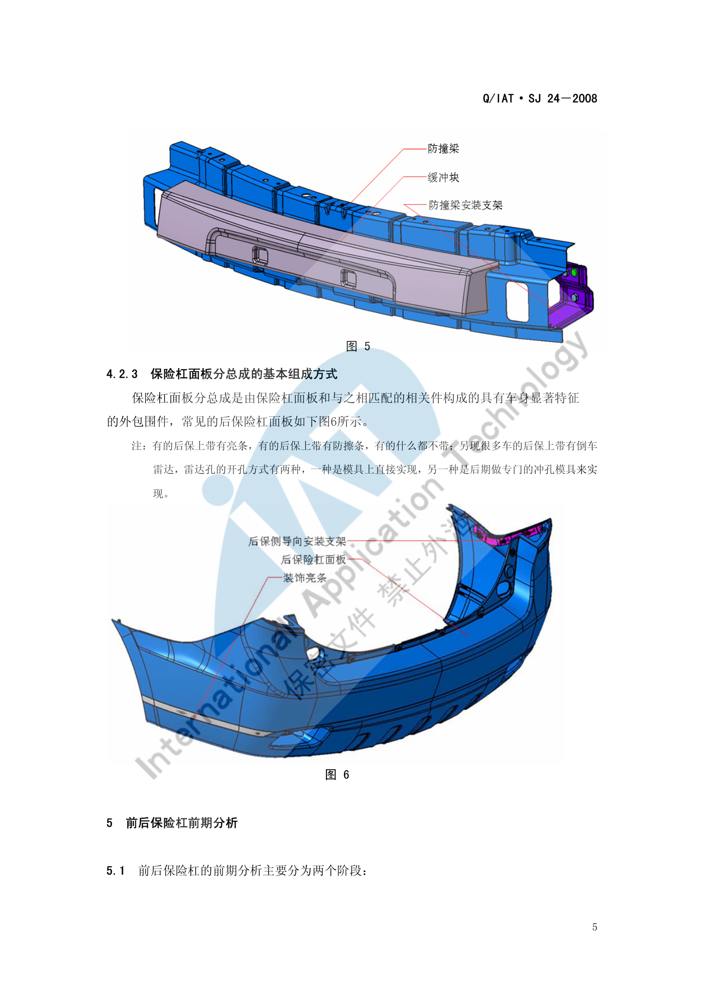
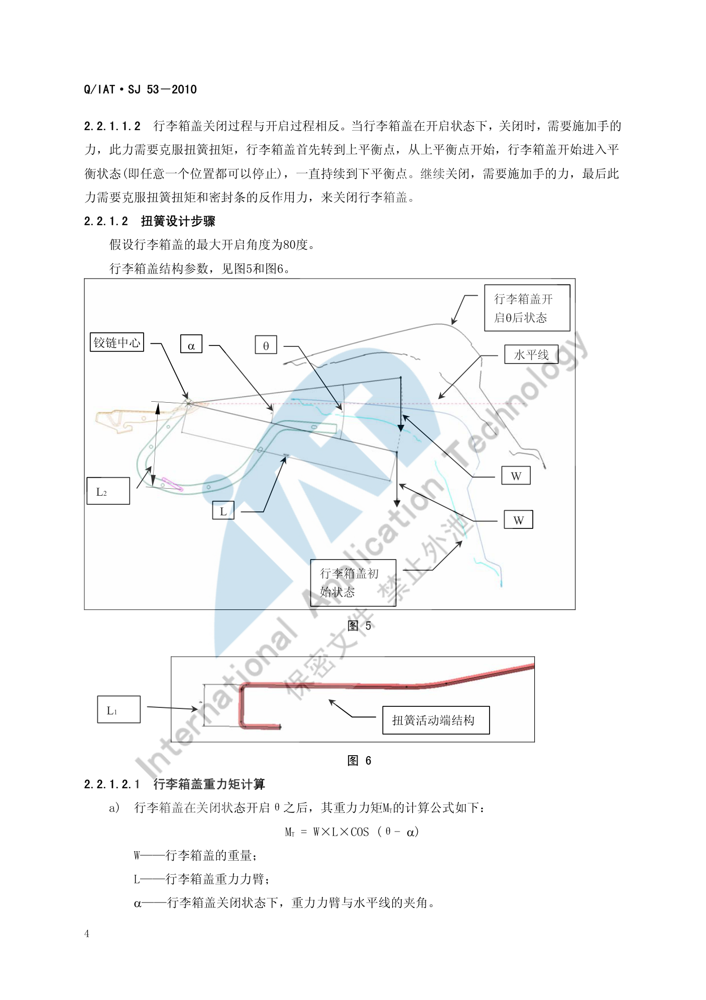

# 后端区域布置

!!! quote "内容来源"
    本页正文抽取自《总布置》知识库中**可文本解析**的文件：
    `SJ 24-2008 前后保险杠设计指导书`、`SJ 53-2010 行李箱盖扭簧设计指导书`、
    `SJ 32-2009 倒车雷达设计规范`、`SJ 44-2009 整车外部照明及光信号装置的技术要求和校核规范`、
    `QCD-A0-005 概念草图阶段总布置检查规范`。
    企业规范编号原样保留。

## 后端区域布置体系

## 概述

### 要点

后端区域 = **后保险杠总成 + 行李箱（盖）系统 + 后部照明 + 排气**，其布置约束分四类：

| 约束类型 | 内容 | 依据 |
|---|---|---|
| **碰撞** | 后保吸能链路与低速碰撞法规 | `GB 17354` |
| **法规** | 外部凸出物、照明装置、号牌板位置 | `GB 11566`、`GB 20182`、`GB 4785`、`GB 15741`、`GA 36` |
| **人机与操作** | 离去角、行李箱盖开启力与平衡点、倒车雷达警示 | `SJ 24`、`SJ 53`、`SJ 32` |
| **热害与间隙** | 排气与油箱、地板下部件离地间隙 | `QCD-A0-005` |

**后保险杠的两大分总成**（`SJ 24-2008` §4.2）：

| 分总成 | 组成 |
|---|---|
| **后防撞梁分总成** | 缓冲块、防撞梁、安装支架——碰撞时吸收能量的机构 |
| **后保面板分总成** | 保险杠面板 + 与之相匹配的相关件构成的外包围件 |

**后保面板的附件差异**（§4.2.3 注）：有的后保带**亮条**，有的带**防擦条**，有的什么都不带；目前很多车型的后保带**倒车雷达**，雷达孔的开孔方式有两种——**模具上直接实现**，或**后期做专门的冲孔模具**来实现。

### 示例

后防撞梁分总成的组成（缓冲块 + 防撞梁 + 安装支架）决定了后端吸能链路与维修更换策略：

### 注意事项

- **雷达孔的开孔方式应在模具开发前决策**："模具直接实现"成本前置但一致性好；"后期冲孔"灵活但需额外的冲孔模具与工序，且孔边缘质量与钣金/塑料件厚度相关；
- 后保面板是**售后更换率最高**的外覆盖件之一，`SJ 24-2008` §3.5 明确要求"保证在主机厂调试面差或间隙时要方便，在售后局部维修损坏件时不会再导致相关件划伤、损坏"。

## 后保险杠区域

### 要点

**（1）低速碰撞法规校核要点**（`SJ 24-2008` §5.2，依据 `GB 17354`）

| 项目 | 要求 |
|---|---|
| 碰撞次数与位置 | 车身纵向**正后方**两次碰撞（一次"整车整备质量"、一次"加载试验车质量"）；"整车整备质量"时对**侧向后 30° 角**一次侧向碰撞；"加载试验车质量"时对另一后"车角"各一次碰撞 |
| 碰撞高度 | **445 mm** |
| 碰撞速度 | 正向 **4 km/h**；侧向 30° 角 **2.5 km/h** |
| 正面碰撞位置 | 正碰点必须在后保的**大面**上（类似铅垂面），且不论在何种质量状态下位置一致 |
| 侧面 30° 角碰撞位置 | 后保上若装后雾灯，则与后保的**断差要求同前保**（前保与前雾灯断差 **> 10 mm**） |

**（2）通过性校核**（§5.4）

| 车型 | 空载离去角 | 满载离去角 |
|---|---|---|
| 两厢车 | **δ > 19°** | **θ > 10°** |
| 三厢车 | **δ > 17°** | **θ > 10°** |

**（3）倒车雷达探头布置**（`SJ 32-2009`）

| 项目 | 要求 |
|---|---|
| 传感器位置 | 位于**保险杠上** |
| 探头数量 | 有 **2、3、4、6、8** 探头；**2～4 探头**一般安装在后保险杠上；**6～8 探头**一般为**前 2 后 4**或**前 4 后 4** |
| 探测能力 | 探头数量决定探测覆盖能力，**能减少探测盲区**；**6 个以上**探头在倒车时可探测前左、右角 |
| 安装方式 | ① **外置粘贴式**：探头直接贴在保险杠上、不用打孔，主要是 2 探头产品，**已基本不用**；② **内嵌式**：通过开孔安装到保险杠上，**现多采用此方式** |
| 外观 | 要注意**探头的颜色应与车身颜色相符** |
| 性能关注项 | 灵敏度（有障碍物时反应是否够快）；**是否存在盲区**；探测距离范围 |

### 示例

倒车雷达的核心工程问题是**盲区与覆盖**：`SJ 32-2009` 明确"探头的数量决定了倒车雷达的探测覆盖能力，能减少探测盲区"，并以 4 探头为例给出安装位置要求。工程上需按保险杠的实际曲率与离地高度确定探头间距，保证相邻探头探测锥的重叠覆盖。

### 注意事项

- **法规突出物与碰撞要求在本区域同样适用**：`GB 11566`（轿车外部凸出物）/`GB 20182`（商用车驾驶室外部凸出物）对后保及其附件的圆角与凸出量有要求，与 [前端区域](front.md) 同源；
- 倒车雷达探头的**开孔位置与后保造型强耦合**：孔位一旦确定，后期改动需修改模具，**建议在 CAS 阶段就完成探头布置与盲区分析**。

## 行李箱区域

### 要点

**（1）行李箱盖扭簧系统**（`SJ 53-2010`，适用于**三厢轿车**）

行李箱盖通过**铰链**实现开启与闭合，扭簧直接或间接作用于铰链，帮助操作行李箱盖的开启和关闭；扭簧一端固定在**铰链支座**上，另一端安装在**铰链臂**上（或通过铰链连接支架连接到铰链臂上）。

| 支撑方式 | 描述 |
|---|---|
| **直接式** | 扭簧固定端安装在铰链支座上，活动端**直接安装到铰链支撑臂**上，直接对行李箱盖做功 |
| **间接式** | 扭簧固定端安装在铰链支座上，活动端通过**铰链连接支架**间接对行李箱盖做功 |

**（2）开启过程的三个特征点**（§2.2.1.1，以最大开启角 **80°** 为例）

| 过程 | 内容 |
|---|---|
| **a) 下平衡点** | 行李箱盖关闭状态下打开行李箱锁时，扭簧弹性势能（**此时最大**）被释放出来克服重力矩，**开启弹力应足以使行李箱盖转动 10 度左右**，此时达到下平衡点 |
| **b) 平衡状态** | 继续开启，行李箱盖进入平衡状态（**任意位置都能停止**），一直持续到最大开启角度之前约 **10°–20°**，达到**上平衡点** |
| **c) 全开** | 继续开启，扭簧扭矩克服重力矩，**不需借助外力**即可开启到最大角度；在最大角度时扭簧也应**有足够扭矩支撑**行李箱盖，使其能承受一般风力，**否则回落会造成意外事故** |

关闭过程与开启过程相反：需施加手力克服扭簧扭矩 → 转到上平衡点 → 进入平衡状态（任意位置可停止）→ 到下平衡点 → 继续关闭需克服**扭簧扭矩与密封条反作用力**。

**（3）扭簧设计的计算体系**（§2.2.1.2）

| 量 | 公式 / 取值 |
|---|---|
| 行李箱盖重力矩 | `MT = W × L × COS(θ − α)`（W 为行李箱盖重量，L 为重力力臂，α 为关闭状态下重力力臂与水平线夹角） |
| 扭簧扭矩（通常两根扭簧） | `MS = 2 × Kt × φ × L2 / L1` |
| 扭转刚度 | `Kt = G · IP / l`（l 为扭簧扭曲部分长度，L1 为活动端力臂长度，L2 为相对铰链轴线力臂长度） |
| 极惯性矩（圆形断面） | `IP = π · d⁴ / 32` |
| 扭转角度 | `φ = φk + 80° − θ`（φk 为全开扭角） |
| 横向弹性系数 | `G = 7 900 kgf/mm²`（**SWC 材质**时） |
| 簧丝直径初选 | `d` 一般取 **6.0 / 6.5 / 7.0** |
| 全开扭矩 | `Mk = G × π × d⁴ × φk / (32 × l) × 2`，其中 Mk **等于行李箱盖重力矩与人的操作力矩之和** |
| 强度校核 | `τmax = Mmax / Zt ≤ τ`；`Zt = π · d³ / 16`（圆形截面）；**行李箱盖关闭状态下扭簧产生的扭矩为最大扭矩** |

**（4）三个工作区域的判据**（§2.2.1.2.3，MF 为摩擦力力矩）

| 区域 | 条件 | 表现 |
|---|---|---|
| **F～A** | `MS > MT`（克服 MT 与 MF 后） | 可使行李箱盖开启到一定角度 |
| **A～B** | `MT − MF ≤ MS ≤ MT + MF` | 行李箱盖**开启到每一个位置都能达到平衡状态** |
| **B～C** | `MS > MT + MF` | **即使不加外力**，行李箱盖都能开启到最大设计角度 80° |

> 间接式的扭矩传递需经过连接板换算：`F1 = MI / l1` → `F2 = F1 / COS(90° − α)` → `F3 = F2 × COS(90° − β)` → `MH = F3 × l2`，即"通过连接板传递给铰链的有效力矩"。

### 示例

行李箱盖的几何参数（重量 W、重力力臂 L、初始夹角 α、开启角 θ、铰链中心、扭簧活动端力臂 L1、相对铰链轴线力臂 L2）是全部计算的输入：

### 注意事项

- **备胎/补胎工具与储物兼容性属待人工补充项**：已解析条款中未见行李箱**容积、开口尺寸、地板高度**以及备胎布置的要求
  （备胎布置在知识库中对应 `AEM-A2-020 备胎布置分析`，按规则**未采用**）；
- 扭簧的"**最大角度时必须有足够扭矩抵抗风力**"是安全要求而非舒适性要求——`SJ 53-2010` 明确"否则行李箱盖回落会造成意外事故"，设计时应按最不利风力校核；
- 直接式与间接式的选择会改变**扭簧的力臂链**，间接式的有效力矩需经连接板换算（公式见上），**不能直接把 MI 当作作用于铰链的力矩**。

## 后端接口关系

### 要点

**（1）后部照明装置**（`SJ 44-2009`，依据 `GB 4785-2007`）

| 装置 | 配备要求 |
|---|---|
| 后位灯 | **必备** |
| 制动灯 | **2 只 S1 或 S2 类必备**，1 只 S3 类选装 |
| 倒车灯 | **汽车和 O2、O3、O4 类挂车必备** |
| 牌照灯 | **必备** |
| 后雾灯 | **必装 1 只或两只** |
| 非三角形后回复反射器 | **汽车必备** |
| 三角形后回复反射器 | **汽车禁用** |
| 侧标志灯 | 除带驾驶室底盘外，长度 **> 6 m** 的车辆必备 |
| 示廓灯 | 宽度介于 **1.80 m–2.10 m** 的车辆选装 |
| 危险警告信号 | **必备**，应由诸转向信号灯同时工作发出 |

**（2）排气与地板下部件**（`QCD-A0-005` §3.3.3）

| 项目 | 要求 |
|---|---|
| 排气管最低点离地间隙 | **不能小于整车最小离地间隙** |
| 油箱 | 容量应保证整车行驶 **500 km**；地板下部离地间隙最小的零部件**不能是油箱** |
| 排气管与油箱最小间隙 | **> 50 mm**（保证足够的加装隔热垫空间） |
| **隐藏式排气口** | 应保证 **95% 假人在车后 10 m 处不能看见排气管的排气口** |

**（3）倒车雷达显示与报警**（`SJ 32-2009` §5.6）

| 项目 | 内容 |
|---|---|
| 显示装置 | ① **液晶显示**：一般安装在内后视镜上（镜面显示），也有用 DVD 显示屏或单独显示屏；② **非液晶显示**：一般安装在仪表内、驾驶员易看到的地方 |
| 显示内容 | 数字显示、颜色显示、距离显示 |
| 报警方式 | 声音报警、颜色报警、距离报警 |
| 功能分类 | LCD 距离显示、声音提示报警、方位指示、语音提示、探头自动检测等；**功能较齐全的应有距离显示、声音提示报警、方位指示** |

**（4）与后悬、轮罩**

后轮包络面按独立/非独立后悬的工况制作（见 [前后端校核标准](check.md)），后轮罩与后保、翼子板的边界由此确定。倒车雷达探头的位置还需与后保内部结构（防撞梁、吸能支架）协调，避免探头后方存在遮挡。

### 示例

排气口的隐蔽性是**感知质量指标**，`QCD-A0-005` 用"95% 假人在车后 10 m 处看不见"来量化——这类"以观察者视角定义"的要求在内外饰设计中很常见，比单纯的几何尺寸更能反映用户真实感受。

### 注意事项

- **热害与间隙控制属待人工补充项**：已解析条款给出了排气管与油箱的 50 mm 间隙要求，但未见排气系统对后保、行李箱地板、线束的**热辐射限值**要求；
- **后端接口清单需要包含"后保—灯具—倒车雷达—排气"四条链**：四者共用后保内部空间，任一位置的变更都会影响其余三者。

## 待人工补充

!!! warning "本页待人工补充清单"
    - **行李箱容积、开口尺寸、地板高度**要求：知识库中无对应条款；
    - **备胎与补胎工具布置**：对应文件 `AEM-A2-020 备胎布置分析` 因读取问题**未采用**；
    - **排气系统热害**（对后保、行李箱地板、线束的热辐射限值）要求；
    - **NVH 与后保异响**：知识库中无对应条款（「汽车」文件夹中有 NVH 相关微信文章，但为纯图片型）；
    - `SJ 24-2008` §5.5 之后的条款（号牌板位置、外部凸出物细则、RPS 应用）尚未展开；
    - 知识库中以下文件虽相关但因读取问题**未采用**：`AEM-A4-002 外部凸出物校核规范`、
      `AEM-A4-004 汽车前、后端保护装置校核规范`、`AEM-A4-006 号牌板位置校核规范`、
      `AEM-A2-020 备胎布置分析`。

    建议：在 IMA 客户端中打开对应文件补充条款，或按"规范编号 + 页码"方式人工引用。

---

## 下一步阅读

- [前端区域布置](front.md)：前保险杠、前舱饰件与灯具接口
- [前后端校核标准](check.md)：间隙、功能与法规校核清单
- [门板布置](../door-trim/door.md)：行李箱盖类开闭件的强度与耐久要求
- [总布置工作流程](../basics/workflow.md)：地板下部件与排气间隙
