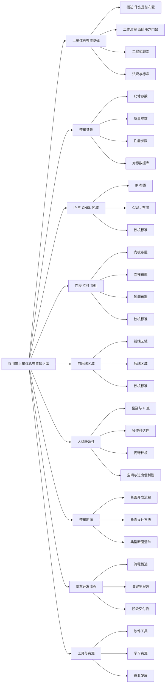

---
hide:
  - navigation
  - toc
---

# 乘用车上车体总布置知识库

# 🚗 乘用车上车体知识库

**系统化整理乘用车上车体设计知识，面向在校学生、初级工程师与自学者**

[开始阅读](basics/overview.md){ .md-button .md-button--primary }
[整车断面](sections/process.md){ .md-button }
[维护指南](maintain/update.md){ .md-button }

---

## 🗺️ 知识结构总览

> 脑图由站点内的 Mermaid 直接在 Markdown 中绘制，与左侧导航一一对应；修改导航时可同步更新本图。

---

## 📚 知识板块

-  **上车体总布置基础**

    ---

    了解上车体总布置工程师的角色、工作流程与核心职责，建立全局认知。

    [总布置基础 - 详情](basics/overview.md)

-  **整车参数**

    ---

    尺寸、质量、性能三大参数体系，总布置设计的约束基础。

    [整车参数 - 详情](parameters/dimensions.md)

-  **IP&CNSL 区域总布置**

    ---

    仪表&副仪表区域的零部件布置及校核标准。

    [IP&CNSL 总布置 - 详情](ip-cnsl/ip.md)

-  **门板&立柱&顶棚区域总布置**

    ---

    门板&立柱&顶棚区域的零部件布置及校核标准。

    [门板&立柱&顶棚区域总布置 - 详情](door-trim/door.md)

-  **前后端区域总布置**

    ---

    前后端区域的零部件布置及校核标准。

    [前后端区域总布置 - 详情](front-rear/front.md)

-  **人机舒适性标准**

    ---

    人机舒适性要求及校核方法。

    [人机舒适性标准 - 详情](ergonomics/posture.md)

-  **整车断面**

    ---

    断面开发流程、方法。

    [整车断面 - 详情](sections/process.md)

-  **整车开发流程**

    ---

    整车开发流程介绍。

    [整车开发流程 - 详情](process/overview.md)

-  **工具与资源**

    ---

    CATIA 等软件工具、学习资料与职业发展路径。

    [工具与资源 - 详情](tools/software.md)

---

## ✨ 特色

- **系统化**：从基础概念到实战案例，覆盖总布置全流程
- **实用导向**：结合真实工程参数与设计经验，可直接参考
- **持续更新**：作为团队知识备份与输出，不断积累完善

## 🎯 适合人群

| 人群 | 价值 |
|------|------|
| 在校学生 | 建立总布置知识体系，为求职做准备 |
| 初级工程师 | 快速上手工作，理解各系统协调关系 |
| 高级工程师 | 作为知识备份与输出，形成企业级数据资产|

---

!!! tip "如何使用本知识库"
    1. **新手入门**：从 [总布置基础](basics/overview.md) 开始，建立全局认知
    2. **按需查阅**：利用左侧导航栏和顶部搜索快速定位内容
    3. **断面学习**：结合 [整车断面](sections/process.md) 理解理论如何落地
    4. **持续关注**：内容会持续更新，欢迎 Star 收藏
