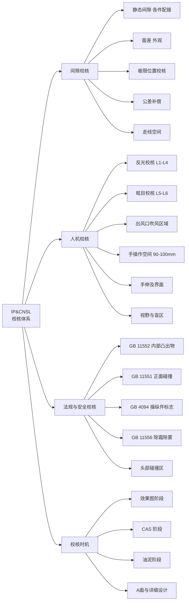
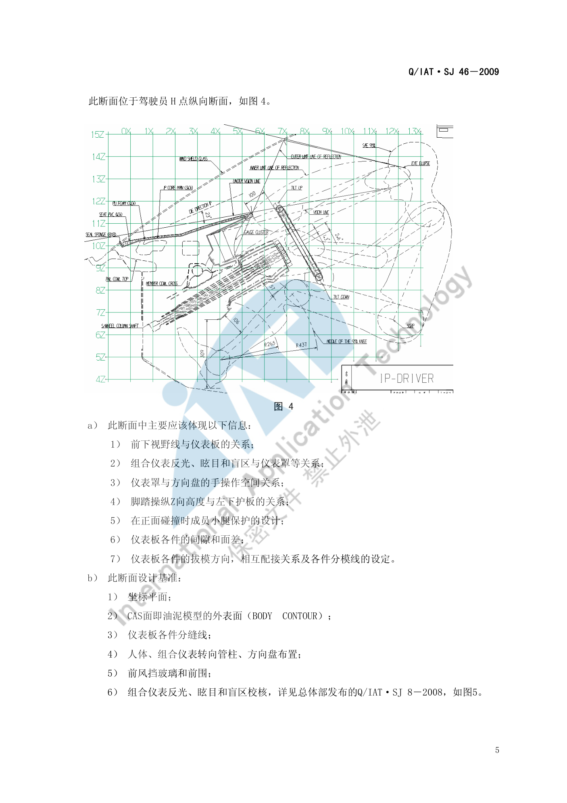
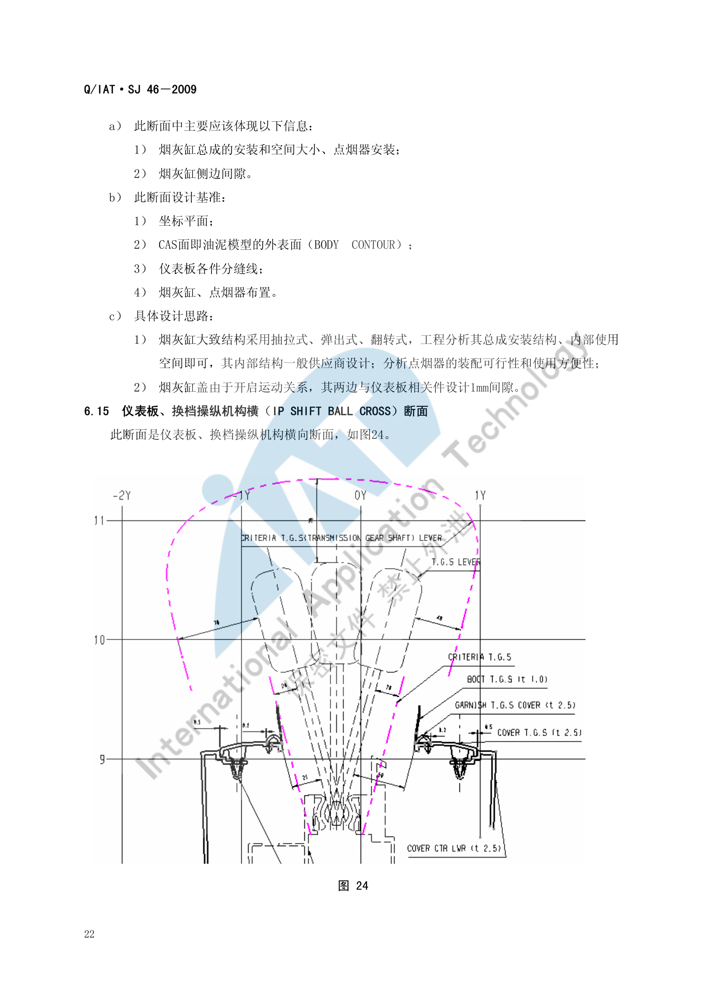
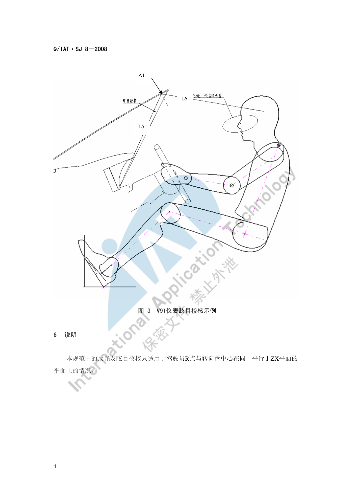

# IP&CNSL 校核标准

!!! quote "内容来源"
    本页正文抽取自《总布置》知识库中**可文本解析**的文件：
    `SJ 46-2009 仪表板SEG分析设计指导书`、`SJ 47-2009 吹面出风口设计指导书`、
    `SJ 8-2008 仪表反光及眩目设计规范`、`SJ 39-2009 汽车操纵件标志及指示装置法规校核规范`、
    `SJ 50-2009 仪表板装配设计指导书`、`SJ 9-2008 A类汽车眼椭球、头部包络面设计规范`、
    `SJ 15-2008 手伸及界面设计规范`、《通用汽车设计标准》`U02_PushBttn`。
    企业规范编号原样保留。

## 校核体系

## 概述

### 要点

IP&CNSL 区域的校核分为**间隙、人机、法规与安全**三类，每类都有明确的量化判据与校核时机：

| 类别 | 判据来源 | 主要校核项 |
|---|---|---|
| 间隙与面差 | `SJ 46-2009` 各断面设计思路 | 各件配接间隙、外观面差、极限位置间隙、走线空间 |
| 人机 | `SJ 8-2008`、`SJ 47-2009`、`SJ 15-2008`、`SJ 9-2008` | 仪表反光/眩目、出风口吹风区域、手操作空间、手伸及界面、视野与盲区 |
| 法规与安全 | `GB 11552-1999`、`GB 11551-2003`、`GB 4094-1999`、`GB 11556-94` | 内部凸出物、正面碰撞小腿/膝盖保护、操纵件标志、除霜除雾 |
| 装配可行性 | `SJ 50-2009` | 装配顺序、定位方式、工具空间、最小距离 |

### 示例

校核的**载体是 SEG 断面**：每个断面在"设计思路"中都固定附带"需要校核的问题点"，这使校核项天然可追溯。驾驶员处纵向断面是最密集的一个：

### 注意事项

- 校核时机必须与造型阶段同步：`QCD-A0-005`/`QCD-A0-006` 要求概念草图与效果图阶段就把视野、人机等项校核到位，**IP 区域的大量间隙又依赖 CAS 面**，因此实际节奏是"每个造型版本都要重跑对应断面"。
- 校核数据状态必须记录：间隙值对数据版本敏感，**结论必须注明依据的数据版本与状态**（空载/满载、造型阶段）。

## 间隙校核

### 要点

**（1）IP 内部与配接间隙汇总**（`SJ 46-2009` 各断面）

| 校核项 | 要求 | 出处 |
|---|---|---|
| 仪表罩与组合仪表 | **3 mm** | §6.1 |
| 组合仪表左右两端与仪表板本体 | 最小间隙 **> 3 mm** | §6.3 |
| 转向管柱护罩各极限位置与仪表板各件 | **≥ 5 mm** | §6.1 |
| 左下护板与转向管柱护罩 | 最小间隙 **5 mm** | §6.4 |
| 左下护板与中下饰板 | 间隙 **0.5 mm** | §6.4 |
| 左下护板与前门护板 | 间隙 **6 mm** | §6.5 |
| 仪表板本体与侧围内板 | 最小间隙 **10 mm** | §6.5 |
| 开关组面板与左下护板搭接边宽度 | **≥ 5 mm** | §6.5 |
| 除霜风道与 A 柱盖板风口海绵密封条压缩量 | **3 mm ～ 5 mm** | §6.6 |
| A 柱盖板面上边界低于仪表板外表面（面差） | **1 mm ～ 6 mm**，间隙 **0.5 mm** | §6.6 |
| A 柱卡脚与仪表板外端 | 间隙 **0.2 mm 或 0**；内端与仪表板装配空间 **2 mm** | §6.7 |
| 引擎盖扣手开启手操作空间 | **≥ 25 mm**；开启最大角度时与仪表板间隙 **≥ 1.5 mm** | §6.8 |
| 仪表板总成定位支架与前围 | 间隙 **3 mm** | §6.10 |
| 仪表板本体与风挡玻璃 | 间隙 **5 mm** | §6.10 |
| 风挡黑区线 Z 向高于仪表板本体 | **≥ 5 mm** | §6.10 |
| 仪表板本体前端与前围 Z 向间隙 | **≥ 5 mm**（保证装配调整空间） | §6.10 |
| 管梁周边（安装主线束与仪表板线束） | 至少 **φ20 mm** 空间 | §6.10 |
| 风道与 DVD 后端 | 间隙 **≥ 25 mm** | §6.10 |
| 电气开关组、空调控制开关、烟灰缸 | **≥ 20 mm** 走线空间 | §6.10 |
| 中控面板左右侧与仪表板左右下护板 | 外观间隙 **0.5 mm** | §6.13 |
| 空调控制开关圆形旋转按钮与中控面板 | 间隙 **1 mm** | §6.13 |
| 烟灰缸盖与仪表板相关件（两侧，因开启运动） | 间隙 **1 mm** | §6.14 |
| 风道与安全气囊 | 间隙 **≥ 10 mm** | §6.16 |
| 空调与仪表板 | 间隙 **10 mm** | §6.16 |
| 手套箱周边 | 间隙一般 **2 mm** | §6.16 |
| 吹面/除霜风道与周边 | 间隙 **5 mm 左右** | §6.1 |
| 隔栅框架与出风面板 | 面差建议 **0.2 mm** | `SJ 47` §5.2 |
| 出风口叶片与出风面板 | 间隙 **1.0 mm ～ 1.5 mm** | `SJ 47` §5.2 |
| 仪表罩自攻螺钉头圆头面低于仪表罩外表面 | **2 mm** | §6.2 |
| 仪表板整体机械装配与所有钣金、内饰件 | 最小距离 **10 mm** | `SJ 50` §4.1.3 |
| 固定销插入定位孔后，仪表板固定臂周边 | **10 mm** 间隙 | `SJ 50` §4.1.2 |

**（2）装配定位与公差补偿**（`SJ 50-2009` §4.1.2）

仪表板管梁两端沿同一 Z 方向有两个固定孔，构成**主副定位 + 公差补偿**的标准做法：

| 孔位 | 形式 | 作用 |
|---|---|---|
| 顶端 | 直径 **15 mm 圆孔** | 主定位 |
| 底端 | **13.5 mm × 15 mm 长圆孔**，与顶端孔距离 **105 mm** | 补偿制造与装配公差 |

**（3）装配方向**（`SJ 46-2009` §6.10）

仪表板总成装配一般含风道、安全气囊等，装配时**在装配方向上不能与空调、管梁、前围、侧围发生干涉**，定位与装配方向据此设定。当空调和管梁在仪表板之前装配时，**装配方向设定为 15°**。

### 示例

中控面板与换挡操纵机构横向断面是 CNSL 区域间隙最密集的断面（换档盖板卡接结构、换档操纵机构与仪表板间隙）：

### 注意事项

- **公差累积与极限状态校核**：上表间隙多为"标称设计值"，实际必须做极限状态校核——管梁两端圆孔+长圆孔的定位方案本身就是为了吸收公差；左下护板在碰撞时的 X 向变化（≤ 30 mm）是**变形后**的要求，与静态间隙不是一回事，不可混用。
- **极限位置**是漏项高发区：转向管柱的倾角/伸缩极限、烟灰缸盖开启、手套箱开启、引擎盖扣手最大角度，每一项都要单独校核。
- 走线空间（φ20 mm、≥20 mm、≥25 mm）极易被忽视，但它决定后期线束能否装配，**必须在断面阶段预留**。

## 人机校核

### 要点

**（1）仪表反光与眩目校核**（`SJ 8-2008`）

| 校核项 | 方法 | 合格判据 |
|---|---|---|
| **反光** | 过 R 点（或中间眼椭圆中心）作平行于 ZX 平面的平面；由眼椭圆上边与转向盘上轮缘下表面作切线与仪表反光面相交，作眼椭圆的切线并求反射线 L1、L2；同法由眼椭圆下边与轮毂上表面得 L3、L4 | **L1～L4 组成的最大区域（即能反射到眼椭圆的全部入射光区域）必须被组合仪表罩下帽沿全部遮挡** |
| **眩目** | 过仪表盘最下沿作仪表帽沿切线 L5，求与前风挡玻璃内表面交点 A1；若 A1 在玻璃黑区之下则作反射线 L6 | A1 在**玻璃黑区之内或之上** → 不眩目；L6 在**眼椭圆上部** → 不眩目；L6 与眼椭圆相切或在**眼椭圆内部/下部** → **存在眩目** |

适用范围限制：仅适用于**驾驶员 R 点与转向盘中心在同一平行于 ZX 平面的平面上**的情况；反光校核**不适用于从侧窗玻璃入射的光线**。

**（2）出风口吹风区域校核**（`SJ 47-2009`）

| 校核项 | 要求 |
|---|---|
| 出风口中心与眼椭圆中心 X 向距离 | 600 mm ～ 800 mm |
| 出风口中心与驾驶员中心 Y 向最小距离 | 380 mm |
| 眼椭圆中心与 H 点 X 向距离 | 80 mm |
| 出风口下边缘与 H 点 Z 向最小距离 | 380 mm（左侧出风口 240 mm） |
| 吹风目标区域余量 | 左右、上下各大于目标区域 **(5～10) 度** |
| 四出风口出风量比例 | 左 : 中左 : 中右 : 右 = **2 : 3 : 3 : 2** |

**（3）手操作空间与可达性**

| 校核项 | 要求 | 出处 |
|---|---|---|
| 仪表罩与方向盘手操作空间 | 一般 **≥ 90 mm**；1 L 左右微轿 **≥ 70 mm**；大排量 SUV/商务/商用 **≥ 100 mm** | `SJ 46` §6.1 |
| 引擎盖扣手开启手操作空间 | **≥ 25 mm** | `SJ 46` §6.8 |
| 换挡手柄包络、手刹包络 | 必须落在驾驶员**手握式手伸及界面**之内；推荐用 Ramsis 校核 95%/50%/5% 假人的不舒适度并与竞品对比 | `QCD-A0-005` §4.3 |
| 手伸及界面生成 | 由 A40/H30/W9/H18/L11/H17/A42/L53 算 G 因子 → 求参考坐标系 → 选 SAE J287 表格 → 点云连面 | `SJ 15-2008` |
| 空挡换挡操作点 | 距 EO 点 530～580 mm（推荐 **555 mm**） | `SJ 6-2008` §4.4 |
| 驻车制动操作点 | 距 EO 点 550～670 mm（推荐 **595～640 mm**） | `SJ 6-2008` §4.5 |
| 按钮类控制件 | 尺寸 **≥ 10 × 10 mm**；中心到边缘 **≥ 13 mm**；中心到中心 **≥ 19 mm**；位移 1.5～3.5；操作力 2.8～11.0 N | GM `U02` |

**（4）视野与盲区**

- 仪表板本体与仪表罩外表面**不超过前方的下视野线**，且预留**与下视野线 0.5° 角以上余量**（`SJ 46` §6.1、§6.10）；
- 仪表罩下边缘**不超过仪表的发光表面**；
- 仪表板盲区、立柱盲区的判定使用**眼椭球**（95%/99% 百分位）与视线联合求作（`SJ 9-2008`）。

### 示例

V91 车型仪表眩目校核示例：切线 L5 与前风挡玻璃内表面交于 A1，反射线 L6 是否落入眼椭圆决定眩晕是否成立：

### 注意事项

- **不同百分位人体的覆盖要求**：眼椭球/头部包络面按 **95% 与 99%** 两个百分位制作，前乘客区按 99%、后乘客区按 95%（`SJ 18-2008`）；手伸及界面则需覆盖 **95%/50%/5%** 三个百分位——**两套百分位体系不要混用**。
- 反光校核的"侧窗入射"是明确的**排除项**：这不是疏漏，而是标准适用范围所限；若项目关注侧窗反光，需另行定义。
- 中控屏幕的反光/眩光没有直接对应的企业规范（`SJ 8-2008` 的对象是仪表反光面），需类比校核。

## 法规与安全校核

### 要点

**（1）内部凸出物**（`GB 11552-1999` 轿车内部凸出物，等效采用 74/60/EEC 及 78/632/EEC）

| 判据 | 内容 |
|---|---|
| 尖棱定义 | **曲率半径小于 2.5 mm** 的刚性材料棱边，但**不包括从仪表板表面测量凸出高度小于 3.2 mm** 的构件 |
| 圆钝例外 | 若凸出物的**凸出高度不大于其宽度的一半且边缘圆钝**，可不规定最小曲率半径 |
| 格栅零件 | 满足下表则视为符合规定 |

| 格栅间距 (mm) | 最小片厚 e | 平端格栅最小半径 | 圆端格栅最小半径 |
|---|---|---|---|
| 1–10 | 1.5 | 0.25 | 0.50 |
| 10–15 | 2.0 | 0.33 | 0.75 |
| 15–20 | 3.0 | 0.50 | 1.25 |

此外，`SJ 46-2009` §6.16 要求乘员侧断面**在头部碰撞基准区内满足 GB 11552-1999 对应要求**。

**（2）正面碰撞乘员保护**（`GB 11551-2003` 乘用车正面碰撞的乘员保护、`ECE R94`）

| 指标 | 限值 |
|---|---|
| 小腿压力指标 **TCFC** | **不超过 8 kN** |
| 每根胫骨两端所测**胫骨指数 TI** | **不超过 1.3** |

设计对策（`SJ 46-2009` §6.1、§6.4）：

- 以**脚踝为中心、R265～R437 为半径**的区域设计碰撞缓冲，可做成**缓冲块或缓冲筋**的形式；
- **膝盖保护区域**为"以腿中心和膝盖外侧 **15°** 之间"的区域；
- 左右膝盖两个保护区域内，**左下护板外表面在 X 方向上的最大变化距离应在 30 mm 以内**，以保证碰撞时左右两腿受力均匀；
- 手套箱横向断面（右下护板）的膝盖保护方法与左下护板相同；要加强强度处采用**螺钉连接**，其他部位可用卡扣连接。

**（3）操纵件标志及指示装置**（`GB 4094-1999`，校核方法见 `SJ 39-2009`；词汇依据 `GB/T 4782-1984`）

| 基本要求 | 内容 |
|---|---|
| 强制标示 | 装备标准 §4.2.1 所列操纵件、指示器及信号装置时，**其相应标志必须标示**且必须符合规定 |
| 非强制标示 | 装备 §4.2.2 所列者，标志**非强制**；但一旦标示则必须符合规定 |
| 相似标志 | 使用相似标志时亦应符合规定 |
| 可识读性 | 标志相对于底色应清楚、醒目，且**永久保持**；应保证**驾驶员在其座位上能够识别** |
| 多功能件 | **多功能操纵件上必须具有其各功能的相应标志** |
| 组合装置 | 同一功能的组合式指示器和信号装置**可以用一个标志** |
| 不得混淆 | 用于其他目的的标志**不得与本标准规定的标志相混淆** |
| 信号颜色 | 信号装置的显示颜色必须符合标准规定 |
| 标志位置 | 标志必须位于**操纵件或其工作位置上**；对于指示器及信号装置，标志必须位于**其上** |

典型标示位置（`SJ 39-2009` 表 1 示例）：灯光总开关/远近光/位置灯/转向指示灯/刮水器洗涤器组合操纵件 → **组合开关**；前/后雾灯开关 → **左下装饰板**；危险报警灯操纵件 → **中控面板**。

**（4）除霜除雾**（`GB 11556-94`，与出风口/风道耦合）

- 前风挡除霜的出风角度与距离设定见 `SJ 48-2008` §7.2.1"前除霜口的吹风方向"；
- 除霜风道与 A 柱盖板风口海绵密封条**压缩 3～5 mm**，风口布置**靠盖板中下处**以保证除霜效果（`SJ 46` §6.6）。

### 示例

校核的法规区域与断面必须一一对应：例如乘员侧断面（`SJ 46-2009` §6.16）需在该断面上同时体现 GB 11552-1999 的**头部碰撞基准区**要求、风道走向与各件间隙、乘客安全气囊固定结构，以及手套箱的空间、旋转中心、旋转角度与开启扣手形式。

### 注意事项

- **校核时机与数据状态要求**：法规项必须在**造型各阶段**用固定清单逐项打勾并保留"结论 + 图片示意"两栏留痕（`EDD-A0-005-1/-2`）；装配相关校核（`SJ 50`）需在数据具备装配特征后进行，过早校核无意义。
- **标志校核最易漏项**：`SJ 39-2009` 明确"多功能操纵件上必须具有其各功能的相应标志"，多功能组合开关、多功能方向盘的标志完整性应逐功能核对。
- 小腿/膝盖保护是**结构设计项**而非几何布置项：总布置能确定保护区域与变形量限值，具体缓冲块/筋的刚度需 CAE 反复迭代。

## 待人工补充

!!! warning "以下条目无法自动提取或知识库中无对应条款，需人工补充"
    - `SJ 46-2009` 的图 1（断面分布图）为图片页，30 个断面的**总清单与分布位置**需人工从原图整理
      （本页已从正文梳理出 §6.1～6.17 共 17 个典型断面的名称与设计要点）；
    - `SJ 39-2009` 的表 1～表 3（操纵件标志、指示器标志、信号装置颜色）为**表格图片**，
      本页仅提取到表头与部分项目，完整标志清单需人工查阅原文；
    - **中控屏幕**的反光/眩光、亮度与指纹可视性：无直接对应企业规范；
    - **杯托尺寸、中央扶手高度**等 CNSL 专属条款：知识库中未见；
    - 知识库中以下文件虽相关但因读取问题**未采用**：`AEM-A4-003 内部凸出物校核规范`、
      `AEM-A5-201 手伸及界面及仪表控制面板校核规范与流程`、`AEM-A5-309 组合仪表布置规范`。

    建议：在 IMA 客户端中打开对应文件补充条款，或按"规范编号 + 页码"方式人工引用。

---

## 下一步阅读

- [IP 布置](ip.md)：仪表板各分区的布置要求
- [CNSL 布置](cnsl.md)：副仪表板区域的布置要求
- [坐姿与 H 点](../ergonomics/posture.md)：眼椭圆与百分位人体体系
- [视野校核](../ergonomics/vision.md)：视野与盲区的完整校核方法
