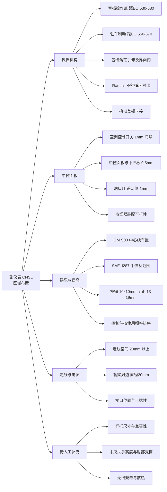
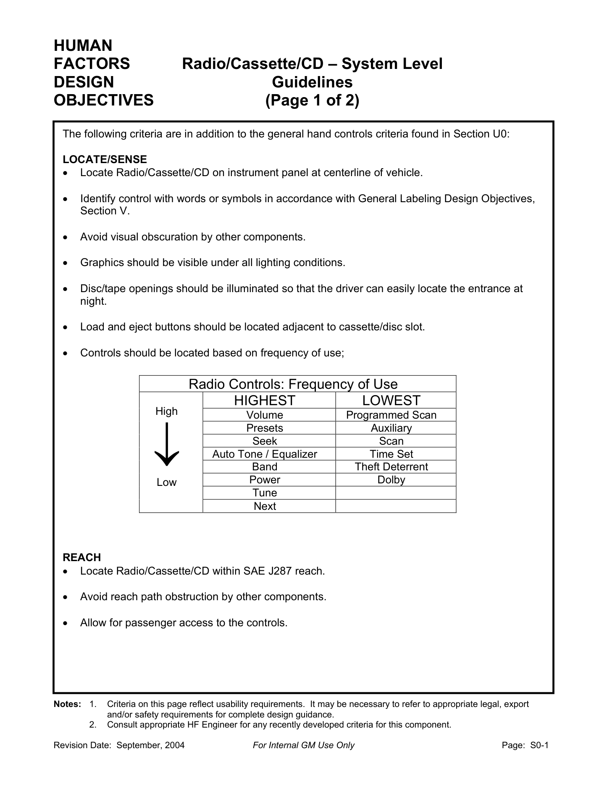

# 副仪表（CNSL）布置

!!! quote "内容来源"
    本页正文抽取自《总布置》知识库中**可文本解析**的文件：
    `SJ 46-2009 仪表板SEG分析设计指导书`（§6.13～6.15 为中控面板与换挡机构断面）、
    `SJ 6-2008 驾驶员人机硬点设计规范`、`SJ 15-2008 手伸及界面设计规范`、
    `SJ 49-2009 仪表板与底盘相关件配接设计指导书`、`QCD-A0-005 概念草图阶段总布置检查规范`、
    《通用汽车设计标准》`S00_RadioCassCDSys`、`U02_PushBttn`。
    企业规范编号原样保留。

!!! info "知识库覆盖度说明"
    《总布置》知识库中对 **CNSL 专属条款（杯托、扶手、无线充电等）覆盖较少**，
    但对**换挡机构、中控面板配接、走线空间**有明确条款。本页对无条款的部分统一以
    `!!! warning "待人工补充"` 标记，不做臆测填充。

## CNSL 区域布置体系



## 概述

### 要点

CNSL（副仪表板）是**操纵密集区**：换挡、驻车制动、空调开关、娱乐单元、电源接口集中布置，其布置结论由两类依据共同决定：

| 依据类型 | 内容 | 来源 |
|---|---|---|
| **人机派生** | EO 点 → 换挡/驻车操作点距离；手伸及界面 → 包络校核 | `SJ 6-2008`、`SJ 15-2008`、`QCD-A0-005` |
| **断面配接** | 中控面板、空调开关、烟灰缸、换挡盖板各件间隙与安装 | `SJ 46-2009` §6.13～6.15 |

知识库覆盖度如下：

| 分项 | 是否有明确条款 | 主要出处 |
|---|---|---|
| 换挡机构 | **是** | `SJ 6-2008` §4.4/4.5、`QCD-A0-005` §4.3、`SJ 46-2009` §6.15 |
| 中控面板/空调开关/烟灰缸 | **是** | `SJ 46-2009` §6.13、§6.14 |
| 娱乐与信息单元 | **是**（GM 标准） | GM `S00`、`U02` |
| 走线与电源 | **部分** | `SJ 46-2009` §6.10、§6.14 |
| 杯托、中央扶手 | **否** | 见各节 `待人工补充` |

### 示例

中控面板与空调开关横向断面是中控面板区域的典型断面，需体现空调开关的定位与安装关系、以及各件间隙：


### 注意事项

- CNSL 的输入端是**人机派生结果**（EO 点、手伸及界面），不是造型完成后再"塞进去"；换挡与驻车位置一旦由 EO 点确定，中控面板的分块就必须围绕它展开。
- 中控面板是全车**间隙最密**的区域之一（0.5 mm、1 mm 级），这些数值本质是**外观安全余量**，公差分析不通过时必须回到造型定义，而不是压缩间隙。

## 换挡机构

### 要点

**（1）换挡与驻车制动的位置由 EO 点派生**（`SJ 6-2008` §4.4～4.5）

EO 点先由 H30 推出：

```text
EOX = 1208 - 0.8917 × H30      （EO 点相对踵点的 X 向距离）
EOZ = 1574 - 0.9818 × EOX      （EO 点相对踵点的 Z 向距离）
EOy = SgRPy ± 135              （EO 点 Y 向位置）
```

再据此定操作点：

| 操作件 | 与 EO 点的距离范围 | 推荐值 |
|---|---|---|
| **空挡换挡操作点** | 530 mm ～ 580 mm | **555 mm** |
| **驻车制动操作点** | 550 mm ～ 670 mm | **595 mm ～ 640 mm** |

**（2）可达性判据**（`QCD-A0-005` §4.3）

- **换挡手柄包络与手刹包络必须落在驾驶员手握式手伸及界面之内**；
- 更合理的做法是用 **Ramsis** 校核 95%、50%、5% 假人在各自 H 点位置操作换挡手柄与手刹的舒适性，得**不舒适度值**并与竞争车型对比后改进；
- 手伸及界面按 `SJ 15-2008` 生成（G 因子 → 参考坐标系 → SAE J287 选表 → 点云连面），规则详见 [操作可达性](../ergonomics/reach.md)。

**（3）换挡机构的断面配接**（`SJ 46-2009` §6.15）

| 项目 | 要求 |
|---|---|
| 换档盖板总成 | 根据造型要求设计换档护罩和盖板的安装结构；**考虑维修换挡操纵机构的方便性，换档盖板用卡接结构装配** |
| 换档操纵机构与仪表板间隙、空间 | 详见 `SJ 49-2009 仪表板与底盘相关件配接设计指导书` |
| 管梁支撑腿走向 | 设计时须**确保与空调、换档机构不干涉**，断面需设计支撑腿与地板的连接方式（§6.10） |

### 示例

仪表板与换档操纵机构横向断面需表达换档盖板总成的连接结构与换档操纵机构的间隙、空间要求：


### 注意事项

- **换挡形式差异属于待补充项**：知识库中的条款对机械式换挡（含盖板、护罩、卡接装配）表述较完整，但**电子换挡、怀挡、旋钮式换挡**的差异未在已解析文件中找到条款，需人工补充。
- 换挡与驻车位置的"距 EO 点距离"是**单点距离**，实际校核仍必须用**包络**（全行程）——手柄在极限挡位时最易超出界面。
- 管梁支撑腿、空调箱、换挡机构三者在 CNSL 下方共用空间，**断面必须同时表达三者**，否则干涉会在数据阶段才暴露。

## 杯托与储物

!!! warning "待人工补充：知识库中未检索到 CNSL 杯托/储物的专门条款"
    已检索关键词：`杯托`、`杯架`、`储物`、`杂物盒`、`cupholder`、`storage`、`console box`
    （覆盖 SJ 全系列 54 份、GM 系列 48 份、QCD/EDD/H20 报告），未命中杯托尺寸、深度、
    兼容性（不同杯径/瓶型）等专门条款。

    - 可借用的类比判据：GM `S00` 对**碟/带的取放空间**给出了明确的间隙体系——
      上下手部间隙 **≥ 50.0 mm**、弹出件突出饰板 **≥ 50.0 mm**、饰板后方取放间隙 **≥ 270.0 mm**，
      可作为"取放类储物的手部操作空间"类比基准；
    - 可借用的结构判据：`SJ 46-2009` §6.14 的**烟灰缸**条款（抽拉式/弹出式/翻转式三种结构、
      盖因开启运动其两边与仪表板相关件设计 **1 mm 间隙**）可作为运动类储物盒的间隙类比；
    - 建议补充来源：`SJ 22-2008 三厢车内饰零部件装配流程`、GM `U0x` 手部操作件系列；
    - 另需人工确认：杯托口径与深度的兼容性清单、防倾覆结构、底部排水/易清洁设计。

### 要点

- 在缺乏专门条款的情况下，杯托设计的**可判定项**目前只有两条：① 取放手部空间（类比 GM `S00` 的 ≥ 50 mm 体系）；② 开启/运动件的间隙（类比 §6.14 的 1 mm）。

### 注意事项

- **与换挡操作的干涉**是本区域的头号风险：杯托内的杯子（尤其高杯、保温杯）不得在挡位切换行程内产生干涉，**必须用带杯的包络做动态校核**，而不是空载校核。

## 中央扶手

!!! warning "待人工补充：知识库中未检索到中央扶手的专门条款"
    已检索关键词：`中央扶手`、`扶手`、`储物扶手`、`armrest`、`console armrest`。
    仅在 `SJ 26-2008 座椅及座椅安全带设计指导书` §4.1 中出现过"扶手功能"作为**座椅功能项**
    之一（与加热、水杯架、储物盒并列），没有高度、前后位置、肘部支撑的量化要求。

    - 可借用的判据：肘部空间的尺寸代码为 **W31**，其定义见 `SJ 9-2008` 与 H20 硬点报告
      （人机工程布置设计硬点）；扶手高度宜以"乘坐姿态下肘部自然下垂位置"为基准反推；
    - 建议补充来源：`SJ 26-2008`（座椅与内饰接口）、`SJ 45-2009 内饰SEG设计指导书`；
    - 另需人工确认：扶手与安全带的间隙、与座椅调节行程的干涉、承载能力与锁止机构。

### 要点

- 现阶段可作为**边界约束**使用的只有两条：① 肘部空间 W31 的尺寸基准（见 [坐姿与 H 点](../ergonomics/posture.md)）；② 扶手运动（翻折/滑移）包络不得侵入安全带的固定与织带路径。

### 注意事项

- **扶手与安全带、座椅的间隙**在本区域尤其敏感：安全带锁扣、织带导向件常布置在 CNSL 侧后方，扶手翻折或盒盖开启极易与其干涉，必须纳入运动包络校核。

## 电源与接口

### 要点

**（1）走线空间**（`SJ 46-2009` §6.10）

| 项目 | 要求 |
|---|---|
| 管梁周边（安装车身主线束与仪表板线束） | 至少 **φ20 mm** 空间 |
| 电气开关组、空调控制开关、烟灰缸 | **≥ 20 mm** 走线空间 |
| 风道与 DVD 后端 | 间隙 **≥ 25 mm** |

**（2）中控面板上的电气件配接**（`SJ 46-2009` §6.13、§6.14、§6.8）

| 项目 | 要求 |
|---|---|
| 空调控制开关安装 | 一般**先与中控面板总成后再一起装配**，采用自攻螺钉与中控面板固定 |
| 空调控制开关圆形旋转按钮与中控面板 | 间隙 **1 mm** |
| 中控面板左右侧与仪表板左右下护板 | 外观间隙 **0.5 mm** |
| 烟灰缸总成 | 结构大致采用**抽拉式、弹出式、翻转式**；工程分析其总成安装结构、内部使用空间即可，**内部结构一般由供应商设计** |
| 点烟器 | 分析**装配可行性和使用方便性** |
| 电气开关组与左下护板 | 开关组面板与左下护板多采用**卡接结构**，搭接边宽度最小 **≥ 5 mm** |
| 左下护板拔模 | 一般根据机盖扣手、加油口盖扣手、电气开关等的安装确定 |

**（3）接口的照明与可达性**（GM `S00`）

| 要求 | 内容 |
|---|---|
| 开口照明 | 碟/带开口**应被照明**，使驾驶员在夜间容易找到入口 |
| 装/退碟按钮 | 应布置在**卡带/碟槽的邻近位置** |
| 位置 | 整个单元位于**仪表板车辆中心线**、**SAE J287 手伸及范围内**，并**允许乘员访问** |
| 使用频率 | 辅助输入（Auxiliary）位于使用频率**中高**档，仅次于 Volume、Programmed Scan、Presets |
| 按钮尺寸 | 最小 **10.0 × 10.0 mm**；中心到边缘 **≥ 13.0 mm**；中心到中心 **≥ 19.0 mm**；操作力 2.8～11.0 N |

### 示例

GM `S00_RadioCassCDSys` 设计目标页给出了中控娱乐单元的位置、可达性、控制件使用频率排序与取放间隙体系：



### 注意事项

- **线束走向与散热属待补充项**：知识库已解析文件只给出走线**空间**要求（≥20 mm、φ20 mm），未给出线束固定方式、转弯半径与散热要求，需人工补充。
- **无线充电、USB 接口的位置与可达性**在知识库中未见条款，需人工补充；可类比的只有 GM `S00` 的"开口应被照明 + 位于手伸及范围内"两条原则。
- 电源接口是**乘员可访问件**，与驾驶员专属件不同：校核时应覆盖副驾与后排的手伸及范围。

## 待人工补充

!!! warning "本页待人工补充清单"
    - **杯托**：口径/深度/兼容性、防倾覆、排水设计（知识库无专门条款）；
    - **中央扶手**：高度与前后位置的量化要求、肘部支撑面、与安全带及座椅的间隙（知识库无专门条款）；
    - **电子换挡/怀挡/旋钮换挡**形式的布置差异（已解析条款仅覆盖机械式）；
    - **线束走向、转弯半径与散热**要求；**无线充电与 USB 接口**的位置与可达性要求；
    - `SJ 49-2009 仪表板与底盘相关件配接设计指导书` 已下载但尚未逐条解析，其中包含
      **换档操纵机构与仪表板的间隙、空间要求**，建议优先补充；
    - 知识库中以下文件虽相关但因读取问题**未采用**：`AEM-A5-201 手伸及界面及仪表控制面板校核规范与流程`、
      `AEM-A5-203 方向盘位置设计`。

    建议：在 IMA 客户端中打开对应文件补充条款，或按"规范编号 + 页码"方式人工引用。

---

## 下一步阅读

- [IP 布置](ip.md)：仪表板各分区的布置要求
- [校核标准](check.md)：IP&CNSL 区域的间隙、人机与法规校核清单
- [操作可达性](../ergonomics/reach.md)：EO 点、手伸及界面与操作件位置公式
