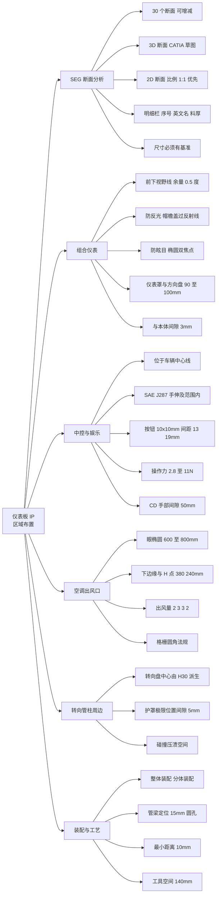
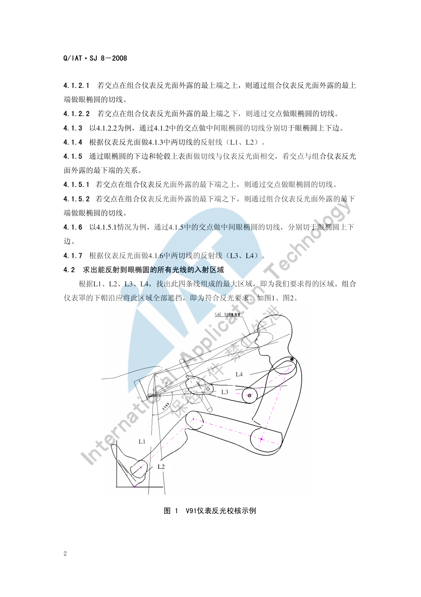
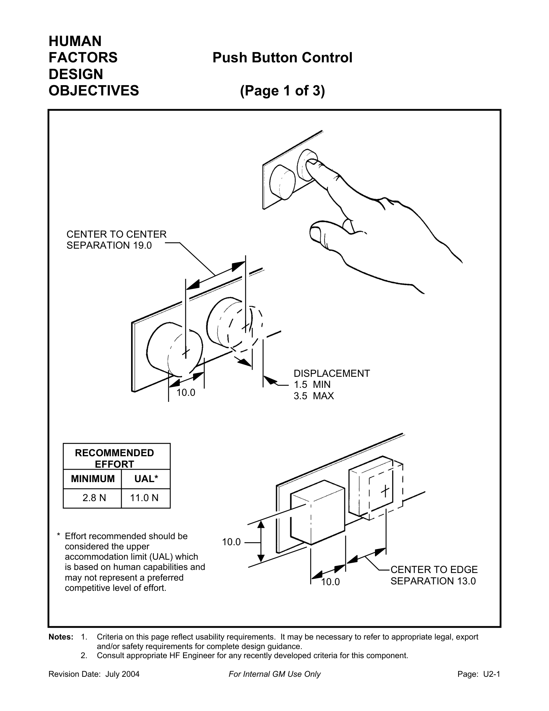
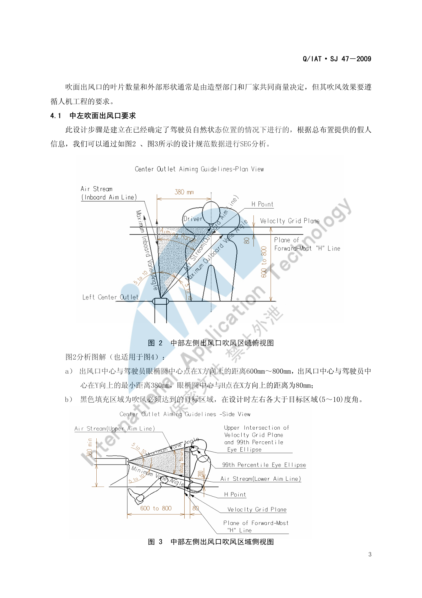
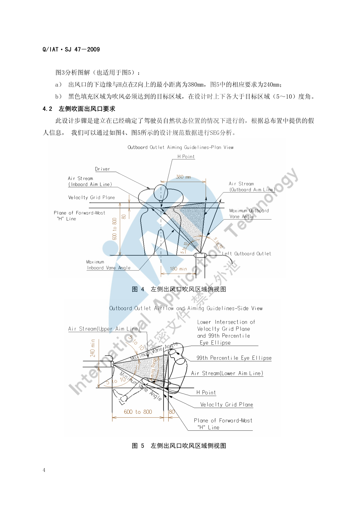
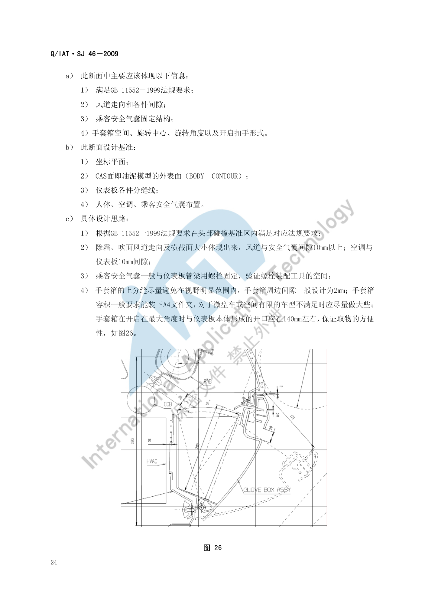
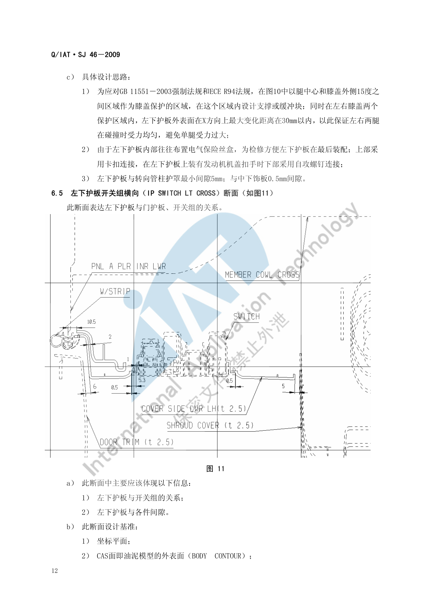

# 仪表板（IP）布置

!!! quote "内容来源"
    本页正文抽取自《总布置》知识库中**可文本解析**的文件：
    `SJ 46-2009 仪表板SEG分析设计指导书`、`SJ 47-2009 吹面出风口设计指导书`、
    `SJ 50-2009 仪表板装配设计指导书`、`SJ 48-2009 仪表板风道设计指导书`、
    `SJ 8-2008 仪表反光及眩目设计规范`、`SJ 6-2008 驾驶员人机硬点设计规范`、
    《通用汽车设计标准》`U02_PushBttn`、`S00_RadioCassCDSys`。
    企业规范编号原样保留。

## IP 区域布置体系



## 概述

### 要点

**（1）术语**（`SJ 46-2009` §3）

| 缩写 | 全称 | 含义 |
|---|---|---|
| IP | Instrument Panel | 仪表板 |
| CCB | Cockpit Cross Bar | 仪表板管梁 |

**（2）SEG 分析的输入条件**（`SJ 46-2009` §4.1）

| 类别 | 输入项 |
|---|---|
| **外部输入** | ① 与仪表板相关的整车功能配置定义；② 相关法规与性能要求；③ 效果图与 CAS 面；④ 总体人机、车身扣手、电气布置、底盘操纵机构布置与运动极限位置、内外饰密封边界限制面/线；⑤ 外观面差定义（造型确定） |
| **内部输入** | ① 依据效果图与 CAS 初定的分块与装配工艺；② 各件材料、料厚与成型工艺；③ 依据分块与装配工艺初定的拔模方向；④ 外观间隙定义 |

> SEG 分析不只是造型与工程可行性分析，也**部分验证上述输入条件的合理性**；输入条件应尽可能准确。

**（3）断面数量与出图规范**（`SJ 46-2009` §5）

- 一般乘用车/商用车仪表板 SEG 分析约需 **30 个断面**，可按实际增减；
- 须同时输出 **3D 与 2D 断面**，统一模板、投图比例与标注尺寸规范；
- **3D 断面**在 CATIA "草图绘制器"中绘制，用"三维元素相交"命令求得与 CAS 面/油泥模型外表面的交线后做**参数化草图**（优点：绘图快捷、便于编辑、可做运动件草图模拟）；
- **2D 断面**投图比例**优先 1:1**，其次 1:2、1:5、2:1；
- 断面尺寸（尤其关键尺寸）**都必须有基准**，或可由基准间接推算；明细栏需体现各部件序号、**英文名称**与料厚；有特殊安装/加工工艺要求时需给出技术要求。

### 示例

驾驶员 H 点处的纵向断面是整个 IP 区域信息最密集的断面，需同时表达视野、反光眩目、手操作空间、小腿保护、间隙面差与拔模关系：


### 注意事项

- IP 是**多专业交汇区**：总布置、造型、电气、底盘、内外饰都在这里交接，SEG 断面是唯一能把各方约束同时表达出来的载体。
- 断面基准必须"具有可操作性"——**关键尺寸不能靠间接推算**，否则后期结构设计无法直接引用。

## 组合仪表

### 要点

**（1）组合仪表相关的关键约束**（`SJ 46-2009` §6.1～6.3）

| 项目 | 要求 |
|---|---|
| 与前方下视野线的余量 | 仪表板本体与仪表罩外表面**不超过**总体给出的前方下视野线，且预留**与下视野线 0.5° 角以上余量** |
| 防反光（帽檐） | 组合仪表罩帽檐在 **X 方向上必须盖过**通过风挡玻璃反射进入人眼的反射光线 |
| 防眩目（避光罩） | 把避光罩在高度方向设计成**椭圆**，利用"过椭圆一焦点的光线经椭圆面反射后必过另一焦点"的原理，将**一个焦点放在转向管柱护罩内、另一焦点放在眼椭圆上**，从而避免组合仪表眩目反射到人眼；此项需与电气工程师协同设计 |
| 仪表罩下边缘 | **不超过仪表的发光表面**（依据总体视野确定） |
| **仪表罩与方向盘手操作空间** | 一般车型 **≥ 90 mm**；排量 1 L 左右微轿等紧凑车型 **≥ 70 mm**；大排量 SUV、商务车与商用车型应 **≥ 100 mm** |
| 仪表罩与组合仪表间隙 | **3 mm** |
| 转向管柱护罩与仪表板各件 | 护罩各极限位置均 **≥ 5 mm** |
| 仪表罩螺钉 | 较多采用自攻螺钉与本体固定，**螺钉头圆头面低于仪表罩外表面 2 mm**；装配工具空间在装配方向上 **≥ 140 mm** |
| 组合仪表固定 | 一般自攻螺钉固定；本体在组合仪表底部一般**两个固定点**（也可一个），**两点间距约 200 mm**，通过焊接支架固定到管梁以保证刚度 |
| 组合仪表与本体间隙 | 左右两端与本体最小间隙 **> 3 mm** |
| 转向管柱护罩 | 各极限位置与仪表板各件间隙 **不小于 5 mm** |
| 拔模方向 | 仪表板本体拔模方向一般与 **X 轴正向向上 20° 左右**；仪表罩拔模方向一般**与组合仪表发光面垂直**；左下护板拔模一般依据机盖扣手、加油口盖扣手、电气开关等安装确定 |

**（2）碰撞安全约束**（`SJ 46-2009` §6.1、§6.4）

- 依据 `GB 11551-2003` 与 `ECE R94`：小腿压力指标 **TCFC 不应超过 8 kN**；每根胫骨两端所测**胫骨指数不应超过 1.3**；
- 设计上以**脚踝为中心、R265～R437 为半径**的区域设计碰撞缓冲，可做成缓冲块或缓冲筋的形式起到小腿保护作用；
- 膝盖保护区域为**以腿中心和膝盖外侧 15° 之间的区域**；在左右膝盖两个保护区域内，**左下护板外表面在 X 方向上的最大变化距离应在 30 mm 以内**，以保证左右两腿受力均衡。

**（3）防反光与防眩目的校核方法**（`SJ 8-2008`）

- **反光**：入射光线经仪表反光面反射后射到驾驶员眼睛；
- **眩目**：仪表自身发出的光射到前风挡玻璃后反射到驾驶员眼睛内；
- 反光校核步骤：过 R 点（或中间眼椭圆中心）作平行于 ZX 平面的平面 → 由眼椭圆上边与转向盘上轮缘下表面作切线与仪表反光面相交 → 判断交点与反光面外露最上端的关系 → 作眼椭圆的切线并求出反射线 L1、L2；同法由眼椭圆下边与轮毂上表面得 L3、L4 → **L1～L4 组成的最大区域即为能反射到眼椭圆的所有入射光区域**，组合仪表罩下帽沿应将该区域**全部遮挡**方为合格；
- 眩目校核步骤：过仪表盘最下沿作仪表帽沿切线 L5，求其与前风挡玻璃内表面的交点 A1 → 若 A1 在**玻璃黑区之内或之上**则不存在眩目；若在黑区之下，则作出反射线 L6 → 若 L6 在**眼椭圆上部**则不存在眩目；若 **L6 与眼椭圆相切、或在眼椭圆内部/下部**，则判定存在眩目；
- 适用范围限制：该反光/眩目校核**只适用于驾驶员 R 点与转向盘中心在同一平行于 ZX 平面的平面上**的情况；**反光校核不适用于从侧窗玻璃入射的光线**。

### 示例

V91 车型仪表反光校核示例（L1～L4 四条反射线与需要被帽沿完全遮挡的入射区域）：



### 注意事项

- **帽檐避光与手操作空间是一对矛盾**：帽檐要"盖过反射线"要求加大，手操作空间要求减小帽檐；`SJ 46-2009` 明确当两项冲突时，应在仪表板内部空间允许的条件下**与总体和电气部门协商调整组合仪表的布置**，而不是单方面牺牲某一项。
- 仪表罩下边缘的边界是**仪表的发光表面**，不是仪表本体外形——用量规定义清楚可避免后期反复。
- 防眩目的椭圆双焦点法需要电气专业提供仪表发光面位置，**布置冻结前必须拿到该输入**。

## 中控与娱乐系统

### 要点

**（1）位置与可达性**（GM `S00_RadioCassCDSys`）

| 要求 | 内容 |
|---|---|
| 位置 | 将收音机/卡带/CD 单元布置在**仪表板的车辆中心线**上 |
| 可达性 | 必须位于 **SAE J287 手伸及范围内**；避免伸手路径被其他部件遮挡；**并允许乘员访问** |
| 可视性 | 避免被其他部件视觉遮挡；图形在所有光照条件下均应可见 |
| 标识 | 按 GM `V00_GenLabel`（通用标识）用文字或符号标识；标签优先置于**按钮表面**以便夜间形成发光目标 |
| 分组 | 控制件应**按功能分组**，且应位于相应显示器**之内或附近**；控制件与其显示屏的标识应一致 |
| ON 位置 | 系统 ON 位置的预期位置是单元**上部、最靠近驾驶员的一侧** |

**（2）控制件的使用频率排序**（GM `S00`，从高到低）

| 顺序 | 控制件 |
|---|---|
| 最高 | Volume（音量） |
| ↓ | Programmed Scan、Presets（预置）、Auxiliary（辅助输入）、Seek、Scan |
| ↓ | Auto Tone / Equalizer、Time Set、Band |
| ↓ | Theft Deterrent（防盗）、Power、Dolby、Tune |
| 最低 | （使用频率最低者置于最不易触及位置） |

**（3）按钮类控制件的尺寸与力值**（GM `U02_PushBttn`，July 2004 版）

| 项目 | 最小值 | 说明 |
|---|---|---|
| 按钮尺寸 | **10.0 mm × 10.0 mm**（或直径 10.0 mm） | 该值**不适用于戴手套的手** |
| 按钮位移 | 1.5（最小）～ 3.5（最大） | 推荐值 |
| 按钮间中心到边缘间距 | **13.0 mm** | |
| 按钮间中心到中心间距 | **19.0 mm** | |
| 按钮边缘到相邻饰面间隙 | **15.0 mm** | |
| 操作力 | 2.8 N（最小）～ **11.0 N（UAL，上限适应极限）** | 该上限基于人的能力，可能**不代表有竞争力的水平** |
| 凹陷按钮的凹坑直径 | **25.0 mm**（在表面测量） | 凹坑应带锥度 |
| 按钮间屏障（当无法满足最小间距时） | 宽度 **≥ 3.0 mm** | 深度需足以防止误操作 |

相关的可用性要求还有：当控制件**可能被误认为翘板开关**或**可能发生偏心激活**时，激活推点应以**表面触觉**定义；离散按钮应通过开关位置或其他反馈提供**清晰的状态指示**，未锁止位置最好用"未锁止时可见的涂色带"与锁止位置区分；按钮与其周围饰面设计应避免手指伸入表面以下被夹住或摩擦锐边。

**（4）碟/带操作空间**（GM `S00`）

| 项目 | 要求 |
|---|---|
| 碟/带插入推荐力 | **≤ 3.0 N** |
| 碟/带上下的手部间隙 | **≥ 50.0 mm** |
| 弹出碟突出饰板的距离 | **≥ 50.0 mm** |
| 碟插入/取出时饰板后方的间隙 | **≥ 270.0 mm** |
| 弹出带突出饰板的距离 | **≥ 25.0 mm** |

### 示例

GM 按钮类控制件的设计目标页（含推荐操作力、间距与位移的量化限值）：



### 注意事项

- **中控屏幕的"反光/眩光"没有直接对应的企业规范**：`SJ 8-2008` 的校核对象是仪表反光面，屏幕需类比校核并额外考虑屏幕亮度与自动调光策略，本项目暂按待人工补充处理。
- **指纹可视性**是屏幕类特有项，属于感知质量范畴，需与造型/供应商共同定义验收条件。
- GM 标准中明确"该值不适用于戴手套的手"——面向寒区或商用场景时应另行放宽。

## 空调出风口

### 要点

**（1）出风口的 SEG 人机分析**（`SJ 47-2009` §4.1～4.2）

以**中左吹面出风口**为例（适用于左侧出风口的类比项另注）：

| 项目 | 要求 |
|---|---|
| 出风口中心与驾驶员眼椭圆中心在 X 向距离 | **600 mm ～ 800 mm** |
| 出风口中心与驾驶员中心在 Y 向的最小距离 | **380 mm** |
| 眼椭圆中心与 H 点在 X 向距离 | **80 mm** |
| 出风口下边缘与 H 点在 Z 向最小距离 | **380 mm**（左侧出风口的相应要求为 **240 mm**） |
| 吹风目标区域余量 | 左右各**大于目标区域 (5～10) 度角**；上下各**大于目标区域 (5～10) 度角** |

黑色填充区域为**吹风必须达到的目标区域**，设计时须在四个方向各留 5°～10° 的角度余量。

**（2）出风量与配接**（`SJ 47-2009` §4.2 补充）

- 左侧、中左、中右、右侧四个出风口**出风量比例依次为 2 : 3 : 3 : 2**，据此校核出风口形状与大小是否满足出风量要求；
- 还需分析叶片与出风隔栅的间隙大小、旋转角度；
- 出风口与风道之间**需增加海绵条**，以达到密封和减少摩擦的作用。

**（3）格栅的法规要求**（`SJ 47-2009` §3.1，依据 `GB 11552-1999` 轿车内部凸出物，等效采用 74/60/EEC 及 78/632/EEC）

- "尖棱"指**曲率半径小于 2.5 mm 的刚性材料棱边**，但**不包括从仪表板表面测量凸出高度小于 3.2 mm 的构件**；
- 若凸出物的凸出高度**不大于其宽度的一半且边缘圆钝**，可不规定最小曲率半径；
- 格栅零件满足下表则视为符合规定（单位：mm）：

| 格栅间距 | 最小片厚 e | 平端格栅最小半径 | 圆端格栅最小半径 |
|---|---|---|---|
| 1–10 | 1.5 | 0.25 | 0.50 |
| 10–15 | 2.0 | 0.33 | 0.75 |
| 15–20 | 3.0 | 0.50 | 1.25 |

**（4）典型结构**（`SJ 47-2009` §5）

- 两种典型形式：**两层叶片式**与**三层叶片式**；三层式中**第一、二层叶片调整吹风角度，第三层叶片控制出风量**（控制效果明显强于两层式，如卡罗拉）；两层式中第一层叶片同时调整角度与控制出风量（如帕萨特领驭）；
- 断面设计需确定：第一、二层叶片的**旋转极限角度**与**叶片厚度**；叶片的转轴一般设在**叶片的 1/3 处**（仅供参考）；**各层叶片之间要保证平行**；
- 格栅与叶片材料一般采用 **ABS 或 PP 改性材料**；
- 两个关键面差/间隙（`SJ 47-2009` §5.2）：
  - 吹面出风口**隔栅框架与出风面板建议面差 0.2 mm**——使驾驶员视野方向看不到隔栅框架边缘，达到美观效果；
  - 出风口**叶片与出风面板间隙 1.0 mm ～ 1.5 mm**——保证叶片旋转不干涉、并尽量避免异响。

### 示例

中左吹面出风口的吹风区域俯视图（出风口中心与眼椭圆中心的 X 向 600～800 mm、与驾驶员中心的 Y 向 ≥ 380 mm）：



侧视图给出 Z 向约束（出风口下边缘与 H 点最小距离 380 mm）：



### 注意事项

- **直吹人脸**是常见抱怨点：`SJ 47-2009` 的目标区域定义以"必须达到"为下限，但工程上还需通过叶片角度限位避免长时间直吹面部。
- **除霜除雾要求会反向约束出风口**：吹面风道与除霜风道需与周边留 **5 mm 左右间隙**（`SJ 46-2009` §6.1），风道走向与风口位置需统筹（详见 `SJ 48-2009 仪表板风道设计指导书`）。
- 出风面积与造型强相关：造型定型后若出风量比例（2:3:3:2）不满足，只能通过内部叶片与风道结构调整，**越晚发现代价越大**。

## 手套箱与储物

### 要点

手套箱的条款集中在 `SJ 46-2009` 的**乘员侧断面（§6.16）**与**手套箱横向断面（§6.17）**：

| 项目 | 要求 |
|---|---|
| 周边间隙 | 一般设计为 **2 mm** |
| 容积 | 一般要求能装下 **A4 文件夹**；对微型车或空间有限的车型不满足时应**尽量做大些** |
| 开启开口 | 开启至最大角度时与仪表板本体形成的开口应在 **140 mm 左右**，以保证取物方便性 |
| 上分缝位置 | **尽量避免在视野明显范围内** |
| 断面须表达 | 手套箱**空间、旋转中心、旋转角度**以及**开启扣手形式** |
| 碰撞安全 | 正面碰撞时**膝盖保护区域与方法同左下护板**（`GB 11551-2003` / `ECE R94`） |
| 右下护板安装强度 | 在需加强强度的地方采用**螺钉连接**，其他地方可采用卡扣连接 |
| 关联法规 | 乘员侧断面需在**头部碰撞基准区**内满足 `GB 11552-1999` 要求 |
| 关联系统间隙 | 除霜/吹面风道与安全气囊间隙 **≥ 10 mm**；空调与仪表板间隙 **10 mm**；乘客安全气囊一般与管梁用螺栓固定，需验证螺栓装配工具空间 |
| 注册补充项 | 手套箱的**容积**（能否容纳 A4 文件夹）是其唯一被明确量化的储物指标 |

### 示例

手套箱开启至最大角度时与仪表板本体形成的**约 140 mm 开口**是"取物方便性"的直接判据：



### 注意事项

- 手套箱的**开启运动包络**必须与副驾乘员膝部空间、A 柱下护板做动态校核，静态间隙合格不代表开启过程无干涉。
- 手套箱区域同时是**膝部保护区域**：右下护板在碰撞中不能因过软而失去支撑、也不能过硬而加大膝部伤害，需在"加强强度处用螺钉、其他处用卡扣"的安装方案下做 CAE 验证。
- **一般储物（门板储物、后备箱储物）**在已解析条款中未见系统性要求，需人工补充。

## 转向管柱周边

### 要点

**（1）转向盘与管柱的位置由 H30 派生**（`SJ 6-2008` §4.2）

```text
WX = 676 - 0.786 × H30      （转向盘中心相对 AHP 的 X 向距离）
WZ = 1063 - 0.903 × WX      （转向盘中心相对 AHP 的 Z 向距离）
Wa = 0.08 × H30 + 3         （转向盘倾角）
```

转向盘倾角经验值：**轿跑 22°–24°、轿车 23°–26°、SUV 25°–28°**（`QCD-A0-005` §4.3）。

**（2）与 IP 的接口要求**（`SJ 46-2009`）

| 项目 | 要求 |
|---|---|
| 转向管柱护罩各极限位置与仪表板各件间隙 | **≥ 5 mm** |
| 仪表罩与方向盘手操作空间 | 一般 **≥ 90 mm**（微轿 ≥ 70 mm，大排量 SUV/商务/商用 ≥ 100 mm） |
| 组合仪表的避光罩椭圆焦点 | **一个焦点在转向管柱护罩内，另一个在眼椭圆上** |
| 仪表板本体在组合仪表底部的固定点间距 | 约 **200 mm**（两点），经焊接支架固定到管梁 |

**（3）碰撞压溃空间**

转向管柱周边的压溃空间与小腿/膝部保护区域共用同一套法规判据：以脚踝为中心 **R265～R437** 区域内的缓冲设计（缓冲块或缓冲筋），需满足 `GB 11551-2003`/`ECE R94` 的 `TCFC ≤ 8 kN` 与**胫骨指数 ≤ 1.3**。

### 示例

左下护板横向断面是转向管柱周边与膝关节保护的交汇处，需同时表达护板安装、与各件间隙以及膝部保护区域：



### 注意事项

- 转向管柱的**调节范围**（倾角与伸缩）会产生多个极限位置，**每一个极限位置都要与仪表板各件校核 ≥ 5 mm**，只校核中间位置是不够的。
- 仪表罩帽檐"盖过反射线"与"手操作空间 ≥ 90 mm"在此处直接冲突，需与总体、电气协商组合仪表布置（见"组合仪表"节注意事项）。

## 装配与工艺

### 要点

**（1）装配顺序**（`SJ 50-2009` §3.1）

装饰件装配顺序：先装配**顶棚系统** → 铺设**地毯** → 将**驾驶舱模块（含仪表板组件）**装配到车身钣金件上 → 装配**前风挡玻璃**到前围 → 装**立柱、护板等内饰部件** → 将**座椅**固定在地板上 → 其他部件。

**（2）两种装配形式**（`SJ 50-2009` §3.3）

| 形式 | 内容 |
|---|---|
| **整体装配** | 管梁、仪表板本体（含风道）、空调系统与转向管柱总成先装配成一个大总成，再整体固定到车身钣金上——即**模块化集成装配**，被认为是全球汽车设计业的发展方向 |
| **分体装配** | 管梁、仪表板本体（含风道）与空调系统装配成大总成后整体装到车身钣金上，**转向管柱总成后装**，再装配其他相配接部件 |

装配线划分为 `Main Line`（整车装配线）与 `Sub Line`（仪表板装配线）：先在单件装配线装配小分总成，再在仪表板装配线装配大总成，最后在整车装配线与其他小总成、电器与底盘件、钣金件装配到一起。

**（3）定位与工具空间**（`SJ 50-2009` §4.1）

- 仪表板装配到前围钣金的三种定位方法：① 前围钣金加**定位销** + 仪表板加**定位孔**；② 前围钣金加**定位长圆孔** + 仪表板加**定位销**；③ 前围钣金加**定位托耳** + 仪表板加**定位销**；
- 仪表板管梁两端沿同一 Z 方向有两个固定孔：**顶端为直径 15 mm 的圆孔**；**底端为 13.5 mm × 15 mm 的长圆孔**，与顶端孔距离为 **105 mm**；
- 固定销插入定位孔后，仪表板固定臂周边要留出 **10 mm 间隙**；
- 仪表板整体机械装配时，与**所有钣金和内饰部件的最小距离为 10 mm**；
- 仪表罩自攻螺钉的装配工具空间在装配方向上 **≥ 140 mm**。

### 示例

仪表板管梁两端的固定孔形式（15 mm 圆孔 + 13.5 × 15 mm 长圆孔，间距 105 mm）是装配定位设计的典型做法——**一个圆孔定主定位、一个长圆孔补偿公差**。

### 注意事项

- **装配顺序会反向决定分块方案**：先装顶棚与地毯意味着仪表板分块必须考虑"后装件不遮挡前装件"，这也是 SEG 分析必须输入装配工艺的原因。
- 工具空间是硬约束：自攻螺钉 140 mm、固定臂 10 mm 间隙一旦不足，后期只能改结构或改工具，代价很高。

## 待人工补充

!!! warning "以下条目无法自动提取或知识库中无对应条款，需人工补充"
    - `SJ 46-2009` 的图 1（断面分布图）为图片页，30 个断面的**分布位置**需人工从原图整理
      （本页已从正文梳理出 §6.1～6.17 共 17 个典型断面的名称与设计要点）；
    - **一般储物**（门板储物、后备箱储物）在已解析条款中无系统性要求；
    - **中控屏幕**的反光/眩光、亮度与指纹可视性：`SJ 8-2008` 仅覆盖仪表反光面，屏幕需另行定义验收条件；
    - GM 系列中与 IP 中控直接相关的条目仅解析了 `U02_PushBttn` 与 `S00_RadioCassCDSys`，
      其余可补充：`U01_ContMotiOpExp`、`U04_RckrCont`、`U05_RotSelectCont`、`U06_RoundKnob`、
      `U08_ThumbWhl`、`U19_ContTypeSelect`（控制类型选择）、`W01`～`W04`（显示与颜色）、
      `Q00`～`Q04`（HVAC 系统与除霜除雾）、`pg-55 Instrument panel reflections`（仪表板反光）；
    - 知识库中以下文件虽相关但因读取问题**未采用**：`AEM-A5-309 组合仪表布置规范`、
      `AEM-A1-103 机舱布置流程`。

    建议：在 IMA 客户端中打开对应文件补充条款，或按"规范编号 + 页码"方式人工引用。

---

## 下一步阅读

- [CNSL 布置](cnsl.md)：副仪表板区域的换挡、储物与接口
- [校核标准](check.md)：IP&CNSL 区域的间隙、人机与法规校核清单
- [操作可达性](../ergonomics/reach.md)：手伸及界面与操作件布置
- [视野校核](../ergonomics/vision.md)：仪表板盲区与转向盘障碍角
