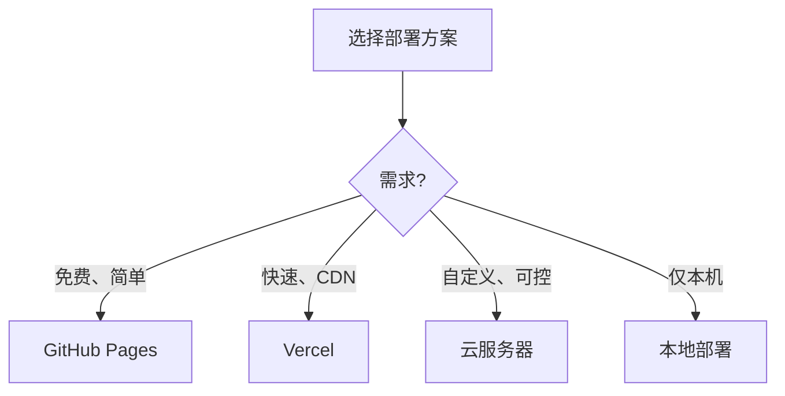

# 部署发布指南

## 概述

本章详细介绍如何将知识库部署到线上，包括 GitHub Pages（免费推荐）、云服务器等多种方案。

## 部署方案对比

| 方案 | 成本 | 难度 | 适用场景 |
|------|------|------|----------|
| GitHub Pages | 免费 | ★★ | **推荐**，个人知识库 |
| 云服务器 | 付费 | ★★★ | 需要自定义功能 |
| Vercel/Netlify | 免费 | ★★ | 自动部署、CDN |
| 本地部署 | 免费 | ★ | 仅本机访问 |

## 方案一：GitHub Pages（推荐）

### 1. 创建 GitHub 仓库

1. 注册/登录 [GitHub](https://github.com)
2. 点击 "New repository" 创建新仓库
3. 仓库名建议：`auto-layout-kb`
4. 设置为 Public（公开）

### 2. 推送代码到 GitHub

```bash
# 在项目目录初始化 Git
git init

# 添加远程仓库
git remote add origin https://github.com/你的用户名/auto-layout-kb.git

# 添加所有文件
git add .

# 提交
git commit -m "初始化汽车总布置知识库"

# 推送
git branch -M main
git push -u origin main
```

### 3. 修改 mkdocs.yml 配置

```yaml
# 修改 site_url 为你的 GitHub Pages 地址
site_url: https://你的用户名.github.io/auto-layout-kb/

# 修改 repo_url
repo_url: https://github.com/你的用户名/auto-layout-kb
repo_name: auto-layout-kb
edit_uri: edit/main/docs/
```

### 4. 配置 GitHub Actions 自动部署

在项目根目录创建 `.github/workflows/ci.yml`：

```yaml
name: ci
on:
  push:
    branches:
      - main
      - master

permissions:
  contents: write

jobs:
  deploy:
    runs-on: ubuntu-latest
    steps:
      - uses: actions/checkout@v4
        with:
          fetch-depth: 0

      - uses: actions/setup-python@v5
        with:
          python-version: 3.x

      - run: pip install mkdocs-material
      - run: pip install mkdocs-git-revision-date-localized-plugin

      - name: Build
        run: mkdocs build

      - name: Deploy
        run: mkdocs gh-deploy --force
```

### 5. 启用 GitHub Pages

1. 推送代码后，GitHub Actions 会自动构建
2. 进入仓库 **Settings → Pages**
3. Source 选择 **gh-pages** 分支
4. 目录选择 **/ (root)**
5. 保存后等待几分钟

### 6. 访问站点

访问：`https://你的用户名.github.io/auto-layout-kb/`

!!! success "自动部署"
    配置完成后，每次推送代码到 main 分支，GitHub Actions 会自动构建并部署。
    无需手动操作。

### 手动部署（备选）

如果不使用 GitHub Actions，可手动部署：

```bash
# 本地构建并部署
mkdocs gh-deploy

# 这会：
# 1. 构建静态站点到 site/
# 2. 将 site/ 推送到 gh-pages 分支
# 3. GitHub 自动发布
```

## 方案二：Vercel 部署

### 1. 注册 Vercel

访问 [vercel.com](https://vercel.com) 注册账号（可用 GitHub 登录）。

### 2. 导入项目

1. 点击 "New Project"
2. 选择你的 GitHub 仓库
3. Framework Preset 选 "Other"

### 3. 配置构建

| 配置项 | 值 |
|--------|-----|
| Build Command | `pip install mkdocs-material && mkdocs build` |
| Output Directory | `site` |
| Install Command | `pip install mkdocs-material` |

### 4. 部署

点击 "Deploy"，Vercel 会自动构建并部署。

!!! tip "Vercel 优势"
    - 全球 CDN，访问速度快
    - 自动 HTTPS
    - 每次推送自动部署
    - 自定义域名

## 方案三：云服务器部署

### 1. 准备服务器

| 要求 | 说明 |
|------|------|
| 操作系统 | Linux（Ubuntu/CentOS） |
| 内存 | ≥ 1GB |
| 存储 | ≥ 10GB |
| 带宽 | ≥ 1Mbps |

### 2. 服务器安装环境

```bash
# 安装 Python
sudo apt update
sudo apt install python3 python3-pip python3-venv git

# 克隆项目
cd /var/www
git clone https://github.com/你的用户名/auto-layout-kb.git
cd auto-layout-kb

# 创建虚拟环境
python3 -m venv venv
source venv/bin/activate

# 安装依赖
pip install -r requirements.txt

# 构建静态文件
mkdocs build
```

### 3. 配置 Nginx

```bash
# 安装 Nginx
sudo apt install nginx

# 创建配置文件
sudo nano /etc/nginx/sites-available/auto-layout-kb
```

配置内容：

```nginx
server {
    listen 80;
    server_name your-domain.com;    # 替换为你的域名或IP

    root /var/www/auto-layout-kb/site;    # 指向 site 目录
    index index.html;

    location / {
        try_files $uri $uri/ =404;
    }

    # 错误页面
    error_page 404 /404.html;
}
```

```bash
# 启用站点
sudo ln -s /etc/nginx/sites-available/auto-layout-kb /etc/nginx/sites-enabled/

# 测试配置
sudo nginx -t

# 重启 Nginx
sudo systemctl restart nginx
```

### 4. 配置 HTTPS（推荐）

```bash
# 安装 Certbot
sudo apt install certbot python3-certbot-nginx

# 获取 SSL 证书
sudo certbot --nginx -d your-domain.com

# 自动续期
sudo systemctl status certbot.timer
```

### 5. 自动部署脚本

创建 `deploy.sh`：

```bash
#!/bin/bash
# 自动部署脚本

cd /var/www/auto-layout-kb

# 拉取最新代码
git pull origin main

# 激活虚拟环境
source venv/bin/activate

# 构建站点
mkdocs build --clean

echo "部署完成！"
```

```bash
# 赋予执行权限
chmod +x deploy.sh

# 执行部署
./deploy.sh
```

## 方案四：本地内网部署

### 1. 构建静态文件

```bash
mkdocs build
```

### 2. 使用 Python 内置服务器

```bash
cd site
python -m http.server 8000
```

访问 `http://本机IP:8000`

### 3. 使用 Nginx（本地）

```bash
# 安装 Nginx 后
# 将 site/ 目录配置为 Nginx 根目录
```

## 自定义域名

### GitHub Pages 自定义域名

1. 在域名服务商添加 CNAME 记录：
   - 类型：CNAME
   - 主机：www（或 @）
   - 值：`你的用户名.github.io`

2. 在项目 `docs/` 目录创建 `CNAME` 文件：
   ```
   your-domain.com
   ```

3. 推送代码，等待生效

### 云服务器自定义域名

1. 域名解析到服务器 IP
2. Nginx 配置 server_name
3. 配置 HTTPS

## 部署检查清单

部署后，检查以下项目：

```markdown
- [ ] 网站可以正常访问
- [ ] 首页显示正常
- [ ] 所有导航链接有效
- [ ] 搜索功能正常
- [ ] 图片显示正常
- [ ] 暗色模式切换正常
- [ ] 移动端显示正常
- [ ] HTTPS 证书有效（如配置）
```

## 更新部署

### GitHub Pages

```bash
# 修改内容后
git add .
git commit -m "更新内容"
git push

# GitHub Actions 自动部署（如已配置）
# 或手动部署：
mkdocs gh-deploy
```

### 云服务器

```bash
# 在服务器执行
cd /var/www/auto-layout-kb
./deploy.sh
```

## 监控与维护

### 1. 检查部署状态

```bash
# GitHub Actions 状态
# 访问仓库 Actions 页面

# 云服务器
sudo systemctl status nginx
```

### 2. 日志查看

```bash
# Nginx 日志
sudo tail -f /var/log/nginx/access.log
sudo tail -f /var/log/nginx/error.log
```

### 3. 备份

```bash
# 代码备份（GitHub 远程仓库）
git push

# 服务器备份（打包项目）
tar -czf backup.tar.gz /var/www/auto-layout-kb
```

## 常见部署问题

### 1. GitHub Pages 404

**检查：**

- gh-pages 分支是否存在
- Settings → Pages 配置是否正确
- 等待几分钟（首次部署需要时间）

### 2. 样式丢失

**检查：**

- `site_url` 配置是否正确
- 是否使用相对路径

### 3. GitHub Actions 失败

**检查：**

- `.github/workflows/ci.yml` 语法
- Actions 日志（仓库 Actions 页面）

### 4. 域名无法访问

**检查：**

- DNS 解析是否生效（可能需要等待）
- HTTPS 证书是否有效

## 部署方案选择建议



| 场景 | 推荐方案 |
|------|----------|
| 个人知识库（首选） | GitHub Pages |
| 需要快速访问 | Vercel |
| 企业内部使用 | 云服务器 |
| 临时预览 | 本地部署 |

---

## 下一步阅读

- [本地开发](develop.md）：开发环境搭建
- [内容更新](update.md）：内容维护方法
