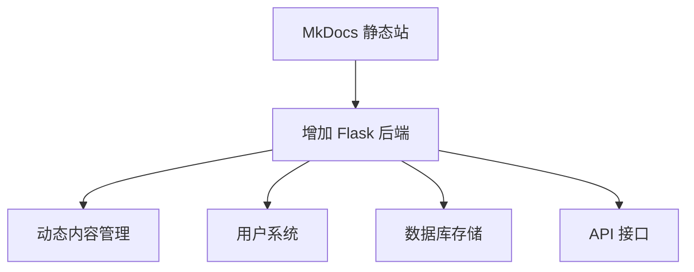

# 本地开发指南

## 概述

本章介绍如何在本地搭建开发环境，进行内容编写和预览。这是日常维护的基础。

## 环境准备

### 1. 安装 Python

!!! note "版本要求"
    需要 Python 3.8 或以上版本。

#### Windows

1. 访问 [python.org](https://www.python.org/downloads/) 下载安装包
2. 安装时**勾选 "Add Python to PATH"**
3. 验证安装：

```bash
python --version
```

#### macOS

```bash
# 使用 Homebrew
brew install python
```

#### Linux (Ubuntu/Debian)

```bash
sudo apt update
sudo apt install python3 python3-pip python3-venv
```

### 2. 安装 Git

Git 用于版本管理和部署。

#### Windows

1. 访问 [git-scm.com](https://git-scm.com/) 下载安装
2. 验证：

```bash
git --version
```

#### macOS

```bash
brew install git
```

### 3. 安装编辑器

推荐使用 **VS Code**（免费、强大）：

1. 访问 [code.visualstudio.com](https://code.visualstudio.com/) 下载
2. 推荐安装插件：
   - **Markdown All in One**：Markdown 编辑增强
   - **Markdown Preview Enhanced**：Markdown 预览
   - **Python**：Python 支持
   - **mkdocs**：MkDocs 语法支持

## 项目初始化

### 1. 克隆项目（已有仓库）

```bash
git clone https://github.com/your-username/auto-layout-kb.git
cd auto-layout-kb
```

### 2. 创建虚拟环境

!!! tip "为什么要用虚拟环境"
    虚拟环境隔离项目依赖，避免与其他 Python 项目冲突。

```bash
# Windows
python -m venv venv
venv\Scripts\activate

# macOS / Linux
python3 -m venv venv
source venv/bin/activate
```

激活后，命令行前面会出现 `(venv)` 标识。

### 3. 安装依赖

```bash
# 使用国内镜像加速（推荐）
pip install -r requirements.txt -i https://pypi.tuna.tsinghua.edu.cn/simple

# 或使用默认源
pip install -r requirements.txt
```

### 4. 验证安装

```bash
mkdocs --version
```

## 本地预览

### 启动开发服务器

```bash
mkdocs serve
```

启动后访问 **http://127.0.0.1:8000** 即可预览。

!!! tip "热重载"
    `mkdocs serve` 支持热重载，修改 Markdown 文件后浏览器自动刷新。
    这是日常编写最常用的工作模式。

### 指定端口

如果 8000 端口被占用：

```bash
mkdocs serve -a 127.0.0.1:8080
```

### 构建静态文件

```bash
mkdocs build
```

构建结果在 `site/` 目录，是纯静态 HTML，可部署到任何服务器。

```bash
# 构建并清理旧文件
mkdocs build --clean
```

## 目录结构说明

```
auto-layout-kb/
├── docs/                    # 内容目录（Markdown 文件）
│   ├── index.md            # 首页
│   ├── basics/             # 总布置基础
│   │   ├── overview.md
│   │   ├── workflow.md
│   │   └── ...
│   ├── parameters/         # 整车参数
│   ├── powertrain/         # 动力总成
│   ├── chassis/            # 底盘系统
│   ├── body/               # 车身布置
│   ├── electrical/         # 电气与新能源
│   ├── cases/              # 总布置案例
│   ├── tools/              # 工具与资源
│   ├── maintain/           # 维护指南
│   ├── about.md            # 关于
│   └── stylesheets/        # 自定义样式
│       └── extra.css
├── mkdocs.yml              # MkDocs 配置文件
├── requirements.txt        # Python 依赖
├── .gitignore              # Git 忽略文件
└── README.md               # 项目说明
```

### 关键文件说明

| 文件 | 作用 |
|------|------|
| `mkdocs.yml` | 站点配置（主题、导航、插件等） |
| `docs/` | 所有内容文件 |
| `requirements.txt` | Python 依赖清单 |
| `venv/` | 虚拟环境（不提交到 Git） |
| `site/` | 构建输出（不提交到 Git） |

## 常用命令速查

| 命令 | 说明 |
|------|------|
| `mkdocs serve` | 启动本地预览服务器 |
| `mkdocs build` | 构建静态站点 |
| `mkdocs build --clean` | 清理后构建 |
| `mkdocs new [dir]` | 创建新项目（初始用） |
| `pip install -r requirements.txt` | 安装依赖 |
| `git status` | 查看文件变更 |
| `git add .` | 暂存所有变更 |
| `git commit -m "msg"` | 提交变更 |
| `git push` | 推送到远程仓库 |

## 常见问题

### 1. mkdocs 命令未找到

```bash
# 确保虚拟环境已激活
# Windows
venv\Scripts\activate

# macOS / Linux
source venv/bin/activate

# 重新安装
pip install mkdocs mkdocs-material
```

### 2. 预览页面打不开

- 检查端口是否被占用
- 尝试指定其他端口：`mkdocs serve -a 127.0.0.1:8080`
- 检查防火墙设置

### 3. 中文搜索不工作

确保 `mkdocs.yml` 中 search 插件配置了中文：

```yaml
plugins:
  - search:
      lang:
        - zh
        - en
```

### 4. 图片不显示

- 图片放在 `docs/` 目录下（如 `docs/assets/`）
- Markdown 中使用相对路径引用：``

### 5. Mermaid 图表不显示

确保 `mkdocs.yml` 配置了 superfences：

```yaml
markdown_extensions:
  - pymdownx.superfences:
      custom_fences:
        - name: mermaid
          class: mermaid
          format: !!python/name:pymdownx.superfences.fence_code_format
```

## 开发工作流


### 日常开发流程

```bash
# 1. 拉取最新代码
git pull

# 2. 激活虚拟环境
# Windows
venv\Scripts\activate
# macOS/Linux
source venv/bin/activate

# 3. 启动预览
mkdocs serve

# 4. 编辑内容（VS Code 中编辑）
# ... 编辑 docs/ 下的 Markdown 文件 ...

# 5. 预览确认
# 浏览器访问 http://127.0.0.1:8000

# 6. 提交变更
git add .
git commit -m "更新XXX内容"
git push
```

## VS Code 推荐配置

在项目根目录创建 `.vscode/settings.json`：

```json
{
  "markdown.preview.fontSize": 14,
  "editor.fontFamily": "Consolas, 'Microsoft YaHei'",
  "editor.wordWrap": "on",
  "files.autoSave": "afterDelay",
  "markdown.extension.toc.levels": "2..3",
  "markdown.extension.preview.autoShowPreviewToSide": true
}
```

## 后期扩展为 Python Web

!!! note "为什么选 MkDocs"
    MkDocs 基于 Python，后期可无缝扩展为 Python Web 应用（Flask/FastAPI），
    这是选择 MkDocs 而非 Hugo/Jekyll 的重要原因。

### 扩展思路



| 扩展方向 | 说明 |
|----------|------|
| 动态内容 | Flask 后端管理 Markdown 内容 |
| 用户系统 | 登录/注册，个人收藏 |
| 数据库 | SQLite/PostgreSQL 存储用户数据 |
| API | 提供知识查询 API |
| 后台管理 | 管理员后台编辑内容 |

### 示例：Flask 扩展

```python
# app.py（未来扩展用）
from flask import Flask, render_template
import markdown

app = Flask(__name__)

@app.route('/')
def index():
    # 读取 Markdown 并渲染
    with open('docs/index.md', 'r', encoding='utf-8') as f:
        content = f.read()
    html = markdown.markdown(content)
    return render_template('page.html', content=html)

if __name__ == '__main__':
    app.run(debug=True)
```

> 当前阶段保持 MkDocs 静态站点即可，需要动态功能时再扩展。

---

## 下一步阅读

- [内容更新](update.md）：如何添加和修改内容
- [部署发布](deploy.md）：如何部署到线上
