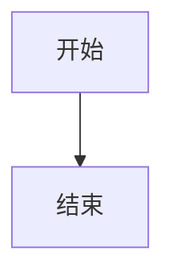

# 内容更新指南

## 概述

本章详细介绍如何添加、修改和维护知识库内容。这是日常使用最频繁的操作。

## 内容组织规则

### 目录结构

```
docs/
├── 板块名称/          # 如 basics/、powertrain/
│   ├── 文件1.md      # 板块内文章
│   └── 文件2.md
└── index.md          # 首页
```

### 文件命名规范

| 规则 | 示例 |
|------|------|
| 使用英文小写 | `overview.md`（非 `概述.md`） |
| 单词间用连字符 | `engine-layout.md` |
| 不要有空格和中文 | 避免文件路径问题 |

## Markdown 基础

### 标题

```markdown
# 一级标题（页面标题，只用一个）

## 二级标题（主要章节）

### 三级标题（子章节）

#### 四级标题
```

### 文本格式

```markdown
**粗体**
*斜体*
~~删除线~~
`行内代码`
```

### 列表

```markdown
- 无序列表项 1
- 无序列表项 2
  - 子项

1. 有序列表 1
2. 有序列表 2
```

### 表格

```markdown
| 列1 | 列2 | 列3 |
|-----|-----|-----|
| 内容 | 内容 | 内容 |
```

### 代码块

````markdown
```python
def hello():
    print("Hello")
```
````

### 链接和图片

```markdown
[链接文字](https://example.com)
[内部链接](../basics/overview.md)

```

## MkDocs Material 特殊语法

### 提示框（Admonition）

```markdown
!!! note "提示"
    这是一个提示框。

!!! tip "建议"
    这是一个建议框。

!!! warning "警告"
    这是一个警告框。

!!! danger "危险"
    这是一个危险警告。
```

支持的类型：`note`、`tip`、`info`、`warning`、`danger`、`example`、`quote`、`abstract`

### 可折叠提示框

```markdown
??? note "点击展开"
    这个内容默认折叠，点击标题展开。

???+ note "默认展开"
    这个内容默认展开，可点击折叠。
```

### 代码块带行号和复制

````markdown
```python linenums="1"
def calculate():
    return 42
```
````

### 标签页

````markdown
=== "Tab 1"
    Tab 1 的内容

=== "Tab 2"
    Tab 2 的内容
````

### Mermaid 图表

````markdown

````

### 数学公式

```markdown
行内公式：$E = mc^2$

块公式：
$$
F = ma
$$
```

### 按钮和图标

```markdown
[按钮文字](链接){ .md-button }
[主要按钮](链接){ .md-button .md-button--primary }

:material-car: 汽车图标
:octicons-arrow-right-24: 箭头图标
```

## 添加新内容

### 1. 添加新文章

**步骤：**

1. 在对应板块目录创建 `.md` 文件
2. 编写内容
3. 在 `mkdocs.yml` 的 `nav` 中注册

**示例：添加"混动系统布置"文章**

```bash
# 1. 创建文件
# 文件路径：docs/powertrain/hybrid.md
```

```markdown
# 混动系统布置

## 概述

混动系统结合燃油和电动...

## 内容
...
```

```yaml
# 2. 在 mkdocs.yml 的 nav 中添加
nav:
  - 动力总成布置:
    - 发动机布置: powertrain/engine.md
    - 电机布置: powertrain/motor.md
    - 混动系统布置: powertrain/hybrid.md   # 新增
    - 传动系统: powertrain/transmission.md
```

### 2. 添加新板块

**步骤：**

1. 在 `docs/` 下创建新目录
2. 创建文章文件
3. 在 `mkdocs.yml` 中注册板块

**示例：添加"轻量化设计"板块**

```bash
# 1. 创建目录和文件
mkdir docs/lightweight
# 创建 docs/lightweight/materials.md
# 创建 docs/lightweight/structure.md
```

```yaml
# 2. 在 mkdocs.yml 中添加
nav:
  - 轻量化设计:           # 新板块
    - 材料轻量化: lightweight/materials.md
    - 结构轻量化: lightweight/structure.md
```

### 3. 添加图片

```bash
# 1. 创建图片目录
mkdir docs/assets

# 2. 放入图片
# 将图片文件放入 docs/assets/

# 3. 在 Markdown 中引用

```

!!! tip "图片优化"
    - 使用 WebP 格式（体积小、质量好）
    - 图片宽度不超过 1200px
    - 文件大小控制在 200KB 以内

## 修改现有内容

### 编辑流程


### 1. 找到要修改的文件

根据导航栏位置找到对应文件：

| 导航位置 | 文件路径 |
|----------|----------|
| 首页 | `docs/index.md` |
| 总布置基础 > 概述 | `docs/basics/overview.md` |
| 整车参数 > 尺寸参数 | `docs/parameters/dimensions.md` |

### 2. 编辑内容

在 VS Code 或任意编辑器中修改 Markdown 文件。

### 3. 预览

```bash
mkdocs serve
# 浏览器访问 http://127.0.0.1:8000
```

## 文章模板

新建文章时，可参考以下模板：

```markdown
# 文章标题

## 概述

简要介绍本章内容，说明重要性和适用场景。

## 主要内容

### 1. 第一个主题

正文内容...

| 参数 | 说明 |
|------|------|
| ... | ... |

### 2. 第二个主题


## 要点总结

- 要点 1
- 要点 2
- 要点 3

!!! tip "实用建议"
    给读者的实用建议。

---

## 下一步阅读

- [相关文章1](../xxx/yyy.md)
- [相关文章2](../xxx/zzz.md)
```

## 导航菜单管理

导航菜单在 `mkdocs.yml` 的 `nav` 部分定义：

```yaml
nav:
  - 首页: index.md
  - 板块名称:           # 顶层菜单
    - 文章1: path/file1.md
    - 文章2: path/file2.md
```

### 导航层级

```yaml
nav:
  - 首页: index.md              # 顶层
  - 总布置基础:                  # 顶层（板块）
    - 概述: basics/overview.md  # 二层（文章）
    - 工作流程: basics/workflow.md
```

!!! note "导航顺序"
    `nav` 中文章的顺序就是网站导航的顺序，可以自由调整。

## 配置修改

### 修改站点信息

编辑 `mkdocs.yml`：

```yaml
site_name: 你的站点名称
site_description: 你的站点描述
site_author: 你的名字
```

### 修改主题颜色

```yaml
theme:
  palette:
    - scheme: default
      primary: indigo    # 主色（可选：red/pink/purple/deep-purple/indigo/blue/light-blue/cyan/teal/green/light-green/lime/yellow/amber/orange/deep-orange/brown/grey/blue-grey）
      accent: blue       # 强调色
```

### 修改仓库链接

```yaml
repo_url: https://github.com/你的用户名/你的仓库
repo_name: 你的仓库名
edit_uri: edit/main/docs/    # 编辑链接
```

## 内容更新最佳实践

### 1. 定期更新

| 更新频率 | 内容 |
|----------|------|
| 每周 | 新增内容、修改细节 |
| 每月 | 审查内容准确性 |
| 每季度 | 更新法规标准变化 |
| 每年 | 重大内容补充 |

### 2. 版本管理

```bash
# 每次更新都提交 Git
git add .
git commit -m "更新内容说明"
git push
```

### 3. 内容质量

| 要求 | 说明 |
|------|------|
| 准确 | 数据和参数需准确 |
| 清晰 | 逻辑清晰，层次分明 |
| 图文 | 配合图表说明 |
| 更新 | 过时内容及时更新 |
| 来源 | 引用数据注明来源 |

### 4. 备份

```bash
# 定期推送到远程仓库（GitHub），相当于备份
git push

# 也可以导出完整项目备份
# 复制整个项目文件夹
```

## 常见内容问题

### 1. 导航不显示新文章

**原因：** 未在 `mkdocs.yml` 的 `nav` 中注册。

**解决：** 在 `nav` 中添加新文章的条目。

### 2. 图片不显示

**检查：**

- 图片路径是否正确（相对路径）
- 图片文件是否存在
- 文件名大小写是否一致

### 3. 特殊语法不生效

**检查：**

- `mkdocs.yml` 中是否启用了对应扩展
- 语法是否正确（缩进、符号）

### 4. 中文路径问题

**建议：**

- 文件名用英文，避免中文
- 内容中可以用中文

## 内容更新清单模板

每次更新内容后，可使用以下清单检查：

```markdown
- [ ] 内容已编写完成
- [ ] 本地预览正常（mkdocs serve）
- [ ] 图片显示正常
- [ ] 导航已更新（mkdocs.yml）
- [ ] 内部链接有效
- [ ] 代码块格式正确
- [ ] 表格格式正确
- [ ] 已提交 Git
- [ ] 已推送到远程
```

---

## 下一步阅读

- [本地开发](develop.md）：环境搭建
- [部署发布](deploy.md）：发布到线上
