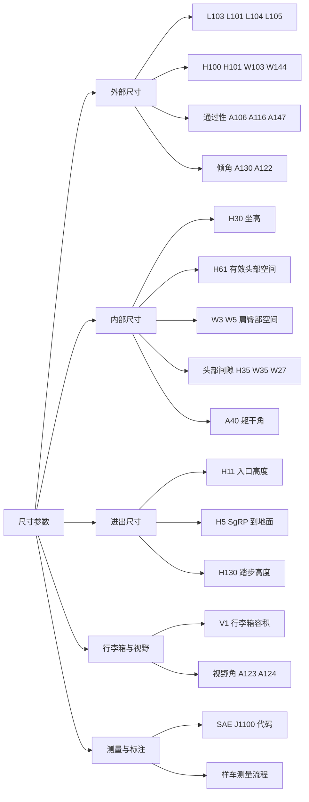

# 尺寸参数

!!! quote "内容来源"
    本页正文抽取自《总布置》知识库中**可文本解析**的文件：
    `40《总布置图设计规范》.xlsx`（**127 项 SAE J1100 参数目标表**）、
    `SJ 16-2008 样车总布置测量指导书`、`QCD-A0-005 概念草图阶段总布置检查规范`、
    `SJ 4-2008`（断面尺寸基准）、`SJ 9-2008`（尺寸代码体系）。
    企业规范编号原样保留。

## 尺寸参数体系

## 概述

### 要点

**（1）尺寸代码的唯一基准是 SAE J1100**

《总布置图设计规范》（`40`）以 **SAE J1100** 为唯一参照标准，将整车尺寸参数整理为 **127 项**，分六大类：

| 类别 | 覆盖面 |
|---|---|
| **Exterior Dimension**（外部尺寸） | 长/宽/高、轴距、前后悬、轮距、轮心、通过性角度、倾角、离地间隙、腰线高 |
| **Interior Dimension**（内部尺寸） | 坐高 H30、有效头部空间 H61、腿部空间、肩/臀部空间、头部间隙、地板高、躯干角、转向盘、座椅行程 |
| **Ingress/Egress Dimension**（进出尺寸） | 入口高度、SgRP 到地面/立柱距离、踏步高度、脚部入口间隙、门开度 |
| **Luggage Compartment**（行李箱） | 容积 V1、提举高度、开口宽度、轮罩宽度 |
| **Direct/Indirect Field of View**（视野） | 风窗/后窗上下视野角、A/B/C 柱双目障碍角 |
| **Chassis** | 静载半径、轮胎规格、油箱容积、转弯直径 |

**（2）国内代码体系**：`GB/T 19234-2003 乘用车尺寸代码` 是与 SAE J1100 对应的国标版本（`SJ 45-2009` §2 引用）；企业规范中出现的尺寸代码（H30、A40、L48、W3、W5、W31、H61…）均出自 SAE J1100。

**（3）总布置图设计规范的组织形式**（`40`）

该规范以表格形式给出：**序号 / 图幅包含内容 / 尺寸代码 / 英文名称 / 目标参数（示例值）/ 参照标准 / 自检 / 校对 / 审核**——即"参数表 + 三级签字"的形式，可直接作为总布置图的自检表使用。

### 示例

`40《总布置图设计规范》` 的目标参数以**示例项目（A2A01）**为取值来源，因此它既是规范也是对标数据：

| 参数类别 | 示例值 |
|---|---|
| 整车长 L103 / 轴距 L101 | 4585 mm / 2712 mm |
| 前悬 L104 / 后悬 L105 | 965 mm / 840–1000 mm |
| 车高 H100 / H101 | 1600–1700 mm / 1600–1700 mm |
| 最大车宽 W103 / 含后视镜车宽 W144 | 1926 mm / **2150 mm max** |
| 前/后轮距 W102-1/2 | 1625 mm / 1625 mm |
| SgRP 处车身宽 W117-1/2 | 1838 mm / 1876 mm |
| 最小离地间隙 H156-GVM | **170 mm min** |

### 注意事项

- **法规尺寸限值**：
  - `GB 7258` 要求乘用车**后悬不得大于轴距的 55%**；空载和满载下**转向轮轴荷不小于整车整备质量和整车总质量的 30%**（`QCD-A0-005` §5）；
  - `GB 1589` 对整车外廓尺寸、轴荷及质量有**限值**要求，`QCD-A0-005` 指出"对于一般乘用车来说很难超越其限值"，故不作为重点考虑内容。
- **同一参数可能有多个代码变体**（如 W117-1/W117-2、H35-1/H35-2、A106/A116），差值在于**测量状态或座位排**——引用时必须写全代码，不能只写"H35"。

## 主要尺寸定义

### 要点

**（1）外部尺寸**（`40`，示例项目取值）

| 尺寸代码 | 中文名称 | 目标参数 |
|---|---|---|
| L101 | 轴距 Wheelbase | 2712 |
| L103 | 整车长 Vehicle Length | 4585 |
| L104 | 前悬 Overhang Front | 965 |
| L105 | 后悬 Overhang Rear | 840–1000 |
| H100 / H101 | 车身高 / 最大车高 | 1600–1700 / 1600–1700 |
| W103 | 最大车宽 | 1926 |
| W106 / W107 | 前 / 后翼子板宽 | 1919 / 1926 |
| W117-1 / W117-2 | SgRP 处车身宽（前/后） | 1838 / 1876 |
| W102-1 / W102-2 | 前 / 后轮距 | 1625 / 1625 |
| W144 | 含后视镜车宽 | **2150 max** |

**（2）通过性与离地间隙**

| 尺寸代码 | 中文名称 | 目标参数 |
|---|---|---|
| H156-GVM | 最小离地间隙（总质量状态） | **170 min** |
| A106-1-Curb | 空载接近角 Angle of Approach | **20° min** |
| A106-2-Curb | 空载离去角 Angle of Departure | **24° min** |
| A116-1 | 总质量状态接近角 | **16° min** |
| A116-2 | 总质量状态离去角 | **18° min** |
| A147-Curb | 空载纵向通过角 Ramp Breakover | **18° min** |
| A117-GVW | 总质量状态纵向通过角 | **15° min** |
| H103-1 / H103-2 | 前 / 后保离地高 Facia to Ground | 230 min / 230 min |
| H132-1 / H132-2 | 前 / 后门开口下缘离地 | 230 min / 230 min |
| H111-1 / H111-2 | 前 / 后门槛高 Rocker Panel Height | 170 min / 170 min |

> 与 `QCD-A0-005` 的经验值对照：接近角空载 **≥ 15°**、满载 **≥ 10°**（`40` 的示例项目要求更严：空载 20°、总质量 16°）；离去角两厢空载 **> 19°**、三厢 **> 17°**、满载 **> 10°**。**经验值是下限，项目目标值应按车型定位取更高。**

**（3）角度类尺寸**

| 尺寸代码 | 中文名称 | 目标参数 |
|---|---|---|
| A130-1 | 前风窗倾角 Glazing Angle-Windshield | **62° max** |
| A130-2 | 后窗倾角 Glazing Angle-Backlite | **72° max** |
| A122 | 侧窗内倾角 Tumblehome | **22° max** |
| 无 SAE 代码 | 发动机盖开启角 Hood Open Angle | **53°–55°** |
| H25-1 / H25-2 | 一 / 二排腰线高 Belt Height | 490 max / 510 max |
| H26-1 / H26-2 | 一 / 二排内腰线高 Interior Belt Height | 485 max / 505 max |

**（4）整车参数设定的推导逻辑**（`QCD-A0-005` §5）

| 参数 | 确定依据 |
|---|---|
| **前悬** | 碰撞吸能距离 + 散热器/低速碰前保横梁布置 + 接近角与竞品对比 |
| **轴距** | 驾驶室内布置完假人后，对比新车型与竞品乘坐舒适性决定加长/减短 |
| **后悬** | 备胎布置 + 离去角对比；`GB 7258` 要求后悬 ≤ 轴距的 55% |
| **整车高度** | 轮胎型号 + 假人姿态 + 驾驶员头部空间要求 + **顶盖典型截面** |
| **整车宽度** | H 点 Y 坐标差（轮距不变时）；轮距加大/减小则整车宽度同向变化 |
| **接近角/离去角/通过角/最小离地间隙** | **参照竞争车型数值设定** |
| **轴荷** | 预估前后轴荷，校核转向轮 ≥ 30% |

### 示例

尺寸标注示例（`SJ 4-2008`）体现了"**基准先行**"的原则：断面中的关键尺寸都必须由基准来确定。门洞法兰面的四个参数即为典型（L1 = 1 mm 控制边缘线落差、L2 = 15–18 mm 控制法兰面宽度、R1 = 3–6 mm 控制圆角、α > 4° 控制斜角）——这类**小尺寸参数控制的是制造与装配的可行性**，而非性能指标。

### 注意事项

- **尺寸链累积公差影响**：`SJ 29-2008` 用孔加工案例量化了基准变换的代价——基准固定时 B 与 C 的距离公差为 **±0.2 mm**，基准变换后变为 **±0.3 mm**（**减小 ±0.1 mm**）；
- **尺寸标注必须区分状态**：通过性参数在"空载 / 满载 / 总质量"下取值不同，`QCD-A0-005` 明确"以竞争车型数值为设定基准"——目标值必须写明状态。

## 上车体相关尺寸

### 要点

**（1）内部尺寸（前排）**（`40`）

| 尺寸代码 | 中文名称 | 目标参数 |
|---|---|---|
| H30-1 | 驾驶员坐高 Chair Height | **300–330 mm** |
| H61-1 | 前排有效头部空间 | **990 min** |
| L34 | 油门踏板有效腿部空间 | **1000 min** |
| W3-1 | 前排肩部空间 | **1420 min** |
| W5-1 | 前排臀部空间 | **1376 min** |
| L38 | 头部到前风窗饰条间隙 | **140 min** |
| H35-1 | 驾驶员垂直头部间隙 | **55 min**（小车 40） |
| W35-1 | 驾驶员横向头部间隙 | **139 min**（X 断面）/ 94（3D 测量） |
| W27-1 | 驾驶员斜向头部间隙 | **78 min** |
| H46-1 / W38-1 | 前排垂直头部间隙 2 / 最小头部间隙 | 55 min / 55 min |
| SW16-1 | 驾驶员坐垫宽 | **480–500** |
| A40-1 | 驾驶员躯干角 | **22°** |
| W7 | 转向盘中心点 | 坐标点（X/Y/Z） |
| W9 | 转向盘直径 | **375** |
| A18 | 转向盘倾角（Y 平面） | **26°** |
| TL17 / TL28 | 座椅行程包络 | 230 min / 230 min |
| TH21 / TH33 | 座椅高度行程 | 45 min / 25 min |

**（2）内部尺寸（后排）**

| 尺寸代码 | 中文名称 | 目标参数 |
|---|---|---|
| H30-2 | 二排坐高 | **380–410** |
| H61-2 | 二排有效头部空间 | **930 min** |
| L51-2 | 二排有效腿部空间 | **910 min** |
| L48 | 二排膝部间隙 | **61 min** |
| W3-2 / W5-2 | 二排肩部 / 臀部空间 | 1400 min / 1340 min |
| L39 | 头部到后窗饰条间隙 | **40 min** |
| H35-2 / H46-2 / W38-2 | 二排垂直头部间隙（三项） | 15 min / 15 min / 15 min |
| W35-2 | 二排横向头部间隙 | 41 min（X 断面）/ 87（3D） |
| W27-2 | 二排斜向头部间隙 | **26 min** |
| A40-2 | 二排躯干角 | **25°** |
| H67-1/2 | 未压缩地板高（前/后） | 27 min / 27 min |
| H68-1/2 | 压缩地板高（前/后） | 20 min / 20 min |

**（3）进出尺寸**（`40`）

| 尺寸代码 | 中文名称 | 目标参数 |
|---|---|---|
| L50-2 | 排间距离 Couple Distance | 913 |
| H11-1 / H11-2 | 驾驶员 / 二排入口高度 | 790 min / 780 min |
| H5-1 / H5-2 | SgRP 到路缘地面（前/后） | 665–685 / 700–725 |
| H50-1 / H50-2 | 上车体开口到地面（前/后） | 1481 min / 1512 min |
| L18 / L19 | 前 / 后排脚部入口间隙 | 400 min / 320 min |
| H130-1-Curb / H130-2-Curb | 前 / 后踏步高度（空载） | 465–470 / 470–475 |
| 无 SAE | SgRP-1 到 B 柱 | **15 min** |
| 无 SAE | SgRP-2 到 B 柱 / C 柱 / 600 mm 上方 C 柱 | 600 min / −5 min / 250 min |
| 无 SAE | 侧向跨出宽度（前/后） | **604 max** |

**（4）视野相关尺寸**（`40`）

| 尺寸代码 | 中文名称 | 目标参数 |
|---|---|---|
| A124-1-U / A124-1-L | 风窗上下视野角（乘员侧中线） | 14–16° / 6° min |
| A124-2-U / A124-2-L | 后窗上下视野角 | 4° min / 0° min |
| A123-1-U / A123-1-L | 车辆中线前上/前下视野 | 12–14° / **6.55° min** |
| A123-2-U / A123-2-L | 车辆中线后上/后下视野 | 4° min / 0° min |
| A 柱双目障碍角 | A-Pillar Binocular Obstruction | **5° max** |
| B 柱双目障碍角 | B-Pillar Binocular Obstruction | **31° max** |
| C 柱双目障碍角 | C-Pillar Binocular Obstruction | **17.5° max** |

**（5）行李箱尺寸**

| 尺寸代码 | 中文名称 | 目标参数 |
|---|---|---|
| V1 | 行李箱容积 | **523 L min** |
| H196 | 提举高度 Lift Out Height | **770 max** |
| H193 | 装载高度 | 25–30 |
| H251 | 开启举升门到地面高 | 1830–1850 |
| W205 / W206 / W207 | 后开口上部 / 最大 / 下部宽 | 900 min / 1100 min / 1060 min |
| W200 | 行李箱最大宽 | 1100 min |
| W201 / W202 | 地板处轮罩宽 / 最小轮罩宽 | 1000 min / 1000 min |

### 示例

`SJ 16-2008` 的样车测量给出了这些尺寸的**实测获取方法**，测量内容分四类：

| 类别 | 测量项数 | 典型内容 |
|---|---|---|
| **外部特征线** | 16 项 | Y=0 断面线（含发罩、尾门开启状态）、前后轮心位置 X 断面、车身分缝线、活动件开度（次级/最大/过开度）、轮胎与轮眉处断面线、车灯边界、玻璃面边界、腰线、格栅开口、加油口、门把手、外后视镜及旋转中心、前后刮水器刮刷面积及旋转轴线、车门铰链、机舱内部件概略外形 |
| **内部特征线** | 8 项 | 内饰 Y=0 断面线、过 R 点 Y 断面、仪表板特征线、遮阳板特征线、内后视镜镜面及旋转中心、座椅滑移前后极限中心断面、门内护板特征线、驾驶员/乘员脚部地板平面 |
| **硬点** | 10 项 | 发动机 BHC/DC/悬置点、转向盘上表面中心（含上下极限、角度、圈数）、三踏板中心及外廓与行程、驻车制动最低点中心及行程、C 点、内外后视镜中心点、悬架安装硬点、备胎中心点、换档手柄各挡位中心点、座椅旋转中心 |
| **人机相关** | 13 项 | 踵点、R 点、踏板角、踝角、膝盖角、臀角、靠背角、有效头部空间、肩/肘/臀部空间、大腿与转向盘间隙、座椅调节范围 |

### 注意事项

- **尺寸链累积公差**：进出尺寸（H11 入口高度 790 min、L18 脚部入口 400 min、H130 踏步高 465–470）与内饰件间隙（0.5–2 mm 量级）处于同一量级，**钣金公差会直接吃掉可用余量**，必须做极限状态校核；
- **前排与后排的目标值差异明显**（H61-1 990 vs H61-2 930、W3-1 1420 vs W3-2 1400、头部间隙 55 vs 15）——这与 `QCD-A0-005` 的假人选用规则一致：**优先保证驾驶员**。

## 测量与标注方法

### 要点

**（1）样车测量的流程与资源**（`SJ 16-2008` §4、§5.1）

| 阶段 | 内容 |
|---|---|
| **测量准备** | ① 测量车辆主要参数调查（通过互联网、随车使用手册了解样车，填写《整车基本参数配置表》并向项目组发布）；② 测量工具准备 |
| **了解车况** | 调整整车状态（胎压符合标准、燃油 > 油箱容积 90%、加注液 ≥ 容器容积 95%）；关键底盘间隙尺寸调查（前后悬架、发动机舱、传动轴、排气管等周边间隙） |
| **轴荷、质心测量** | 委托专业机构在**整备质量状态**下测量，索取测量报告，填写《整车质量参数测量表》 |
| **轮心、地面位置测量** | 车辆调正（对称中心线平行于测量仪 Y 轴）→ 选取基准点 → 选取姿态指示点 → **分别空载/半载/满载测量** |
| **主要特征线及人机布置测量** | 将车身置于水平姿态（设计姿态），用 SAE 人体 + 多关节臂 + 三坐标协同测量 |

**（2）测量工具清单**（`SJ 16-2008` §5.1.2）

三坐标测量仪 1 台、多关节臂测量仪 1 台、扫描设备 1 台、**SAE 标准假人 1 个**、人体配重（68 + 7）kg/个、千斤顶 4 个、刮刀、有机溶剂、卷尺、直尺、3 种颜色标记笔、拆车工具、抹布、手套、胶带。

**（3）基准点的选取**（§5.4.2）

为把各种状态下的测量结果**整理至统一坐标系**以便对比，必须在车上选取统一基准点：

- 一般选取**纵梁底部纵梁上的工艺孔**作为整个测量过程的基准点；
- **去除孔周围涂胶**，用胶带对孔心进行标记，并采取保护措施保证车辆移动中标记不被破坏；
- 整车姿态的指示点一般选取**门槛翻边上前、后两个点**。

**（4）四张标准测量表**（`SJ 16-2008` 附录）

| 表格 | 用途 |
|---|---|
| **《整车基本参数配置表》**（附录 A） | 车辆基本信息、整车基本尺寸（长/室内长、宽/室内宽、高/室内高、轴距、最小离地间隙、轮距、接近角、前悬、离去角、后悬、纵向通过角、最小转弯半径）、主要配置（发动机/变速器型号、排量、速比、驱动/转向/制动形式）、加注液容量、整车质量参数（整备质量、最大总质量、最大载质量，**均含多种配置**） |
| **《整车地面、轮心测量表》**（表 2） | 各载荷状态下的前后轮心位置、地平面、基准孔、门槛翻边标记点、轮胎与轮眉断面线 |
| **《人机布置测量表》**（表 3） | 人机硬点及关键尺寸 |
| **《整车质量参数测量表》**（附录 B） | 轴荷与质心 |

### 示例

测量准备的"整车状态调整"是保证数据可比性的前提：**胎压须符合车辆标准要求、燃油须大于油箱容积的 90%、各种加注液须 ≥ 容器容积的 95%**——这三项恰好对应"整车整备质量"的定义（干质量 + 冷却液 + 不少于油箱容量 90% 的燃料 + 备用车轮与随车附件），说明**实测质量状态的受控是质量参数可比的先决条件**。

### 注意事项

- **不同标准下的测量差异**：`SJ 16-2008` 依据 `GB/T 3730.2-1996`，尺寸代码依据 `SAE J1100`，
  二者在术语与测量方法上存在差异（例如"整车整备质量"与 `SJ 14-2008` 的"空载质量"口径不同，后者包含驾驶员 75 kg）；
  企业规范中另有 `GB/T 19234-2003 乘用车尺寸代码` 作为 SAE J1100 的国标对应版本；
- **测量基准必须唯一**：`SJ 16-2008` 明确要求各状态测量均以**同一基准点**为基础，
  这是把空载/半载/满载三组数据换算到同一坐标系的前提。

## 待人工补充

!!! warning "本页待人工补充清单"
    - **`40《总布置图设计规范》` 的完整 127 项**：本页提取了外部尺寸、内部尺寸、进出尺寸、
      行李箱、视野五类的**主要项目与目标值**；底盘类（H108 静载半径、L102 轮胎规格、D102 转弯直径）
      与部分客车/皮卡专项参数未展开；
    - **`SAE J1100 机动车辆尺寸（中文版）`**（127 页，已下载并成功抽取）的尺寸定义正文未逐条展开，
      建议作为尺寸代码释义的权威补充来源；
    - **`GB/T 19234-2003 乘用车尺寸代码`** 与 SAE J1100 的**代码对照表**：知识库中未见该文件；
    - **尺寸链累积公差的量化分析**：仅有 `SJ 29-2008` 的孔加工示例，未见整车尺寸链分析方法；
    - 知识库中以下文件虽相关但因读取问题**未采用**：`AEM-A1-001 外廓尺寸设定规范`、
      `AEM-A0-003 总布置测量作业指导书`、`ZBZ-标杆车整车总布置外轮廓尺寸报告`（`.doc` 格式，无法解析）。

    建议：在 IMA 客户端中打开对应文件补充条款，或按"规范编号 + 页码"方式人工引用。

---

## 下一步阅读

- [质量参数](mass.md)：质量定义、轴荷与重心
- [性能参数](performance.md)：空间、舒适与安全相关性能
- [对标数据库](benchmark.md)：车型对标数据（本页为冻结页，不作填充）
- [坐姿与 H 点](../ergonomics/posture.md)：H30、A40 等人机尺寸代码的完整定义
