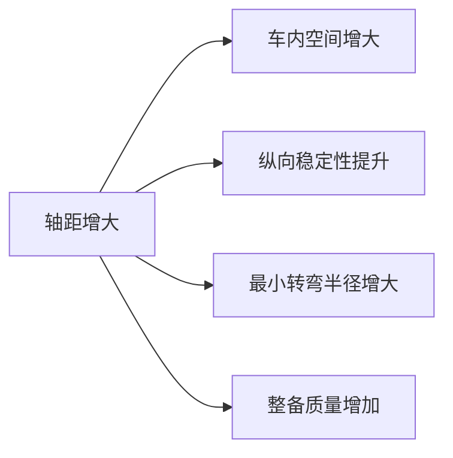
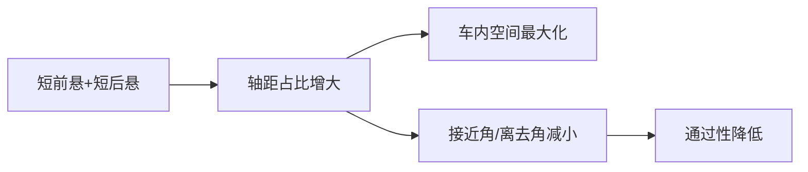
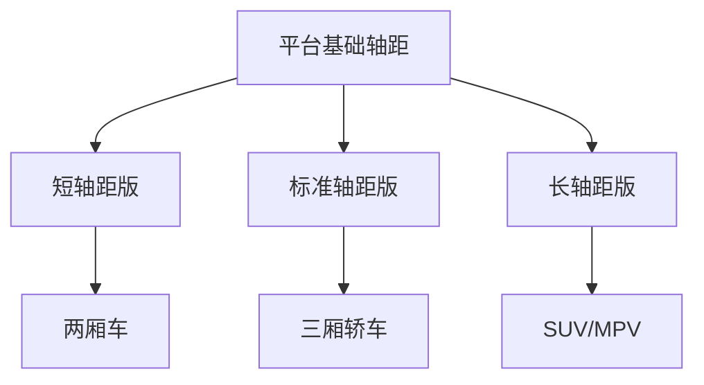

# 尺寸参数

## 概述

整车尺寸参数是总布置设计的**基础约束条件**，决定了车辆的基本形态和空间框架。尺寸参数的确定需要综合考虑产品定位、法规限值、平台约束和竞品对标。

## 整车尺寸定义

### 主要尺寸参数

```
                    ┌──────────────── 车高 H ────────────────┐
                    │                                        │
                    │     ┌─────────────────────┐            │
                    │     │                     │ 前悬 Lf    │
                    │     │      乘员舱          │◄──────────►│
                    │     │                     │            │
            ┌───────┘     └─────────────────────┘     └───────┘
            │                                               │
            ├──────────────── 车长 L ───────────────────────►│
            │                                               │
     ┌──────┘                                               └──────┐
     │  ◉──────────────────────────────────────────────────────◉  │
     │  ├──────────────── 货箱/行李舱 ──────────────────►│  │
     │  ├──────────────── 轴距 Lwb ─────────────────────►│  │
     │  ◉前轴                                          后轴◉  │
     │  ├── 前悬 Lf ──┤                         ├── 后悬 Lr ──┤│
     │  ├◀── 轮距 Twf ──▶│                 │◀── 轮距 Twr ──▶│
     └────────────────────────────────────────────────────────────┘
```

| 参数 | 符号 | 定义 |
|------|------|------|
| 车长 | L | 车辆最前端到最后端的距离 |
| 车宽 | W | 车辆两侧最外点间距（不含后视镜） |
| 车高 | H | 地面到车顶最高点距离（空载） |
| 轴距 | Lwb | 前轮中心到后轮中心的距离 |
| 前悬 | Lf | 车辆前端到前轮中心的距离 |
| 后悬 | Lr | 后轮中心到车辆后端的距离 |
| 前轮距 | Twf | 左右前车轮中心面间距 |
| 后轮距 | Twr | 左右后车轮中心面间距 |
| 最小离地间隙 | hmin | 车辆最低点距地面的距离 |

### 推导关系

```
车长 L = 前悬 Lf + 轴距 Lwb + 后悬 Lr
```

## 各参数的确定方法

### 1. 车长

**确定逻辑：**

| 考虑因素 | 说明 |
|----------|------|
| 产品定位 | A 级车 4.3-4.6m，B 级 4.7-4.9m，C 级 5.0m+ |
| 法规限值 | GB 1589：乘用车 ≤ 6.0m |
| 竞品对标 | 参考同级竞品尺寸范围 |
| 平台约束 | 平台可实现的轴距范围 |
| 内部空间 | 满足乘员舱和行李舱空间需求 |

### 2. 轴距

轴距是影响**车内空间**和**操控性能**的核心参数：

| 轴距范围 | 车型级别 | 空间 | 操控 |
|----------|----------|------|------|
| 2.5-2.6m | A0 级 | 紧凑 | 灵活 |
| 2.6-2.7m | A 级 | 适中 | 均衡 |
| 2.7-2.9m | B 级 | 宽敞 | 稳定 |
| 2.9m+ | C 级/豪华 | 宽敞 | 偏稳 |



### 3. 车宽

| 考虑因素 | 说明 |
|----------|------|
| 法规限值 | GB 1589：乘用车 ≤ 2.5m |
| 乘员肩宽 | 满足前排/后排乘坐宽度需求 |
| 稳定性 | 轮距增大，横向稳定性提升 |
| 通过性 | 影响城市停车、窄路通行 |

### 4. 车高

| 车型 | 典型车高 |
|------|----------|
| 轿车 | 1.4-1.5m |
| SUV | 1.65-1.75m |
| MPV | 1.7-1.9m |
| 货车 | 视载重需求 |

!!! note "车高与重心的关系"
    车高直接影响重心高度，进而影响操稳性。SUV 重心高，侧倾倾向大；
    轿车重心低，操控更稳定。总布置需在空间与性能间权衡。

### 5. 前后悬

| 参数 | 影响 |
|------|------|
| 前悬 Lf | 接近角、碰撞吸能空间、前部布置空间 |
| 后悬 Lr | 离去角、行李舱空间、后部布置空间 |

```
接近角 α = arctan(hmin / Lf)  ← 前轮接地点与车辆前端最低点的夹角
离去角 β = arctan(hmin / Lr)  ← 后轮接地点与车辆后端最低点的夹角
```

### 6. 轮距

| 影响 | 说明 |
|------|------|
| 横向稳定性 | 轮距越大，侧倾越小 |
| 转向特性 | 影响转向灵敏度和稳定性 |
| 车内宽度 | 轮距限制乘员舱有效宽度 |
| 轮罩空间 | 影响轮胎跳动空间和转向角 |

## 典型车型尺寸参数对比

| 车型 | 车长 | 车宽 | 车高 | 轴距 |
|------|------|------|------|------|
| 紧凑型轿车 | 4400-4600 | 1780-1820 | 1420-1470 | 2600-2700 |
| 中型轿车 | 4700-4900 | 1820-1880 | 1450-1500 | 2750-2850 |
| 紧凑型 SUV | 4300-4600 | 1820-1880 | 1600-1700 | 2650-2750 |
| 中型 SUV | 4700-4900 | 1880-1950 | 1650-1750 | 2750-2900 |
| MPV | 4800-5200 | 1850-1950 | 1700-1900 | 2900-3200 |

> 以上为参考范围，具体以实际车型为准。

## 尺寸参数的优化

### 空间利用率

衡量空间利用效率的关键指标：

| 指标 | 公式 | 说明 |
|------|------|------|
| 轴长比 | 轴距/车长 | 越大空间利用率越高，一般 0.60-0.64 |
| 乘员舱利用率 | 乘员舱长/车长 | 衡量有效乘坐空间占比 |



### 平台化考虑



平台化设计时，通过调整前后悬和轴距，实现多车型共享平台。

## 尺寸参数表模板

总布置工程师维护的参数表示例：

| 序号 | 参数名称 | 符号 | 单位 | 目标值 | 法规限值 | 竞品参考 | 状态 |
|------|----------|------|------|--------|----------|----------|------|
| 1 | 车长 | L | mm | 4750 | ≤6000 | 4730 | ✓ |
| 2 | 车宽 | W | mm | 1830 | ≤2500 | 1820 | ✓ |
| 3 | 车高 | H | mm | 1470 | ≤4000 | 1465 | ✓ |
| 4 | 轴距 | Lwb | mm | 2780 | - | 2770 | ✓ |
| 5 | 前悬 | Lf | mm | 930 | - | 950 | ✓ |
| 6 | 后悬 | Lr | mm | 1040 | - | 1010 | ✓ |
| 7 | 前轮距 | Twf | mm | 1565 | - | 1555 | ✓ |
| 8 | 后轮距 | Twr | mm | 1575 | - | 1565 | ✓ |
| 9 | 最小离地间隙 | hmin | mm | 140 | - | 138 | ✓ |
| 10 | 接近角 | α | ° | 16 | - | 15 | ✓ |
| 11 | 离去角 | β | ° | 18 | - | 17 | ✓ |

---

## 下一步阅读

- [质量参数](mass.md)：质量分布与轴荷
- [性能参数](performance.md)：整车性能目标
- [总布置基础](../basics/overview.md)：参数在开发中的角色
