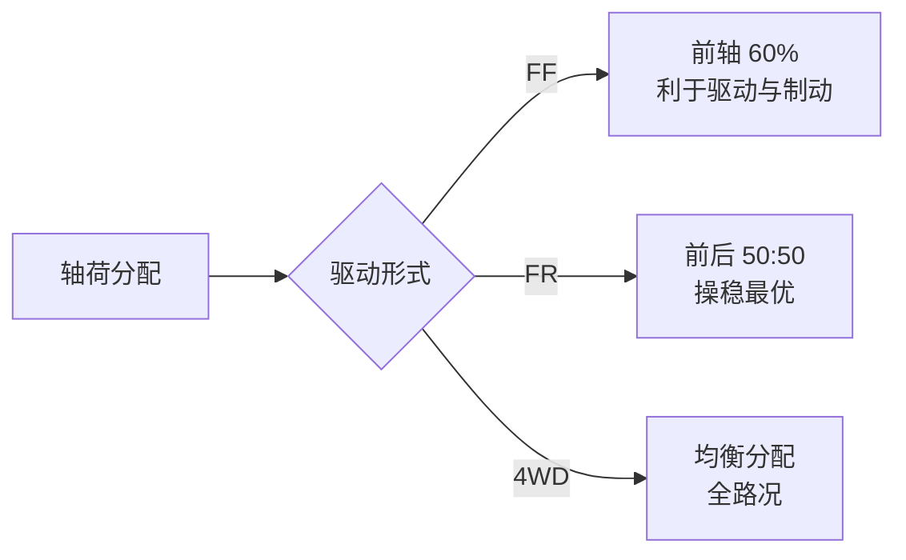
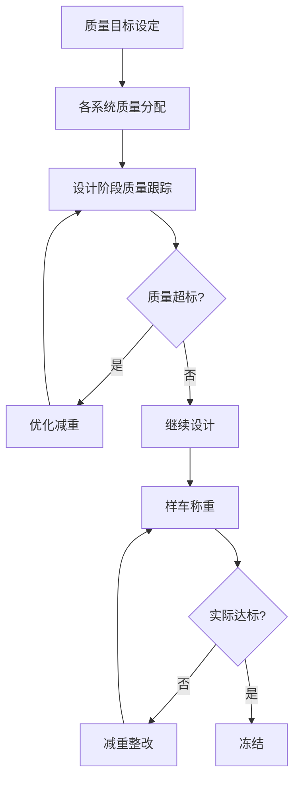
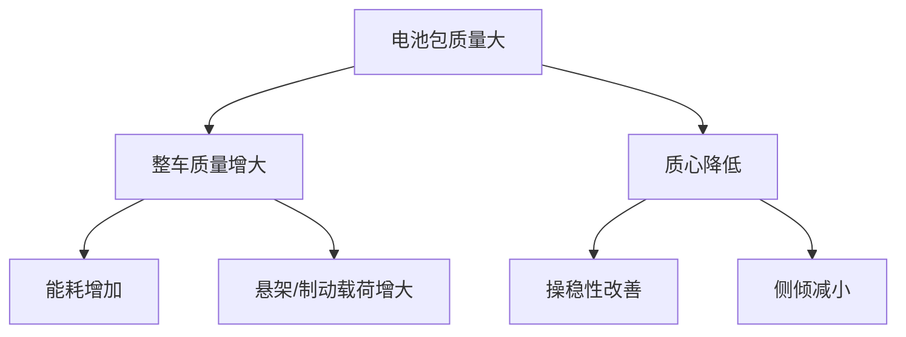

# 质量参数

## 概述

整车质量参数直接影响**动力性、经济性、操稳性、制动性**和**轮胎选型**。总布置工程师需要在设计初期预估整车质量，并在开发过程中持续管控质量变化。

## 质量参数体系

### 主要质量参数

| 参数 | 定义 | 说明 |
|------|------|------|
| 整备质量 | 满油（满液）+ 随车工具，不含乘员和货物 | 车辆本身质量 |
| 满载质量 | 整备质量 + 满员 + 满载货物 | 最大允许总质量 |
| 前轴轴荷 | 前轴承受的载荷 | 满载/空载两种工况 |
| 后轴轴荷 | 后轴承受的载荷 | 满载/空载两种工况 |
| 质心位置 | 质心在 X/Y/Z 方向的坐标 | 影响操稳性 |
| 质心高度 | 质心距地面高度 | 影响侧倾和翻倾 |

### 载荷工况

```
┌─────────────────────────────────────────────┐
│              载荷工况定义                      │
├──────────────┬──────────────────────────────┤
│ 空载工况      │ 仅驾驶员（75kg）+ 满油          │
│ 半载工况      │ 驾驶员 + 部分乘客 + 满油        │
│ 满载工况      │ 全部座位 + 行李舱满载 + 满油    │
│ 超载工况      │ 超过满载（校核用，不作为设计目标）│
└──────────────┴──────────────────────────────┘
```

!!! note "标准乘员质量"
    - 中国标准：每人 65kg + 行李 7kg = 68kg（GB/T 12534）
    - SAE 标准：每人 68kg + 行李 13.6kg
    - 具体以适用标准为准

## 轴荷分配

### 为什么要关注轴荷分配

| 性能 | 轴荷分配影响 |
|------|--------------|
| 操稳性 | 影响转向特性（不足转向/过度转向） |
| 制动性 | 制动时载荷转移，影响制动效率 |
| 动力性 | 驱动轴载荷影响驱动力 |
| 轮胎寿命 | 载荷均匀有利于轮胎磨损均衡 |

### 理想轴荷分配范围

| 驱动形式 | 空载前/后轴荷比 | 满载前/后轴荷比 | 说明 |
|----------|-----------------|-----------------|------|
| FF（前置前驱） | 60:40 ~ 65:35 | 55:45 ~ 60:40 | 前轴偏重，利于驱动 |
| FR（前置后驱） | 50:50 ~ 55:45 | 50:50 ~ 55:45 | 接近 50:50，操稳好 |
| RR（后置后驱） | 40:60 ~ 45:55 | 45:55 ~ 50:50 | 后轴偏重 |
| 4WD（四驱） | 50:50 ~ 55:45 | 50:50 ~ 55:45 | 四轮驱动均衡 |



### 轴荷调整方法

总布置工程师通过以下方式调整轴荷：

| 方法 | 说明 |
|------|------|
| 调整动力总成位置 | 前后移动发动机/电机 |
| 调整电池位置 | 电池位置对轴荷影响大 |
| 调整轴距 | 轴距变化影响质心位置 |
| 调整油箱位置 | 油箱前后位置影响轴荷 |
| 调整乘员舱位置 | 前后移动乘员舱 |
| 增加配重 | 最后手段，增加质量不推荐 |

## 质心位置

### 质心高度

质心高度影响**侧倾**和**翻倾稳定性**：

```
           质心高度 h
              │
              ◉ 质心
             /│\
            / │ \
           /  │  \
          /   │   \
    ◉────/────┴────\────◉ ← 轮距 T
    ◉────┘         └────◉
         半轮距 T/2
```

**侧倾稳定条件：**

```
质心高度 h < (轮距 T / 2) × tan(侧倾角)
```

!!! tip "质心高度参考"
    - 轿车：500-600 mm
    - SUV：650-750 mm
    - 跑车：450-500 mm（追求低重心）
    - 电动车（电池在底部）：可降低 50-100 mm

### 质心位置估算

各总成质量 × 质心坐标的加权平均：

$$
X_{cg} = \frac{\sum m_i \cdot x_i}{\sum m_i}, \quad
Y_{cg} = \frac{\sum m_i \cdot y_i}{\sum m_i}, \quad
Z_{cg} = \frac{\sum m_i \cdot z_i}{\sum m_i}
$$

其中 $m_i$ 为各总成质量，$x_i, y_i, z_i$ 为各总成质心坐标。

## 质量预估与管控

### 质量预估方法

在概念阶段，没有详细数据，通过以下方法预估：

| 方法 | 说明 | 精度 |
|------|------|------|
| 竞品对标 | 参考同级别车型质量 | 低 |
| 经验公式 | 基于尺寸/性能推算 | 中 |
| 总成分解 | 各总成质量累加 | 高 |
| CAE 估算 | 基于初步模型估算 | 中高 |

### 质量分解表

| 总成 | 燃油轿车 (kg) | 纯电动 (kg) | 占比 |
|------|:---:|:---:|:---:|
| 白车身 | 350-450 | 380-480 | 25-30% |
| 动力总成（发动机/电机） | 120-180 | 80-150 | 8-12% |
| 变速器/减速器 | 40-80 | 40-70 | 3-5% |
| 电池包 | - | 300-600 | 20-35% |
| 悬架系统（前后） | 80-120 | 90-130 | 6-8% |
| 制动系统 | 30-50 | 40-60 | 2-3% |
| 转向系统 | 15-25 | 15-25 | 1-2% |
| 车轮轮胎（4个） | 60-100 | 80-120 | 5-7% |
| 内饰 | 80-150 | 80-150 | 6-10% |
| 外饰 | 40-70 | 40-70 | 3-5% |
| 电气系统 | 30-60 | 60-120 | 3-8% |
| 燃油/油液 | 40-60 | 15-25 | 2-4% |
| **整备质量合计** | **1100-1600** | **1500-2200** | **100%** |

> 以上为 A/B 级车参考范围，具体以实际车型为准。

### 质量管控



!!! warning "质量蠕变"
    开发过程中各系统质量往往持续增加（"质量蠕变"），总布置需定期统计并预警。
    每月/每两周进行一次质量统计是常见做法。

## 电动车的质量特点

### 电池质量的影响



| 对比项 | 燃油车 | 纯电动车 |
|--------|--------|----------|
| 整备质量 | 基准 | +200~400 kg |
| 质心高度 | 500-600 mm | 450-550 mm |
| 轴荷调整 | 通过总成位置 | 电池位置灵活 |
| 载荷分布 | 前重后轻 | 可设计更均衡 |

## 质量参数表模板

| 序号 | 参数 | 单位 | 空载 | 满载 | 法规/目标 | 状态 |
|------|------|------|------|------|-----------|------|
| 1 | 整备质量 | kg | 1450 | - | ≤1600 | ✓ |
| 2 | 满载质量 | kg | - | 1850 | ≤2000 | ✓ |
| 3 | 前轴轴荷（空载） | kg | 870 | - | - | ✓ |
| 4 | 后轴轴荷（空载） | kg | 580 | - | - | ✓ |
| 5 | 前轴轴荷（满载） | kg | - | 1020 | - | ✓ |
| 6 | 后轴轴荷（满载） | kg | - | 830 | - | ✓ |
| 7 | 轴荷分配（满载） | - | - | 55:45 | 50:50~60:40 | ✓ |
| 8 | 质心高度 | mm | 520 | 540 | ≤550 | ✓ |
| 9 | 质心 X 坐标 | mm | 轴距的 55% | - | - | ✓ |

---

## 下一步阅读

- [尺寸参数](dimensions.md)：空间约束基础
- [性能参数](performance.md)：质量如何影响性能
- [电池布置](../electrical/battery.md)：电池质量的影响
