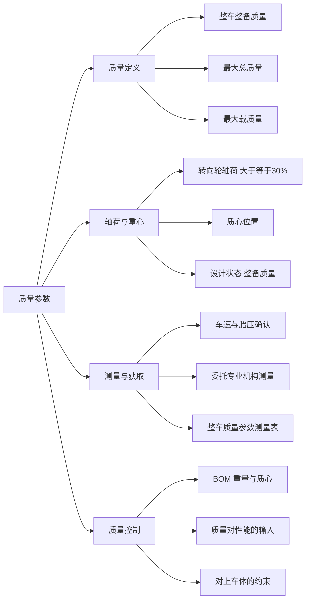

# 质量参数

!!! quote "内容来源"
    本页正文抽取自《总布置》知识库中**可文本解析**的文件：
    `SJ 16-2008 样车总布置测量指导书`、`QCD-A0-005 概念草图阶段总布置检查规范`、
    `H20-整车总布置设计硬点报告`、`SJ 9-2008`（质量对眼椭球定位的影响）。
    企业规范编号原样保留。

## 质量参数体系

## 概述

### 要点

**（1）核心质量定义**（`SJ 16-2008` §3.2，依据 `GB/T 3730.2-1996 道路车辆 质量 词汇和代码`）

| 术语 | 定义 |
|---|---|
| **整车整备质量**（complete vehicle kerb mass） | 汽车的**干质量**加上冷却液和燃料（**不少于油箱容量的 90%**）及**备用车轮和随车附件**的总质量 |

《整车基本参数配置表》（`SJ 16-2008` 附录 A）中要求填写的质量参数有三项：

| 参数 | 说明 |
|---|---|
| **整备质量（kg）** | 含**多种配置** |
| **最大总质量（kg）** | 含多种配置 |
| **最大载质量（kg）** | 含多种配置 |

**（2）设计状态与校核状态**（H20 硬点报告）

| 状态 | 定位 |
|---|---|
| **整备质量状态** | **设计状态**（总布置的基准状态，又是坐标系长度方向的取值基准） |
| 空载、空载+前排乘员、半载、满载 | **校核状态** |

> H20 定义的整车坐标系中，**长度方向取"整备质量状态下前轮中心的铅垂线"**，前负后正——这说明质量状态直接决定了几何基准。

**（3）质量参数的三个下游用途**

| 用途 | 说明 |
|---|---|
| **动力性/经济性计算** | 整车重量是 0→100 km/h 加速时间、最高车速、最大爬坡度、百公里油耗计算的输入（`QCD-A0-005` §3.2） |
| **轴荷分配校核** | 见下节 |
| **零部件设计输入** | 眼椭球与头部包络面的定位公式中含 `H8`（AHP 的 Z 向坐标）等与载荷状态相关的参数（`SJ 9-2008` §5.2.3） |

### 示例

质量参数表的填写必须**覆盖多种配置**：`SJ 16-2008` 附录 A 明确"整备质量、最大总质量、最大载质量"三项均需**含多种配置**——因为同一车型的不同配置（天窗、座椅排数、动力总成）质量差异足以影响轴荷与性能结论。

### 注意事项

- **不同市场的质量定义差异属待补充项**：本页依据 `GB/T 3730.2-1996`（国标词汇），
  未见 EU / US 的定义差异对照（如 EU 的 kerb weight 通常不含驾驶员，而 `SJ 14-2008` §3.8 的"空载质量"定义则**包括驾驶员 75 kg**——两处定义口径不同，跨规范引用时需特别注意）；
- **定义口径不一致是最容易出错的地方**：`SJ 14-2008` 的"空载质量"= 可行驶质量 + 驾驶员 75 kg + 90% 燃料 + 冷却液/润滑油/随车工具/备胎；而"整车整备质量"按 `GB/T 3730.2-1996` 为干质量 + 90% 燃料 + 备胎与随车附件。**引用时必须写明依据哪一份定义**。

## 轴荷与重心

### 要点

**（1）轴荷分配的法规要求**（`QCD-A0-005` §5）

`GB 7258` 要求：**空载和满载情况下，转向轮轴荷不小于整车整备质量和整车总质量的 30%**。

**（2）轴荷与质心的确定时机**（`QCD-A0-005` §3.1.1、§5）

| 阶段 | 工作 |
|---|---|
| 平台检查阶段 | 当新车型相对原平台出现**轴距加长**、**质心抬高**（如家轿平台做 SUV）、**前后轮距变小**时，需预估新车型**重量、质心位置、轴距、轴荷**并做仿真分析 |
| 整车参数设定阶段 | 确定平台、配置和基础布置数据之后，预估**前后轴荷数值**，校核 30% 要求 |

**（3）坐标系与质心的关系**（H20 硬点报告、`SJ 16-2008` §5.4）

- H20 坐标系长度方向取**整备质量状态下前轮中心的铅垂线**——即以质心所在的质量状态为基准；
- 样车测量时**分别在整车空载、半载、满载状态下**测量前后轮心位置、地平面、基准孔、门槛翻边标记点、轮胎与轮眉处断面线（`SJ 16-2008` §5.4.4），从而得到各载荷状态的**整车姿态**；
- H20 的布置方法：**车身放平（前纵梁平直部分水平）并作为不动基准**，车轮位置由悬架状态拟合出不同地面，从而得到各载荷状态的整车姿态。

### 示例

轴荷测量的标准做法（`SJ 16-2008` §5.3）：

1. 因公司不具备轴荷与质心测量设备，需**与专业机构沟通、协商委托测量事宜**；
2. 协同专业机构对**整车整备质量状态下**的轴荷、质心位置进行测量，**跟踪并监督测量过程**，保证测量数据真实可靠，并要求对方**出具测量报告**；
3. 根据测量报告填写**《整车质量参数测量表》**（附录 B）；
4. 向项目组成员发布。

### 注意事项

- **上车体增重对重心的影响**：上车体的主要质量贡献是侧围、顶盖、门板、立柱、顶棚、天窗——**天窗**是其中单项影响最大的部件（既增重又抬高质心）。
  质心抬高会直接触发 `QCD-A0-005` 的平台性能检查（需重新评估操稳性）；
- **质心抬高会连锁影响人机**：`SJ 9-2008` 的眼椭球与头部包络面定位公式中含 `H8`（AHP 的 Z 向坐标）与 `H30`，载荷状态变化会改变 H 点与地面的关系，进而影响视野与头部空间的校核结论。

## 质量控制

### 要点

**（1）开发过程中的质量预估与管控**（`QCD-A0-005` §3.1.1、`SJ 45-2009` §6.1）

| 环节 | 做法 |
|---|---|
| **前期预估** | 平台检查阶段预估新车型重量、质心位置、轴距、轴荷 |
| **BOM 化管理** | SEG 阶段制定的内饰 BOM 表需添加**零部件重量、质心**，**便于总布置和 CAE 计算整车性能** |
| **标杆对标** | 参考样车零件的**名称、图号、材料、料厚、面积、重量**（`SJ 2-2008` §4.2.3～4.2.4） |
| **BOM 动态更新** | BOM 表内容应根据设计的更新而**不断更新** |

**（2）质量参数的测量链**（`SJ 16-2008` §5.1～5.3）

| 步骤 | 要求 |
|---|---|
| 车型信息收集 | 通过互联网、随车使用手册等渠道了解样车，填写《整车基本参数配置表》并向项目组发布 |
| 加注液与胎压确认 | 查看各轮胎胎压是否符合车辆标准要求；查看燃油是否大于油箱容积的 **90%** 以上；查看各种加注液是否 **≥ 容器容积的 95%** |
| 轴荷质心测量 | 委托专业机构，在整备质量状态下测量并出具报告 |
| 记录表格 | 《整车质量参数测量表》（附录 B） |

**（3）质量超标时的减重路径**（待人工补充）

已解析条款中**未见**系统性的减重路径（如材料替换、结构优化、零件集成）规定，仅有"成本与轻量化：材料利用率、平台通用化、轻量化、成本控制达标"的目标性表述（见 [总布置概述](../basics/overview.md)）。

### 示例

质量跟踪表的载体是 BOM：`SJ 45-2009` §6.1 要求 BOM 除常规内容外必须包含**零部件重量、质心**，并随设计更新不断更新——这使 BOM 同时成为**质量跟踪表**与**整车性能计算的输入源**。

### 注意事项

- **质量超标时的减重路径属待人工补充项**：知识库中未见减重方法与优先级的规定；
- **"含多种配置"是质量表的硬要求**：同一车型不同配置的质量差异必须在表格中分别体现，否则轴荷与性能计算的结论不可靠。

## 待人工补充

!!! warning "本页待人工补充清单"
    - **质量超标时的减重路径**与优先级（材料替换 / 结构优化 / 零件集成）；
    - **不同市场质量定义差异对照**（GB/T 3730.2 vs EU kerb weight vs US curb weight）；
    - **H20 硬点报告 §3.5 整车质量相关参数**的具体数值：该文件为 `.docx`，本页仅提取其目录结构，
      各章节硬点数值未展开（可另行解析该文件）；
    - **质量对 NVH / 疲劳耐久的影响机制**：知识库中无对应条款；
    - 知识库中以下文件虽相关但因读取问题**未采用**：`AEM-A0-102 整车质量参数估算方法及规范`、
      `AEM-A0-005 整车轴荷测量指导书`、`AEM-A1-001 外廓尺寸设定规范`；
    - 「汽车」文件夹中的《某主机厂内部的 NVH 教材》《汽车疲劳耐久性道路试验》为**纯图片型微信文章**，
      无法提取文本。

    建议：在 IMA 客户端中打开对应文件补充条款，或按"规范编号 + 页码"方式人工引用。

---

## 下一步阅读

- [尺寸参数](dimensions.md)：尺寸代码体系与测量标注方法
- [性能参数](performance.md)：空间、舒适与安全相关性能
- [对标数据库](benchmark.md)：车型对标数据（本页为冻结页，不作填充）
- [总布置工作流程](../basics/workflow.md)：平台性能检查与整车参数设定
