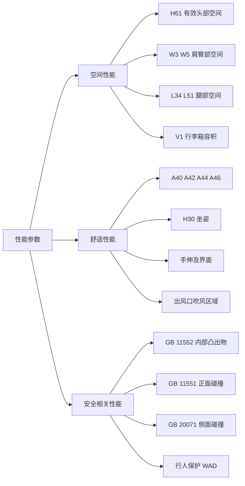

# 性能参数

!!! quote "内容来源"
    本页正文抽取自《总布置》知识库中**可文本解析**的文件：
    `40《总布置图设计规范》.xlsx`（参数目标值）、`QCD-A0-005`、
    `SJ 9-2008 A类汽车眼椭球、头部包络面设计规范`、`SJ 18-2008 顶篷设计指导书`、
    `SJ 21-2008 前门内饰板设计指导书`、`SJ 46-2009 仪表板SEG分析设计指导书`、
    `SJ 47-2009 吹面出风口设计指导书`、`SJ 54-2009 侧碰对应B柱断面系数设定指导书`、
    `SJ 40-2009 轿车外饰SEG分析断面设计指导书`。
    企业规范编号原样保留。

## 性能参数体系

## 概述

### 要点

上车体相关的性能分三类，**性能目标必须逐级分解到具体尺寸代码**：

| 性能类别 | 性能目标 | 分解到的尺寸/指标 |
|---|---|---|
| **空间性能** | 乘坐空间与储物空间满足目标人群 | H61、W3、W5、L34、L51、L48、L50、V1 等 |
| **舒适性能** | 坐姿、操作、视野、空调吹风舒适 | A40、A42、A44、A46、H30、手伸及界面、吹风区域 |
| **安全相关性能** | 法规符合性 + 目标星级 | GB 11552、GB 11551、GB 20071、行人保护 |

**性能目标的三层结构**（`QCD-A0-005` 与 H20 硬点报告）：

| 层级 | 内容 |
|---|---|
| **整车性能指标** | 碰撞安全（如 C-NCAP 五星）、NVH、可靠性、舒适性、疲劳耐久、刚强度、门洞密封性、耐腐蚀 |
| **系统目标** | 分配至车身/内外饰/底盘各系统 |
| **布置硬点与尺寸** | 落到具体尺寸代码与硬点坐标 |

### 示例

性能目标的分解实例：**"C-NCAP 五星"** 分解到侧碰 → 分解到 **B 柱断面系数**（各高度的最小断面系数要求线）→ 分解到 **B 柱钣金结构与加强板布置**。`SJ 54-2009` 的价值就在于提供了这条分解链的**定量环节**（见下"安全相关性能"）。

### 注意事项

- **性能目标不是"越高越好"**：`QCD-A0-005` 要求性能目标与市场定位、客户目标预期相匹配，并在平台选定阶段就完成"整车性能/碰撞等级/动力总成匹配/平台布置"四项检查；
- **目标的冲突需要权衡**：空间与造型、性能与成本、法规与造型之间普遍存在冲突，权重原则属待补充项（见 [总布置概述](../basics/overview.md)）。

## 空间性能

### 要点

**（1）乘坐空间目标值**（`40《总布置图设计规范》`）

| 尺寸代码 | 项目 | 前排 | 后排 |
|---|---|---|---|
| **H61** | 有效头部空间 | **990 min** | **930 min** |
| **L34 / L51** | 有效腿部空间 | 1000 min（油门踏板） | **910 min** |
| **L48** | 膝部间隙 | — | **61 min** |
| **W3** | 肩部空间 | **1420 min** | 1400 min |
| **W5** | 臀部空间 | **1376 min** | 1340 min |
| **H35** | 垂直头部间隙 | **55 min**（小车 40） | 15 min |
| **W35** | 横向头部间隙 | **139 min**（X 断面）/ 94（3D） | 41 min / 87 |
| **W27** | 斜向头部间隙 | **78 min** | **26 min** |
| **H46 / W38** | 垂直头部间隙 2 / 最小头部间隙 | 55 min / 55 min | 15 min / 15 min |
| **L38 / L39** | 头部到前/后风窗饰条间隙 | **140 min** | **40 min** |
| **SW16-1** | 驾驶员坐垫宽 | **480–500** | — |
| **L50-2** | 排间距离 | — | **913** |

**（2）头部空间的评价工具**（`SJ 9-2008` §6.3）

利用**头部包络面**判定人体头部与顶棚内饰的最小间隙，用于满足人体头部活动空间、评价内饰对乘员产生的压抑感，主要设定范围由三个量表达：**W27**（斜向 30° 方向空间）、**W35**（水平空间）、**H35**（垂直空间），另加 **H61**（有效头部空间）。

空间百分位选用规则（`SJ 18-2008` §5.2.1）：

- **前乘客区头部空间**：顶篷距 **99%** 百分位人体头部包络线的最小距离；
- **后乘客区头部空间**：顶篷距 **95%** 百分位人体头部包络线的最小距离。

**（3）储物空间**

| 项目 | 目标值 |
|---|---|
| 行李箱容积 **V1** | **523 L min** |
| 提举高度 **H196** | **770 max**；装载高度 H193 为 25–30 |

（各分区储物尺寸见 [门板布置](../door-trim/door.md)：地图袋长度约 320 mm、拉手盒 100–120 mm、水杯架 φ70 等。）

### 示例

空间性能的最直观结论来自对标：`SJ 9-2008` 附录 A 的前排驾驶员最小头部空间实测（`W27-1 / W35-1 / H35-1 / H61-1`，括号内为 99%/95% 取值）显示——**带天窗的车型头部空间被显著压缩**：

| 车型 | W27-1 | W35-1 | H35-1 | H61-1 |
|---|---|---|---|---|
| M2 两厢轿车 | 65 | 87 / 88 / 54 | 71 | 889 + 102 |
| V221（天窗版） | — | **18** | — | **840 + 102** |
| V221（非天窗版） | 37 | 58 / 47 / 76 | 45 | 885 + 102 |
| A230（有天窗） | **11** | 32 / 15 / 45 | 27 | **853 + 102** |
| S21 三厢轿车 | 78 | 110 / 99 / 129 | 68 | 869 + 102 |

### 注意事项

- **空间与造型的平衡**：空间指标（尤其 H30 与 H61）直接决定顶盖典型截面与整车高度（`QCD-A0-005` §5），
  而车高又受造型与风阻约束——**空间是造型的输入之一，但不是唯一输入**；
- **天窗是空间的最大变量**：确定天窗配置后应在造型阶段预留头部空间；
- **前后排目标值不一致是有意为之**（H61 990 vs 930、头部间隙 55 vs 15），符合"优先保证驾驶员"的原则。

## 舒适性能

### 要点

**（1）坐姿舒适性**（`QCD-A0-005` 表 1、`SJ 9-2008`）

| 角度 | H30 (mm) | A40 (°) | A42 (°) | A44 (°) | A46 (°) |
|---|---|---|---|---|---|
| 推荐范围 | 220–350 | 22–28 | 85–105 | 110–125 | 87（±2） |

H30 按车型级别取值：轿跑 220–240、B 级车 230–270、A 级车 280–310、A0 级车 300–330、A00 级车 320–350、SUV 320–350。
（`40` 的示例项目取 H30-1 = 300–330、A40-1 = 22°、A40-2 = 25°。）

**（2）操作舒适性**

| 项目 | 指标 |
|---|---|
| 手伸及界面 | 按 `SJ 15-2008` 生成，覆盖 95%/50%/5% 假人 |
| 换挡手柄包络与手刹包络 | **必须落在驾驶员手握式手伸及界面之内** |
| 不舒适度评价 | 用 Ramsis 校核 95%、50%、5% 假人操作换挡手柄与手刹的舒适性，与竞品对比 |
| 肘靠 | 宽度 **> 70 mm**、高度在 **H 点上方 170–220 mm**、到 H 点横向距离 **300 mm 以上** |
| 手摇柄 | 运动轨迹与周边间隙 **40 mm 以上**，门内饰面间隙 **6 mm 以上** |
| 内拉手/遮阳板手部开启空间 | 内拉手 **≥ 5 mm**；遮阳板 **≥ 16 mm**（特定情形） |

**（3）视野舒适性**

| 项目 | 指标 |
|---|---|
| 上视野 / 下视野（`QCD-A0-005`） | 轿车 > 15° / > 6°；SUV > 16° / > 6.5° |
| A 柱双目障碍角 | 法规 < 6°，推荐 < 5°（`40` 目标 5° max），建议设计 < 4.5° |
| 转向盘障碍角 | 推荐 > 5°，界限 > 2°，法规 > 1° |
| 车辆中线前下视野（`40`） | **6.55° min** |
| B / C 柱双目障碍角（`40`） | 31° max / 17.5° max |

**（4）空调舒适性**（`SJ 47-2009` §4.1～4.2，以中左吹面出风口为例）

| 项目 | 要求 |
|---|---|
| 出风口中心与眼椭圆中心 X 向距离 | **600–800 mm** |
| 出风口中心与驾驶员中心 Y 向最小距离 | **380 mm** |
| 出风口下边缘与 H 点 Z 向最小距离 | **380 mm**（左侧出风口 **240 mm**） |
| 吹风目标区域余量 | 左右、上下各大于目标区域 **(5～10)°** |
| 四出风口出风量比例 | 左 : 中左 : 中右 : 右 = **2 : 3 : 3 : 2** |

**（5）仪表可视性**（`SJ 46-2009`、`SJ 8-2008`）

| 项目 | 要求 |
|---|---|
| 仪表罩与方向盘手操作空间 | 一般 **≥ 90 mm**；微轿 **≥ 70 mm**；大排量 SUV/商务/商用 **≥ 100 mm** |
| 仪表板本体与外表面 | 不超过前方下视野线，预留 **0.5° 角以上余量** |
| 仪表反光 | 能反射到眼椭圆的全部入射光区域**必须被组合仪表罩下帽沿完全遮挡** |
| 仪表眩目 | 反射线落在眼椭圆上部为不眩目；与眼椭圆相切或在其内部/下部即判定**存在眩目** |

### 示例

舒适性目标分解的典型链条：**"长途驾驶疲劳"** 分解到 **A44（膝角）** → 分解到 **H30 与 L48/K 腿部空间** → 分解到 **座椅滑轨行程 TL17/TL28 与座椅骨架边界**。链条上任何一环取小值，都会让上游目标落空。

### 注意事项

- **指标的主观评价差异属待人工补充项**：知识库中未见舒适性主观评价（如座椅舒适度评分、NVH 主观评分）的方法与判据；
- **`QCD-A0-005` 的假人降级规则是刚性约束**：若后排 A44 < 85°，后排乘客改按 SAE 50% 假人；若 50% 假人仍 A44 < 85°，改按 SAE 5% 女性假人——
  这是"用降低假人百分位来换取舒适性指标达标"的显式规定，**不能通过修改角度推荐值来规避**。

## 安全相关性能

### 要点

**（1）内部凸出物**（`GB 11552-1999《轿车内部凸出物》`，等效 74/60/EEC、78/632/EEC）

| 判据 | 内容 |
|---|---|
| **尖棱** | **曲率半径 < 2.5 mm** 的刚性材料棱边；**不包括**从仪表板/内饰表面测量**凸出高度小于 3.2 mm** 的构件 |
| **圆钝例外** | 凸出物的**凸出高度不大于其宽度的一半且边缘圆钝**时，可不规定最小曲率半径 |
| **饰板边缘导角** | 不得小于 **3.2 mm**，一般设计做到 **R3.5 以上**；若饰板表面有凸出特征或凸出零件（如高音扬声器护罩、上车扶手），凸出物边缘圆角也应 **≥ R3.2**（`SJ 45-2009` §7.1.3.1） |
| **格栅类零件** | 需满足格栅间距与最小片厚/半径的对应表（间距 1–10 / 10–15 / 15–20 mm → 最小片厚 1.5 / 2.0 / 3.0 mm） |

适用范围：立柱内饰板（`SJ 20`）、顶篷（`SJ 18`）、前门内饰板（`SJ 21`）、吹面出风口（`SJ 47`）、仪表板（`SJ 46`）均须满足。

**（2）正面碰撞乘员保护**（`GB 11551-2003`、`ECE R94`）

| 指标 | 限值 |
|---|---|
| 小腿压力指标 **TCFC** | **不超过 8 kN** |
| 每根胫骨两端所测**胫骨指数 TI** | **不超过 1.3** |

设计对策（`SJ 46-2009` §6.1、§6.4）：以**脚踝为中心、R265～R437 为半径**的区域设计碰撞缓冲（缓冲块或缓冲筋）；**膝盖保护区域**为"以腿中心和膝盖外侧 15° 之间"的区域；左右膝盖两个保护区域内，**左下护板外表面在 X 方向上的最大变化距离应在 30 mm 以内**。

**（3）侧面碰撞乘员保护**（`GB 20071-2006`、`ECE R95`）

| 项目 | 内容 |
|---|---|
| 试验条件 | 可变形移动障碍壁（MDB），**950 kg**，**50 km/h**，撞击角 **90°**，假人 EuroSID-1 或 EuroSID-2 |
| 适用范围 | R 点与地面距离不超过 **700 mm** 的 M1 和 N1 类车辆（`SJ 54-2009`） |
| B 柱断面系数 | 按简化力学模型计算各位置最小断面系数 `ZLWR`、`ZUPR`，要求 B 柱各处断面系数位于**最小断面系数要求线右侧** |
| 碰撞保护块（内饰） | 根据总布置及 CAE 分析结果布置位置与大小，**最小厚度 30 mm 以上**，**平面大小覆盖 CAE 要求的保护区域**（`SJ 21-2008` §5.2.9） |
| 顶篷侧碰间隙 | 考虑侧碰时顶篷与侧围边梁间隙 **≥ 25 mm**；加气帘时理想间隙 **> 3 mm**（`SJ 18-2008` §5.3.4） |

**（4）行人保护**（`SJ 40-2009` §6.1，EU 法规）

| 对象 | 法规基准 | 头部模型 | 质量 | 速度 | 撞击角 |
|---|---|---|---|---|---|
| **儿童** | WAD = **1000 mm** | **Φ130 mm** | 2.5 kg | 40 km/h | 与水平面成 **50°** |
| **成人** | WAD = **1500 mm** | **Φ165 mm** | 4.8 kg | 40 km/h | 与水平面成 **65°** |

设计要求：加强件后边界到 WAD1000 的距离 **≥ 65 + 50 = 115 mm**（考虑儿童头部 Φ130 mm 与 50 mm 试验误差）。

**（5）间接视野**（`SJ 14-2008` 附录 A，`GB 15084-2006` / `ECE R46`）

| 后视镜 | 遮挡限值 |
|---|---|
| 内后视镜 | 头枕、遮阳板、后风窗刮雨器、加热元件、S3 类制动车灯或车身构件遮挡部分总和**占所规定视野的 15% 以下** |
| 外后视镜 | 车身结构、门把手、示廓灯、转向指示灯、后保险杠两端、清洗装置等遮挡部分总和**占所规定视野的 10% 以下** |

### 示例

**法规合格 ≠ 目标星级**：`SJ 54-2009` 指出丰田 COROLLA 的断面系数**远高于**应对 `GB 20071-2006` 的最低要求（原因是其同时考虑出口对应美国 NAS 标准等，预留了足够安全余量），因此在 **C-NCAP 取得侧碰 16 分满分、整车 5 星**成绩。

| 车型 | SLWR (mm²) | SUPR (mm²) | a (mm) | b (mm) | ZLWR (mm³) | ZUPR (mm³) |
|---|---|---|---|---|---|---|
| 丰田 COROLLA | 5.2×10⁴ | 2.2×10⁴ | 1144 | 259 | **1.93×10⁴** | **1.77×10⁴** |
| 海马 M2 | 4.06×10⁴ | 2.46×10⁴ | 1166 | 246 | **1.68×10⁴** | **1.62×10⁴** |

### 注意事项

- **法规项与企业目标的关系**：法规是**下限**，企业目标（如 C-NCAP 五星）通常高于法规；
  两者差距需要靠**结构余量**（如 B 柱断面系数、碰撞保护块厚度）来填补，且必须在**概念设计阶段**就预留；
- **安全性能与空间/舒适的冲突是常态**：碰撞保护块最小厚度 30 mm、顶篷侧碰间隙 ≥ 25 mm、气帘间隙 > 3 mm，
  这些都会挤占内饰可用空间，需与空间指标联合平衡；
- **不同市场法规差异属待补充项**：本页依据均为国标（GB）与 EU 法规，未见 FMVSS 等市场差异对照。

## 待人工补充

!!! warning "本页待人工补充清单"
    - **舒适性主观评价方法与判据**（座椅舒适度、NVH 主观评分）；
    - **目标冲突时的权衡原则与权重**；
    - **整备质量/满载质量对性能指标的影响机制**：如质量对制动、动力性的定量影响；
    - **`SJ 35-2009 空调系统热负荷计算指导书`**（10 页）、**`SJ 37-2009 整车电气系统起动、供电平衡计算规范`**（16 页）、
      **`SJ 33-2008 发动机压缩比计算方法`**（7 页）已下载并成功抽取文本，属整车性能计算的补充素材，本页未展开；
    - **不同市场法规差异对照**（GB vs ECE vs FMVSS）；
    - 知识库中以下文件虽相关但因读取问题**未采用**：`AEM-A4-003 内部凸出物校核规范`、
      `AEM-A4-101 汽车座椅头枕性能校核规范`、`AEM-A4-102 汽车安全带固定点校核规范与流程`、
      `AEM-A4-301 汽车前方视野校核规范与流程`。

    建议：在 IMA 客户端中打开对应文件补充条款，或按"规范编号 + 页码"方式人工引用。

---

## 下一步阅读

- [尺寸参数](dimensions.md)：尺寸代码体系与目标值
- [质量参数](mass.md)：质量定义、轴荷与重心
- [人机舒适性标准](../ergonomics/posture.md)：坐姿、可达性、视野、空间的完整判据
- [前后端校核标准](../front-rear/check.md)：法规校核清单
