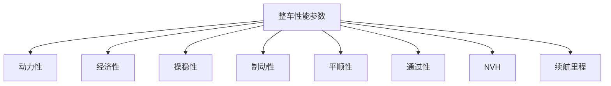
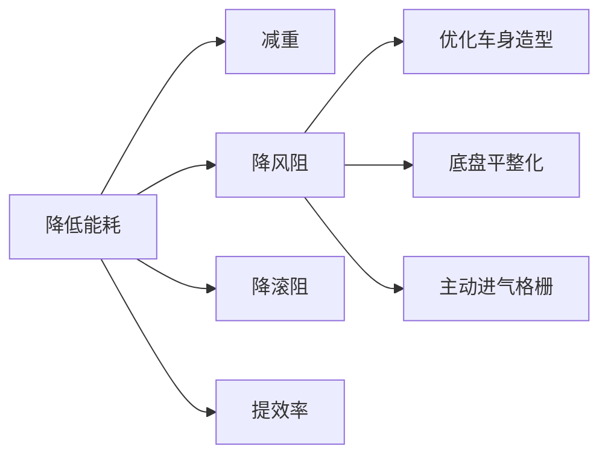
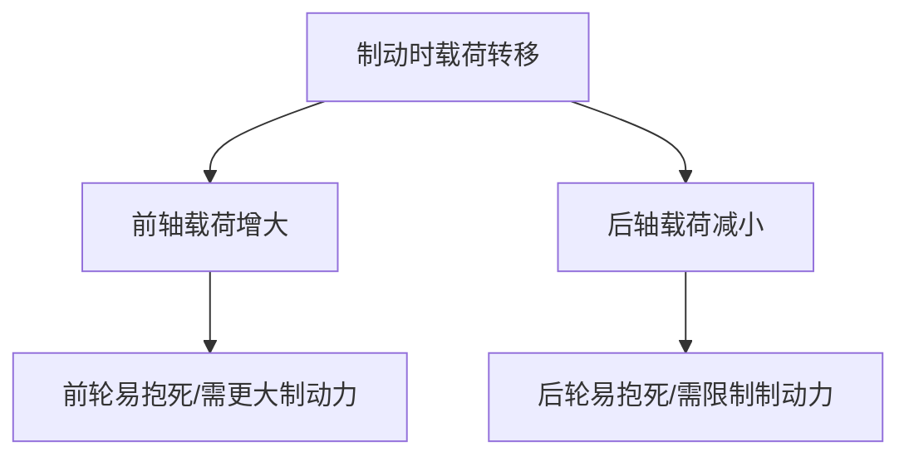
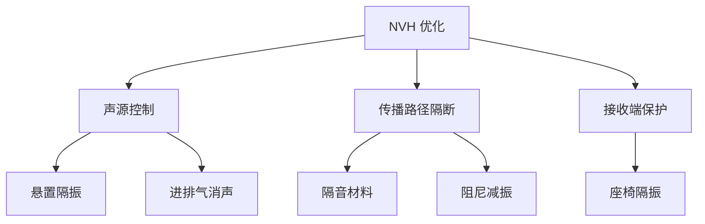
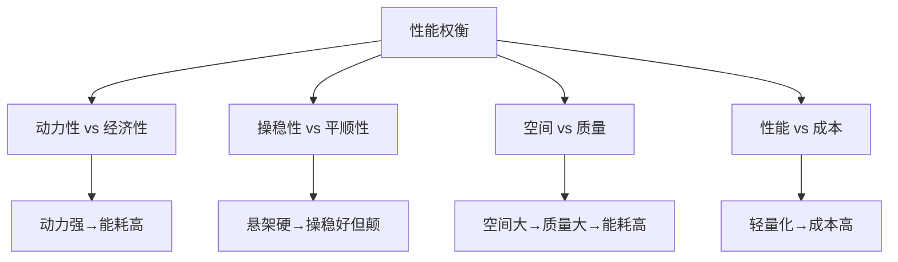

# 性能参数

## 概述

整车性能参数是总布置设计的**目标函数**，布置方案必须确保这些性能目标的达成。性能参数与尺寸参数、质量参数密切相关，需要协同优化。

## 性能参数分类



## 1. 动力性

### 主要指标

| 指标 | 单位 | 说明 |
|------|------|------|
| 最高车速 | km/h | 直道最大持续车速 |
| 0-100km/h 加速时间 | s | 起步加速到 100km/h 的时间 |
| 最大爬坡度 | % | 能爬上的最大坡度 |
| 超车加速时间 | s | 80-120km/h 加速时间 |

### 布置影响因素

```
动力性 ←── 驱动力 ≥ 阻力
            │           │
            ↓           ↓
     动力总成功率    整车质量
     传动比          风阻系数
     驱动轴载荷      迎风面积
```

| 布置因素 | 对动力性的影响 |
|----------|----------------|
| 驱动轴轴荷 | 驱动轴载荷越大，附着力越大，不易打滑 |
| 整车质量 | 质量越大，加速越慢 |
| 迎风面积 | 面积越大，高速风阻越大 |
| 传动系统效率 | 传动损耗越小，动力输出越高 |

!!! example "典型动力性目标"
    - 紧凑型轿车：0-100km/h 加速 9-11s，最高车速 180-200km/h
    - 性能轿车：0-100km/h 加速 5-7s，最高车速 250km/h
    - 纯电动：0-100km/h 加速 7-9s（普通版），4-6s（性能版）

## 2. 经济性

### 燃油车

| 指标 | 单位 | 说明 |
|------|------|------|
| 综合油耗 | L/100km | NEDC/WLTC 工况综合油耗 |
| 城市油耗 | L/100km | 城市工况 |
| 高速油耗 | L/100km | 高速工况 |

### 纯电动车

| 指标 | 单位 | 说明 |
|------|------|------|
| 综合电耗 | kWh/100km | WLTC 工况电耗 |
| 续航里程 | km | CLTC/WLTC 工况续航 |

### 布置影响因素

| 布置因素 | 对经济性的影响 |
|----------|----------------|
| 整车质量 | 质量越大，能耗越高 |
| 风阻系数 Cd | Cd 越小，高速能耗越低 |
| 迎风面积 A | 面积越小，风阻越小 |
| 滚阻系数 | 轮胎滚阻越小，能耗越低 |



!!! tip "风阻与速度的关系"
    风阻功率与速度的三次方成正比：$P_{aero} \propto v^3$
    - 高速行驶时，风阻是主要能耗来源
    - 总布置可通过底盘平整化、优化底部气流降低风阻

## 3. 操稳性

### 主要指标

| 指标 | 说明 | 目标 |
|------|------|------|
| 不足转向度 | 转向特性 | 适度的不足转向 |
| 侧倾角 | 过弯时车身倾斜 | ≤3-5°（0.4g 侧向加速度） |
| 横摆角速度增益 | 转向灵敏度 | 适中 |
| 中心区转向 | 小转角响应 | 线性、精准 |

### 布置影响因素

| 布置因素 | 对操稳性的影响 |
|----------|----------------|
| 质心高度 | 越低越好，减小侧倾 |
| 轴荷分配 | 接近 50:50 操稳性好 |
| 轴距 | 轴距大，稳定性好但灵活性差 |
| 轮距 | 轮距大，侧倾小 |
| 悬架硬点 | 影响侧倾中心和运动学特性 |

```
操稳性优化方向：
    ↓ 质心高度    → 降低侧倾
    → 50:50 轴荷  → 中性转向
    ↑ 轮距        → 增大抗侧倾力臂
    → 悬架优化     → 运动学/弹性运动学特性
```

## 4. 制动性

### 主要指标

| 指标 | 单位 | 说明 |
|------|------|------|
| 100-0km/h 制动距离 | m | 冷态制动距离 |
| 制动减速度 | m/s² | 最大制动减速度 |
| 前后制动力分配 | - | 前后制动力的比值 |

### 布置影响因素



| 布置因素 | 对制动性的影响 |
|----------|----------------|
| 质心高度 | 越高，制动时载荷转移越大 |
| 轴荷分配 | 影响前后制动力分配设计 |
| 轴距 | 影响载荷转移量 |

!!! note "制动法规"
    GB 21670 对乘用车制动系统有强制要求，包括制动距离、热衰退、ABS 等。

## 5. 通过性

### 主要指标

| 指标 | 说明 |
|------|------|
| 最小离地间隙 | 车辆最低点距地面距离 |
| 接近角 | 前部不碰地的最大爬坡角 |
| 离去角 | 后部不碰地的最大下坡角 |
| 纵向通过角 | 底盘不托底的最大过坎角 |
| 最小转弯半径 | 方向盘打死时的转弯半径 |

### 各车型参考值

| 车型 | 离地间隙 | 接近角 | 离去角 | 转弯半径 |
|------|----------|--------|--------|----------|
| 轿车 | 120-150mm | 12-16° | 15-20° | 5.0-5.5m |
| 城市 SUV | 180-220mm | 18-22° | 22-26° | 5.5-6.0m |
| 硬派 SUV | 220mm+ | 25°+ | 25°+ | 5.5-6.5m |

## 6. NVH 性能

### NVH 三要素

- **N**oise（噪声）
- **V**ibration（振动）
- **H**arshness（声振粗糙度）

### 布置影响因素

| 布置因素 | NVH 影响 |
|----------|----------|
| 悬置系统 | 发动机/电机隔振 |
| 质量分配 | 模态解耦 |
| 隔音材料空间 | 声学包布置 |
| 进排气位置 | 进气噪声、排气噪声 |
| 风噪 | 后视镜、密封条、A 柱造型 |



!!! tip "电动车的 NVH 特点"
    电动车没有发动机噪声，但电机高频噪声更突出，路噪和风噪也更明显。
    总布置需特别关注电机的悬置隔振和高频噪声控制。

## 7. 续航里程（电动车）

### 续航影响因素

```
续航里程 = 电池能量 / 综合电耗

电池能量 = 电池容量 × 电池电压
        ↑              ↑
    电池体积         电芯技术
    布置空间
```

| 布置因素 | 对续航的影响 |
|----------|--------------|
| 电池布置空间 | 决定电池容量上限 |
| 整车质量 | 质量越大，电耗越高 |
| 风阻系数 | 高速续航影响大 |
| 热管理系统 | 低温续航衰减 |

## 性能参数表模板

| 序号 | 性能指标 | 单位 | 目标值 | 竞品参考 | 状态 |
|------|----------|------|--------|----------|------|
| 1 | 最高车速 | km/h | 190 | 185 | ✓ |
| 2 | 0-100加速 | s | 8.5 | 9.2 | ✓ |
| 3 | 最大爬坡度 | % | 30 | 30 | ✓ |
| 4 | 综合油耗/电耗 | L/100km | 6.5 | 6.8 | ✓ |
| 5 | 续航里程（EV） | km | 550 | 520 | ✓ |
| 6 | 100-0制动 | m | 38 | 40 | ✓ |
| 7 | 最小转弯半径 | m | 5.4 | 5.5 | ✓ |
| 8 | 风阻系数 Cd | - | 0.28 | 0.30 | ✓ |
| 9 | 接近角 | ° | 15 | 15 | ✓ |
| 10 | 离去角 | ° | 17 | 17 | ✓ |

## 性能目标的权衡



!!! warning "总布置的核心挑战"
    各项性能往往相互矛盾，总布置工程师的任务是在矛盾中找到**最优平衡点**。
    没有完美方案，只有最适方案。

---

## 下一步阅读

- [尺寸参数](dimensions.md)：空间约束
- [质量参数](mass.md)：质量与轴荷
- [总布置基础](../basics/overview.md)：性能在开发中的角色
