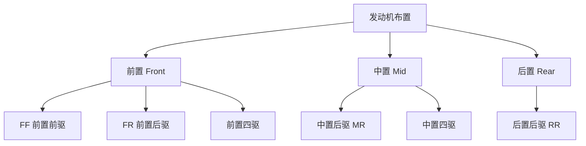
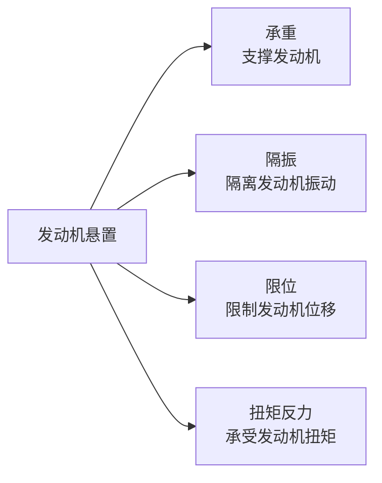
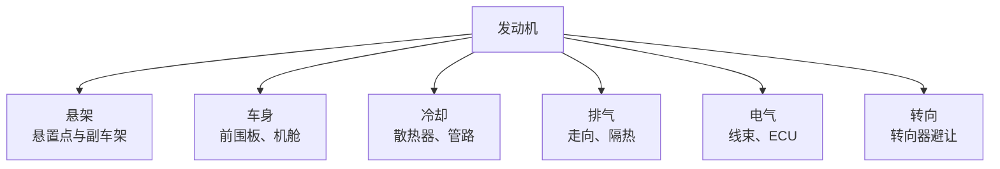

# 发动机布置

## 概述

发动机是燃油车的核心总成，其布置方式直接决定了车辆的空间布局、性能特征和成本。本章介绍发动机的布置形式、定位参数和关键布置要点。

## 发动机布置形式

### 按位置和驱动方式分类



### 各布置形式对比

| 布置形式 | 优点 | 缺点 | 典型应用 |
|----------|------|------|----------|
| **FF 前置前驱** | 空间利用率高、成本低、前轴载荷大利于驱动 | 前轴载荷重、转向不足、前轮兼驱动和转向 | 大多数家用轿车、SUV |
| **FR 前置后驱** | 轴荷均衡、操控好、转向轮和驱动轮分离 | 传动轴占空间、有传动损耗、成本高 | 豪华轿车、性能车 |
| **MR 中置后驱** | 质心居中、操控极佳 | 乘员舱空间小、散热难 | 超级跑车 |
| **RR 后置后驱** | 后轴载荷大利于驱动、前部空间大 | 后轴载荷过重、操稳难调、散热难 | 保时捷 911、大巴 |

### FF 布置详解（最常见）

FF（前置前驱）是乘用车最主流的布置形式：

```
┌──────────────────────────────────────┐
│  ┌──────┐                            │
│  │发动机 │  变速器                     │
│  │  横置 │  ┌───┐                     │
│  └──────┘  │   │  ← 半轴直接驱动前轮    │
│            └───┘                     │
│  ◉──────────◉──────────────◉        │
│  前轮(驱动+转向)        后轮(从动)     │
└──────────────────────────────────────┘
```

**横置 vs 纵置：**

| 项目 | 横置 | 纵置 |
|------|------|------|
| 机舱长度 | 短，利于空间 | 长 |
| 机舱宽度 | 宽，大排量难放 | 窄 |
| 半轴长度 | 左右不等长（扭矩转向） | 左右等长 |
| 适用 | 4缸及以下小排量 | 6缸及以上 |
| 典型 | 大众高尔夫、丰田卡罗拉 | 高级轿车（部分） |

## 发动机定位参数

### 1. 发动机位置坐标

```
          Z（高度）
          ↑
          │    发动机质心
          │      ◉
          │     /│
          │    / │
          │   /  │ ← 发动机倾角
          │  /   │
    ┌─────┴─/────┴──────→ X（前后）
    │  /   │
    │ ◉────┘
    │前轮心
    └──────→ Y（左右）
```

| 定位参数 | 说明 | 典型值 |
|----------|------|--------|
| X 向位置 | 曲轴中心距前轮心距离 | 0~150mm（横置 FF） |
| Z 向位置 | 曲轴中心距地面高度 | 350~500mm |
| 倾角 | 发动机相对水平面的倾角 | 横置：0~5°，纵置：3~8° |
| 偏置 | 发动机中心线相对车辆纵轴偏移 | 0~20mm（为半轴等长） |

### 2. 倾角的作用

!!! note "为什么要倾斜？"
    - **油底壳避让**：倾斜后油底壳可下沉，降低发动机高度
    - **传动轴角度**：使半轴/传动轴角度合理
    - **维修空间**：倾斜后上部空间增大，便于维修
    - **油液管理**：保证机油泵吸油、冷却液排气

### 3. 发动机与周边的间隙要求

| 周边部件 | 最小间隙 | 说明 |
|----------|----------|------|
| 发动机舱盖 | ≥25mm | 考虑发动机跳动 |
| 散热器 | ≥15mm | 考虑振动 |
| 前围板 | ≥25mm | 隔热隔噪 |
| 副车架 | ≥15mm | 振动相对位移 |
| 排气管 | ≥50mm | 热防护 |
| 转向器 | ≥25mm | 运动间隙 |

## 发动机悬置系统

### 悬置的作用



### 悬置布置形式

| 布置形式 | 说明 | 应用 |
|----------|------|------|
| 三点悬置 | 左右各一 + 防扭拉杆 | 横置 FF 常见 |
| 四点悬置 | 左右各两个 | 纵置发动机 |
| 液压悬置 | 内置液压油，衰减低频振动 | 中高级车 |

```
┌─────────────────────────────────┐
│         发动机                   │
│   ◉──────────────────◉          │ ← 左右悬置（主承载）
│        │    │                   │
│        └────┘                   │
│      防扭拉杆（承受扭矩）          │
└─────────────────────────────────┘
```

### 悬置布置要点

| 要点 | 说明 |
|------|------|
| 刚度匹配 | 三向刚度（X/Y/Z）匹配，实现模态解耦 |
| 位置选择 | 尽量靠近发动机扭力节点（Torque Axis） |
| 隔振率 | 怠速工况隔振率 ≥ 80% |
| 位移限位 | 极限工况（急加速/制动）位移在允许范围 |

## 冷却系统布置

### 散热器布置

```
┌──────────────────────────────┐
│  ←─ 冷却风                    │
│ ┌────────┐                   │
│ │ 冷凝器  │ ← 空调冷凝器（前置）│
│ └────────┘                   │
│ ┌────────┐                   │
│ │ 散热器  │ ← 发动机散热器     │
│ └────────┘                   │
│        ↓ 热风                 │
│  ┌──────────┐                │
│  │  发动机   │               │
│  └──────────┘                │
└──────────────────────────────┘
```

| 布置要点 | 说明 |
|----------|------|
| 散热器位置 | 前端最前方，迎风面最大 |
| 冷凝器位置 | 散热器前方（温度更低） |
| 风扇 | 电子风扇辅助散热 |
| 导风板 | 减少漏风，提高散热效率 |
| 间隙 | 散热器与前保 ≥ 30mm |

### 冷却管路走向

- 上水管：发动机 → 散热器上水室
- 下水管：散热器下水室 → 水泵
- 膨胀罐：最高点，排气补液

!!! tip "热管理优化"
    - 寒冷地区可增加进气格栅主动关闭，加快暖机
    - 电动水泵可按需控制流量，降低能耗

## 进排气系统布置

### 进气系统

```
进气口 → 进气管 → 空滤 → 进气管 → 节气门 → 进气歧管 → 气缸
```

| 部件 | 布置要点 |
|------|----------|
| 进气口 | 高处、远离热源、防水 |
| 空滤 | 便于维护更换、空间充裕 |
| 进气管 | 走向顺畅、管径匹配 |

### 排气系统

```
气缸 → 排气歧管 → 催化器 → 前消音器 → 后消音器 → 排气口
```

| 部件 | 布置要点 |
|------|----------|
| 排气歧管 | 靠近发动机，快速起燃催化器 |
| 催化器 | 尽量靠近发动机，高温工况 |
| 消音器 | 底盘下方，注意离地间隙 |
| 排气管 | 避让传动轴、悬架、油箱 |
| 隔热 | 与周边塑料件/线束保持热安全距离 |

!!! warning "排气管热防护"
    - 排气温度可达 600-800°C
    - 与塑料件间隙 ≥ 100mm（无隔热板）或 ≥ 50mm（有隔热板）
    - 与线束间隙 ≥ 100mm

## 与其他系统的协调



---

## 下一步阅读

- [电机布置](motor.md)：新能源车的动力布置
- [传动系统](transmission.md)：变速器与传动
- [底盘系统](../chassis/suspension.md)：悬置与底盘的协调
