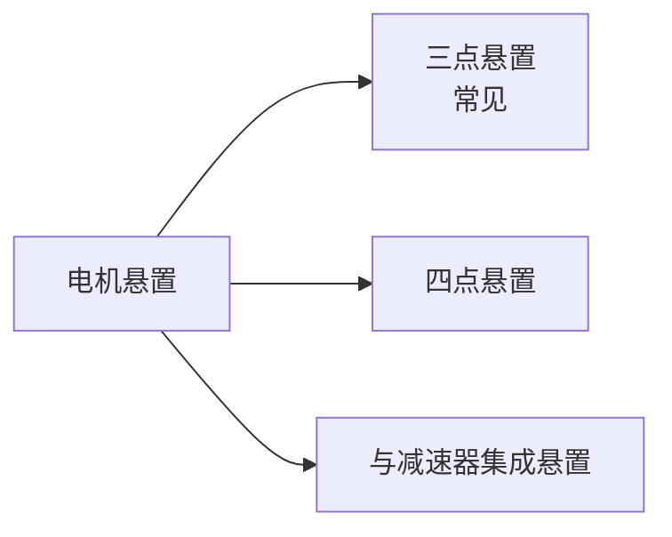
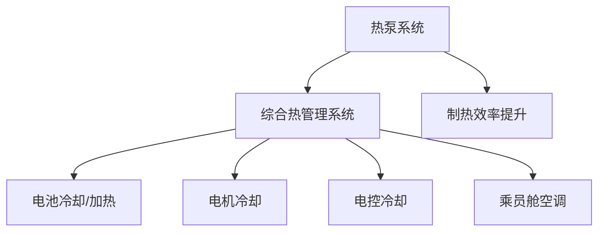

# 电机布置

## 概述

新能源汽车的电驱动系统布置与燃油车有显著差异。电机体积小、布置灵活，但带来了高压安全、热管理、NVH 等新挑战。本章介绍电机的布置形式和关键要点。

## 电驱动系统组成


| 部件 | 功能 | 布置特点 |
|------|------|----------|
| 驱动电机 | 电能→机械能 | 替代发动机位置 |
| 电机控制器 | 控制电机 | 需要散热，靠近电机 |
| 减速器 | 降速增扭 | 替代变速器，单级居多 |
| 差速器 | 允许左右轮速差 | 集成在驱动桥内 |
| 高压线束 | 传输高压电 | 屏蔽、防护要求高 |

## 电机布置形式

### 1. 前驱单电机

```
┌──────────────────────────────────────┐
│  ┌──────────┐                        │
│  │  电机+    │  ←  电驱总成（横置）     │
│  │  减速器   │                        │
│  └──────────┘                        │
│  ◉──────────◉──────────────◉        │
│  前轮(驱动)            后轮(从动)     │
└──────────────────────────────────────┘
│              电池包（底部）            │
```

| 特点 | 说明 |
|------|------|
| 优点 | 结构简单、成本低、机舱空间充裕 |
| 缺点 | 前轴载荷偏重、后轮无驱动力 |
| 应用 | 入门级电动车 |

### 2. 后驱单电机

```
┌──────────────────────────────────────┐
│                                      │
│  ◉──────────◉──────────────◉        │
│  前轮(从动)            后轮(驱动)     │
│                      ┌──────────┐    │
│                      │  电机+    │   │
│                      │  减速器   │   │
│                      └──────────┘    │
└──────────────────────────────────────┘
│              电池包（底部）            │
```

| 特点 | 说明 |
|------|------|
| 优点 | 后驱操控好、前舱可做前备箱、轴荷均衡 |
| 缺点 | 后部空间受影响 |
| 应用 | Tesla Model 3 后驱版、小鹏 P7 后驱版 |

### 3. 双电机四驱

```
┌──────────────────────────────────────┐
│  ┌──────────┐                        │
│  │ 前电机+   │                        │
│  │ 减速器    │                        │
│  └──────────┘                        │
│  ◉──────────◉──────────────◉        │
│  前轮(驱动)            后轮(驱动)     │
│                      ┌──────────┐    │
│                      │ 后电机+   │   │
│                      │ 减速器    │   │
│                      └──────────┘    │
└──────────────────────────────────────┘
│              电池包（底部）            │
```

| 特点 | 说明 |
|------|------|
| 优点 | 四驱性能强、加速快、前后轴荷可均衡 |
| 缺点 | 成本高、质量大 |
| 应用 | 高性能电动车、高端 SUV |

### 4. 轮边/轮毂电机

```
┌──────────────────────────────────────┐
│                                      │
│  ◉──────────◉──────────────◉        │
│  │电机│                    │电机│    │
│  └──┘                      └──┘     │
│  前轮(电机内置)        后轮(电机内置) │
└──────────────────────────────────────┘
```

| 特点 | 说明 |
|------|------|
| 优点 | 省去传动轴/半轴、效率高、独立控制 |
| 缺点 | 非簧载质量大（操稳差）、成本高、散热难 |
| 应用 | 商用车为主，乘用车尚少 |

## 电机定位参数

### 与发动机的对比

| 参数 | 燃油发动机 | 驱动电机 |
|------|-----------|----------|
| 体积 | 大 | 小（同功率下） |
| 质量 | 重 | 轻 |
| 倾角 | 3-8° | 0-3° |
| 悬置 | 复杂（低频振动大） | 相对简单 |
| 散热 | 水冷 | 水冷/油冷 |
| NVH | 低频为主 | 高频啸叫 |

### 电机悬置



!!! note "电机 NVH 特点"
    - 电机振动频率高（1000Hz+），人耳敏感
    - 高频啸叫是电动车 NVH 主要问题
    - 悬置需针对高频隔振优化
    - 可采用液压悬置或主动悬置

## 电机控制器布置

| 布置方式 | 说明 | 优缺点 |
|----------|------|--------|
| 与电机集成 | 控制器直接安装在电机上 | 线路短、效率高，但散热难 |
| 独立布置 | 控制器单独安装 | 散热好、维护方便，但高压线长 |
| 多合一 | 电机控制器+OBC+DCDC 集成 | 集成度高、成本低 |

```
┌─ 多合一电驱桥 ─────────────────────┐
│  ┌─────┐ ┌─────┐ ┌─────┐          │
│  │ MCU │ │ OBC │ │DCDC │          │
│  └─────┘ └─────┘ └─────┘          │
│  ┌───────────────────┐             │
│  │  电机 + 减速器     │            │
│  └───────────────────┘             │
└────────────────────────────────────┘
```

## 高压系统布置

### 高压线束

| 要点 | 说明 |
|------|------|
| 走向 | 尽量短、避免折弯 |
| 屏蔽 | 防止电磁干扰 |
| 防护 | 波纹管、护板保护 |
| 间隙 | 与运动件 ≥ 25mm |
| 固定 | 每 300mm 一个固定点 |

### 高压安全

!!! danger "高压安全要求"
    - 高压线束橙色标识
    - 电池包、电机、控制器等高压部件需可靠接地
    - 碰撞时自动切断高压（碰撞断电）
    - 高压系统与乘员舱隔离

## 热管理布置

### 电机冷却

| 冷却方式 | 说明 | 应用 |
|----------|------|------|
| 水冷 | 冷却液循环冷却 | 主流乘用车 |
| 油冷 | 变速器油冷却电机内部 | 高性能电机 |
| 风冷 | 自然风冷 | 低功率电机 |

### 综合热管理



!!! tip "热泵系统"
    纯电动车冬季制热耗电大，热泵系统可利用环境热量和电机余热，显著提升冬季续航。

## 与燃油车布置的差异总结

| 对比项 | 燃油车 | 纯电动车 |
|--------|--------|----------|
| 动力总成体积 | 大 | 小 |
| 机舱空间 | 紧凑 | 充裕（可做前备箱） |
| 传动系统 | 复杂（变速器+传动轴） | 简单（减速器+半轴） |
| 底部空间 | 油箱+排气管 | 电池包 |
| 热管理 | 发动机冷却为主 | 电池+电机+乘员舱综合 |
| 高压系统 | 无（12V） | 有（300-800V） |
| NVH | 低频发动机噪声 | 高频电机啸叫+路噪风噪 |
| 质心 | 较高 | 较低（电池在底部） |

---

## 下一步阅读

- [发动机布置](engine.md)：燃油车动力布置
- [传动系统](transmission.md）：减速器与传动
- [电池布置](../electrical/battery.md）：电池包布置详解
- [热管理系统](../electrical/thermal.md）：综合热管理
