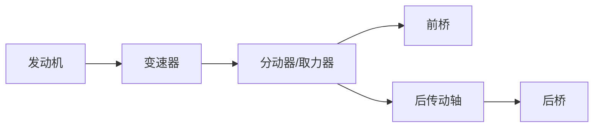
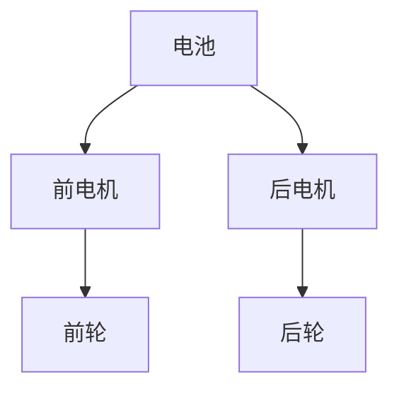

# 传动系统

## 概述

传动系统负责将动力总成的动力传递到驱动轮。燃油车与电动车的传动系统差异显著，本章分别介绍。

## 燃油车传动系统

### 系统组成


### 变速器类型

| 类型 | 说明 | 优缺点 |
|------|------|--------|
| 手动 MT | 驾驶员手动换挡 | 效率高、成本低、操作累 |
| 自动 AT | 液力变矩器+行星齿轮 | 舒适、成熟、效率略低 |
| 双离合 DCT | 两套离合器交替 | 换挡快、效率高、低速顿挫 |
| CVT | 无级变速 | 平顺、效率高、承受扭矩有限 |

### 变速器布置

#### 横置 FF 布置

```
┌─────────────────────────────────────┐
│   发动机（横置）                      │
│   ┌──────────┐    ┌──────────┐      │
│   │          │────│  变速器   │      │
│   └──────────┘    └────┬─────┘      │
│                        │            │
│              ┌─────────┴─────────┐  │
│              │   差速器（内置）    │  │
│              └────┬───────┬──────┘  │
│              左半轴│       │右半轴   │
│              ◉────┘       └────◉   │
│              前轮             前轮   │
└─────────────────────────────────────┘
```

#### 纵置 FR 布置

```
┌─────────────────────────────────────┐
│   发动机（纵置）                      │
│   ┌──────────┐    ┌──────────┐      │
│   │          │────│  变速器   │      │
│   └──────────┘    └────┬─────┘      │
│                        │            │
│                   传动轴（纵）       │
│                        │            │
│              ┌─────────┴─────────┐  │
│              │   后桥差速器       │  │
│              └────┬───────┬──────┘  │
│              左半轴│       │右半轴   │
│              ◉────┘       └────◉   │
│              后轮             后轮   │
└─────────────────────────────────────┘
```

### 传动轴布置（FR/四驱）

| 布置要点 | 说明 |
|----------|------|
| 走向 | 沿车辆纵向，从变速器到后桥 |
| 角度 | 与变速器输出轴、后桥输入轴角度匹配 |
| 万向节 | 两端万向节补偿角度变化 |
| 中间支撑 | 长传动轴需中间支撑轴承 |
| 间隙 | 与排气管、车身底板保持间隙 |

```
变速器 ──→ ┌───┐ ─────── ┌───┐ ──→ 后桥差速器
          万向节       中间支撑  万向节
```

!!! note "传动轴动平衡"
    传动轴高速旋转，必须做动平衡。不平衡会引起振动和噪声。
    传动轴的一阶临界转速需高于最高车速对应转速。

### 半轴布置

| 要点 | 说明 |
|------|------|
| 等长设计 | FF 横置左右半轴尽量等长，避免扭矩转向 |
| 等速万向节 | 球笼式万向节保证等速传动 |
| 角度 | 悬架跳动时半轴角度在允许范围 |
| 行程 | 伸缩花键补偿长度变化 |

```
    左半轴           右半轴
  ◉─────────◉  ◉─────────◉
  前轮    差速器   差速器   前轮

  FF横置：差速器偏置，左右半轴不等长（扭矩转向）
  优化：加中间轴使左右等长
```

## 电动车传动系统

### 减速器

电动车通常采用**单级减速器**替代多挡变速器：

| 对比 | 燃油车变速器 | 电动车减速器 |
|------|-------------|-------------|
| 挡位数 | 5-9 挡 | 1 挡（单级） |
| 速比 | 多个挡位切换 | 固定速比（8-10） |
| 结构 | 复杂 | 简单 |
| 控制 | TCU 控制 | 无需换挡 |


!!! note "为什么电动车用单级减速器？"
    - 电机转速范围宽（0-16000rpm），不需要换挡
    - 电机低速扭矩大，起步无需低速挡
    - 单级效率高、结构简单、成本低
    - 高速巡航效率略低（这也是部分高性能车考虑两挡的原因）

### 两挡减速器（高性能）

部分高性能电动车采用两挡减速器：

| 优点 | 缺点 |
|------|------|
| 兼顾加速和最高车速 | 结构复杂、成本高 |
| 高速效率提升 | 增加质量 |
| | 换挡控制复杂 |

> 应用：保时捷 Taycan 后桥两挡、奥迪 e-tron GT

## 传动系统布置要点

### 1. 角度匹配

```
        变速器输出轴
            │
            │ ↘ 角度 θ1
            │
            ◉ 万向节
            │
            │ ↙ 角度 θ2
            │
        传动轴
```

- 输入轴和输出轴的角度差需在万向节允许范围
- 等速万向节：角度 ≤ 7-8°（连续工作）
- 非等速万向节：需成对使用补偿

### 2. 运动间隙

| 工况 | 校核内容 |
|------|----------|
| 悬架最大压缩 | 半轴最大角度 |
| 悬架最大下跳 | 半轴最大伸长 |
| 转向最大转角 | 半轴角度 + 轮罩间隙 |
| 发动机最大扭转 | 传动轴位移 |

### 3. 润滑

| 部件 | 润滑方式 | 注意事项 |
|------|----------|----------|
| 变速器 | 飞溅润滑/压力润滑 | 油量充足、考虑爬坡工况 |
| 减速器 | 飞溅润滑 | 油面高度 |
| 差速器 | 飞溅润滑 | 限滑差速器需专用油 |
| 等速万向节 | 油脂润滑 | 密封防尘套完好 |

### 4. NVH

| NVH 问题 | 原因 | 解决方案 |
|----------|------|----------|
| 传动轴振动 | 动不平衡 | 动平衡校正 |
| 齿轮啸叫 | 齿轮误差 | 齿形修形、斜齿 |
| 换挡冲击 | 离合器接合 | 优化换挡逻辑 |
| 半轴共振 | 扭转共振 | 调整半轴刚度 |

## 四驱系统布置

### 适时四驱



| 类型 | 说明 |
|------|------|
| 分时四驱 | 手动切换两驱/四驱 |
| 适时四驱 | 自动按需分配扭矩（多片离合器） |
| 全时四驱 | 始终四轮驱动（中央差速器） |

### 电动车四驱



| 优点 | 说明 |
|------|------|
| 无机械连接 | 前后电机独立，无需传动轴 |
| 响应快 | 电控扭矩分配，毫秒级 |
| 灵活 | 可实现矢量控制（扭矩矢量分配） |

## 传动系统参数表

| 参数 | 燃油车（FF） | 纯电动（FF） |
|------|:---:|:---:|
| 变速器/减速器类型 | 6AT | 单级减速器 |
| 主减速比 | 3.5-4.5 | 8-10 |
| 最大输入扭矩 | 250-350 Nm | 300-400 Nm |
| 传动效率 | 90-93% | 95-97% |
| 润滑油量 | 4-6 L | 2-3 L |

---

## 下一步阅读

- [发动机布置](engine.md）：燃油动力总成
- [电机布置](motor.md)：电驱动系统
- [悬架系统](../chassis/suspension.md)：半轴与悬架的协调
