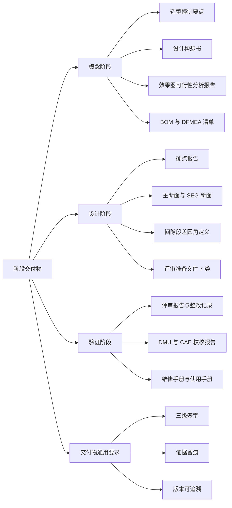

# 阶段交付物

!!! quote "内容来源"
    本页正文抽取自《总布置》知识库中**可文本解析**的文件：
    `SJ 41-2009 动力/底盘3D数据评审流程`、`SJ 45-2009 内饰SEG设计指导书`、
    `SJ 40-2009 轿车外饰SEG分析断面设计指导书`、`SJ 46-2009 仪表板SEG分析设计指导书`、
    `SJ 2-2008 车门设计指导书`、`SJ 4-2008 轿车车门主断面设计流程`、
    `EDD-A0-005 外效果图可行性分析报告`、`EDD-A0-005-1/-2 内外造型总布置检查清单`、
    `H20-整车总布置设计硬点报告`。
    企业规范编号原样保留。

## 交付物体系

## 概述

### 要点

**交付物的三种性质**：

| 性质 | 说明 | 示例 |
|---|---|---|
| **结论类** | 回答"合格/不合格" | 效果图可行性分析报告、评审报告、DMU 校核报告 |
| **数据类** | 提供下游可直接引用的几何与参数 | 硬点报告、主断面、SEG 断面、BOM、间隙段差圆角定义 |
| **证据类** | 支撑结论的判断依据 | 检查清单（含"结论 + 图片示意"）、自检表、配接单、整改记录 |

**交付物的通用要求**（汇总各规范）：

| 要求 | 依据 |
|---|---|
| **三级签字** | 3D 数据自检表需由设计人员自检、主管领导校对、部门领导审核（`SJ 41-2009` §3.2） |
| **证据留痕** | 检查清单须保留"结论 + 图片示意"（`EDD-A0-005-1/-2`） |
| **版本可追溯** | 硬点报告"初稿 → 冻结正式发布"，中间版本必须可追溯（H20 硬点报告） |
| **整改闭环后交付** | 评审问题须填写《整改记录》，**合格后**交付数据（`SJ 41-2009` §6.3） |

### 示例

外效果图可行性分析报告是一份典型的"结论类 + 数据类"复合交付物：它既有合格的结论（第 5 章），也包含四类视图的逐项数据校核记录（第 4 章），其输入明确为**外效果图（含前后轴视图）、效果图阶段总布置图、整车配置表**三项。

### 注意事项

- **交付物评审要求**：`SJ 41-2009` 明确评审前**三天**需将准备文件放服务器，且评审报告 PPT 也需**提前三天完成**——交付物的"评审准备"本身有独立的时间约束；
- **交付物不是"本专业自嗨"**：配接单与管线布置校核报告的存在说明交付物必须包含**跨专业接口确认**。

## 概念阶段交付物

### 要点

**（1）前期分析阶段交付物**（`SJ 2-2008` §4.2，以车门为例）

| 交付物 | 内容 |
|---|---|
| **造型控制要点** | 依据设计要求与设计目标，对效果图设计有明确限制或要求的地方制作造型控制要点，**及时给造型设计以输入** |
| **设计构想书** | 依据设计要求与效果图制作初步的设计构想书 |
| 零件清单 | 新开发车型与参考样车零件的**名称、图号、材料、料厚、面积、重量** |

**（2）设计构想书的内容结构**（`SJ 45-2009` §6.2）

| 方面 | 内容 |
|---|---|
| **整体规划** | 针对**舒适性、美观性、人机、成本、装配**提出目标构想及具体方案；针对标杆车提出**借用与改进措施** |
| **总成结构规划** | 一般以**爆炸图**形式，体现总成的零件数量、标准件数量、材料、料厚以及各总成的装配关系 |

> 设计构想书是**动态文件**，随设计推进不断完善并更新，作为后续数据库文件。

**（3）SEG 阶段同步建立的技术文件**（`SJ 45-2009` §6）

| 文件 | 关键内容 |
|---|---|
| **BOM 表** | 除按 `Q/IAT·TY 02` 外需添加：零部件**开发状态**（完全借用 / 局部更改 / 全新开发）、**互换性**（通用 / 对称）、**材料信息**（规格与料厚）、**重量与质心**（便于总布置和 CAE 计算整车性能）；随设计更新而不断更新 |
| **间隙、段差、圆角定义** | 效果图冻结后定义**外观可见特征**的内饰间隙/段差/圆角；参考标杆车并考虑材料、制造工艺、装配、相对运动关系；**经造型师确认后发布** |
| **DFMEA 分析文件** | 确定内饰 DFMEA 清单；调研与资料收集；对零件进行边界和功能分析（详见 `Q/IAT·TY 17-2009`） |

**（4）效果图阶段交付物**

| 交付物 | 说明 |
|---|---|
| **外效果图可行性分析报告**（`EDD-A0-005`） | 结构：1 基本信息 / 2 目的 / 3 输入 / 4 校核过程（质量检查、侧视图、正视图、后视图）/ 5 结论 |
| **内效果图可行性分析报告**（`EDD-A0-006`） | 同上结构（本页未展开） |
| **外造型总布置检查清单**（`EDD-A0-005-1`） | 零部件信息完整性、整车尺寸、通过性、人机、法规功能要求、外形尺寸、功能法规校核、沿用件/借用件 |
| **内造型总布置检查清单**（`EDD-A0-005-2`） | 配置检查、法规项检查、进出方便性、乘坐舒适性、操纵舒适性、人机项检查、系统布置可行性 |
| 效果图总布置检查结论（`QCD-A0-006`） | 完整性/外廓/内部/主要配置四类检查 |

### 示例

外造型总布置检查清单的列结构体现了"**工作项 = 验收记录**"的设计：

> **分析项 / 设计值 / 效果图 / CAS / 油泥模型 / A面 / 结果判定 / 备注**

其分析项覆盖：整车尺寸（整车长、整车长-乘员舱部分、整车宽、整车宽-门开启、整车宽-后视镜开闭、整车高、整车高-防滚架/行李箱架、轴距、前悬、后悬、前后轮心坐标、前后轮距、货箱尺寸）、通过性（空/满载接近角与离去角、通过角、最小离地间隙、台阶保护、前后门槛离地高、前后保险杠离地高、前风窗刮刷面积、**开口比计算**、**风阻系数**、轮胎包络与轮罩距离、拖车钩牵引角）、法规功能相关尺寸（前/后低速碰撞全套、牌照板、灯具）、人机舒适性相关尺寸（外开手柄、引擎盖开启、后背门开启、燃油加注、上车踏板、360° 视野盲区、交通灯视野）、视野分析（前后上下视野、侧门玻璃视野、A 柱障碍角、备胎取放方便性）。

### 注意事项

- **交付物评审要求**：检查清单本身即评审依据，`EDD` 清单备注明确"以上校核内容仅供参考，根据具体项目增加或者减少相关校核项；**法规校核项不同车型可能有较大差异**"；
- **重量与质心必须进 BOM**：这是 SEG 阶段最容易被简化掉的一项，但它直接影响整车动力性与经济性计算。

## 设计阶段交付物

### 要点

**（1）总布置主线交付物**（H20 硬点报告、`SJ 46-2009`）

| 交付物 | 内容 |
|---|---|
| **《整车总布置设计硬点报告》** | 目录结构：1 概述 / 2 整车设计基准（2.1 整车坐标系、2.2 整车设计状态）/ 3 整车设计硬点（3.1 整车装备选型、3.2 发动机参数、3.3 底盘系统布置主要硬点、3.4 整车性能、3.5 整车质量相关参数、3.6 整车外廓尺寸参数、3.7 车身主要总成控制硬点、3.8 人机工程布置设计硬点）/ 4 结束语 |
| **主断面清单与断面** | 车门主断面清单（数量、位置、方位、表达内容、排列顺序）+ 3D/2D 断面 |
| **SEG 断面** | 外饰 35～40 个、仪表板约 30 个、内饰分总成断面；含**断面面积、转动惯量**参数 |
| **SEG 检查表** | SEG 分析项的检查清单（`SJ 40-2009` §4 列出为 SEG 输出物之一） |
| **分析数据** | 开闭件布置数据、前后轮口校核、顶盖前后分缝线范围 |

**（2）评审准备文件（7 类）**（`SJ 41-2009` §5）

| # | 文件 | 填写/编制责任人 | 格式依据 |
|---|---|---|---|
| 1 | **评审报告 PPT** | 底盘/动力系统项目负责人；**评审前三天完成** | 附录 A（11 页结构） |
| 2 | **3D 数据自检表** | 系统负责人填写，**纸版三级签字**后交项目负责人整理备案 | 《3D 数据检查规范》 |
| 3 | **底盘/动力系统配接单** | 各系统负责人填写，纸版各级签字确认 | `Q/IAT·CZ 1` |
| 4 | **管线布置校核报告** | 底盘部性能控制科室相关责任人 | `Q/IAT·SJ 31` |
| 5 | **动力/底盘动态检查报告** | 底盘部性能控制科室相关责任人 | `Q/IAT·JY 2` |
| 6 | **3D 数据整改开闭项清单** | 性能控制科室相关责任人；跟踪各检查报告中调整内容是否已完成修改 | — |
| 7 | **设计和开发评审申请表** | 项目负责人 | `Q/IAT·TY 14-2008` |

**（3）评审报告 PPT 的 11 页结构**（`SJ 41-2009` 附录 A）

封面 → 概要 → 设计定义 → 基本配置介绍 → 进度介绍 → 评审资料介绍 → **配接单汇总统计** → **自检表汇总统计** → **管线布置校核报告统计** → **动态检查结果统计** → 结束。

**（4）设计阶段还应编制**

| 交付物 | 依据 |
|---|---|
| **维修手册、使用手册等产品文件** | `SJ 2-2008` §4.5.6 |
| 装配模拟结论（安装拆卸可行性） | `SJ 18-2008`、`SJ 19-2008`、`SJ 21-2008` 等要求进行安装模拟 |

### 示例

评审报告 PPT 的 11 页结构本身就是"**交付物完整性检查表**"——第 7～10 页分别对应配接单、自检表、管线布置校核、动态检查四类检查结果的汇总统计，说明**评审不是看单一报告，而是看四类检查的结果统计**。

### 注意事项

- **交付物版本管理**：硬点报告"初稿 → 冻结正式发布"、BOM 与设计构想书"随设计更新不断更新"——不同交付物的版本策略不同，**设计构想书与 BOM 是持续演进的，硬点报告是阶段冻结的**；
- **纸版签字与电子版汇总并存**：自检表与配接单均要求纸版签字确认 + 电子版汇总存放服务器，这是"责任可追溯"的双保险。

## 验证阶段交付物

### 要点

**（1）评审与整改类**（`SJ 41-2009` §6）

| 交付物 | 内容 |
|---|---|
| **《评审报告》** | 评审会上由专人记录专家提出的问题 |
| **《整改记录》** | 会后由专人整理评审中的问题；**合格后**进行数据的交付 |

**（2）校核报告类**

| 交付物 | 内容 | 依据 |
|---|---|---|
| DMU 间隙/干涉校核报告 | 间隙与干涉校核结论（对应规范未采用，见待补充） | `AEM-A0-009/011` |
| 管线布置校核报告 | 动力/底盘系统管路布置合理性分析 | `SJ 31-2009`（格式） |
| 动力/底盘动态检查报告 | 运动件合理性分析 | `SJ 41-2009` §3.4 |
| 结构 CAE 报告 | 刚度、模态、门下垂、碰撞、抗凹性分析 | `SJ 2-2008` §4.4.2 |
| 碰撞 CAE 与试验报告 | 正碰、侧碰、追尾、低速正碰、翻滚压顶 | `SJ 4-2008` §3、`SJ 54-2009` |
| 强度与耐久试验报告 | 过行程强度、向下加载、全力关门、**5 万次开合耐久** | `SJ 2-2008` §5.2 |

**（3）冻结与归档类**

| 交付物 | 说明 |
|---|---|
| **冻结版硬点报告** | 项目完成冻结时正式发布 |
| **最终主断面** | 经"新车型主断面评审 → 三维结构设计评审 → 主断面完善"后形成 |
| **问题清单（试制/试验/试生产）** | 各阶段问题整理分析记录 |
| **维修手册、使用手册** | `SJ 2-2008` §4.5.6 要求编制 |

**（4）问题清单的固定格式**（`EDD` 清单与 `SJ 41-2009` 共同约定）

问题清单应包含：**问题描述 + 所属部位/视图 + 结论 + 图片示意**，并跟踪"整改是否已完成"（开闭项清单）。

### 示例

验证阶段交付物的最小闭环是：**问题清单（含图片示意）→ 整改记录 → 复算/复验 → 冻结**。`SJ 41-2009` 的"3D 数据整改开闭项清单"正是这一闭环的跟踪载体——它的作用不是记录问题，而是**跟踪"调整内容是否已经完成修改"**。

### 注意事项

- **交付物归档要求属待人工补充项**：已解析条款未见交付物的归档介质、保存期限与权限管理规定；
- **"合格后交付"是硬约束**：`SJ 41-2009` 与各检查清单都把"整改闭环"作为交付前置条件，
  这意味着**交付物的完整性不仅看清单是否齐全，还要看问题是否关闭**；
- **手册类交付物常被遗漏**：`SJ 2-2008` §4.5.6 明确把"编制相关部分的维修手册、使用手册等产品文件"列为设计阶段工作内容，
  这部分在数据冻结后容易被忽略。

## 待人工补充

!!! warning "本页待人工补充清单"
    - **交付物归档要求**（介质、保存期限、权限管理）；
    - **`EDD-A0-006 内效果图可行性分析报告`**（12 页，已下载）的完整结构与本页仅给出类推结构；
    - **DMU 校核报告的判据与格式**：对应 `AEM-A0-009 DMU数据检查手册`、`AEM-A0-011 DMU数据间隙设定规范`，
      因读取问题**未采用**；
    - **`Q/IAT·CZ 1` 配接单、`Q/IAT·JY 2` 动态检查报告、`Q/IAT·SJ 31` 管线布置校核报告**的具体格式文件
      不在《总布置》知识库中（本页仅引用其编号）；
    - **硬点报告的正文章节内容**：H20 硬点报告为 `.docx`，本页仅提取其**目录结构**，
      各章节的具体硬点数值未展开（可另行解析该文件）；
    - 知识库中以下文件虽相关但因读取问题**未采用**：`AEM-A0-002 设计任务书`、
      `AEM-A0-200 总布置图绘制规范`、`40《总布置图设计规范》.xlsx`。

    建议：在 IMA 客户端中打开对应文件补充条款，或按"规范编号 + 页码"方式人工引用。

---

## 下一步阅读

- [开发流程概述](overview.md)：阶段划分与总布置介入时机
- [关键里程碑](milestones.md)：造型、数据、验证三类节点
- [断面开发流程](../sections/process.md)：SEG 输出物与断面评审
- [总布置工作流程](../basics/workflow.md)：硬点报告的目录结构与设计基准
