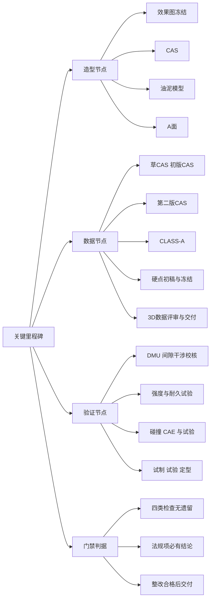
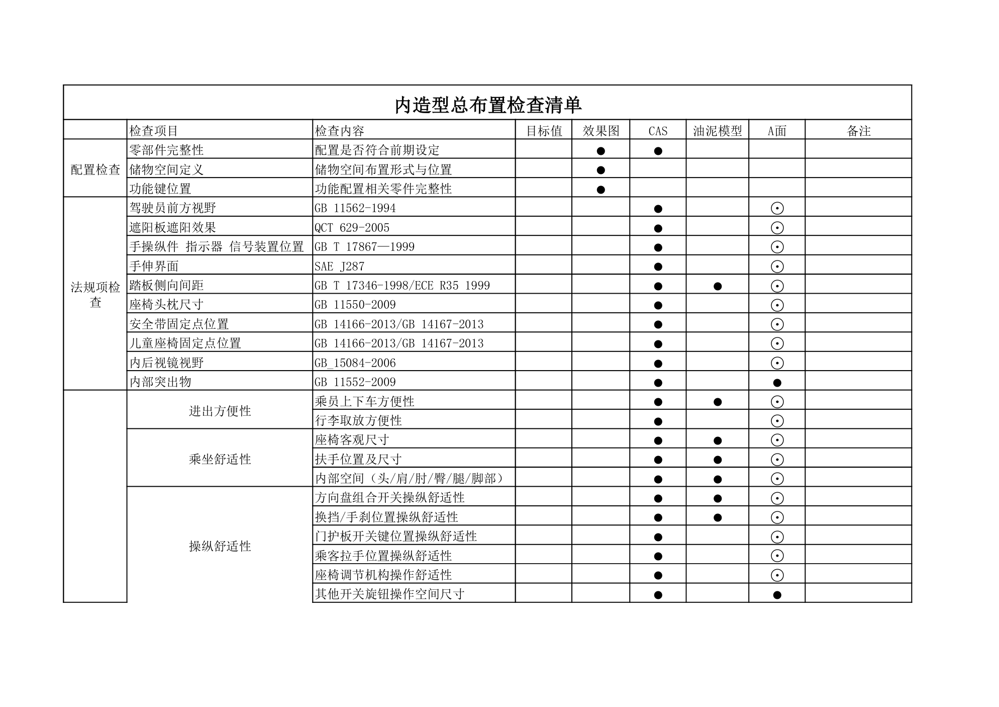
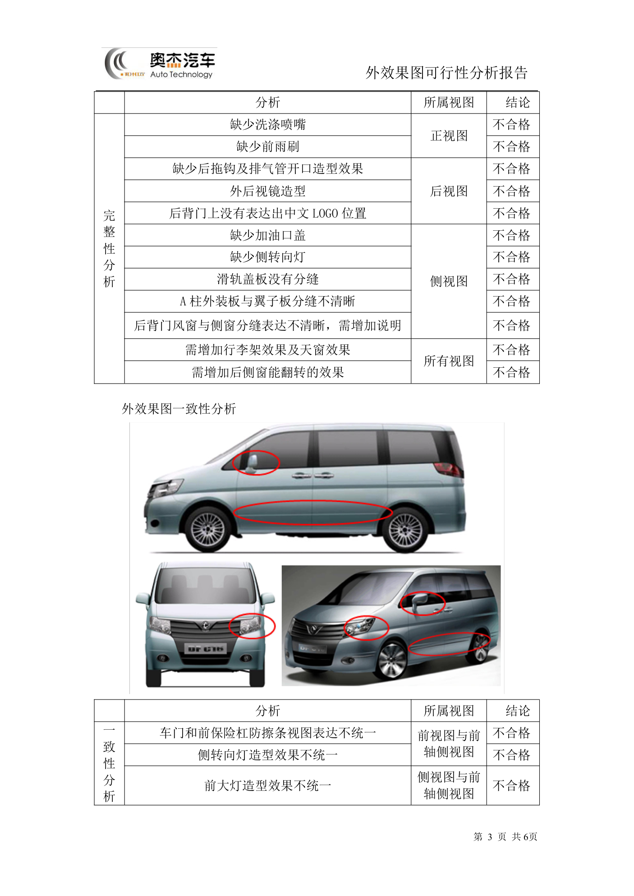

# 关键里程碑

!!! quote "内容来源"
    本页正文抽取自《总布置》知识库中**可文本解析**的文件：
    `QCD-A0-005`、`QCD-A0-006 效果图阶段总布置检查规范`、
    `EDD-A0-005-1 外造型总布置检查清单`、`EDD-A0-005-2 内造型总布置检查清单`、
    `SJ 41-2009 动力/底盘3D数据评审流程`、`SJ 4-2008 轿车车门主断面设计流程`、
    `SJ 45-2009 内饰SEG设计指导书`、`SJ 2-2008 车门设计指导书`、
    `SJ 54-2009 侧碰对应B柱断面系数设定指导书`、`H20-整车总布置设计硬点报告`。
    企业规范编号原样保留。

## 里程碑体系

## 概述

### 要点

整车开发的关键里程碑分三类，每类都附带一个**放行判据（门禁）**：

| 类别 | 里程碑 | 判据来源 |
|---|---|---|
| **造型节点** | 效果图冻结、CAS、油泥模型、A面 | `QCD-A0-006`、`EDD-A0-005-1/-2` |
| **数据节点** | 各版 CAS、CLASS-A、硬点发布、3D 数据交付 | `SJ 41-2009`、`SJ 45-2009`、H20 硬点报告 |
| **验证节点** | DMU 校核、强度/耐久试验、碰撞 CAE 与试验、试制试验定型 | `SJ 2-2008`、`SJ 4-2008`、`SJ 54-2009` |

**门禁的三条通用原则**（汇总自各规范）：

| 原则 | 内容 |
|---|---|
| **四类检查无遗留** | 效果图阶段需通过完整性/外廓/内部/主要配置四类检查（`QCD-A0-006`） |
| **法规项必有结论** | 检查清单中的法规项不得留空，须有明确校核结论（`QCD-A0-006`、`EDD` 清单） |
| **整改合格后交付** | 评审发现的问题须填写《整改记录》，**合格后方可进行数据交付**（`SJ 41-2009` §6.3） |

### 示例

内造型总布置检查清单用 **●（完整检查）/ ⊙（局部检查更新）** 标记各检查项在四个造型节点上的检查强度，这张矩阵就是"造型节点体系"的可执行版本：

### 注意事项

- **里程碑不是"时间点"而是"状态点"**：`EDD` 清单要求在每个节点都留下"结论 + 图片示意"的证据，节点放行以**证据完整**为准；
- **不同企业的阀点命名差异属待补充项**：知识库中《福特 GPDS 产品开发流程》等文章为纯图片型，无法提取阀点体系。

## 造型节点

### 要点

**（1）四个造型节点与检查强度**（`EDD-A0-005-1/-2`）

| 节点 | 检查定位 | 典型检查项（内造型） |
|---|---|---|
| **效果图** | 造型意图与配置的首次工程校核 | 驾驶员前方视野、手伸界面、内部突出物、乘坐舒适性、进出方便性、行李箱容积 |
| **CAS** | 三维可行性校核 | 内部突出物、座椅客观尺寸、扶手位置及尺寸、内部空间（头/肩/肘/臀/腿/脚部）、方向盘组合开关与换挡/手刹操纵舒适性 |
| **油泥模型** | 1:1 物理模型验证 | 与 CAS 相近的项目做**局部检查更新** |
| **A面** | 最终表面数据的闭环 | 全部检查项做局部更新确认 |

**（2）造型冻结前的工程可行性确认**（`EDD-A0-005` 校核过程）

| 步骤 | 内容 |
|---|---|
| 4.1 **外效果图质量检查** | 完整性分析（视图完整、功能件无缺失）+ 一致性分析（各视图之间的造型表达是否统一） |
| 4.2 **侧视图可行性分析** | 整车尺寸（L103 长、H100 高、L101 轴距、L104 前悬、L105 后悬）、通过性（A106-1 满载接近角、A106-2 满载离去角、A147 通过角、最小离地间隙、台阶保护高度）、人机（上下视野、外开把手离地高度、加油口盖离地高度）、法规功能要求（前机盖距前保距离、护轮板开口大小、前后保险杠低速碰撞）、借用件 |
| 4.3 **正视图可行性分析** | 外形尺寸（W103 宽度、W104 后视镜宽度、后视镜伸出量、W101-1 前轮距）、功能法规校核（前牌照板安装空间与上下边缘离地高度、灯具位置法规校核、**迎风面积计算**）、借用件 |
| 4.4 **后视图可行性分析** | W101-2 后轮距、后牌照板、灯具位置法规校核、后背门开口宽度、借用件 |

**（3）效果图阶段的总布置检查**（`QCD-A0-006`）

四类检查：**完整性**（视图完整、车型功能件无缺失）、**外廓检查**（长/宽/高/轴距/前悬/后悬/轮距/接近角/离去角/最小离地间隙/机舱盖轮廓/前后端离地高度/外部照明装置/号牌板位置/外后视镜宽度）、**内部检查**（分块合理性、人体布置空间、座椅尺寸、座间距、驾驶员视野、三踏板间距、手操纵件舒适性、方向盘位置及尺寸、仪表板/门护板/顶棚边界）、**主要配置**（前期提供配置表得到体现）。

### 示例

外效果图的**完整性分析**必须逐项落到视图并给出结论——例如"缺少洗涤喷嘴（正视图）不合格""缺少前雨刷（正视图）不合格""后背门上没有表达出中文 LOGO 位置（后视图）不合格""滑轨盖板没有分缝（侧视图）不合格"，以及**一致性分析**中的"车门和前保险杠防擦条视图表达不统一（前视图与前轴侧视图）不合格""前大灯造型效果不统一（侧视图与前轴侧视图）不合格"。

### 注意事项

- **一致性分析常被忽略**：完整性只回答"有没有"，一致性回答"各视图说的是不是同一个东西"，后者是造型内部矛盾的直接暴露点；
- **造型冻结前的工程可行性确认有时间窗**：`SJ 40-2009` 强调 SEG 阶段工程要尽量满足造型，但反馈必须早于油泥与 A 面。

## 数据节点

### 要点

**（1）CAS 版本序列**（`SJ 45-2009` §5）

| 版本 | 作用 |
|---|---|
| **造型草 CAS** | 依据配置表与门洞密封面初步完成边界条件，确定内饰功能件区域范围，作为效果图基本限制条件 |
| **初版 CAS** | 做结构分块与功能件布置的可行性分析；初步定义间隙、段差、圆角 |
| **第二版 CAS** | **油泥模型的数字模型基础**；油泥模型开始骨架设计 |
| **CLASS-A** | 油泥模型评审通过后，以油泥模型为基础开展 |

**（2）断面评审节点**（`SJ 4-2008` §3）

两个评审环节均为"合格 / 不合格"判断，不合格回到设计修改：

| 节点 | 通过条件 |
|---|---|
| **新车型主断面评审** | 评审报告判定合格 |
| **三维结构设计评审** | 评审报告判定合格 → 形成最终三维结构设计数模 → 主断面完善 → **最终主断面** |

**（3）3D 数据评审与交付**（`SJ 41-2009` §5、§6）

| 项目 | 要求 |
|---|---|
| 评审准备文件 | **7 类**：评审报告 PPT（提前三天完成）、3D 数据自检表（三级签字）、系统配接单、管线布置校核报告、动态检查报告、3D 数据整改开闭项清单、设计和开发评审申请表 |
| 时间要求 | 确定评审日期后**提前三天**将准备内容放到指定服务器 |
| 评审会议 | 项目负责人介绍评审报告；各检查报告负责人介绍检查内容及**整改结果**；安排专人记录专家问题并填写《评审报告》 |
| 会后 | 专人整理问题填写《整改记录》；**合格后**进行数据交付 |

**（4）硬点发布节点**（H20 硬点报告）

硬点报告的发布节奏是 **"初稿 → 项目完成冻结时正式发布"**，中间版本必须可追溯。

### 示例

3D 数据交付的前置条件不是"数据做完"，而是"**检查做完 + 整改闭环**"：`SJ 41-2009` 用 5 类检查文件（自检表、配接单、管线布置校核报告、动态检查报告、整改开闭项清单）构成交付前的体系性检查。

### 注意事项

- **数据质量与完整性检查的判定依据是"文件"而非"口头确认"**：自检表需**纸版三级签字**（设计人员自检 / 主管领导校对 / 部门领导审核），电子版汇总存放服务器；
- **配接单是跨专业接口的确认书**：它保证数据交付时**相邻专业接口已确认**，而不只是本专业数据齐全。

## 验证节点

### 要点

**（1）结构强度与耐久**（`SJ 2-2008` §5.2，以车门为例）

| 验证项 | 判据 |
|---|---|
| 过行程强度 | 250 N：下沉 ≤ 1.0 mm；250 N：开启方向角度变形 ≤ 10°；290 N：与各部件无干涉；450 N：不发生龟裂、破断 |
| 向下加载负荷强度 | 500 N：向下位移 ≤ 10 mm，残留位移（永久变形）≤ 1.0 mm |
| 全力关门强度 | 全开状态下全力关闭，外板/玻璃/车锁及其他部位不能龟裂、破断 |
| **开合耐久强度** | 白车身或涂装后车身上实施 **5 万次**反复开合：无影响性能与外观质量的裂纹、磨损、变形、干涉、螺栓松动；无破坏涂装质量、脱落、扭曲 |

**（2）CAE 验证**（`SJ 2-2008` §4.4.2、`SJ 4-2008` §3）

| 类型 | 内容 |
|---|---|
| 结构 CAE | 车门刚度分析、模态分析、**门下垂分析**、碰撞分析（与整车一起）、抗凹性分析 |
| 刚度分析（标杆车） | 整体扭转/弯曲刚度、车身接头部位刚度、车门门洞部位刚度；各关键断面的封闭面积与转动惯量系数 |
| 碰撞 CAE | 正碰、侧碰、追尾碰撞、低速正碰、**翻滚压顶** |

**（3）碰撞验证与目标星级**（`SJ 54-2009`）

| 项目 | 内容 |
|---|---|
| 侧碰试验条件 | 可变形移动障碍壁（MDB），**950 kg**，**50 km/h**，撞击角 **90°**，假人 EuroSID-1 或 EuroSID-2（`GB 20071-2006` / `ECE R95`） |
| 断面系数校核 | 概念设计阶段即计算 B 柱各位置最小断面系数，要求实测断面系数位于**要求线右侧** |
| 对标结论 | 丰田 COROLLA 因断面系数远高于 GB 20071-2006 最低要求（预留了对应美国 NAS 标准等的安全余量），在 **C-NCAP 取得侧碰 16 分满分、整车 5 星** |

**（4）试制、试验、定型**（`SJ 2-2008` §3.6～3.8、§4.5）

| 阶段 | 工作 |
|---|---|
| 试制 | 对试制中出现的问题整理分析，对已暴露的设计缺陷与不完善之处进行改进 |
| 试验 | 对试验过程中出现的问题整理分析，对属于设计缺陷之处进行改进 |
| 定型 | 对试生产过程中出现的问题整理分析并改进，**将设计定型**；同时编制相关部分的**维修手册、使用手册**等产品文件 |

### 示例

验证节点的"闭环"含义是：**CAE → 试验 → 问题清单 → 设计更改 → 复算**。`SJ 2-2008` §4.5 明确该阶段要"归纳总结过程中出现的问题 → 对问题进行分析整理 → 对设计问题进行研究分析提供解决方案 → 更改相关设计文件完善设计 → 编制维修手册与使用手册等产品文件"。

### 注意事项

- **验证问题整改闭环**：与数据评审一致，问题必须**形成记录并跟踪关闭**，`SJ 41-2009` 的"整改开闭项清单"就是这个机制的实例；
- **目标星级要预留余量**：`SJ 54-2009` 的 COROLLA 案例说明"**法规合格 ≠ 五星**"——若项目目标为五星，应在概念阶段就按更高标准预留断面系数与结构余量；
- **骡子车/样车等验证节点属待人工补充项**：知识库已解析条款覆盖的是**零部件级**验证（强度、耐久、CAE），
  未见整车级的骡子车（Mule）、工程样车、试生产车节点的定义与判据。

## 待人工补充

!!! warning "本页待人工补充清单"
    - **整车级验证节点**：骡子车（Mule）、工程样车、试生产车的定义与放行判据；
    - **主机厂阀点体系**（PEP / GVDP 等）的节点名称与对应关系；
    - **DMU 数据检查的间隙设定值**：对应 `AEM-A0-009 DMU数据检查手册`、`AEM-A0-011 DMU数据间隙设定规范`，
      因读取问题**未采用**；
    - **`EDD-A0-006 内效果图可行性分析报告`**（12 页，已下载）的校核步骤尚未逐条展开；
    - **造型冻结的正式签署流程**：已解析条款描述了检查与评审，但未见签署与冻结管理的规定；
    - 知识库中以下文件虽相关但因读取问题**未采用**：`AEM-A0-002 设计任务书`、
      `AEM-A0-005 概念草图阶段总布置工作手册`。

    建议：在 IMA 客户端中打开对应文件补充条款，或按"规范编号 + 页码"方式人工引用。

---

## 下一步阅读

- [开发流程概述](overview.md)：阶段划分与总布置介入时机
- [阶段交付物](deliverables.md)：各阶段交付物清单与检查清单
- [总布置工作流程](../basics/workflow.md)：五阶段与六门禁的详细判据
- [立柱布置](../door-trim/pillar.md)：B 柱断面系数与侧碰验证
