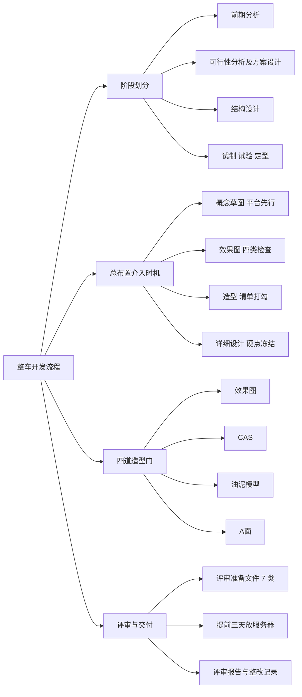
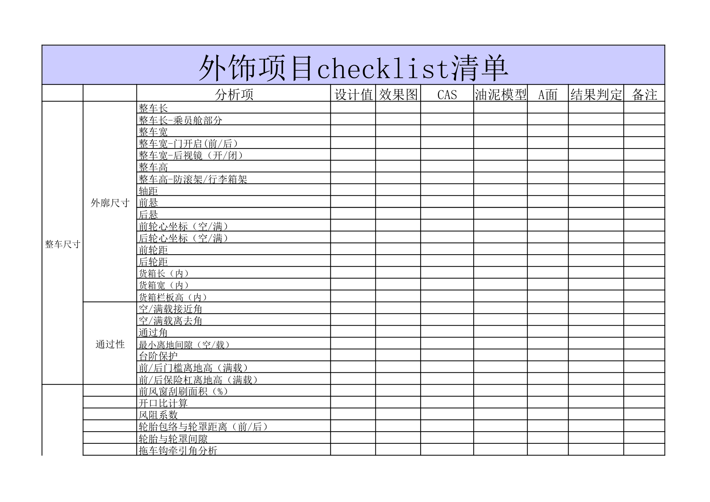

# 开发流程概述

!!! quote "内容来源"
    本页正文抽取自《总布置》知识库中**可文本解析**的文件：
    `QCD-A0-005 概念草图阶段总布置检查规范`、`QCD-A0-006 效果图阶段总布置检查规范`、
    `EDD-A0-005 外效果图可行性分析报告`、`EDD-A0-006 内效果图可行性分析报告`、
    `SJ 2-2008 车门设计指导书`（六阶段划分）、`SJ 45-2009 内饰SEG设计指导书`、
    `SJ 40-2009 轿车外饰SEG分析断面设计指导书`、`SJ 41-2009 动力/底盘3D数据评审流程`、
    `SJ 50-2009 仪表板装配设计指导书`（装配顺序）、`H20-整车总布置设计硬点报告`。
    企业规范编号原样保留。

## 开发流程体系

## 概述

### 要点

**（1）整车开发流程的主干**

从总布置的角度，流程主干是"**目标设定 → 造型协同 → 硬点冻结 → 数据校核**"四段，各段由不同的企业规范约束：

| 阶段 | 依据规范 | 核心工作 |
|---|---|---|
| **概念草图** | `QCD-A0-005` | 平台检查、动力总成匹配、平台布置、人机工程、整车参数设定 |
| **效果图** | `QCD-A0-006`、`EDD-A0-005/006` | 效果图构成检查与可行性分析 |
| **造型（效果图→CAS→油泥→A面）** | `EDD-A0-005-1/-2` | 用检查清单**逐阶段打勾** |
| **详细设计** | H20 硬点报告 | 硬点确定与冻结、断面设计、DMU 校核 |

**（2）六阶段划分**（`SJ 2-2008` §3.2.2，以车门设计为例，可类推至整车）

| 阶段 | 内容 |
|---|---|
| **前期分析** | 竞品结构调查；制作造型控制要点并输入造型；效果图初步分析与反馈；编制设计构想书 |
| **可行性分析及方案设计** | 主断面与断面设计、造型可行性分析；确定各附件的选型/布置/安装；断面强度解析、运动分析、拆装分析、组焊顺序分析 |
| **结构设计** | 详细 3D 数模；CAE 与工艺分析并优化；完整 2D 工程图纸与设计文件 |
| **试制** | 试制问题整理分析，改进设计缺陷 |
| **试验** | 试验问题整理分析，改进设计缺陷 |
| **定型** | 试生产问题整理分析，设计定型 |

**（3）内饰 SEG 的六步流程**（`SJ 45-2009` §5）

| 步骤 | 内容 |
|---|---|
| 5.1 **效果图及造型草 CAS** | 以配置表为依据、根据门洞密封面初步完成内饰边界条件，确定内饰功能件（前后门内扣手、拉手、升降器摇柄、遮阳板、乘客扶手等）的区域范围，作为效果图的基本限制条件 |
| 5.2 **初版 CAS 工程可行性分析** | 分析结构分块、内饰功能件布置是否可行，总布置及法规条件是否满足；初步定义间隙、段差、圆角 |
| 5.3 **工程主断面阶段** | 在工程主断面上填加内饰断面，应尽量多反映工程要求（安装点空间、拔模角、拔模方向、间隙、段差、圆角、总体与电器专业要求） |
| 5.4 **内饰第二版 CAS** | 第二版 CAS 是**油泥模型的数字模型基础**；提供造型工程条件，油泥模型开始骨架设计 |
| 5.5 **内饰详细分析阶段** | 对第二版 CAS 详细分析；主断面不能明确反映的应增加详细内饰断面或作草数模分析 |
| 5.6 **油泥模型及 CLASS-A** | 数字模型与 1:1 油泥模型存在视觉差异，造型师会提出更改意见，工程需配合分析并取得一致；油泥模型评审通过后以油泥为基础开展 CLASS-A |

**（4）评审与交付**（`SJ 41-2009`）

| 项目 | 要求 |
|---|---|
| 3D 数据定义 | 整车坐标系下，由 CATIA 建立、与整车比例相同、并可用于 2D 投图的三维数据 |
| 评审准备文件（**7 类**） | ① 评审报告 PPT（评审前**三天**完成）；② 3D 数据自检表（**三级签字**：设计人员自检 / 主管领导校对 / 部门领导审核）；③ 底盘/动力系统配接单；④ 管线布置校核报告；⑤ 动力/底盘动态检查报告；⑥ 3D 数据整改开闭项清单；⑦ 设计和开发评审申请表 |
| 评审流程 | 确定评审日期后**提前三天**将准备内容放到指定服务器供专家察看；评审时项目负责人介绍评审报告，各项检查报告负责人介绍检查内容及整改结果，**安排专人记录专家问题并填写《评审报告》**；会后专人整理问题填写《整改记录》，**合格后进行数据交付** |

### 示例

`EDD-A0-005` 外效果图可行性分析报告的结构本身就是一份标准交付物模板：

| 章节 | 内容 |
|---|---|
| 1 基本信息 | 项目平台与改款说明（如"在既有平台做改款升级车型，整车加长 100 mm，轴距加长 100 mm，前后悬长度不变"） |
| 2 目的 | 校核分析外效果图是否满足工程要求 |
| 3 输入 | 外效果图（前视图、后视图、侧视图、**前轴视图、后轴视图**）；效果图阶段总布置图；整车配置表 |
| 4 校核过程 | 4.1 外效果图质量检查 → 4.2 侧视图可行性分析 → 4.3 正视图可行性分析 → 4.4 后视图可行性分析 |
| 5 结论 | 合格 / 不合格判定 |

其中 4.1 的"质量检查"要求同时做**完整性分析**与**一致性分析**（见下节示例）。

### 注意事项

- **不同企业流程差异属待补充项**：本页流程来自 Q/IAT·SJ 企业标准体系与 EDD/QCD 规范，
  与主机厂的 **PEP（产品诞生流程）/ GVDP（全球整车开发流程）** 等体系在阀点命名与颗粒度上不同；
  知识库「汽车」文件夹中的《福特 GPDS 产品开发流程》为**纯图片型文章**，无法提取文本；
- **"提前三天"是硬性时间要求**：`SJ 41-2009` 明确评审准备文件需在评审前三天完成并上传服务器，
  这是评审有效性的前提。

## 开发阶段划分

### 要点

**（1）按总布置交付物划分的阶段与关键交付**

| 阶段 | 关键交付物 | 依据 |
|---|---|---|
| 概念草图 | 整车参数初稿、造型边界要求、平台检查结论 | `QCD-A0-005` |
| 效果图 | 外/内效果图可行性分析报告、效果图检查结论 | `EDD-A0-005`、`EDD-A0-006`、`QCD-A0-006` |
| 造型（CAS/油泥/A面） | 内外造型总布置检查清单（逐阶段打勾） | `EDD-A0-005-1/-2` |
| 详细设计 | **《整车总布置设计硬点报告》**、主断面、SEG 断面、DMU 校核报告 | H20 硬点报告、`SJ 46/40/45` |
| 验证与冻结 | DMU 间隙/干涉校核、实物验证、硬点冻结 | `AEM-A0-009/011`（未采用） |

**（2）SEG 阶段必须同步建立的技术文件**（`SJ 45-2009` §6）

| 文件 | 内容要点 |
|---|---|
| **BOM 表** | 除按 `Q/IAT·TY 02` 规定外，还需添加：**零部件开发状态**（完全借用 / 局部更改 / 全新开发）、**互换性**（通用 / 对称）、**材料信息**（规格与料厚）、**重量与质心**（便于总布置和 CAE 计算整车性能） |
| **设计构想书** | ① 内饰整体规划（针对舒适性、美观性、人机、成本、装配提出目标构想及具体方案，并对标杆车提出借用与改进措施）；② **每个总成的结构规划**（一般以爆炸图形式，体现零件数量、标准件数量、材料、料厚及装配关系） |
| **间隙、段差、圆角定义** | 效果图冻结后定义**外观可见特征**的内饰间隙/段差/圆角，随概念设计完善而修正；定义时一方面参考标杆车，另一方面充分考虑零件材料、制造工艺、装配、相对运动关系；**经造型师确认后发布**，指导第二版 CAS 与油泥模型工作 |
| **DFMEA 分析文件** | 按项目确定的分析范围确定内饰 DFMEA 清单；进行调研与资料收集；对零件进行边界和功能分析（详见 `Q/IAT·TY 17-2009`） |

**（3）装配顺序作为开发约束**（`SJ 50-2009` §3.1）

装饰件装配顺序：**顶棚系统 → 铺设地毯 → 驾驶舱模块（含仪表板组件）→ 前风挡玻璃 → 立柱、护板等内饰件 → 座椅固定在地板上 → 其他部件**。

### 示例

外效果图的质量检查分**完整性**与**一致性**两类，判据必须逐条落到视图：

| 类型 | 典型不合格项 | 所属视图 |
|---|---|---|
| 完整性 | 缺少洗涤喷嘴、缺少前雨刷 | 正视图 |
| 完整性 | 缺少后拖钩及排气管开口造型效果、外后视镜造型、后背门未表达中文 LOGO 位置 | 后视图 |
| 完整性 | 缺少加油口盖、缺少侧转向灯、滑轨盖板没有分缝、A 柱外装板与翼子板分缝不清晰、后背门风窗与侧窗分缝表达不清晰 | 侧视图 |
| 完整性 | 需增加行李架效果及天窗效果、需增加后侧窗能翻转的效果 | 所有视图 |
| 一致性 | 车门和前保险杠防擦条视图表达不统一 | 前视图与前轴侧视图 |
| 一致性 | 侧转向灯、前大灯造型效果不统一 | 侧视图与前轴侧视图 |

### 注意事项

- **前置输入不足的风险**：`EDD-A0-005` 明确"输入"只有三项——效果图（含前后轴视图）、效果图阶段总布置图、整车配置表。
  若配置表未定稿，则"配置的体现"一项无法判定（`QCD-A0-006` 同此要求）；
- **BOM 表要带重量与质心**：这是 SEG 阶段容易被忽视的一项——它直接服务于整车性能（动力性/经济性）计算，
  而不是单纯的物料清单。

## 上车体工作在流程中的位置

### 要点

**（1）总布置是"几何总线"**（见 [总布置工作流程](../basics/workflow.md)）

- **向造型输出边界**：概念草图阶段就要对造型提出更具体的边界要求，使后期造型改动量更少；
- **向底盘/车身/电气输出硬点**：硬点报告为下游详细设计提供依据；
- **向下游输出校核清单**：造型各阶段用固定清单逐项打勾闭环。

**（2）上车体在各阶段的介入时机**

| 阶段 | 上车体相关工作 |
|---|---|
| 概念草图 | 平台检查（整车性能/碰撞等级/动力总成匹配/平台布置四项）；人机工程参数设定（H30、A40、A42、A44、A46）；整车参数设定（前悬/轴距/后悬/车高/车宽/通过性/轴荷） |
| 效果图 | 外廓检查（长/宽/高/轴距/前悬/后悬/轮距/接近角/离去角/离地间隙）、内部检查（人体布置空间、座椅尺寸、座间距、视野、踏板间距、仪表板/门护板/顶棚边界） |
| CAS / 油泥 / A面 | **SEG 断面分析**（外饰 35～40 个断面、内饰分总成断面、仪表板约 30 个断面）；造型检查清单逐项打勾 |
| 详细设计 | 硬点确定与冻结、主断面完善、DMU 间隙校核 |

**（3）四道造型门与检查清单的对应**

`EDD-A0-005-1`（外造型）与 `EDD-A0-005-2`（内造型）两张检查清单均以 **效果图 / CAS / 油泥模型 / A面** 四列作为检查阶段，用 **●（完整检查）/ ⊙（局部检查更新）** 标记检查强度。

### 示例

内造型总布置检查清单的"阶段×检查项"矩阵结构（● 完整检查、⊙ 局部检查更新）：

| 检查项 | 效果图 | CAS | 油泥模型 | A面 |
|---|---|---|---|---|
| 驾驶员前方视野（GB 11562-1994） | ● | | ⊙ | |
| 手伸界面（SAE J287） | ● | | ⊙ | |
| 内部突出物（GB 11552-2009） | ● | ● | | ⊙ |
| 乘坐舒适性（座椅客观尺寸/扶手/内部空间） | ● | ● | | ⊙ |
| 行李箱容积 | ● | | ⊙ | |

### 注意事项

- **工程可行性确认必须早于造型冻结**：`SJ 40-2009` 说明 SEG 阶段"工程应该尽可能去满足造型的要求"，
  但反馈意见必须**在油泥与 A 面之前**给出，否则改动代价急剧上升；
- **清单是"打勾闭环"而非"抽查"**：`EDD-A0-005-1/-2` 要求保留"结论 + 图片示意"两列做证据留痕。

## 各阶段主要工作

### 要点

**（1）各阶段工作项与门槛**（汇总自上表各规范）

| 阶段 | 工作项 | 质量门槛 |
|---|---|---|
| 概念草图 | 平台性能/碰撞等级/动力总成匹配/平台布置四项检查；视野、坐姿、操作方便性、整车参数设定 | 各项检查通过；参数落在推荐区间 |
| 效果图 | 完整性（视图完整、功能件无缺失）、外廓、内部、主要配置四类检查 | 四类检查无遗留 |
| 造型各阶段 | 外/内造型检查清单逐项打勾 | 清单逐项打勾，法规项全部有校核结论 |
| SEG 断面 | 断面制作、分析数据、圆角间隙阶差、设计构想书、SEG 检查表 | 断面通过评审 |
| 详细设计 | 硬点报告、主断面、DMU 校核 | 硬点发布（初稿→正式） |
| 数据评审 | 7 类评审准备文件、评审报告、整改记录 | **整改合格后方可交付** |

**（2）DMU 与数据校核**（`SJ 41-2009` 类比）

3D 数据交付前的系统性检查内容包括：**3D 数据自检表**（三级签字）、**配接单**（各系统接口确认）、
**管线布置校核报告**、**动态检查报告**、**整改开闭项清单**（跟踪整改是否完成）。

### 示例

工作计划模板的核心是"**阶段 × 检查项 × 结论 × 证据**"四要素。以 `EDD-A0-005-1` 的外饰检查清单为例，其表格列结构为：**分析项 / 设计值 / 效果图 / CAS / 油泥模型 / A面 / 结果判定 / 备注**——每一行既是工作项，也是验收记录。

### 注意事项

- **阶段交付物的质量门槛集中在"法规项必须有校核结论"**：`QCD-A0-006` 与 `EDD` 清单均明确法规项不得留空；
- **整改闭环是交付的前置条件**：`SJ 41-2009` 规定"会后由专人整理评审中的问题填写《整改记录》，**合格后**进行数据的交付"；
- **数据完整性检查要覆盖接口**：配接单与管线布置校核报告的存在，说明数据交付不仅是本专业数据齐全，还要**相邻专业接口已确认**。

## 待人工补充

!!! warning "本页待人工补充清单"
    - **主机厂流程体系（PEP / GVDP 等）的阀点命名与颗粒度对照**：知识库中的相关文章
      （《福特 GPDS 产品开发流程》《最详细的整车开发流程》）为**纯图片型微信文章**，无法提取文本；
    - **EDD-A0-006 内效果图可行性分析报告**已下载（12 页）但本页未逐条展开；
    - **QCD-A0-005/006 的门禁判据**已在 [总布置工作流程](../basics/workflow.md) 中整理，本页仅作索引；
    - **DMU 数据检查的具体判据**（间隙设定值）对应 `AEM-A0-009`、`AEM-A0-011`，因读取问题**未采用**；
    - 知识库中以下文件虽相关但因读取问题**未采用**：`AEM-A0-002 设计任务书`、
      `AEM-A0-005 概念草图阶段总布置工作手册`、`AEM-A0-010 整车坐标系建立规范与流程`。

    建议：在 IMA 客户端中打开对应文件补充条款，或按"规范编号 + 页码"方式人工引用。

---

## 下一步阅读

- [关键里程碑](milestones.md)：造型、数据、验证三类节点
- [阶段交付物](deliverables.md)：各阶段交付物清单与检查清单
- [总布置工作流程](../basics/workflow.md)：五阶段与六门禁的详细判据
- [断面开发流程](../sections/process.md)：SEG 分析与断面评审
