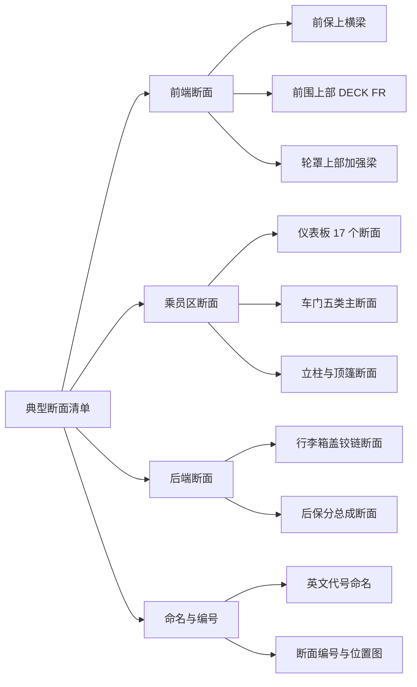
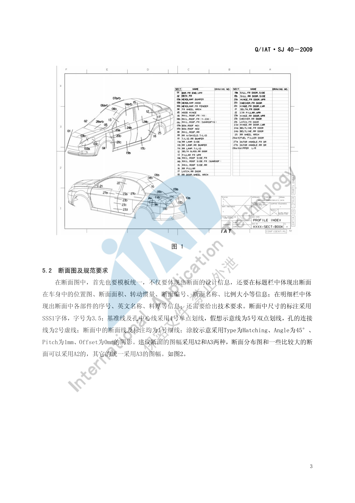
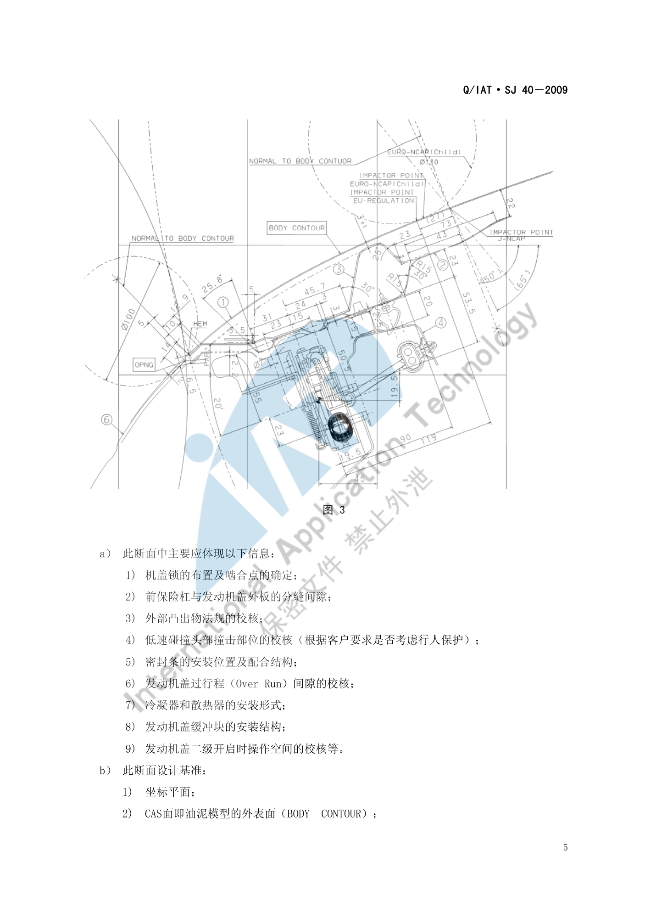
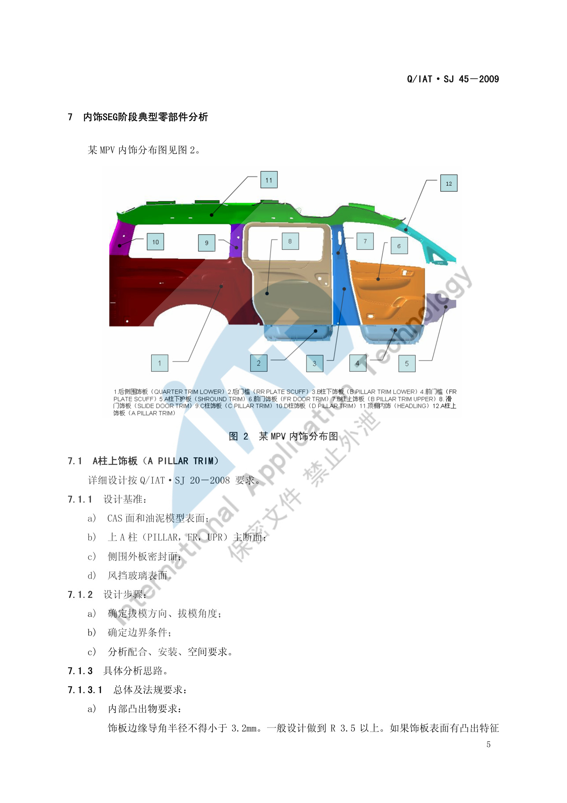

# 典型断面清单

!!! quote "内容来源"
    本页正文抽取自《总布置》知识库中**可文本解析**的文件：
    `SJ 40-2009 轿车外饰SEG分析断面设计指导书`、`SJ 46-2009 仪表板SEG分析设计指导书`、
    `SJ 2-2008 车门设计指导书`、`SJ 4-2008 轿车车门主断面设计流程`、
    `SJ 45-2009 内饰SEG设计指导书`、`SJ 18-2008 顶篷设计指导书`。
    企业规范编号原样保留。

## 断面清单体系

## 概述

### 要点

**（1）断面量的分布**（各规范统计）

| 部位 | 断面数量 | 来源 |
|---|---|---|
| 外饰 SEG | **35～40 个** | `SJ 40-2009` §5 |
| 仪表板 SEG | **约 30 个**（本文整理出 17 个典型断面） | `SJ 46-2009` §5 |
| 车门主断面 | **五类关键断面**（清单需与客户确认） | `SJ 2-2008` §4.3.2、`SJ 4-2008` §3 |
| 车身结构主断面 | A/B/C/D 柱、门槛、顶盖侧围、前后风挡等（用于刚度与转动惯量计算） | `SJ 4-2008` §3 |

**（2）命名规则**：断面名称采用**中文 + 英文代号**形式，英文代号由"部位 + 方向"构成，以便与国际接轨并便于外籍专家审核。常见方向后缀：**UPR**（上部）、**LWR**（下部）、**CROSS**（横向）、**LT**（左侧）、**FR**（前部）、**RR**（后部）。

**（3）断面的三类用途**

| 用途 | 说明 |
|---|---|
| **造型可行性分析** | 分析 CAS 数据是否满足工程要求 |
| **指导结构设计** | 断面定义了零件之间的结构断面形式以及装配、焊接、密封、涂胶关系 |
| **性能参数计算** | 通过断面的**封闭面积、材料面积、转动惯量系数**判断刚度分布 |

### 示例

典型断面在整车上的分布可按"前端—乘员区—后端"三段理解：

### 注意事项

- 断面清单是**交付物而非过程产物**：需形成清单文件并与客户协商确认（见 [断面开发流程](process.md)）；
- 本文整理的断面名称**以规范原文为准**，不同项目的断面代号可能不同。

## 前端典型断面

### 要点

**（1）前保险杠上横梁（Bar，Fr End，Upr）**（`SJ 40-2009` §6.1）

剖切位置：发动机盖与前保险杠在 **Y0 处**。

| 应体现的信息（9 项） | 设计基准（5 项） |
|---|---|
| ① 机盖锁的布置及啮合点的确定；② 前保险杠与发动机盖外板的分缝间隙；③ **外部凸出物法规的校核**；④ 低速碰撞头部撞击部位的校核（按客户要求考虑行人保护）；⑤ 密封条的安装位置及配合结构；⑥ **发动机盖过行程（Over Run）间隙的校核**；⑦ 冷凝器和散热器的安装形式；⑧ 发动机盖缓冲块的安装结构；⑨ **发动机盖二级开启时操作空间的校核** | ① 坐标平面；② CAS 面（BODY CONTOUR）；③ 前保险杠分缝线；④ 发动机盖锁的啮合点（**间接基准**）；⑤ **WAD = 1000 mm 的点**（校核基准） |

**关键经验尺寸**（`SJ 40-2009` §6.1 c)）：

| 项目 | 取值 |
|---|---|
| 前保与发盖外板**表面间隙**（美观考虑） | **5 mm–6 mm** |
| 发动机盖**过行程（Over Run）** | 一般 **5 mm 左右** |
| 发盖包边与前保险杠间隙 | 一般 **8 mm 左右** |
| 发盖运动过程中与前保**最小间隙** | 约 **3 mm** |
| 包边长度 | 一般 **7 mm–10 mm**（视包边设备） |
| 内板边界到包完边外板内表面间隙 | 约 **1.5 mm** |
| 减震胶涂胶区域间隙 | **2 mm–3 mm** |
| 涂胶槽（凹台）深度 | **2.5 mm–3 mm** |
| 行人保护加强件后边界到 WAD1000 的距离 | **≥ 115 mm**（= 65 + 50 试验误差） |
| 发盖二级开启校核 | 前保分缝线为圆心作 **R45** 圆，需有效接触开启手柄；发盖外板包边到手柄中心距离 **≤ 40 mm**；前保与发盖间隙 **> 25 mm**（水平分缝要求端部至少被弹簧力抬起 **25 mm**；竖直分缝已有 5–6 mm 分缝间隙，要求至少抬起 **20 mm**） |

**（2）前围上部（DECK，FR）**（`SJ 40-2009` §6.2）

剖切位置：前风窗玻璃与发动机盖在 **Y0 处**。

应体现的信息（7 项）：前围上部结构；前风窗玻璃的黑边区域、涂胶位置、挡胶条位置、玻璃边界；发动机盖的包边结构、内板结构；空气室盖板结构及与钣金的装配关系；发动机盖后端挡水密封条的安装结构；**前方下视野的校核**；发动机盖开启过程中与空气室盖板、前风窗玻璃及雨刮等部件间隙的校核。

关键方法（§6.2 c)）：

| 项目 | 要求 |
|---|---|
| 玻璃黑边区域 | 以**前风窗玻璃内表面与视野线的交点**为基准，沿玻璃表面**向下偏移 5 mm** 即黑边区域（5 mm 主要考虑玻璃安装误差） |
| 涂胶表示符号 | **底长 7 mm、高度 12 mm 的等腰三角形** |
| 前风窗玻璃边界 | 以空气室盖板后端边界线为基准，一般设定 **7.5 mm 左右**（视盖板结构而定） |
| 玻璃安装面 | 将玻璃外表面偏移"玻璃厚度 + 涂胶厚度（一般 **5 mm–6 mm**）"作为安装平面，再以涂胶位置为中心两侧各偏移 **15 mm** → 安装面一般 **30 mm 左右** |
| 发动机盖后端断面宽度 | 一般 **25 mm–30 mm** |
| 发盖开启前端离地面高度 | **1600 mm–1650 mm**；运动校核按铰链自身限位角度校核最小间隙——**空气室盖板 5 mm、雨刮 10 mm、前风窗玻璃 10 mm** |
| 包边形式 | 根据外部凸出物法规要求确定采用**水滴状包边**还是**直接包边**结构 |

**（3）轮罩上部加强梁（FRAME，UPR）**（`SJ 40-2009` §6.3）

剖切位置：过**前轮轮心**平行于 yz 面，剖前翼子板、轮胎及轮胎包络面、轮罩上部加强梁及发动机盖。

应体现的信息（7 项）：发盖外板与前翼子板的分缝间隙及发盖外板包边尺寸；发盖内板结构；轮罩上部加强梁结构；前翼子板结构及安装形式；轮罩挡泥板安装形式；**静止标准胎和最大胎的轮胎包络面与前翼子板、轮罩挡泥板及纵梁的间隙校核**；前滑柱的安装结构。

关键方法：为保证分缝间隙均匀，建议通过分缝线做一个**垂直于外表面、长度 3 mm 的过渡面**，再将此面按分缝间隙值**法向偏移**过去作为发盖外板的边界；翼子板上有一个 **7 mm 的遮挡分缝结构**以隐藏安装螺栓；发盖外板与翼子板分缝间隙一般 **3.5 mm–4 mm**。

轮胎包络校核的三类对象：**转向 20° 全跳动的最大胎包络、全转向 80% 跳动的最大胎包络、静止的标准胎**；有防滑链时须以**带防滑链的轮胎跳动**校核。

### 示例

前保险杠上横梁断面是前端区域信息最密集的断面（锁啮合点、分缝、法规、过行程、密封、缓冲块、二级开启）：

### 注意事项

- **断面校核关注点集中在"法规 + 运动"两类**：法规（外部凸出物、行人保护）与运动（过行程、发盖开启、二级开启）是前端断面最易出问题的部分；
- **发动机盖运动校核的三个间隙值不同**（空气室盖板 5 mm、雨刮 10 mm、前风窗玻璃 10 mm），不能统一取一个值。

## 乘员区典型断面

### 要点

**（1）仪表板 SEG 的 17 个典型断面**（`SJ 46-2009` §6.1～6.17，英文代号为规范原文）

| # | 断面名称（中文 / 英文代号） | 主要表达内容 |
|---|---|---|
| 1 | 驾驶员处纵向（**Bar, Fr End, Upr**） | 前下视野线与仪表板关系；组合仪表反光/眩目/盲区；仪表罩与方向盘手操作空间；脚踏操纵 Z 向高度与左下护板；小腿保护；各件间隙面差；拔模方向与分模线 |
| 2 | 组合仪表罩左侧纵向（**IP CLUSTER LT**） | 仪表罩与本体安装方式；组合仪表与本体安装方式；本体与管梁安装关系；各件间隙面差 |
| 3 | 组合仪表横向（**IP METER SPEED CROSS**） | 本体与管梁安装；组合仪表、仪表罩、本体各件间隙 |
| 4 | 左下护板横向（**IP KNEE LT CROSS**） | **正面碰撞膝盖保护区域与方法**；左下护板安装；与各件间隙 |
| 5 | 左下护板开关组横向（**IP SWITCH LT CROSS**） | 左下护板与开关组关系；左下护板与各件间隙 |
| 6 | A 柱三角窗、仪表板横向（**IP A-PILLAR DELTA GLASS CROSS**） | 侧三角除霜风道与 A 柱盖板关系；A 柱盖板与仪表板关系 |
| 7 | A 柱、仪表板横向 | A 柱护板与仪表板配接关系 |
| 8 | 左侧出风口、高音扬声器（**IP OUTLET-HIGH SPKER-LH**） | 仪表板与高音扬声器关系；出风口人机；电气开关组与左下护板关系；引擎盖扣手与左下护板关系 |
| 9 | 左侧出风口横向（**IP OUTLET LH CROSS**） | 出风口吹面人机分析；出风口结构形式 |
| 10 | 仪表板中心（**IP CENTER**） | 前下视野线；前风挡除霜出风角度与距离；仪表板与前围/风挡/黑区定位；装配角度；风道/管梁/CD/开关组/空调控制开关/烟灰缸间隙；管梁支撑腿走向；换档操纵机构关系 |
| 11 | 仪表板中间左出风口（**IP OUTLET CENTER LH**） | 中左出风口纵向结构 |
| 12 | 中间出风口、DVD 横向（**IP OUTLET CENTER&DVD CROSS**） | DVD 装配关系；出风口人机与仪表板关系 |
| 13 | 中控面板、空调开关横向（**IP FACIA HVAC CONTROLER CROSS**） | 空调开关定位与安装关系；本体、中控面板、空调开关各件间隙 |
| 14 | 中控面板、烟灰缸横向（**IP FACIA ASHTRAY CROSS**） | 烟灰缸总成安装与空间大小、点烟器安装；烟灰缸侧边间隙 |
| 15 | 仪表板、换档操纵机构横向（**IP SHIFT BALL CROSS**） | 换档盖板总成连接结构关系；换档操纵机构与仪表板间隙、空间要求 |
| 16 | 仪表板乘员（**IP PASSENGER**） | **GB 11552-1999 法规要求**；风道走向与各件间隙；乘客安全气囊固定结构；手套箱空间、旋转中心、旋转角度与开启扣手形式 |
| 17 | 仪表板手套箱横向（**IP GLOVE BOX CROSS**） | 正面碰撞膝盖保护区域与方法；右下护板的安装 |

**（2）车门五类关键主断面**（`SJ 2-2008` §4.3.2）

| # | 主断面 | 表达的装配关系 | 剖切方向 |
|---|---|---|---|
| 1 | 前门、侧围上部、顶盖关系 | 侧围外板、顶盖、顶盖侧梁及加强板、顶棚、前门门框上部结构、门洞密封条、门框密封条、玻璃导槽、流水槽装饰条 | — |
| 2 | 前门、后门、中支柱、后门铰链关系 | 前门结构、后门结构、中支柱结构、前门锁、后门铰链、密封条 | **垂直于后门铰链轴线**剖切 |
| 3 | 前门、门槛关系 | 前门外板、前门内板、前门护板、侧围下门槛、门槛内板、门槛加强板、前地板、门槛外侧装饰件、门槛法兰焊接边处装饰件、地毯、线束、密封条 | 与 **YZ 坐标面平行** |
| 4 | 前门水切 | 前门内板、水切内外加强板、前门护板、内外水切密封条 | — |
| 5 | 前门、翼子板关系 | 前门内外板、翼子板、A 柱结构、前门铰链、密封条、前门护板、A 柱护板 | — |

此外，`SJ 4-2008` §4.1.3 以 **B 柱断面** 作为门洞法兰面参数的通用示例（L1 = 1 mm、L2 = 15–18 mm、R1 = 3–6 mm、α > 4°）。

**（3）立柱与顶篷断面**（`SJ 45-2009`、`SJ 18-2008`）

| 断面 | 主要表达内容 |
|---|---|
| **上 A 柱（PILLAR, FR, UPR）主断面** | A 柱上饰板的设计基准之一（其余为 CAS 面、侧围外板密封面、风挡玻璃表面） |
| 顶篷与侧围边梁配合断面 | 四种情形：无加装（8–15 mm / 侧碰 ≥ 25 mm）、加气帘（> 3 mm）、塑料护板（0 mm）、泡沫块（0 mm） |
| 顶篷与立柱配合断面 | 顶篷与立柱间隙 1 mm、面差 0 mm、翻边 > 8 mm、立柱压顶棚过盈 1 mm |

**（4）车身结构主断面（刚度计算用）**（`SJ 4-2008` §3）

A、B、C、D 柱断面、门槛断面、顶盖侧围断面、前后风挡断面——这些部位的**封闭面积、材料面积、转动惯量系数**直接决定白车身刚度好坏，是标杆车对标与新车型刚度分布优化的依据。

### 示例

内饰 SEG 的断面分布以整车内饰零件清单为索引（以某 MPV 为例）：

### 注意事项

- **断面的"信息清单"是可以直接当检查表用的**：`SJ 46-2009` 与 `SJ 40-2009` 的每个断面都列出"应体现的信息"，把 17 个仪表板断面的清单汇总起来，就是一份完整的 IP 区域设计检查表；
- **乘员区断面的校核关注点**：法规（内部凸出物 GB 11552、正面碰撞 GB 11551 膝部/小腿）与人机（视野、手操作空间、出风口吹风区域）是两类高频问题。

## 后端典型断面

### 要点

后端区域的断面清单在已解析条款中覆盖较少，可确认的有：

| 断面 | 主要表达内容 | 来源 |
|---|---|---|
| **后保分总成相关断面** | 缓冲块、防撞梁、安装支架的装配关系 | `SJ 24-2008` §4.2.2 |
| **行李箱盖铰链/扭簧断面** | 铰链支座、铰链臂、扭簧活动端与固定端的空间关系；扭簧活动端力臂 L1 与相对铰链轴线力臂 L2 | `SJ 53-2010` §2.2.1.2 |
| 后轮罩相关断面 | 后轮包络面与轮罩、翼子板的间隙（按独立/非独立后悬工况制作） | `SJ 51-2009` §4.2 |

行李箱盖开启的核心几何参数（W 重量、L 重力力臂、α 初始夹角、θ 开启角、L1/L2 力臂）需要在断面中表达清楚，它们是扭簧计算的输入。

### 示例

后端断面的关键是表达"**铰链—扭簧—密封条**"三者的力矩与空间关系：扭簧直接或间接作用于铰链，起支撑方式分直接式（活动端直接装到铰链臂上）与间接式（通过铰链连接支架），**断面必须能看出采用的是哪一种**。

### 注意事项

- **后端断面清单属待人工补充项**：`SJ 40-2009`（外饰 SEG）的 47 页中断言共有 35～40 个断面，但本页只解析到前端的 3 个；
  后端（行李箱盖、后保、后风窗、尾灯区域）的断面名称与设计要点需人工从原文补齐；
- 相关可参考资料：`SJ 25-2008 前后风窗玻璃设计指导书`、`SJ 24-2008 前后保险杠设计指导书`、
  `SJ 53-2010 行李箱盖扭簧设计指导书`（均已下载，本页未逐条展开）。

## 待人工补充

!!! warning "本页待人工补充清单"
    - **外饰 SEG 剩余约 32 个断面的清单与设计要点**：`SJ 40-2009` 共 47 页，
      本页仅整理了 §6.1～§6.3（前保上横梁、前围上部、轮罩上部加强梁）；
    - **后端断面清单**：行李箱盖、后保、后风窗、尾灯区域的断面名称与要点；
    - **断面编号规则**：各规范的命名规律已归纳，但**断面编号（如 RPS 序号）的具体编制规则**未提取；
    - `SJ 46-2009` 的图 1（断面分布图）为图片页，30 个断面的**分布位置图**需人工从原图整理；
    - 知识库中以下文件虽相关但因读取问题**未采用**：`AEM-A0-203 造型用总布置图制作`、
      `AEM-A0-203-001/002 总布置样板图`、`AEM-A0-010 整车坐标系建立规范与流程`。

    建议：在 IMA 客户端中打开对应文件补充条款，或按"规范编号 + 页码"方式人工引用。

---

## 下一步阅读

- [断面开发流程](process.md)：SEG 定位、断面规划与评审冻结
- [断面设计方法](method.md)：基准设定、表达规范与断面驱动设计
- [IP 布置](../ip-cnsl/ip.md)：仪表板各断面的设计细节
- [顶棚布置](../door-trim/roof.md)：顶篷与侧围边梁的四种配合结构
