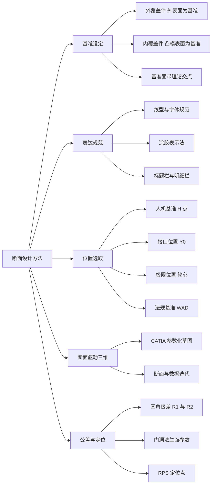
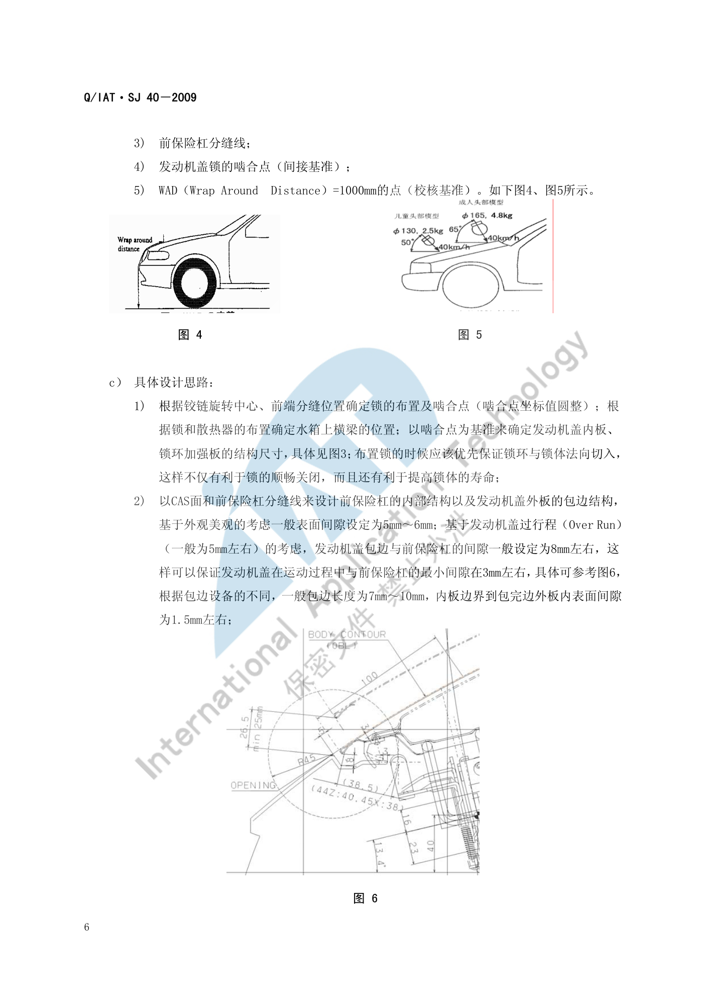

# 断面设计方法

!!! quote "内容来源"
    本页正文抽取自《总布置》知识库中**可文本解析**的文件：
    `SJ 40-2009 轿车外饰SEG分析断面设计指导书`、`SJ 46-2009 仪表板SEG分析设计指导书`、
    `SJ 4-2008 轿车车门主断面设计流程`、`SJ 45-2009 内饰SEG设计指导书`、
    `SJ 29-2008 车身RPS设计指导书`。
    企业规范编号原样保留。

## 断面设计方法体系

## 概述

### 要点

断面设计的四条方法论支柱：

| 支柱 | 原则 | 依据 |
|---|---|---|
| **基准先行** | 断面中**关键尺寸都必须由基准来确定**，基准的选用**必须具有可操作性** | `SJ 40-2009` §6、`SJ 46-2009` §6 |
| **规范统一** | 统一模板、投图比例与标注规范，让下游能直接引用 | `SJ 40-2009` §5 |
| **位置有据** | 断面位置由人机基准、接口位置、极限位置、法规基准共同定义 | `SJ 40-2009` §6 |
| **迭代闭环** | 断面驱动三维设计，三维设计反哺断面修改，直至匹配协调 | `SJ 4-2008` §3 |

> `SJ 46-2009` §6 明确：断面"**不仅为了分析造型的成立性，而且还要规范指导后期的结构设计**"——这是判断断面质量的根本标准。

### 示例

断面位置必须表达清楚"切在哪里、切出来什么"，因此每个断面都要在标题栏中体现**断面在车身中的位置图**（见 [断面开发流程](process.md) 的断面图规范）。

### 注意事项

- **基准必须可操作**：如果基准选在无实体的位置（如理论交点而无标注），下游结构设计就无法引用——`SJ 4-2008` 为此专门规定"基准面要求不仅有倒圆角信息，而且带有**理论交点信息**"；
- **不同企业的规范差异属待补充项**：本页规范来自企业内部标准体系（Q/IAT·SJ 系列），与主机厂规范（如各主机厂的设计手册）在字体、图幅、线型上可能不同，`SJ 40-2009` 也说明"断面中 2D 投图标准尽量采用主机厂提供的标准或与其协商采用本公司内部自己的标准"。

## 断面表达规范

### 要点

**（1）基准的定义规则**（`SJ 4-2008` §4.1.1）

| 零件类型 | 设计基准面 |
|---|---|
| 汽车**外覆盖件、外装饰件** | **外表面**就是这些零件的基准面 |
| **内覆盖件** | 设计基准面是**加工该零件拉延模的凸模表面** |

绘制要求：**基准面**不仅有倒圆角信息，而且带有**理论交点信息**；**非基准面**不带理论交点，只带倒圆角信息。

**（2）零件焊接面之间的圆角半径定义**（`SJ 4-2008` §4.1.2）

为使两焊接零件在圆角处不产生干涉、使焊接面能正常贴合，内外板金件的圆角必须合理定义：

| 内层圆角 R1 | 外层圆角 R2 |
|---|---|
| **R1 ≤ 15 mm** | **R2 = R1 + 2 mm** |
| **15 < R1 ≤ 30 mm** | **R2 = R1 + 3 mm** |
| **R1 > 30 mm** | **R2 = R1 + 5 mm** |

**（3）门洞法兰面的关键参数**（`SJ 4-2008` §4.1.3，以 B 柱断面为例）

| 参数 | 含义 | 取值 | 依据 |
|---|---|---|---|
| **L1** | 板金件内外板边缘线的落差值 | **1 mm** | 保证焊接后侧围外板密封条安装面的边缘线**始终是最外缘边**，避免边缘线参差不齐影响密封条安装精度 |
| **L2** | 侧围外板门洞法兰面的宽度 | **15 mm–18 mm** | 主要考虑焊接要求、密封条安装要求 |
| **R1** | 圆角 | **3 mm–6 mm** | 冲压、焊接工艺要求与安装密封条要求 |
| **α** | B 柱侧面的斜角 | **> 4°** | 冲压工艺要求并保证适当的断面封闭面积 |

**（4）线型与字体规范**（`SJ 40-2009` §5.2）

| 元素 | 规范 |
|---|---|
| 尺寸标注 | **SSS1** 字体，字号 **3.5** |
| 基准线及孔中心线 | **4 号单点划线** |
| 假想示意线 | **5 号双点划线** |
| 孔的连接线 | **2 号虚线** |
| 断面线及标注 | **1 号细线** |
| 涂胶示意 | Type = Hatching、Angle = **45°**、Pitch = **1 mm**、Offset = **0 mm** |
| 断面分布图断面代号 | **SSS1** 字体、字号 **5.0 粗体** |
| 图幅 | A2（分布图与大断面）与 A3（其余） |

**（5）标题栏与明细栏**（`SJ 40-2009` §5.2、`SJ 46-2009` §5.3）

| 栏位 | 必须体现的信息 |
|---|---|
| 标题栏 | 断面在车身中的**位置图**、**断面面积**、**转动惯量**、断面编号、断面名称、比例大小 |
| 明细栏 | 各部件的**序号、英文名称、料厚** |
| 技术要求 | 特殊安装和加工工艺要求 |

### 示例

发盖包边与过行程（Over Run）是"用断面表达运动关系"的典型案例：基于美观考虑前保与发盖外板的**表面间隙一般设定为 5 mm–6 mm**；基于发盖过行程（**一般为 5 mm 左右**）的考虑，**发盖包边与前保险杠的间隙一般设定为 8 mm 左右**，这样可以保证发盖在运动过程中与前保的**最小间隙在 3 mm 左右**。

### 注意事项

- **圆角级差不是格式要求而是工艺要求**：R1 与 R2 的差值（2/3/5 mm）随 R1 增大而增大，是为对冲压回弹与板厚变化的补偿；照抄数值而不理解这个逻辑，在厚板或高强钢件上会失效；
- **外部凸出物的圆角设定需要在断面中直接校核**（`SJ 40-2009` §6.1 c)5)）：依据 `GB 11566-1995《轿车外部凸出物》`。

## 典型位置选取

### 要点

**（1）五类选取依据**（`SJ 40-2009` §6）

| 依据类型 | 典型断面 | 说明 |
|---|---|---|
| **人机基准** | 驾驶员 H 点纵向断面（`SJ 46-2009` §6.1） | 以 R 点/H 点为剖切起始 |
| **接口位置** | 前保险杠与发动机盖在 **Y0 处**（§6.1）；前风窗玻璃与发动机盖在 **Y0 处**（§6.2） | 以整车对称面为剖切面 |
| **极限位置** | 过**前轮轮心**平行于 yz 面（含轮胎包络面）（§6.3） | 以运动极限位置为剖切面 |
| **法规基准点** | **WAD = 1000 mm 的点**（§6.1） | 以行人保护撞击基准为参照 |
| **分缝线** | 以分缝线为基准确定包边与遮挡结构（§6.3） | 以外观分缝为剖切面 |

**（2）断面的"应体现信息"清单化**（`SJ 40-2009` §6、`SJ 46-2009` §6）

每个断面在设计时都固定回答三类问题，形成"信息清单"：

| 问题 | 含义 |
|---|---|
| **a) 此断面中主要应体现哪些信息？** | 该断面负责表达的设计内容（如分缝间隙、法规校核、运动间隙……） |
| **b) 此断面的设计基准是什么？** | 坐标平面、CAS 面、分缝线 + 专项基准 |
| **c) 具体设计思路？** | 尺寸的推导顺序与经验取值 |

**（3）选取依据的取值示例**（`SJ 40-2009` §6.1）

以"前保险杠上横梁（Bar，Fr End，Upr）"断面为例，其应体现的信息共 **9 项**：机盖锁的布置及啮合点；前保险杠与发动机盖外板的分缝间隙；**外部凸出物法规的校核**；低速碰撞头部撞击部位的校核（按客户要求考虑行人保护）；密封条的安装位置及配合结构；**发动机盖过行程（Over Run）间隙的校核**；冷凝器和散热器的安装形式；发动机盖缓冲块的安装结构；**发动机盖二级开启时操作空间的校核**。

其设计基准共 5 项：坐标平面；CAS 面（BODY CONTOUR）；前保险杠分缝线；发动机盖锁的啮合点（**间接基准**）；**WAD = 1000 mm 的点（校核基准）**。

### 示例

行人保护的断面基准直接来自法规的撞击点定义：

| 对象 | 法规基准 | 头部模型 | 质量 | 速度 | 撞击角 |
|---|---|---|---|---|---|
| **儿童** | EU 法规 **WAD = 1000 mm** | **Φ130 mm** | 2.5 kg | 40 km/h | 与水平面成 **50°** |
| **成人** | EU 法规 **WAD = 1500 mm** | **Φ165 mm** | 4.8 kg | 40 km/h | 与水平面成 **65°** |

与行人保护有关的内板结构尺寸都以"**过 WAD = 1000 mm 的基准点垂直于外表面的基准线**"为基准设定。考虑儿童头部大小 Φ130 mm 与试验误差（一般为 50 mm），**加强件后边界到 WAD1000 的距离要做到 65 mm + 50 mm = 115 mm 以上**。

### 注意事项

- **遗漏关键断面的风险**：`SJ 4-2008` 要求主断面清单必须与客户"反复协商与讨论"并形成技术文件——清单一旦遗漏（例如漏掉某个铰链安装面或密封面），后期在三维设计中暴露时只能补断面并重走评审；
- **间接基准也要标注清楚**：如"发动机盖锁的啮合点"被明确标注为间接基准，这类基准在尺寸链传递中容易被忽略。

## 断面与三维数据

### 要点

**（1）断面驱动三维的迭代闭环**（`SJ 4-2008` §3）

| 阶段 | 动作 |
|---|---|
| 起始 | 主断面设计**始于车身油泥模型制作过程**；在模型关键位置和危险断面提取断面数据，输入 CAD |
| 分析 | 结构可行性、运动干涉、装配可行性、焊接可行性、冲压可行性分析 |
| 提精度 | 采集油泥模型表面数据，建立 **CLASS-B 表面模型**，进行车门表面三维数据的工程可行性分析 |
| 第一版 | 形成**第一版新开发车型的主断面数据**，作为今后三维结构设计的依据 |
| 迭代 | 以主断面为依据做三维结构设计时，会发现结构不合理、难以实现甚至无法实现的问题，**反过来修改断面数据** |
| 收敛 | 通过**反复修改主断面设计与三维结构设计的相互关系**，使二者匹配协调，形成最终主断面 |

**（2）3D 断面的制作方法**（`SJ 46-2009` §5.2）

| 项目 | 要求 |
|---|---|
| 环境 | 统一在 **CATIA 的"草图绘制器"模块**中绘制，打开默认约束 |
| 求交 | 用"**三维元素相交**"命令求得与 CAS 面或油泥模型外表面的交线 |
| 方法 | 在交线基础上进行**参数化草图**断面设计 |

参数化草图的三个优点：① **绘图快捷**；② **编辑修改方便**；③ **可做运动件草图模拟分析**。

**（3）断面设计顺序**（各内饰/饰件规范统一）

**查定义 → 做边界 → 核人机 → 定结构 → （工艺分析）细化 3D**。

**（4）与 RPS 的衔接**（`SJ 29-2008`、`SJ 19-2008` §3.8）

断面中的定位孔/定位面标注应与 RPS 系统一致：RPS 点（H/h 孔销定位、F/f 平面棱边定位、T/t 理论点）是模具、工装、检具的共同定位点，**断面是 RPS 点最直观的表达载体**。

### 示例

内外饰零件的边界大都由"从基准面法向偏移"推导而来。以 A 柱上饰板与风挡玻璃的边界为例（`SJ 45-2009` §7.1.3.3）：将风挡玻璃内表面**沿法向偏移 2.5 mm～3 mm**（饰板与玻璃的间隙值），提取前风挡与 A 柱分缝线，沿玻璃面法向作面并平移此面使其与 **A 柱外板法兰边距离为 5 mm～5.5 mm**（饰板厚度 2.5 mm + 与钣金间隙 2.5 mm～3 mm），**两面的交线即 A 柱饰板的前端边界线**。

### 注意事项

- **数据更新后的断面刷新属待人工补充项**：已解析条款强调"断面与三维数据互为迭代"，但**未规定数据变更后断面刷新的触发条件与时限**；
- **断面的"权威性"来自基准而非图面好看**：`SJ 46-2009` 要求关键尺寸由基准确定，就是为了在数据更新后能**快速判断断面是否仍然成立**。

## 待人工补充

!!! warning "本页待人工补充清单"
    - **数据更新后断面刷新的触发条件与时限**；
    - **主机厂规范差异对照**：本页规范来自 Q/IAT·SJ 企业内部标准，与各主机厂设计手册的差异未整理；
    - `SJ 40-2009` 共 47 页，本页仅提取了 §6.1～§6.3 三个断面的"信息清单 + 基准 + 设计思路"结构，
      其余约 32 个断面的具体方法未展开（详见 [典型断面清单](library.md)）；
    - `SJ 29-2008` 的坐标平行原则、统一性原则、尺寸标注原则、RPS 尺寸图四项原则的详细示例未展开；
    - 知识库中以下文件虽相关但因读取问题**未采用**：`AEM-A0-200 总布置图绘制规范`、
      `AEM-A0-203 造型用总布置图制作`、`AEM-A0-203-001/002 总布置样板图`。

    建议：在 IMA 客户端中打开对应文件补充条款，或按"规范编号 + 页码"方式人工引用。

---

## 下一步阅读

- [断面开发流程](process.md)：SEG 定位、断面规划与评审冻结
- [典型断面清单](library.md)：前端/乘员区/后端关键断面清单
- [IP 布置](../ip-cnsl/ip.md)：仪表板 17 个典型断面的设计要点
- [门板布置](../door-trim/door.md)：车门五类关键主断面
